# 一种解决多元优化问题的实验设计方法

> 原文：<https://towardsdatascience.com/an-experimental-design-approach-to-solve-a-multivariate-optimization-problem-58b40b29166d?source=collection_archive---------16----------------------->

## *响应值未知时寻找最佳输入参数*

在这篇文章中，我将描述我在未知响应值的多元优化问题中寻找最大值的经历。我在滑铁卢大学参加的**实验设计**研究生课程的期末项目中研究过这个问题

**语境**

通常，在科学和工程环境中，有时甚至在商业环境中，我们会遇到一些定量问题，我们知道输入值及其范围，并得到相应的输出(响应)值，但不知道它们之间的关系。当可以安全地假设该关系是线性的时，我们可以拟合多元线性回归模型并确定该关系，并使用它来找到响应变量的最佳值或确定其对输入变量的敏感度。在非线性设置中，机器学习技术可以用来为我们做曲线拟合工作。

另一方面，如果我们只知道每个输入变量可以变化的范围，但没有提供响应变量值，并要求我们找到将导致响应变量最佳值的组合，那么我们就面临着一个困难的挑战。为了最有效地达到最佳值，我们应该进行多少次实验，以什么样的顺序进行？根据我对这个问题的研究，这个简单的问题可能会变得很难回答。这是问题陈述:

**问题陈述**

与混凝土相比，沥青在铺路方面有一些优势，比如初期成本较低，噪音也较低。然而，缺点之一是它的强度较低。在这项研究中，我们必须优化沥青的成分，以最大限度地提高其强度(抗压强度——响应变量)。

我们有三个输入变量及其变化范围:

- 𝑥1(水灰比):0.28–0.4

- 𝑥2(粗骨料粒径):9.5-12.5 毫米

- 𝑥3(空隙率):15%-25%

我们的目标是找到最大化𝑦(抗压强度或简单的强度)的𝑥1,𝑥2 和𝑥3 的设置。

请注意简单优化问题和这个问题的区别:

> *在常规优化问题中，我们已知输入变量和相应输出值的组合，但我们只知道输入变量的范围，而不知道响应变量的信息。*

让我们考虑一下业务背景:这里的实验意味着，选择水灰比、粗骨料尺寸和空隙率的特定组合，使用该组合制造沥青，然后在材料测试实验室中确定最终沥青的抗压强度。我们的预算有限，因此不能做我们想做的那么多实验。例如，我们可以用这些输入变量的各种组合做一千个实验，然后报告产生强度最大值的组合吗？我们可以，但这将非常昂贵(想想安装成本、员工工资、原材料、电力……)。此外，这种方法将被视为蛮力，应该只在紧急情况下或所有其他方法都失败时使用。

在这种情况下，有一种叫做“实验设计”的统计学分支可以帮助我们。我们的时间和资源有限，必须想出一个好的解决方案(如果不是最好的)来解决一个基于合理的数学原理的问题。我现在一步一步地描述实验设计方法。

**实验设计法**

首先，我在 0.0-5.0 的范围内调整了所有三个变量，以便于实验的设计。我这样做是为了确保不同输入变量的大小不会影响以后的回归系数。换句话说，如果变量 1 在 0-1 之间变化，变量 2 在 0-100 之间变化，对我们来说应该没有关系。

我们不知道 y 和(x1，x2，x3)之间关系的本质。它可能是一次函数，二次函数，或者其他我们不知道的函数。我们所知道的是输入变量可以变化的范围。该关系在变量空间的某些部分可以是近似线性的，而在其他部分可以是非线性的。

> 由于我们事先没有这些信息，所以从一个小的输入变量空间开始，在这个区域进行一些实验，然后根据我们在这个区域的发现移动到整个变量空间的其他区域是有意义的。这种实验方法被称为顺序策略。我们从小处着手，并在有希望的方向上增加赌注，而不是从大处着手(即，一次性承担整个可变空间)

**实验设定 1**

我做了第一组实验，所有三个(x1，x2，x3)值都在[0，1]区域。我们注意到，这些是换算值，输入参数的实际值可以通过再次将换算值转换为未换算值来找到。在这个区域，我进行了所谓的 **2 +4 中心点实验**。这包括从该区域仔细选择 12 种(x1，x2，x3)组合，并测试由这些组合制成的沥青的抗压强度。你可以在这里了解更多 **2 +4 方法** [。](https://www.statease.com/blog/energize-two-level-factorials-add-center-points/)

你可能会问我，我是如何在这些实验中找到抗压强度的。我是从教授提供的基于 excel 的计算器中得到的！在现实世界中，材料科学家将在实验室进行这些实验，并确定这些值。别无选择！

所以实验组 1 的设计如下:

**实验装置 1 的设计**

因子及其范围:x1(0.00–1.00)、x2(0.00–1.00)和 x3(0.00–1.00)

2 (1 次重复)+ 4 个 CP，总共 12 次运行

*动机*:如前所述，我们现在不知道我们在参数图上的位置，我们是在包含最佳值的区域，还是在斜坡或山脊上。所以我们从参数空间的一个小区域的实验开始，拟合一个模型来检查，然后继续。

实验表如下所示。这样的表格可以在 [Minitab](https://www.minitab.com/en-us/) 或 Python / R 中轻松生成:

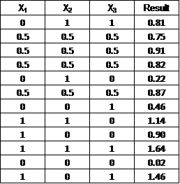

2 +4 CP 设计(图片由作者提供)

我在 Minitab 中做了回归，但同样，它可以在任何标准软件包中完成。这 12 个实验的回归结果如下图所示:

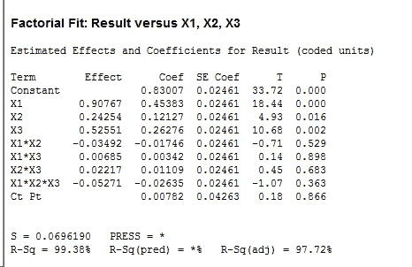

2 + 4 CP 设计的回归结果(图片由作者提供)

正如我们所观察到的，由于 Ct Pt 变量具有相当高的 p 值(0.866)，曲率在该区域并不显著。此外，交互术语如 x1x2、x1x3 等也不重要。因此，我去掉了中心点和这些相互作用项。再次运行回归后，结果如下:

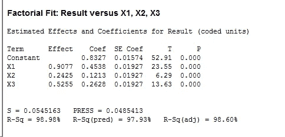

去掉中心点和相互作用项后 2 + 4 CP 设计的回归结果(图片由作者提供)

下图显示了该模型的残差图:

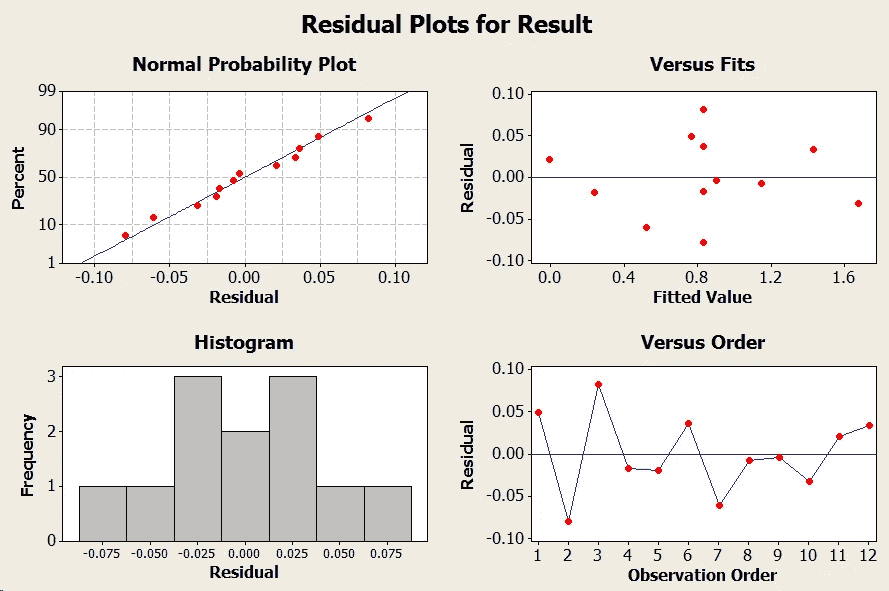

y 变量相对于 x1 和 x2 的等值线图如下所示:

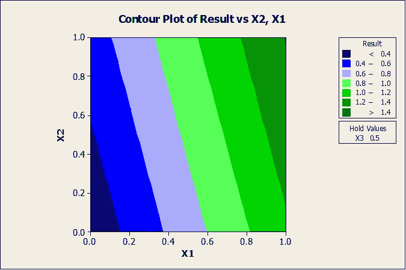

去掉中心点和交互项后的 2 + 4 CP 设计的等高线图(图片由作者提供)

强度相对于 x1 和 x2 的等高线图表明我们在一座山的斜坡上(图形山),并且我们应该在最陡的斜坡上上升以快速到达最佳点。

**实验组 1 的结论**

因此，实验组 1 的结论如下:

- x1、x2 和 x3 是重要的，如 p 值所示，而相互作用项不重要，并且在该区域也没有曲率

- x1 在该区域具有最大的影响，如与其他变量相比相对较高的斜率所示(0.4538)

-拟合似乎很好:高𝑅(调整后)=98.98%，残差无异常，如上面的残差图所示(残差无非正态性，无异方差)

-很明显，我们在一座山的斜坡上，我们需要沿着最陡的上坡路径在实验区域中移动。

**最陡峭的上升路径**

从线性回归模型中，我们发现 x1、x2 和 x3 的系数分别为 0.4538、0.1213 和 0.2628。我们使用这些系数来寻找最陡的上升路径。

我们从中心点(0.5，0.5，0.5)开始

影响最大的是 x1，其步长为 1

接下来是 x3 的效果，其步长大小为 1 x 0.2628/0.4538 = 0.579

接下来是 x2 的效果，其步长大小为 1 x 0.1213/0.4538 = 0.267

最陡爬坡路径如下表所示:

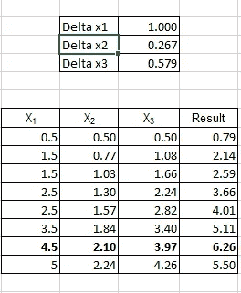

最陡上坡路径(图片由作者提供)

点(4.5，2.1，4)是目前为止最陡的上坡的最佳点。要么我们现在已经越过了山顶，要么我们已经越过了山脊。

为了确定函数在这一点的形状，我们以(4.5，2.1，4)为中心点做一组新的实验。

**实验装置 2 的设计**

实验二还是以(4.5，2.1，4)为中心的 2 + 4 CP 实验。

因子及其范围:x1(4.0–5.0)、x2(1.6–2.6)和 x3(3.5–4.5)

2 (1 次重复)+ 4CP，共 12 次运行

*动机:*我们想了解 y 在(4.5，2.1，4)附近如何变化。如果(4.5，2.1，4)恰好是一圈同心圆的中心点，那么我们已经到达了顶点。否则，我们需要做更多的工作来达到最佳值。

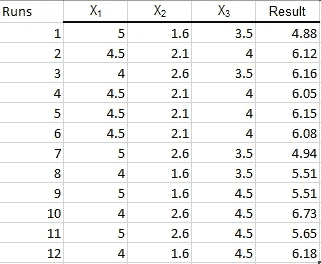

实验组 2: 2 +4 CP 设计(图片由作者提供)

这 12 个实验的回归结果如下图所示:

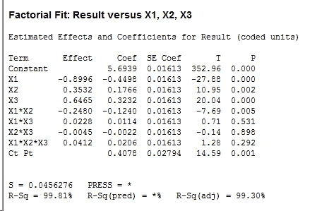

2 + 4 CP 设计的回归结果(图片由作者提供)

*很明显，曲率效应现在很重要*，除了 x1x2 之外的相互作用效应并不显著。我们再次看到 x1x3 和 x2x3 的影响并不显著，这表明 x3 可能不会与 x1 和 x2 相互作用，因此可以单独进行优化。*因此，向前看，我将 x3 作为固定值，并进行实验以找到 x1 和 x2 的最佳值。*一旦找到，x3 已被单独优化。

下面的回归拟合没有交互效应 x1x3 和 x2x3:

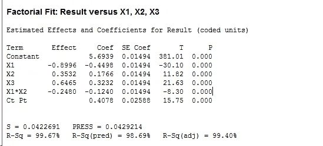

去掉中心点和相互作用项后+ 4 CP 设计的回归结果(图片由作者提供)

接下来，我通过用轴点和额外的中心点扩充 2 (1 次重复)+ 4 CP 模型来拟合响应面模型。**由此产生的设计被称为中心复合设计**，有 20 次实验运行，如下表所示:

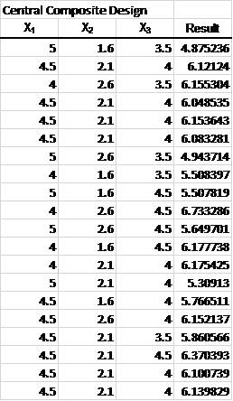

以点(4.5，2.1，4)为中心的中心复合设计

CCD 帮助我们找到这个区域的函数方程。中心复合设计回归分析产生以下结果:

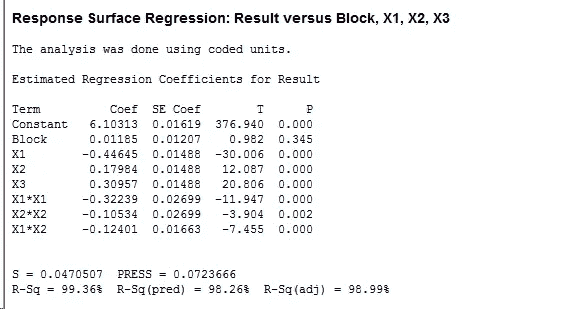

以(4.5，2.1，4)为中心的 CCD 实验设计的回归结果(图片由作者提供)

以 x1 和 x2 为变量的函数的等值线图如下所示:

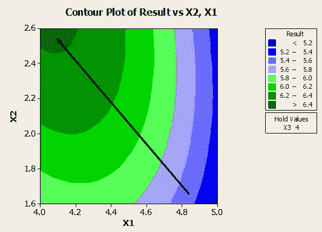

以(4.5，2.1，4)为中心的 CCD 实验设计的等高线图—箭头显示 y 最大增加的大致方向(图片由作者提供)

**实验组 2 的结论:**

由于 x1 的系数为负，x2 的系数为正，所以当 x1 减小而 x2 增大时，y 有可能增大。这通过上面所示的以(4.5，2.1，4)为中心的等高线图得到了证实。这里似乎有一个山脊，我们的移动方向应该是箭头所指的山脊顶部。

**实验集 3**

我将下一组实验集中在点(4，2.5，4)上，该点位于前面等高线图中所示的箭头处。这是我下一个实验的下一个地点，我在下面描述了它:

**实验装置 3 的设计**

因子及其范围:x1(3.5–4.5)，x2(2.0–3.0)，x3 =4.0(固定)

*动机*:这里的目标是向山脊值递增的方向移动，并检查相邻区域的 y 值如何变化。考虑到响应函数的高度非线性特性，应采取小增量的步骤。

我从 2 (1 次重复)+ 4 CP 开始，并根据对显著曲率的检测改变为响应面设计(CCD)，其运行如下所示:

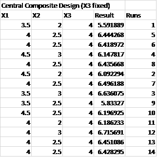

以点(4，2.5，4)为中心的中心复合设计

该集合的回归分析结果如下所示。我删除了不重要的术语，并在此展示了仅包含重要术语的模型:

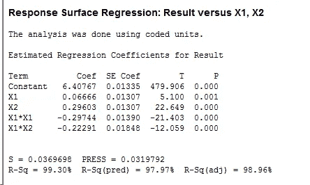

以(4，2.5，4)为中心的 CCD 回归结果(图片由作者提供)

该区域的等高线图如下所示:

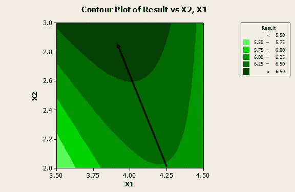

以(4，2.5，4)为中心的 CCD 等高线图—箭头显示 y 最大增长的大致方向(图片由作者提供)

同样，该模式是朝着 x1 的较低值和 x2 的较高值增加的增加脊。因此，下一步是在相邻的 1 阶盒区域进行实验，即 x1 =[3–4]和 x2 =[2.5–3.5]。为了简洁起见，我展示了等高线图来指示接近的方向，而不是详细讨论接下来两个 CCD 实验的结果。这些实验在以下地区进行

4.x1 =[3–4]和 x2 =[2.5–3.5]

5.x1 =[2.5–3.5]和 x2 =[3–4]

6.x1 =[2–3]和 x2 =[3.5–4.5]

从所有这 3 个区域得出的一般结论是，响应面设计更合适，轮廓开始显示接近峰值的模式。这些区域的等高线绘制如下。

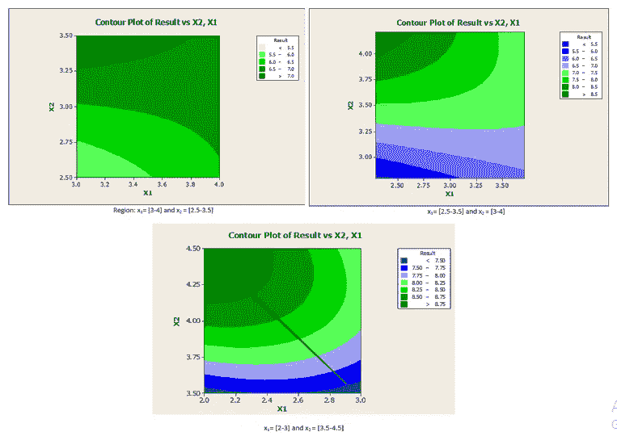

区域 4、5 和 6 的 CCD 等值线图——箭头显示了 y 最大增长的大致方向(图片由作者提供)

**来自实验组 3 的结论(包括区域 4、5、6 中的 CCD 运行):**

现在很清楚，我们可能正在接近一个峰值，下一个逻辑步骤是继续朝着减少 x1 和增加 x2 的方向前进，并移动到下一个区域。

**实验集 4**

这很可能是峰值区域，我在(2，4，5，4)中心做了一个 CCD

**实验装置 4 的设计**

因子和范围:x1(1.5–2.5)，x2(4.0–5.0)，x3 =4.0(固定)

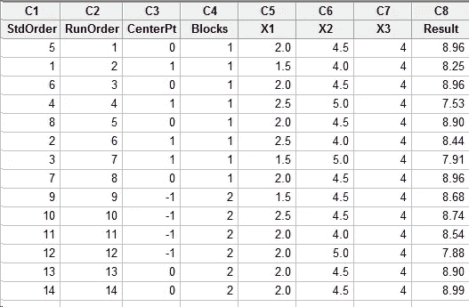

实验四:以(2，4.5，4)为中心的 CCD(图片作者提供)

回归响应和等高线图如下所示:

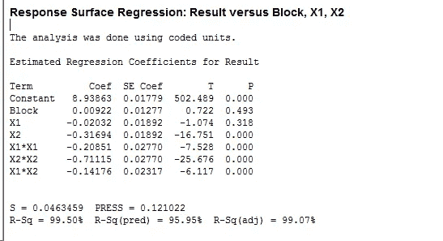

以(2，4.5，4)为中心的 CCD 回归结果(图片由作者提供)

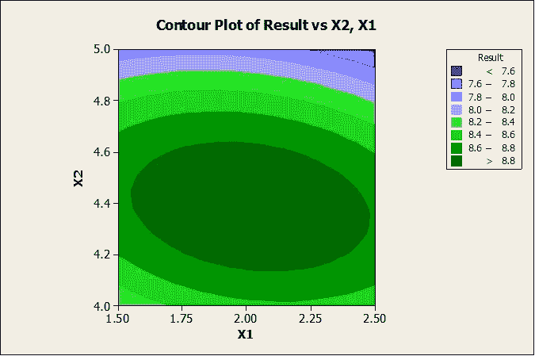

(2，4，5，4)周围区域的 CCD 等值线图—最佳值区域(图片由作者提供)

很明显，我们已经达到了一个峰值，y 的最大值出现在 x1 = 2 和 x2 = 4.5

现在很清楚，最佳值出现在 **x1 = 2 和 x2 = 4.5 处，**我们现在必须找到 y 值最高的 x3 的值。因为我们发现 x1、x3 和 x2、x3 之间没有交互作用，所以我们可以简单地运行 10 个实验，其中 x1 和 x2 的值为最佳值，x3 在 0.5 和 5.0 之间变化。

下表显示了 10 次试验:

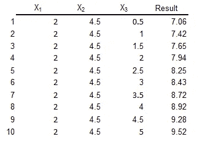

实验确定 x3 的最佳设置(图片由作者提供)

基于这 10 次运行，很明显 y 的全局最优值出现在 **x1 = 2、x2 = 4.5 和 x3 = 5(这些是编码值，但是可以通过简单的线性变换容易地解码)，并且 y 的值是 9.52**

**实验顺序图**

我所做的一系列实验如下图所示:

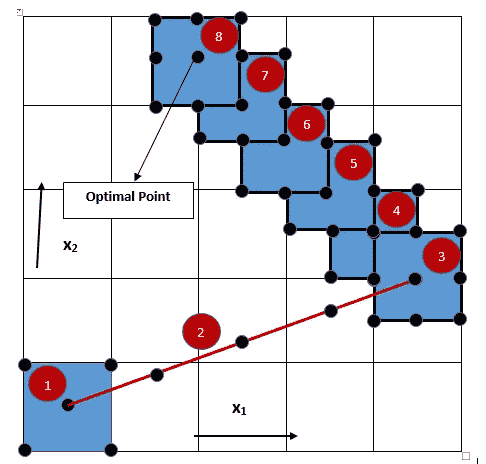

为确定最佳设置而执行的一系列实验(图片由作者提供)

**驻点描述**

我还使用简单的微积分在(2，4，5，4)周围的区域中解析地导出了静止点，以检查最优值集。

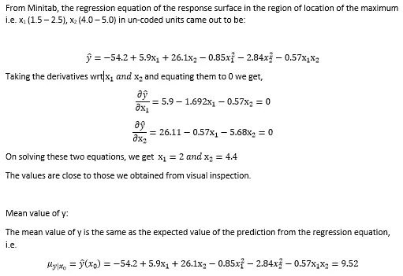

最佳点的描述(图片由作者提供)

回归方程给出了 y 的期望值，但也有与之相关的标准差。我是在最佳设置下计算的:

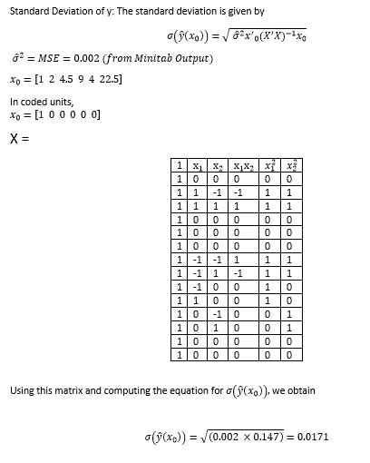

最佳参数设置下抗压强度标准偏差的计算

我们可以使用这个标准偏差来找到抗压强度的置信区间，该置信区间可以反过来用于确定我们可以接受的强度下限，比如 95%置信区间。

**结论**

简而言之，多元优化的实验设计方法是一种强大的方法，它使用小步前进的原则，并利用未知设计函数在搜索空间中探索最大收益的路径。它帮助我们通过采取这些智能步骤快速找到最佳值，而不是使用在计算和财务上非常昂贵的暴力方法。我用三个参数工作，这有助于可视化算法在做什么。然而，这种技术也可以适用于大规模的多元问题。

我希望我的帖子能引发你进一步探索实验设计的兴趣！