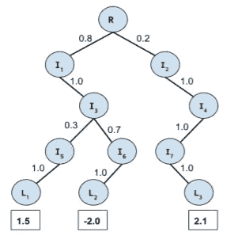
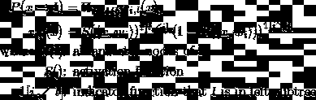
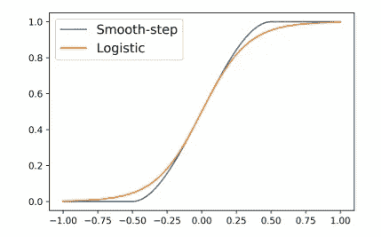

# 树集合层上的解释器

> 原文：<https://towardsdatascience.com/an-explainer-on-tree-ensemble-layer-b7e445621a3f?source=collection_archive---------17----------------------->

## 一种具有决策树优点的新型神经网络层。

由 [Unsplash](https://unsplash.com?utm_source=medium&utm_medium=referral) 上的 [Pietro Jeng](https://unsplash.com/@pietrozj?utm_source=medium&utm_medium=referral) 拍摄

神经网络和决策树都在多个机器学习问题上表现出色。如果我们可以在一个模型中同时获得两者的优点，会怎么样？这就是[谷歌研究](https://github.com/google-research/google-research)团队试图在他们名为[树集成层:可微性符合条件计算](https://arxiv.org/abs/2002.07772)的论文中寻求的东西。

树支持*条件计算*，即它们能够通过少量节点路由每个样本。这可以带来性能上的好处，增强统计属性，并有助于可解释性。但是树的性能严重依赖于特征工程，因为它们缺乏表示学习的机制。这是神经网络的优势所在，特别是在图像和语音识别问题上，尽管缺乏对条件计算的支持。本文提出了神经网络的一层可加可微决策树，*树集成层(TEL)，*。该层可以插入神经网络中的任何位置，并且可以通过标准的基于梯度的优化方法(例如 SGD)来训练。

## 可微分决策树

软路由，[https://arxiv.org/abs/2002.07772](https://arxiv.org/abs/2002.07772)

在经典的决策树中，每个样本在每个节点处被精确地指向一个方向(*硬路由*)，这在损失函数中引入了不连续性。由于不能应用连续优化技术，所以采用贪婪方法来构建树。软树是执行*软路由*的决策树的变体，即以不同的比例将每个样本路由到左侧和右侧。在这种结构中，损失函数是可微的，并且可以使用基于梯度的优化方法。

但是我们如何对一个特定样本， ***x，*** 到达一个叶节点， ***l 的概率建模呢？*** 为了到达节点 ***l*** ，样本 ***x*** 必须访问其所有的祖先节点。并且在每个节点都会以一定的概率发送到左右两个子树。到达节点 ***l*** 的总概率是在每个节点移动到包含 ***l*** 的子树的联合概率。

样本 x 到达节点 l 的概率

***r_i，l(x)*** 是在节点 ***i*** ，样本 ***x*** with 将向包含叶子 ***l*** 的子树移动的概率。逻辑函数是激活函数的一个普遍选择，但它并不精确地给出 0 或 1。这意味着需要计算所有节点，计算量随着树的深度呈指数增长。继**连续**和**可微分**激活函数被提出来解决这个问题:

平滑阶跃激活函数

选择 ***\gamma*** 控制硬路由到 0 或 1 的样本数。该函数非常接近逻辑函数。

平滑步长 vs 逻辑函数(1/(1+e^(-6t)):[https://arxiv.org/abs/2002.07772](https://arxiv.org/abs/2002.07772)

## 条件计算

为了优化 TEL，可以使用一阶优化方法，例如随机梯度下降(SGD)的变体。梯度的计算随着树的深度呈指数增长，这已经成为一个主要的瓶颈。通过利用上面定义的激活函数及其梯度中的稀疏性来开发有效的前向和后向传播。

**条件正向传递:**在计算梯度之前，需要在树上正向传递。这里，通过丢弃任何子树和随后的计算来利用稀疏性，其中激活函数被硬路由到 0。

**条件反向传递:**反向传递遍历树，用梯度更新每个节点。值得注意的重要观察是，对于值被硬路由到 0 或 1 的任何节点，梯度都是 0。因此，在后向过程中要访问的节点数量甚至低于前向过程中访问的节点数量。这是通过创建节点数量减少的*分数树*来实现的，从而加快计算速度。

来自论文的实验结果表明，TEL 实现了与梯度增强决策树(GBDT)和密集神经网络(DNN)层竞争的性能，同时导致显著更紧凑的模型。这篇论文非常有趣，因为它采用了一种新的方法将可解释性引入神经网络模型。DNN 中的每个隐藏层学习一个表示，将 TEL 层放在输出层之前肯定有助于理解该表示与输出的直接联系。

1.  Hazimeh，h .，Ponomareva，n .，Mol，p .，Tan，z .，& Mazumder，R. (2020 年 11 月)。树集合层:可微性满足条件计算。在*机器学习国际会议*(第 4138–4148 页)。PMLR。