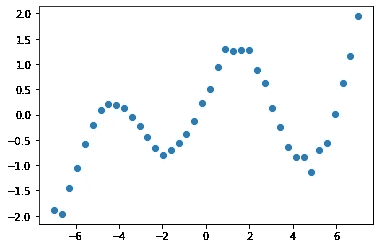
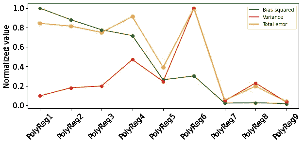
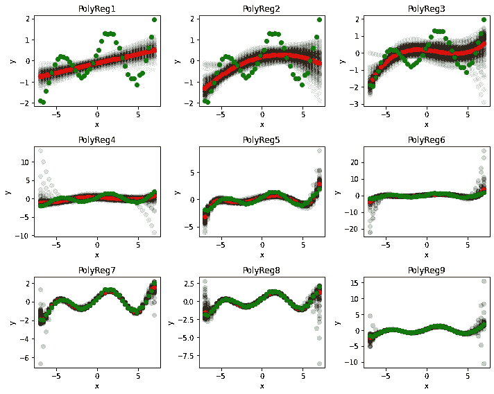
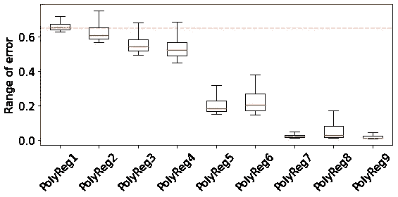

# 使用经验测试解释回归的偏差-方差权衡

> 原文：<https://towardsdatascience.com/an-explanation-of-bias-variance-trade-offs-for-regression-using-empirical-testing-d6935140139f?source=collection_archive---------47----------------------->

## 实证模拟可以增强有抱负的数据科学爱好者对统计概念的理解。


摄影:[迈克尔·斯科特](https://unsplash.com/@kic_mike)在[的 Unsplash](https://unsplash.com/s/photos/curves?utm_source=unsplash&utm_medium=referral&utm_content=creditCopyText)

偏差-方差权衡是机器学习初学者的基本学习要求，以确保基于样本数据选择最合适的模型。关于这一主题的最常见的在线图表如图 1 所示，它显示了三种类型的误差:偏差、方差和总误差以及它们之间的关系。随着模型复杂性的增加，偏差减少，而方差增加，总误差呈抛物线形状。尽管许多专家对此进行了严谨的论述，但这些解释可以通过一定的实证实验来补充，以帮助学习者对这一概念获得令人满意的直观理解。这篇文章的目的是在计算机上使用随机数据计算偏差和方差。

在我们开始之前，为了一致性和更好的理解，注意某些定义和符号是有用的[1，2]:

**模型的类/族:**线性的、某次多项式的、或其它一些具有确定结构的非线性模型(如 ax2 + bx +c 属于模型的二次族)

**成员模型:**是模型的实例，参数固定。例如，典型的二次方程(3x2 + 7x + 1)就是二次方程族的一员。

**偏差:**是响应变量的观察值(真实值)与拟合响应的*期望值*之间的差值。它是模型的属性，而不是数据。

**方差:**描述模型的输出如何根据看不见的数据而变化。与偏差一样，偏差-方差概念中的方差也是模型的一个属性。

**样本数据挑战**

在现实世界中，计算与模型拟合相关的偏差-方差图具有挑战性，原因有两个。首先，我们从来没有超过一个数据集，这就是为什么自举采样变得流行。该技术从单个数据集随机生成许多数据集，这不仅有助于选择正确的模型系列，还可以识别该系列中最合适的模型成员。第二，我们常常把观察值当作真实总体的最具代表性的值。如果一个样本包含几个数据收集偏差[3]并且不具有代表性，那么重复重采样对减少原始样本中的误差作用不大；

虽然我们不能改变现实，但多亏了计算机，我们总是可以创造我们自己的现实，产生合成数据来理解统计概念，并根据经验对它们进行测试。让我们假设输入变量(为简单起见，考虑一个输入变量)和观察到的响应变量之间的关系(在现实世界中我们从来不知道)可以用下面的等式表示(参见 get_y 函数):

```
import numpy as np
import matplotlib.pyplot as plt
import pandas as pdfrom collections import defaultdictfrom sklearn.linear_model import LinearRegression
from sklearn.preprocessing import PolynomialFeaturesdef get_y(x):

    # yes I know, it is complicated; don't ask how I came up with it
    y = np.sin(x) + 0.001*(x**4 + 4*x**3 - 20*x**2 + 400)

    # adding noise
    rand_err = [np.random.normal(0,0.1*abs(i)) for i in y.flatten()]
    y = y + np.array(rand_err).reshape(samp_size, 1)

    return ydef transform_x(x, order):
    poly = PolynomialFeatures(order)
    return poly.fit_transform(x)
```

第二个等式中的最后一项表示均值为零的正态分布噪声。我们首先随机生成一个样本大小为 50 的数据集 X (x_true)，并计算相应的 Y 值(y_true + errors)(见图 1)。这代表了我们将用于比较的具有真实(或测试)值的基线数据集。



图 1 输入和输出变量之间的真实关系

现在，我们将其重采样 100 次，以获得总共 100 个样本，每个样本有 40 个数据点，响应变量中添加了随机噪声。我们拟合了次数从 1(线性回归)到 9 众多多项式回归模型。因为只使用了一个变量，所以不存在交互项。下面分享了代码片段

```
np.random.seed(24)y_pred = defaultdict(list)
y_pred_mean = defaultdict(list)
bias, variance = dict(), dict()range_of_error = dict()nsamp = 100
samp_size = 50# getting a baseline dataset (lets call it true dataset)
x_true = np.linspace(-7, 7, samp_size).reshape(samp_size, 1)
y_true = get_y(x_true)fit_models = ['PolyReg1', 'PolyReg2', 'PolyReg3', 'PolyReg4', 'PolyReg5', 
              'PolyReg6', 'PolyReg7', 'PolyReg8', 'PolyReg9']for name in fit_models:

    # transforming true (test) input for the polynomial model
    order = int(name[7:])
    trans_x = transform_x(x_true, order = order)

    for i in range(nsamp):

        # bootstraping sampling with replacement
        idx = np.random.choice(samp_size, samp_size)
        x = x_true[idx]
        y = get_y(x)

        poly = PolynomialFeatures(order)
        x = poly.fit_transform(x)

        model = LinearRegression() 
        model.fit(x, y)

        ytemp = model.predict(trans_x) # temporary variable

        y_pred[name].append(ytemp.flatten())# to numpy array
    y_pred[name]    = np.array(y_pred[name])
    y_pred_mean[name] = y_pred[name].mean(axis=0)# bias of the estimator
    # E((f(x) - E(y_fit))**2)
    # for each single point from all datasets
    bias[name] = (y_true.flatten() - y_pred_mean[name])**2 
    # average over all data points
    bias[name] = bias[name].mean() 

    range_of_error[name] = (y_true.flatten() - y_pred[name])**2
    range_of_error[name] = range_of_error[name].mean(axis=1)

    # for each point from over all datasets
    # indirect formula
    #variance[name] = ((y_fit_mean[name] - y_fit[name])**2).mean(axis=0)
    # standard formula
    variance[name] = y_pred[name].var(axis=0)

    # average over all data points
    variance[name] = variance[name].mean()
```

**结果**

图 2 显示了简单模型(线性回归)在解释训练数据时表达性较差，这需要更高阶的多项式来获得更好的性能。当我们从简单模型转向复杂模型时，在 6 阶多项式的误差再次增加之前，5 阶多项式似乎为模型提供了最佳“拟合”。虽然并不完美，但这是偏差-方差计算的传统表示。



图 2 偏差方差权衡；来源:图片由作者提供；**注** : PolyRegK:第 k 阶多项式回归。为了更好地说明，这些值已针对所有模型的最大值进行了标准化。

然而，进一步的过度拟合实际上减少了误差、偏差以及方差，这似乎是一个双重下降的观察结果，这是数据科学界正在讨论的话题[4，5]。双下降现象表明，过拟合的缺点可能仅在模型复杂性达到一定水平时出现，并且极高水平的复杂性不一定会恶化模型性能。

图 3 显示了不同模型的分布。绿色曲线显示真实数据，而红色曲线描述模型对所有数据集的预期(平均)预测。灰色散点图显示了每个数据集的预测值。正如我们所见，高阶多项式的偏差较低(红色曲线接近绿色曲线)，但对于某些多项式，分布(灰色分散区域)变得更宽。



图 3 不同模型相对于真实模型的性能

**测试误差范围**

我们还可以通过使用我们的合成数据集来检查每个模型的误差范围。从图 4 中可以看出，均方误差的范围是真实数据集(所有数据集通用)和每个数据集的拟合值之间的差异。虽然每个模型的平均值反映了图 1 的值，但它显示了测试误差如何从一个数据集变化到另一个数据集。红色和蓝色虚线显示，对于某些数据集，“差”拟合模型可能比更具表现力的模型具有更少的测试误差。没有足够的高质量样本，单一数据集可能导致模型选择不当，这强调了使用单一数据集的多个变量生成偏差-方差曲线的重要性。

请注意，箱线图中的方差(分布)可能看起来是相关的，但它在数学上不同于偏差-方差图中的方差。在这里，它是基于不同数据集的预测误差的分布，与偏差-方差权衡不同，方差描述偏差的分布，是模型的一个属性



图 4 均方误差范围；来源:图片由作者提供

**结论**

这篇文章的目的是帮助初学者，包括我自己，通过经验模拟对偏差-方差概念有一个更直观的理解。偏差-方差权衡是一个统计学术语，像统计学中的所有其他概念一样，适用于预测的“预期”结果，而这种结果不能仅由一个样本数据集产生。Bootstrapping 技术可用于重现给定数据集的变量，并反复拟合模型以计算预期预测值以及预测值与观测值的差异。

虽然我使用回归进行说明，但是这个概念也应该适用于分类问题。鼓励读者进一步探索最近关于偏差-方差误差曲线双下降的发现[4，5]，其中随着模型复杂性的增加，偏差-方差权衡可能不再成立。

**参考文献**

[1]威廉·科恩，[机器学习中的偏差-方差](http://www.cs.cmu.edu/~wcohen/10-601/bias-variance.ppt) (2008)，机器学习，10–601 课堂讲座，CMU。

[2]A . Singh 和 Eric Xing，[偏差方差权衡和模型选择](https://www.ics.uci.edu/~smyth/courses/cs274/readings/xing_singh_CMU_bias_variance.pdf) (2012)，机器学习 10-701/15-781，CMU

[https://en.wikipedia.org/wiki/Sampling_bias](https://en.wikipedia.org/wiki/Sampling_bias)

[4] P. Nakkiran，G. Kaplun，Y. Bansal，T. Yang，B. Barak，I. Sutskever，[Deep Double Descent](https://openai.com/blog/deep-double-descent/)(2019)，OpenAI，

[5]安德鲁·杨，[每个数据科学家都应该知道:偏向-方差权衡一般化是错误的](/something-every-data-scientist-should-know-but-probably-doesnt-the-bias-variance-trade-off-25d97a17329d) (2021)，对数据科学而言