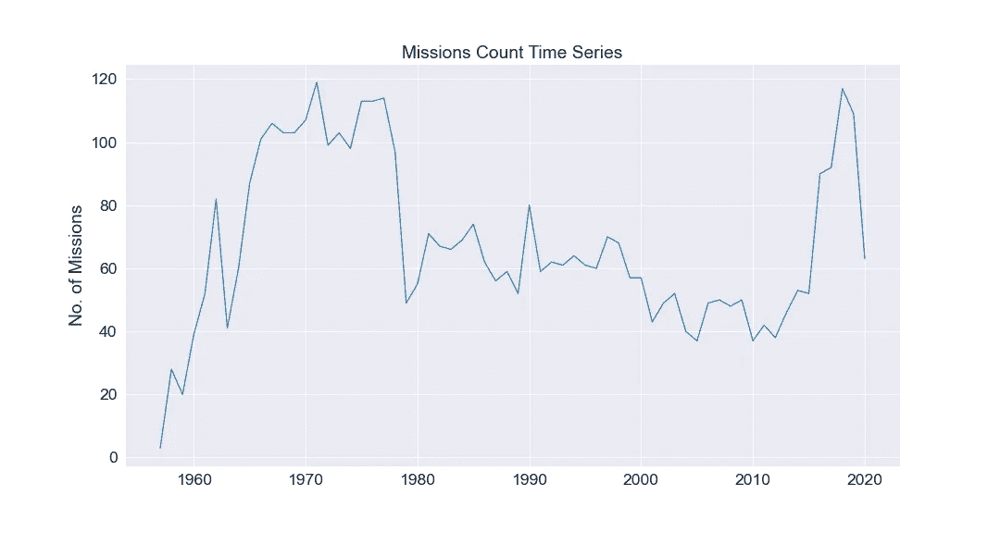
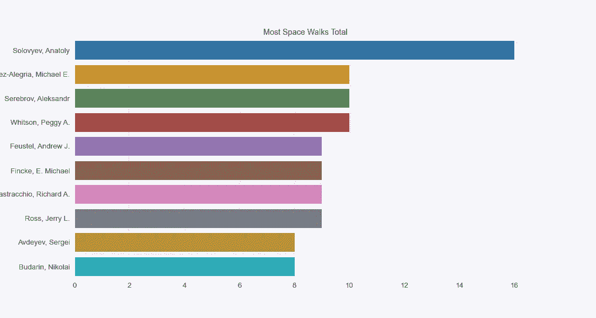

# 70 年空间探测数据的探索性分析

> 原文：<https://towardsdatascience.com/an-exploratory-analysis-on-7-decades-of-space-exploration-data-f0f2b78a6bb2?source=collection_archive---------27----------------------->

## 探索性数据分析

## 人类在太空最初 70 年的迷人见解和引人入胜的故事

美国宇航局在 [Unsplash](https://unsplash.com?utm_source=medium&utm_medium=referral) 拍摄的照片

# **简介**

探索性数据分析是任何数据科学家工具集中的一项关键技能。用数据讲述故事的能力对于激励决策者、激发对某个话题、领域或主题的兴趣至关重要。毕竟，我们都喜欢好故事。

为了说明它的威力，我对 70 年的太空旅行数据进行了探索性分析。我想分享一些令人着迷的见解，这些见解一定会让你震惊和惊喜。有无数种方法来分析数据进行探索，但最终为了防止你迷失方向，你应该始终牢记你探索的目的。

> 在整篇文章中，我用宇航员这个词来指代任何去过太空的人

# **接近**

为了让读者了解，我从数据中提取了一些见解，并以“前 10 名”、记录和显著成就的形式表达出来，从而构建了我的分析。

为了提供一些背景信息，我制作了一个太空任务的时间序列。我以此开始，来描绘一幅太空旅行在过去 70 年中是如何发展的画面。

尽管火箭、卫星和公司是太空探索的重要组成部分，但我的大部分分析还是集中在宇航员本身的成就上。来自这些数据的一些最令人着迷的见解与你可能认为人类不可能取得的成就有关。

重要的是要记住，人们通常会更好地与关于他们的故事联系起来；任何数据科学家在进行探索性数据分析时，如果他们希望讲述令人信服的故事，都应该记住这一点。

> 注意:所有的记录都与撰写这篇文章的时间有关。

# **数据**

在我的探索中，我使用了两个数据集，它们都是公开的。一个是太空任务级别，另一个是宇航员级别。重要的是要记住，任何数据都不应该用大写字母“D”来表示，任何来自数据的见解都应该进行感官检查。通过这样做，我发现了一些数据质量问题。

[**宇航员**](https://github.com/john-adeojo/tidytuesday/tree/master/data/2020/2020-07-14):2020 年 1 月 15 日前参加过太空任务的所有宇航员。数据来源是 NASA、Roscosmos 和好玩的网站。数据集是任务宇航员级别的，包含每个宇航员的详细信息和特定任务的详细信息。它由 517 个独特的任务组成，假设一个单一的任务可以通过连接任务年份、任务名称和 ascend shuttle 来识别。

[**任务**](https://www.kaggle.com/agirlcoding/all-space-missions-from-1957) :这是从网上抓取的任务级数据。它包括了自 1957 年开始以来的所有太空任务。详细介绍了任务的各个方面，如成本、火箭、发射时间、位置等。飞行任务数据包含 4，324 次飞行任务，其中 3，879 次是成功的。

宇航员数据中的任务总数与任务数据之间有很大的差异。对此的一个解释可能是因为任务数据中捕捉到的许多追踪都是无人驾驶的。

# **工具**

我使用 Python 进行所有的数据探索。许多数据争论都是在 NumPy 和 Pandas 图书馆的帮助下进行的。

对于数据可视化，我使用了 Matplotlib 和 Seaborn。我不会在这篇文章中分享代码片段。但是，我会在 GitHub 中提供完整的端到端代码。

# **太空探索背景**

作者图片

自 1957 年开始太空探索以来，太空任务的数量逐年上升，1971 年达到 119 次的高峰。它保持在每年 97 次以上，直到 1979 年下降到 49 次。直到 2018 年，它才再次恢复，当年达到了 117 次任务。是什么导致了这次下跌？

以下是一些可能性:

> 1971 年——联盟 11 号的机组人员在脱离空间站礼炮 1 号后遇难。
> 
> 1975 年——美国和苏联联合进入太空，引发了太空竞赛的结束。
> 
> 1986 年——挑战者号航天飞机发射 73 秒后发生灾难，机上 7 名机组人员全部遇难。

2018 年的复兴可能是由企业对太空探索兴趣的不断扩大所驱动的。像 SpaceX 和中国 CASC 这样的公司已经因其在该领域的成就而成为头条新闻。

仅在 2020 年 1 月，CASC 就完成了 19 次发射，SpaceX 完成了 14 次。

# **成为一名宇航员需要多久？**

从选择(训练开始)到第一次任务的平均时间约为 6.3 年。75%的宇航员在最初选择的 8 年内完成了他们的第一次任务，特别是 25%的宇航员在 4 年内完成了任务。

作者图片

# **太空行走者**

也许比月球漫步更酷，太空行走指的是在地球大气层以外的交通工具中度过的时间。它被记录为宇航员数据中的舱外时间。

作者图片

Anatoly Solovyev，现已退休的俄罗斯苏联宇航员，进行了 16 次太空行走，他保持着太空行走次数的记录。阿纳托利的舱外时间似乎存在一些数据质量问题。在一次任务中，他的时间记录大于他在所有任务中的总时间。这就是为什么不完全相信你得到的任何数据是至关重要的！

因此，我无法从他最长的太空行走或太空行走总时间的数据中得出任何见解。他的官方记录是 82 小时。

阿纳托利·索洛维耶夫[来源](https://www.flickr.com/photos/nasacommons/30468760185/in/photolist-NqqmTt-fpDmsg-oY2mGe-oNF9FA-eJcqfm-2h9VjZi-2h9Wcxy-2k2Nx9h-2k2SkZU-CJCf73-2k2Nxau-2k2NwSW-2k2Sm1R-2k2SkXV-2k2NwW3-2k2SkYw-fgY1p4-2hkdfSM-2gfDiWr-2gfDiy2-2gfDhXT-2gfCLLV-2gfCMAA-2gfDgRE-2gfCWdc-2h7kXWa-2hD76HV-fgY1ip-fgY1gc-2gfCLv9-2gfDgCP-2gfCUbb-2hkdb29-2gfDgrw-2hkdWH4-2gfDfq8-2hkdXic-2gfCTJe-2gfCTtu-2gfDeEk-2gfDejL-2gfCXN6-2gfCJtE-yBZLDT-2k2SWMv-da7CVe-58bzj7-2k2SXMg-2k2SXMG-2k2SYdX)

阿纳托利是一名军事指挥官；他最后一次任务是在 1997 年。一想到在太空行走时间最长的人是军人，就觉得很可怕。他在上面做什么？

# **太空长老**

目前最年长的太空行走者是帕维尔·维诺格拉多夫，他在 60 岁时进行了太空行走，累计时间为 6.62 小时。如果你认为宇航员通常年轻健康(嗯，不到 60 岁)，你并不孤单。

作者图片

首次执行任务的宇航员平均年龄为 39 岁，四分之一的宇航员年龄超过 43 岁。四分之一的宇航员在第一次任务中年龄不到 31 岁。这看起来不像是年轻人的游戏。

记录:最老的太空旅行者是小约翰·h·格伦，他离开地球大气层时 77 岁。

这张照片归功于美国国家航空航天局。

# **在轨道上穿梭**

国际空间站是在轨道上执行任务最多的航天飞机。任务数在 125 左右。这是和平号空间站任务次数的两倍多，该空间站由苏联运营，于 2001 年解散。

作者图片

国际空间站是一个绕地球轨道运行的大型宇宙飞船。它绕行一周大约需要 90 分钟，速度大约为每小时 17500 英里。美国宇航局目前使用该飞行器来了解人们如何在太空中生活和工作。顾名思义，几个国家合作维护和使用空间站。相对而言，这就解释了为什么对它的访问如此之多。

空间站的体积相当于一栋五居室的房子(或两架波音 747 飞机)。

> 点击这里了解更多关于国际空间站的信息。

**礼炮 7 号**:礼炮 7 号有 13 次任务，最后一次是在 1985 年。空间站最终坠毁在地球上。

我们的数据表明，在所有在轨航天器任务中，有两次爆炸。事实上，这只是一次爆炸:1986 年的挑战者号灾难。field ascend 航天飞机存在一些数据质量问题，1985 年挑战者号一半的机组人员乘坐了不同的航天飞机。

图片由美国宇航局拍摄:[号许可【1986 年挑战者号灾难](https://creativecommons.org/licenses/by/2.0/legalcode)

# **单次任务在太空停留时间最长**

这个奖颁给了瓦列里·波利亚科夫，他在太空中度过了 10，000 个小时(相当于单程 14 个月)。他是前宇航员，这次旅行是在和平号空间站上进行的。

作者图片

# **使命的故事**

美国在记录的太空任务总数中领先，大约有 283 次。这比俄罗斯、日本和加拿大的任务总和还要多，它们是下一个最有竞争力的国家。

**失败**:美国海军的任务失败率最高，在其 17 项任务中高达 82%。很有可能，虽然他们已经掌握了海洋，但他们完全超出了太空的深度。另一种可能是，他们对自己的表现要求更高。

作者图片:方格条代表任务数量，实线代表失败率

任务总数和失败率之间有微弱的负相关(-0.26)。进一步研究是什么驱动了成功的太空任务将会很有趣。

# **更多战绩**

第一个进入太空的人:第一个进入太空的人是尤里·加加林，他是苏联空军飞行员，于 1961 年遨游太空。尤里实现这一飞跃时才 27 岁，在太空旅行者的年龄中，他排在倒数第 25 位。

图片由[RV 1864](https://www.flickr.com/photos/summer1978/18699907011/in/photolist-uurURR-dzCg8c-9ABkZi-f468mg-bAm8Z1-DNSjdt-4unfG4-2dNUS2s-XraPVr-288N7tE-9z6PY1-UBdyen-8VGDJD-9xMBK9-MZEvCN-dwERLu-srbeQu-in6ohs-f7bYPM-uHrLn-ajDGGA-2aZX5oA-czqSiy-a5qd97-26k7noA-27eWiD1-fME5Dm-a5nkrH-4ESQpE-2ixsEPw-2iHgMi7-2jw1UoA-tf8Emu-2jw32Bs-2jQwEdQ-GjnrDM- 8tfKrx-2jFxe5L-2jcpVqF-2jKXocg-AYuHHf-f4kV2u-potVBA-4VKdGR-ruwZrP-7xMx5q-9xKGte-f46CnM-3JZUPU-f46DjR)T2 授权:尤里·加加林

**第一位进入太空的女性**:瓦伦蒂娜·捷列什科娃是第一位也是最年轻的进入太空旅行的女性。1963 年，26 岁的她在东方 6 号上独自执行任务。

图片由詹姆斯·乔尔 [授权](https://creativecommons.org/licenses/by-nd/2.0/legalcode)拍摄:瓦伦蒂娜·捷列什科娃

Svetlana Svitskaya 是第二位进入太空的女性，也是第一位进行太空行走的女性。在 1984 年前往礼炮 7 号的任务中，她完成了 3.58 小时的行走。她当时 36 岁。

另一个值得一提的是 Kathryn D. Sullivan，她在同年进行了 3.45 小时的太空行走，成为第一位在太空行走的美国女性。

# **进一步分析**

任务成本:看看任务成本的趋势会很有见地。有很多缺失的数据，并且该字段极其混乱，成本用字符串表示。即使在尝试将它们转换成 floats 之后，仍然有几个实例会产生异常。

为了进一步分析，我想生成一个每年任务平均费用的时间序列。由于所有的缺失值，只有一个样本的成本是可用的，因此我推断人口平均在 95%的置信区间。

预测模型:并不是所有的太空任务都是成功的。失败的原因大概有一些共性。也许可以用任务数据做一些预测模型，以了解是什么驱使任务成功或失败。我的数据中没有足够的特征来生成有用的模型。然而，也许我可以通过获得更多的任务数据来扩展分析。或者甚至利用数据集中的一些高基数字段进行特征工程。

# **最后的想法**

我可以从许多不同的方向进行分析。然而，我把大部分分析集中在人身上，因为我相信这是最引人注目的故事的来源。

🚀我已经创建了一个活页夹，所以你可以用这个笔记本进行实验[请点击这里查看这个笔记本！](https://mybinder.org/v2/gh/john-adeojo/astronaut_2/8dd9a8e65ba76dd4b20929dc360cf5f2f57e18c8?filepath=Astronauts%20JA%20v6%20(5).ipynb)

 [## John Ade-Ojo -数据科学|技术|银行和金融| LinkedIn

### 查看 John Ade-Ojo 在全球最大的职业社区 LinkedIn 上的个人资料。约翰的工作列表上有 6 份工作…

www.linkedin.com](https://www.linkedin.com/in/john-adeojo/)