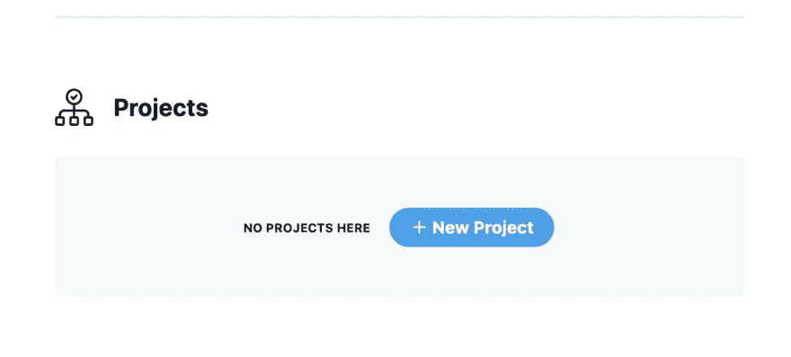
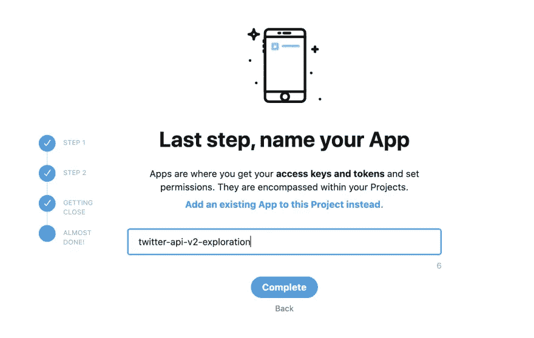
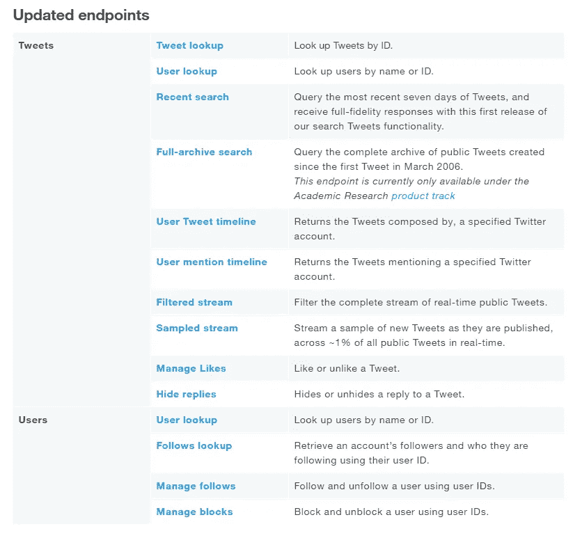
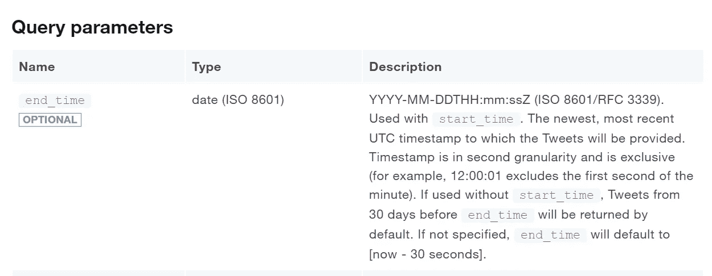
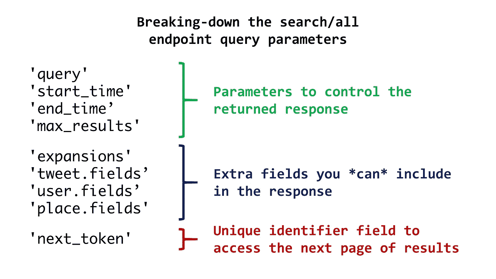
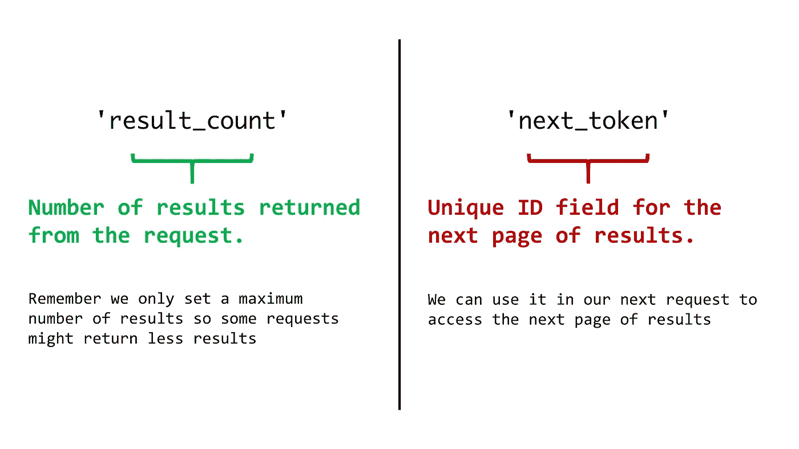

# 使用 Python 3 从 Twitter API v2 收集用于学术研究的推文的广泛指南

> 原文：<https://towardsdatascience.com/an-extensive-guide-to-collecting-tweets-from-twitter-api-v2-for-academic-research-using-python-3-518fcb71df2a?source=collection_archive---------0----------------------->

## [实践教程](https://towardsdatascience.com/tagged/hands-on-tutorials)

## 从设置、访问端点到保存以 CSV 格式收集的推文的一步一步的过程。


由 [NASA](https://unsplash.com/@nasa?utm_source=medium&utm_medium=referral) 在 [Unsplash](https://unsplash.com?utm_source=medium&utm_medium=referral) 上拍摄的照片

# 目录:

1.  介绍
2.  开始的先决条件
3.  不记名代币
4.  创建标题
5.  创建 URL
6.  连接到端点
7.  把所有的放在一起
8.  将结果保存到 CSV
9.  循环请求

# 1.介绍

2020 年底，Twitter 推出了全新构建的 Twitter API。Twitter API v2 提供了更多您可以提取和分析的特性和数据、新的端点和许多功能。

随着新 API 的引入，Twitter 也为学术界引入了一个新的强大的免费产品:[学术研究产品 track](https://developer.twitter.com/en/solutions/academic-research) 。

该路线允许免费访问完整存档搜索和其他 v2 端点，每月的推文量上限为 10，000，000 条！如果你想知道你是否有资格进入赛道，请查看这个[链接](https://developer.twitter.com/en/solutions/academic-research/application-info)。

我最近在卡耐基梅隆大学从事一个数据分析研究项目，利用本专题提供的能力，作为一名研究人员，它给你的力量是令人兴奋的！

然而，由于 API 的 v2 是相当新的，如果您在收集数据进行研究的过程中遇到问题，那么存在的资源会更少。

因此，在本文中，我将一步一步地介绍从设置、访问端点到保存以 CSV 格式收集的 tweets 以供将来分析使用的过程。

本文将使用仅适用于学术研究跟踪的端点([全存档搜索](https://developer.twitter.com/en/docs/twitter-api/tweets/search/api-reference/get-tweets-search-all)端点)，但是本指南中的几乎所有内容都可以应用于适用于所有开发人员帐户的任何其他端点。

如果您没有访问完全存档搜索端点的权限，您仍然可以使用[最近搜索](https://developer.twitter.com/en/docs/twitter-api/tweets/search/api-reference/get-tweets-search-recent)端点来遵循本教程。

建议您在阅读本文时使用 Jupyter 笔记本，这样每个代码片段都可以在单独的单元格中运行。

# 2.启动的先决条件

首先，我们将为本指南导入一些基本的库:

为了能够向 Twitter API 发送您的第一个请求，您需要有一个开发人员帐户。如果你还没有，可以在这里申请一个[！ ***(别担心，这是免费的，你只需要提供一些你打算从事的研究的信息)***](https://developer.twitter.com/en/apply-for-access)

获得批准的开发者帐户了吗？**太棒了！**

你所需要做的就是创建一个项目，并通过开发者门户连接一个应用程序，我们就可以开始了！

1.  转到[开发者门户仪表板](https://developer.twitter.com/en/portal/dashboard)
2.  使用您的开发者帐户登录
3.  创建一个新项目，给它一个名字，一个基于你想要实现的目标的用例，以及一个描述。



新项目页面截图

4.假设这是你第一次使用，请选择“创建新应用”并为你的应用命名，以便创建新应用。



为你的应用程序选择一个名称

如果一切顺利，您应该能够看到包含您的密钥和令牌的页面，我们将使用其中一个来访问 API。


图片也取自 Twitter 开发团队创建的[这个](https://developer.twitter.com/en/docs/tutorials/step-by-step-guide-to-making-your-first-request-to-the-twitter-api-v2)分步指南。

# 3.不记名令牌

如果你已经走到这一步，**恭喜你！**您有资格从 API 发送您的第一个请求:)

首先，我们将创建一个 **auth()** 函数，该函数将具有来自我们刚刚创建的应用程序的“不记名令牌”。

由于这个不记名令牌是敏感信息，你不应该与任何人分享它。如果你和一个团队一起工作，你不希望任何人能接触到它。

因此，我们将把令牌保存在一个“环境变量”中。

有很多方法可以做到这一点，你可以看看这两个选项:

> [*环境变量。env 与 Python*](https://www.youtube.com/watch?v=ecshCQU6X2U)[*利用 Python*](https://www.nylas.com/blog/making-use-of-environment-variables-in-python/) 中的环境变量

在本文中，我们将在代码中运行这一行来设置一个 **"TOKEN"** 变量:

```
os.environ['TOKEN'] = '<ADD_BEARER_TOKEN>'
```

只需将 Twitter 上的***<ADD _ BEARER _ TOKEN>***替换为您的不记名令牌，运行该函数后，删除这两行。如果这种方法有任何错误，请尝试上面列出的任何链接。

现在，我们将创建我们的 **auth()** 函数，它从环境中检索令牌。

# 4.创建标题

接下来，我们将定义一个函数，它将获取我们的承载令牌，传递它以进行授权，并返回我们将用来访问 API 的头。

# 5.创建 URL

现在我们可以访问 API 了，我们将为将要使用的端点和要传递的参数构建请求。

上面定义的函数包含两部分:

## A.搜索 _url:

这是我们想要访问的端点的链接。

Twitter 的 API 有很多不同的端点，下面是在撰写本文时可以提前访问的端点列表:



撰写本文时存在的一些早期访问端点

您还可以在这个[链接](https://developer.twitter.com/en/docs/twitter-api/early-access)中找到关于每个端点的完整列表和更多信息。

对于这篇文章，因为它是针对可能试图从 Twitter 的新产品中受益的学术研究人员，我们将使用 ***全存档搜索端点*** 。

## B.查询参数:

端点提供的参数，我们可以使用这些参数来定制我们想要发送的请求。

每个端点都有不同的参数，我们可以传递给它，当然，Twitter 的文档中有每个端点的 API 引用！

例如，对于我们在本文中使用的全存档搜索端点，您可以在这里的 [API 参考页面](https://developer.twitter.com/en/docs/twitter-api/tweets/search/api-reference/get-tweets-search-all)的**“查询参数”**部分下找到查询参数列表。



完整归档端点 API 文档中的查询参数示例屏幕截图

我们可以将上面函数中的查询参数分解为三个部分:



该端点参数的简单分解

1.前 4 个参数是我们控制的参数

```
'query':        keyword,
'start_time':   start_date,
'end_time':     end_date,
'max_results':  max_results,
```

2.接下来的 4 个参数基本上是我们指示端点返回更多信息，这些信息是可选的，默认情况下不会返回。

```
'expansions':   'author_id,in_reply_to_user_id,geo.place_id',
'tweet.fields': 'id,text,author_id,in_reply_to_user_id,geo,conversation_id,created_at,lang,public_metrics,referenced_tweets,reply_settings,source',
'user.fields':  'id,name,username,created_at,description,public_metrics,verified',
'place.fields': 'full_name,id,country,country_code,geo,name,place_type',
```

3.最后，“next_token”参数用于获取下一页结果。参数中使用的值直接从 API 提供的响应中提取。如果存在比每个请求的上限更多的结果，我们将在本文中对此进行更多的讨论。

```
'next_token': {}
```

现在我们知道了 create_url 函数的作用，有几个重要的注意事项:

*   **所需端点:**

在全存档搜索端点的情况下，*query*参数是发出请求**所需* *的唯一参数。请务必查看您正在使用的端点的文档，以确认哪些参数必须存在，这样您就不会遇到问题。

*   **查询参数:**

**查询**参数是您放置想要搜索的关键字的地方。

查询可以简单到搜索包含单词“xbox”的 tweet，也可以复杂到(xbox europe)或(xbox usa)，返回包含单词 xbox AND europe 或 xbox AND usa 的 tweet。

此外，可以使用*搜索运算符*定制*查询*。有很多选项可以帮助你缩小搜索结果的范围。我们有望在另一篇文章中更深入地讨论操作符。现在，你可以在这里找到构建查询操作符的完整列表。

带有操作符的简单查询示例: ***"xbox lang:en"***

*   **时间戳:**

Twitter 用于时间戳的*结束时间*和*开始时间*格式是

**YYYY-MM-DDTHH:MM:ssZ(ISO 8601/RFC 3339)**

所以一定要把日期转换成这种格式。如果你不确定如何做，这是一个很好的[时间戳转换器](https://www.timestamp-converter.com/)一定会有帮助。

*   **成绩卷:**

一个请求返回的搜索结果数量目前限制在 10 到 500 个结果之间。

现在你可能会问，我怎么能得到超过 500 个结果呢？这就是*next_token*和分页发挥作用的地方！

> 答案很简单:如果您的查询存在更多结果，Twitter 将返回一个唯一的 **next_token** ，您可以在下一次请求中使用它，它将为您提供新的结果。
> 
> 如果您想要检索您的查询中存在的所有 tweet，您只需使用每次收到的新*next_token*不断发送请求，直到不存在 **next_token** 为止，这表明您已经检索了所有 tweet！

希望你不会感到太困惑！但是不要担心，当我们运行我们刚刚创建的所有函数时，就会很清楚了！

# 6.连接到端点

现在我们已经有了想要的 URL、头和参数，我们将创建一个函数将所有这些放在一起并连接到端点。

下面的函数将发送“GET”请求，如果一切都正确(响应代码 200)，它将以“JSON”格式返回响应。

**注意:** ***next_token*** 默认设置为**【无】**，因为我们只关心它是否存在。

# 7.把所有的放在一起

现在我们已经有了所有需要的函数，让我们测试一下把它们放在一起创建我们的第一个请求！

在下一个单元格中，我们将设置我们的输入:

*   来自 API 的 bearer_token 和 headers。
*   我们将寻找包含单词“xbox”的英语推文。
*   我们将寻找 2021 年 3 月 1 日至 31 日之间的推文。
*   我们只想最多返回 15 条推文。

现在我们将创建 URL 并从 API 获得响应。

Twitter API 返回的响应以 JavaScript 对象符号“JSON”格式返回。
为了能够处理它并分解我们得到的响应，我们将使用我们之前导入的 python 的编码器和解码器。你可以在这里找到更多关于库[的信息。](https://docs.python.org/3/library/json.html)

如果从以下代码返回的响应是 ***200*** ，则请求成功。

```
url **=** create_url(keyword, start_time,end_time, max_results)json_response **=** connect_to_endpoint(url[0], headers, url[1])
```

让我们使用这个 JSON 库函数以可读的格式打印响应

```
print(json.dumps(json_response, indent=4, sort_keys=True))
```

现在让我们来分解返回的 JSON 响应，响应基本上是作为 Python 字典读取的，键要么包含数据，要么包含更多字典。最上面的两个键是:

## A.数据:

字典列表，每个字典代表一条推文的数据。如何检索第一条推文创建时间的示例:

```
json_response['data'][0]['created_at']
```

## B.元:

关于我们发送的请求的属性字典，我们通常只关心字典中的两个键， **next_token** 和 **result_count** 。



对两个键中数据的解释

例如，要检索 next_token，您可以编写:

```
json_response['meta']['result_count']
```

现在，我们有两个选项来保存结果，这取决于我们希望如何处理数据，我们可以将结果保存为我们收到的相同的 JSON 格式，或者保存为 CSV 格式。
要在 JSON 中保存结果，我们可以使用这两行代码轻松完成:

```
with open('data.json', 'w') as f:
    json.dump(json_response, f)
```

# 8.将结果保存到 CSV

您可能会问自己，为什么我们要将结果保存为 CSV 格式？简而言之，与 JSON 对象相比，CSV 是一种广泛使用的格式，可以很容易地导入 Excel 电子表格、数据库或数据可视化软件。

现在，要将结果保存为 CSV 格式的表格，有两种方法，一种简单的方法和一种更加定制的方法。

嗯… **如果有一个通过 Python 库的简单方法，为什么我们需要自定义方法呢？**

答案是:自定义函数将使我们将一些返回结果中嵌入的字典分解并精简到单独的列中，使我们的分析任务更容易。

例如，公共指标关键字:

```
"public_metrics": {
                    "like_count": 0,
                    "quote_count": 0,
                    "reply_count": 0,
                    "retweet_count": 0
                  },
```

该键返回另一个字典，简单的方法是将该字典保存在一个 CSV 列下，而在自定义方法中，我们可以在将数据保存到 CSV 之前将每个字典分成不同的列。

## A.简单的方法是:

对于这种方法，我们将使用熊猫包

```
df = pd.DataFrame(response['json_response'])
df.to_csv('data.csv')
```

这是基于推特开发团队关于这个主题的博客文章的内容，我尝试了这个方法，它在简单的查询下运行得很好。

## B.定制方法:

首先，我们将创建一个带有我们想要的列标题的 CSV 文件，我们将与我们的实际函数分开进行，这样以后它就不会干扰对请求的循环。

然后，我们将创建我们的 **append_to_csv** 函数，我们将把响应和期望的文件名输入到该函数中，并且该函数将把我们收集的所有数据附加到 csv 文件中。

现在，如果我们在最后一次调用中运行 append_to_csv()函数，我们应该有一个包含 15 条推特的文件(或者更少，这取决于您的查询)

```
append_to_csv(json_response, "data.csv")
```

# 9.循环请求

干得好！我们已经发送了第一个请求，并保存了第一个回复。

**现在，如果我们想保存更多的回复，该怎么办？**除了推特给我们的前 500 个结果之外，或者如果我们想在特定时期自动获得推特。为此，我们将使用循环和从 Twitter 接收的 next_token 变量。

让我们想想这个案例:

我们想收集 2020 年包含“新冠肺炎”一词的推特，分析人们在推特上谈论病毒时的情绪。可能有数百万条推特，我们每个月只能收集 1000 万条推特。

如果我们只是在 2020 年 1 月 1 日至 2020 年 12 月 31 日之间发送收集推特的请求，我们将很快达到上限，而不会在 12 个月内得到很好的分布。

因此，我们可以做的是，我们可以设定我们希望每月收集的推特数量的限制，这样，如果我们在某个月达到了特定的上限，我们就可以进入下一个月。

下面的代码就是一个例子，它将完全做到这一点！下面的代码块由两个循环组成:

1.  我们希望覆盖的月/周/日内的 For 循环(取决于设置方式)
2.  一个 While-loop，控制每个时间段我们希望收集的最大推特数量。

请注意，在调用之间添加了 **time.sleep()** ，以确保您不只是向 API 发送请求。

# **总结**

在本文中，我们已经通过了一个广泛的逐步过程，使用 Python 从用于学术研究的 Twitter API v2 收集 Tweets。

我们已经涵盖了所需的先决条件，身份验证，创建请求和向搜索/所有端点发送请求，最后以不同的格式保存响应。

如果你喜欢这个，请随时通过 Twitter 和 LinkedIn 与你的朋友和同事分享！

请随时在 LinkedIn 上与我联系，或者在 T2 的 Twitter 上关注我！