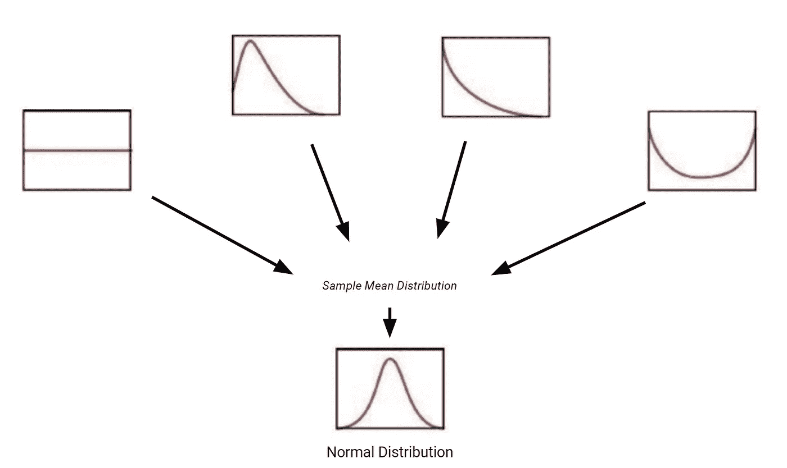
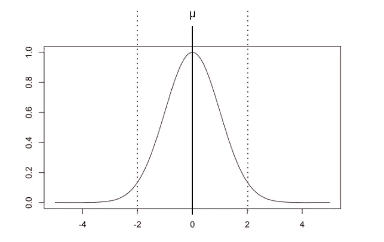
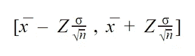
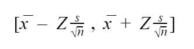

# 置信区间的广泛指南和为什么你需要知道它

> 原文：<https://towardsdatascience.com/an-extensive-guide-to-confidence-intervals-and-why-you-need-to-know-it-aca707fb2c3?source=collection_archive---------37----------------------->

## 像数据科学家一样思考这个重要的统计概念

乔恩·泰森在 [Unsplash](https://unsplash.com/s/photos/question?utm_source=unsplash&utm_medium=referral&utm_content=creditCopyText) 上的照片

# 介绍

几乎在商业中的任何角色，你都必须做出**估计:**

*   在市场营销中，你必须估计未来活动的投资回报率。
*   在供应链管理中，你必须预测(估计)你需要的库存量。
*   在产品开发中，置信区间对于确定产品的可靠规格非常重要。

现在，做出估计是一回事，但给出估计是另一回事**和**提供*置信水平*。

## 考虑以下情况…

*   陈述 A:我估计我们明年的销售额会达到 50 万美元。
*   陈述 B:我估计并且我有 95%的信心我们明年的销售额会在 450，000 美元到 550，000 美元之间。

两者有什么区别？

语句 B 为我们提供了更多的信息，因为它不仅为我们提供了一个统计数据，还告诉我们对这个统计数据有多大的“信心”。如果**信心**和**信心水平**的想法对你没有意义，不要担心，继续读下去。

# 目标

在本文中，我们将介绍什么是置信区间，为什么它们很重要，以及如何计算它们。

但是在深入置信区间之前，我们首先需要讲一个极其重要的概念，**中心极限定理**。

# 中心极限定理

**中心极限定理**非常强大——它指出样本均值的分布近似于正态分布。

作者创建的图像

举个例子，假设你从一个数据集中抽取一个样本，然后计算这个样本的平均值。一旦重复多次，你就可以把所有的样本均值和它们的频率绘制到一个图表上。不管初始分布是什么样的，最终总会是正态分布。

这真的很重要，因为这意味着我们可以利用假设正态分布的统计技术，比如置信区间。

# 那么什么是置信区间呢？

作者创建的图像

**置信区间**只是一个很可能包含感兴趣的参数(或统计数据)的数值范围。

例如，使用上面的图片，我们可以说样本均值是 100，或者我们可以说我们有 95%的把握样本均值在 90 和 110 之间。

另一方面，**点估计**是一个样本统计量，它提供了一个总体参数的单值估计(即平均值)。

**误差幅度**是点估计和置信区间终点之间的距离。

如前所述，使用置信区间而不是点估计(即平均值)的好处是因为它为我们提供了更多的信息。

**一般来说，置信区间越宽，你越有信心真实参数在区间内。**

# 均值的置信区间

由于中心极限定理，我们知道采样平均值的采样分布是正态分布，因此我们知道以下内容:

*   平均值等于μ
*   样本平均值等于 x̅
*   标准偏差等于σ/√n

作者创建的图像

因此，如果我们想要找到 95%的置信区间，知道[经验法则](https://www.investopedia.com/terms/e/empirical-rule.asp)，我们的误差幅度将是标准偏差的两倍——这是因为大约 95%的数据位于 2 个标准偏差内。

均值的置信区间

然后我们可以退一步，把它概括为一个方程。Z 分数简单地由我们希望我们置信区间有多“自信”来确定。

现在你可能在想，“在这之前，我们怎么知道σ呢？”这是个好问题。一般来说，如果你不知道μ，你可能也不会知道σ。也就是说，数学上可以证明，你可以用样本标准差作为替代。

因此，等式看起来像这样:

因为我们依赖中心极限定理来成立，所以有几个条件也需要成立。第一，样本必须是随机的，第二，样本大小(n)必须大于或等于 30。

# 比例的置信区间

现在，如果你想找到**人口比例**——也就是说，人口中具有某种特征的人/事物与人口总规模的比率。

在这种情况下，等式有一点改变:

*   您现在要寻找的不是平均值(μ),而是人口比例(p)
*   样本比例被表示为 p̂
*   标准偏差现在是= sqrt[p̂(1—p̂]/n]

这导致以下等式:

比例的置信区间

# 感谢阅读！

如果你坚持到了最后，那太好了！你应该知道什么是置信区间，它为什么有用，以及如何计算它。在进行估计时，置信区间是非常有用的，我强烈建议你除了进行点估计之外，还要使用置信区间。

如果你喜欢这样的文章，一定要给我一个关注介质。一如既往，我祝你在努力中好运！

不确定接下来要读什么？我为你挑选了另一篇文章:

 [## 数据科学面试中你应该知道的 10 个统计概念

### 学习聪明，不努力。

towardsdatascience.com](/10-statistical-concepts-you-should-know-for-data-science-interviews-373f417e7d11) 

**又一个！**

 [## 2021 年成为数据科学家的完整 52 周课程

### 连续 52 周，每周学点东西！

towardsdatascience.com](/a-complete-52-week-curriculum-to-become-a-data-scientist-in-2021-2b5fc77bd160) 

# 特伦斯·申

*   ***如果你喜欢这个，*** [***跟我上媒***](https://medium.com/@terenceshin) ***了解更多***
*   ***报名我的邮箱列表*** [***这里***](https://forms.gle/tprRyQxDC5UjhXpN6) ***！***
*   ***有兴趣合作吗？让我们连线上***[***LinkedIn***](https://www.linkedin.com/in/terenceshin/)