# 量子优势的例证

> 原文：<https://towardsdatascience.com/an-illustrative-case-of-quantum-advantage-6dd1a0168a73?source=collection_archive---------26----------------------->

## 实践中的 Deutsch-Jozsa 量子算法

量子机器学习要不要入门？看看 [**动手量子机器学习用 Python**](https://www.pyqml.com/page?ref=medium_illustrative&dest=/) **。**

关于量子计算的帖子通常以它将如何改变世界的轶事开始。据说它可以在几秒钟内完成经典计算机需要几千年才能完成的任务。

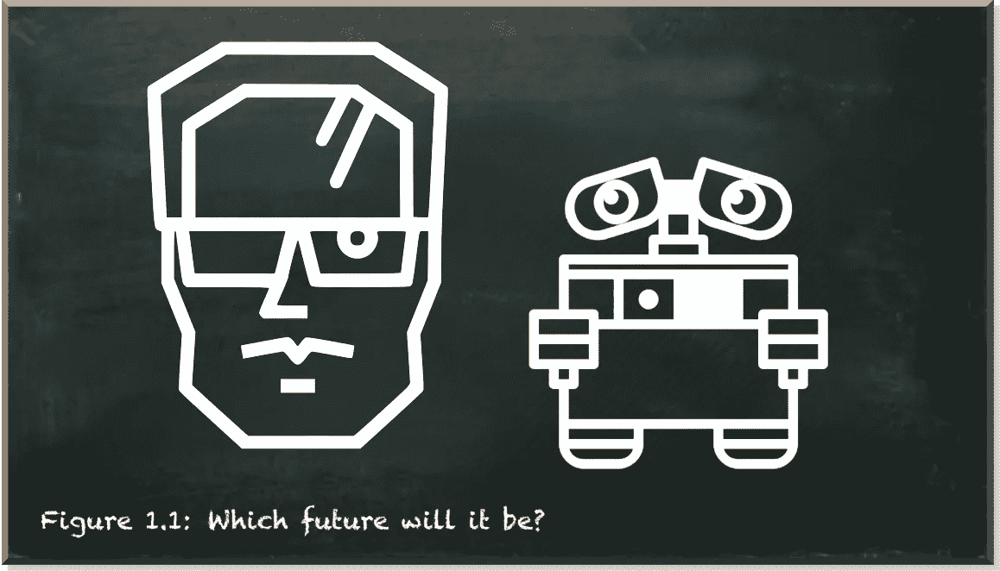

作者图片

然后，我们开始调查。首先，我们[了解量子比特(量子比特)与经典比特](/hands-on-exploration-of-the-qubit-815bee3f30dd)有何不同。它们处于叠加状态。叠加是状态 0 和 1 的复合(如在复数中)线性组合。许多人喜欢量子位不是 0 或 1，而是同时是 0 和 1 的概念。尽管这个概念不正确——或者至少不精确——但它生动地说明了量子算法的优势。经典计算机按顺序处理任务，一次一个，而量子计算机一次完成所有步骤。

在之前的一篇文章中，我们研究了大卫·多伊奇的算法。这种量子算法通过只查看一次来分类函数是恒定的(总是返回相同的结果)还是平衡的(给定不同的输入返回不同的结果)。相比之下，经典算法需要查看函数两次。

量子算法同时评估一个输入的不同方面的能力是惊人的。但是我们使用的例子似乎过于简单和解释。它不提供任何实用价值。因此，我们现在来看一个更实际的例子。

让我们假设有人给你一枚硬币，要你赌正面或反面。有人带着赌博的意图直接接近你？这听起来很可疑，不是吗？

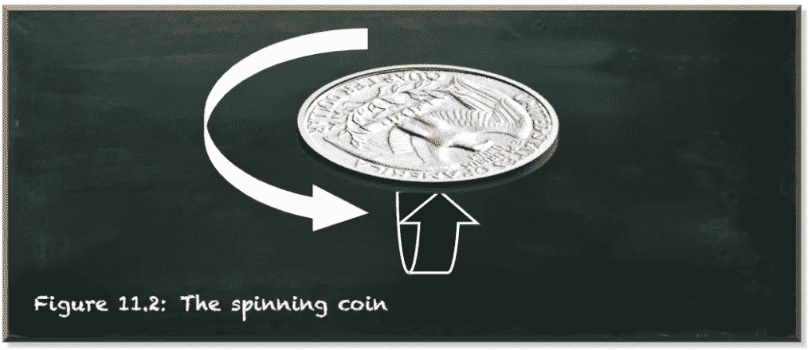

作者图片

在你同意玩之前，你首先要确定硬币没有被操纵。假设有两种选择。要么，硬币是公平的，一半的情况下落在两边。或者，硬币被骗了，总是落在同一边。判断硬币是否公平的唯一可靠方法是扔硬币，看它落在哪一边。

假设我们测试硬币四次。一枚公平的硬币会落在两边两次。那么，你需要多久抛一次硬币才能发现呢？如果你只扔一次，它要么正面朝上，要么反面朝上。这根本没告诉你什么。如果你再扔一次，它落在另一边，你就完了。那么，你知道这是一枚公平的硬币。但是如果硬币再次落在同一边呢？一枚公平的硬币可能有四分之二落在一边。要肯定地说一枚硬币被骗了，你至少需要抛三次(当我们假设在样本量为 4 的情况下是公平的)。

从数学上讲，当硬币在第 *n* 次投掷时是公平的，我们需要投掷硬币*2^(n/2–1)+1*次。对于 n=4，这些是*2^(4/2–1)+1=3*投掷。对于 n=8，这些是 2^(8/2–1)+1=7 投掷，对于 n=10，这些是 2^(10/2–1)+1=15 投掷，等等。这个数字呈指数增长。

在最坏的情况下，我们可能会重复得到相同的结果，而不知道硬币是否仍然公平。这将需要指数数量的查询——至少如果我们以传统方式进行。

有了量子计算，我们可以一次性解决这个问题。相反，我们对每一种可能的投掷组合使用一个量子位。为了简单起见，假设我们只扔硬币三次。假设 1 代表正面，0 代表反面。因此，有八种可能的输入:(0，0，0)、(0，0，1)、(0，1，0)、(0，1，1)、(1，0，0)、(1，0，1)、(1，1，0)、(1，1，0)、(1，1，1)。

在我们的量子电路中，我们考虑的每一次投掷使用一个量子位，外加一个辅助量子位。因此，我们使用四个量子位。

我们从导入所需的库和指定量子电路开始。该电路包含一个表示投掷的量子寄存器、一个包含辅助量子位的量子寄存器和一个接收测量值的经典寄存器。

算法的主要部分是量子预言。如果这是你第一次听说量子计算领域的先知，不要担心。[不是魔术，也不涉及神力](/the-quantum-oracle-demystified-65e8ffebd5d5)。量子预言只不过是转换门的占位符。甲骨文就像你在经典编程中可能知道的开关盒控制结构。你有一个变量，先知。并为它可能具有的每个可能值指定行为。

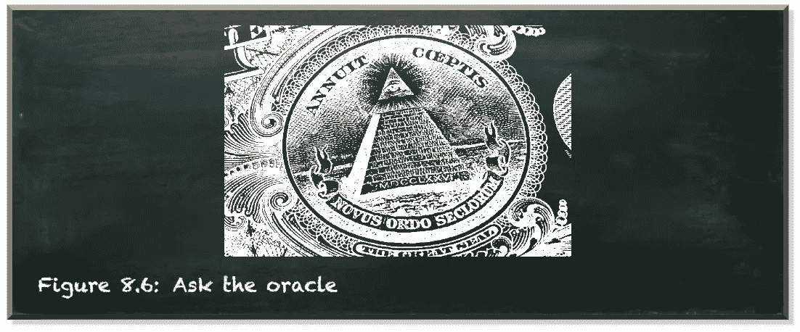

作者图片

在我们的例子中，神谕代表了硬币的行为。一枚被骗的硬币要么只产生 0，要么只产生 1。

Qiskit 在|0⟩.初始化一个量子位在这种状态下，我们总是将一个量子位测量为 0。所以，当我们什么都不做的时候，我们已经有了代表一枚被骗硬币的神谕，这枚硬币总是反面朝上。

无论如何，我们把“无所事事”包装成一个函数。这个函数为我们创建了一个定制的转换门。为了清楚我们做了什么，我们在所有代表投掷的量子位元上应用 I-gate。I 门是身份门，保持量子位不变。

下图以图形方式描绘了`tails_oracle`。

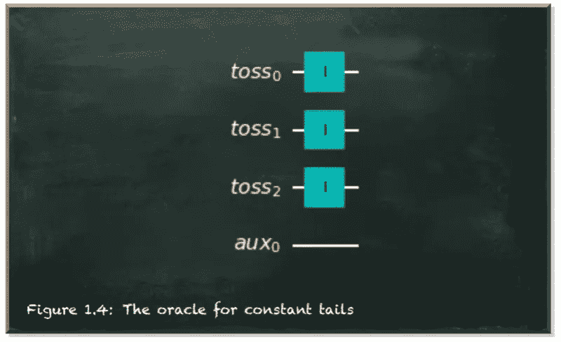

作者图片

当我们运行一个仅由这个 oracle 组成的电路时，它输出状态`000`——代表三次尾朝上。

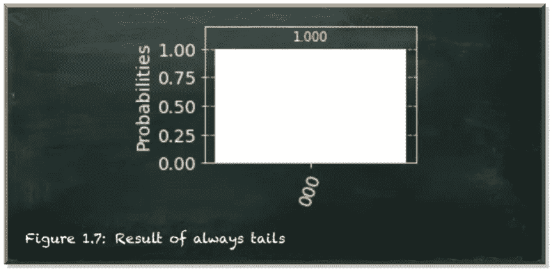

作者图片

“非门”将一个量子位从|0⟩态翻转到|1⟩.态因此，我们可以通过对所有量子位应用非门来创建一个代表被骗硬币的预言。

下图描述了这个 oracle。

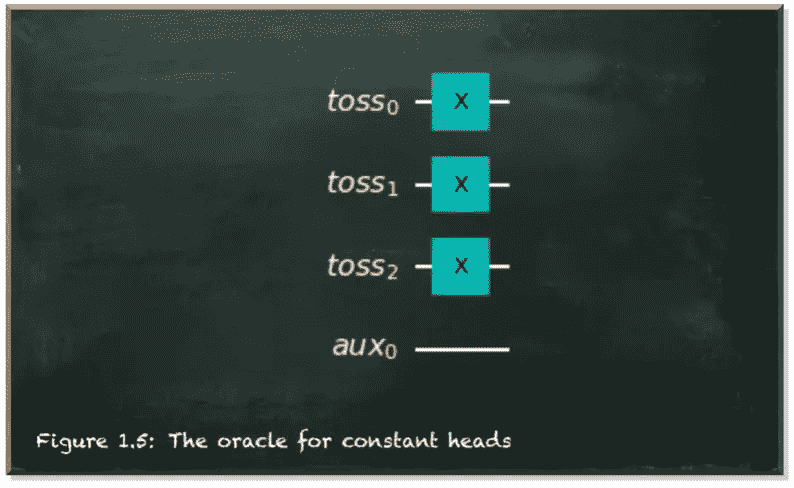

作者图片

这个神谕总是产生州名`111`——代表三次平视的州名。

代表公平硬币的神谕有点棘手。不过，它也不太复杂。对于三个量子位，我们可以说它至少正面朝上一次，反面朝上一次。函数`balanced_oracle`采用额外的`config`参数。这应该是一个表示抛硬币结果的位串。我们将非门应用于代表正面掷硬币的量子位。

此外，我们添加受控非门，每次投掷作为控制量子位，辅助量子位作为目标量子位。

下图描绘了配置`110`的平衡 oracle 代表头对头尾。

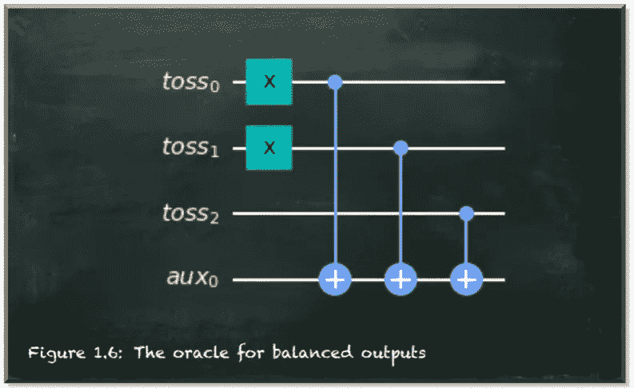

作者图片

这个预言导致我们在`config`位串中指定的状态。在我们的例子中，它是`110`。它也适用于所有其他输入。请注意，量子位从右向左读取。

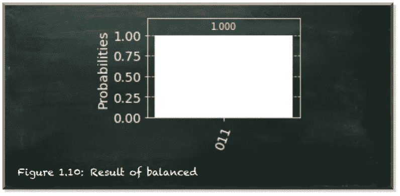

作者图片

显然，三个 CNOT 门并没有影响。这似乎是合理的，因为只有当控制量子位处于|1⟩.态时，CNOT-gate 才像非门一样作用于目标量子位我们所有量子位都在|0⟩.状态参见[这篇文章](/towards-einsteins-spooky-action-at-a-distance-c32ca0148f8f)以获得 CNOT 门更详细的视图。

问题出现了:“*如果 CNOT 门不重要，我们为什么要把它放在首位？*

答案就是我们的量子算法。到目前为止，我们只为不同的情况创建了神谕。我们看到神谕正确地代表了硬币的行为。

所以，让我们实现我们的算法，识别硬币是常数(欺骗)还是平衡(公平)。

我们从一系列的哈达玛门开始，将量子位带入|+⟩态，将辅助量子位带入|-⟩.态在这些状态下，一个量子位元被测量为 0 或 1 的机率各为 50%。|+⟩州和|-⟩州的区别在于量子位相位(参见[这篇文章](/the-qubit-phase-b5fea2026ea)了解更多关于量子位相位的信息)。

然后，我们应用神谕。最后，我们在量子位元上加上另一个哈达玛门，让它们从叠加态回到基态。

下图显示了电路，包括一个神谕。

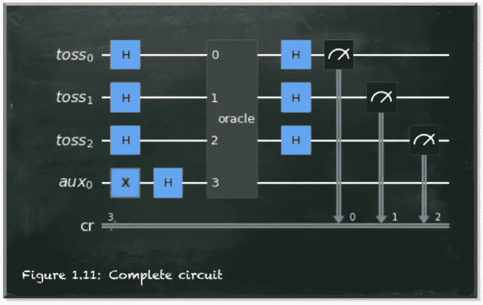

作者图片

所以。让我们看看这个电路的工作情况。我们从持续反面硬币的神谕开始。

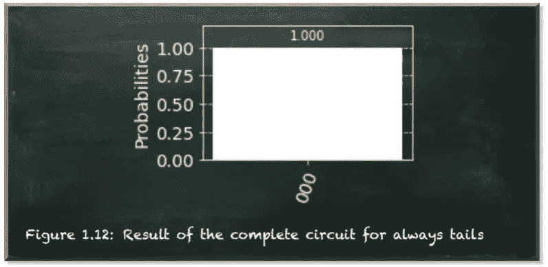

作者图片

它结束于状态`000`。

接下来，我们用`heads_oracle`运行算法。

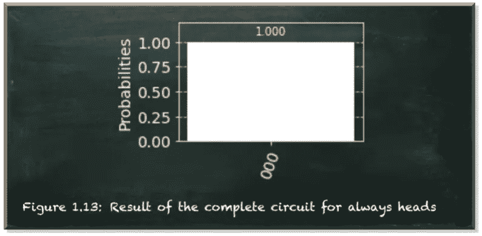

作者图片

它也在`000`州结束。

最后，我们用平衡甲骨文运行电路(你可以用任何位串运行它)。

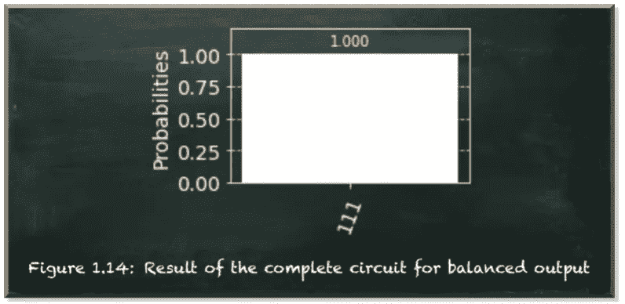

作者图片

对于平衡输入的预言，电路结束于状态`111`。您提供哪个位串作为输入并不重要。

***“但这是怎么做到的？”***

当预言不变时，我们要么应用 I 门，要么应用非门。但是由于我们的算法将量子位放入|+⟩状态，我们没有改变任何东西。当我们在|+⟩态的量子位元上应用非门时，它会停留在那个状态。当我们在电路末端使用哈达玛门时，它们会将量子位从|+⟩态转换回|0⟩.态我们有简单的 HIH 序列。

但是当我们应用`balanced_oracle`时，我们额外应用了 CNOT-盖茨。虽然如果量子位处于基态(如|0⟩)，这些都无关紧要，但如果量子位处于叠加态，它们就有关系了。然后，CNOT 门将目标量子位的相位应用于控制量子位。我们使用辅助量子位作为我们电路中的目标量子位，我们把它放入|-⟩.状态因此，当我们应用 CNOT 门时，我们将这个相位“复制”到其他量子位上。

结果，这些量子位也被转换到|-⟩态。最后的哈达玛门将|-⟩的量子位变成了|1⟩.我们称这种效应为[相位反冲](/quantum-phase-kickback-bb83d976a448)。

# 结论

开发了这个算法。它是 Deutsch 算法的推广，只使用两个量子位。

这个算法是量子算法比经典算法指数级更快的第一个例子之一。

此外，一个算法使用了相当多的量子特定技术，如叠加、预言和相位反冲。而且，当你一步一步地学习这些技术时，你会对量子算法在实践中的工作有很好的感觉。

量子机器学习要不要入门？看看 [**动手量子机器学习用 Python**](https://www.pyqml.com/page?ref=medium_illustrative&dest=/) **。**

在这里免费获得前三章。