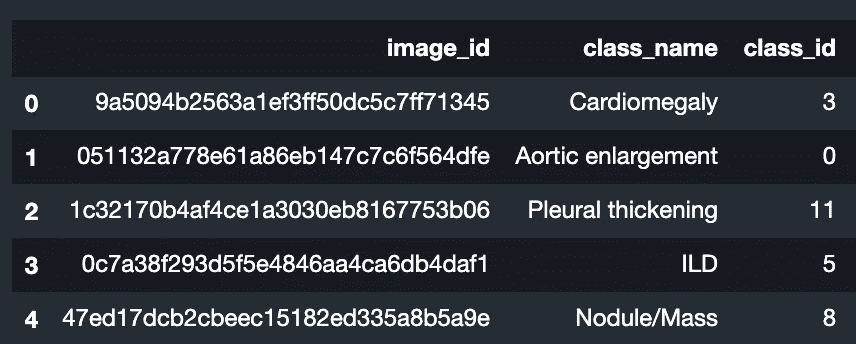

# 使用 TensorFlow 的深入 EfficientNet 教程—如何在自定义数据集上使用 EfficientNet。

> 原文：<https://towardsdatascience.com/an-in-depth-efficientnet-tutorial-using-tensorflow-how-to-use-efficientnet-on-a-custom-dataset-1cab0997f65c?source=collection_archive---------5----------------------->

## 使用 Tensorflow 在具有挑战性的 Kaggle 数据集上训练效率网


桑德·韦特林在 [Unsplash](https://unsplash.com?utm_source=medium&utm_medium=referral) 拍摄的照片

> 卷积神经网络(ConvNets)通常在固定的资源预算下开发，然后如果有更多的资源可用，则按比例增加以获得更好的准确性。在本文中，我们系统地研究了模型缩放，发现仔细平衡网络深度、宽度和分辨率可以获得更好的性能。基于这一观察，我们提出了一种新的缩放方法，该方法使用简单而高效的复合系数来统一缩放深度/宽度/分辨率的所有维度。我们证明了这种方法在扩展 MobileNets 和 ResNet 上的有效性。

来源: [arxiv](https://arxiv.org/pdf/1905.11946.pdf)

EfficientNet 是目前最先进的图像分类网络中相当强大的一个。我可以看到它在 Kaggle 的图像分类比赛中被大量使用，AUC 为 0.90 以上，我想我应该把我们的教程放在这里，因为网上没有那么多。

我将不会讨论 EfficientNet 的理论部分，因为有大量的在线资源，相反，我将讨论编码部分。你可以使用 [efficientNet-pytorch](https://github.com/lukemelas/EfficientNet-PyTorch) ，然而，我通常发现 TensorFlow 更快更容易使用。

我们将在此使用的数据集是来自 Kaggle 竞赛 [VinBigData](https://www.kaggle.com/c/vinbigdata-chest-xray-abnormalities-detection) 的胸部 x 光数据集。我们将使用 512x512 图像的调整版本，因为原始图像非常大(2k+)。你可以在这里找到调整后的版本。无论如何，本教程的主要目的是让你在自定义数据集上使用它。

除了图像之外，我们还有一个数据帧，用于指定每个图像的 class_id:



## 包装和进口

你想做的第一件事就是跑

```
!pip  install tensorflow-gpu
```

这将允许您在 GPU 上训练您的模型(如果您有一个)。接下来要导入几个包:

```
from tensorflow.keras.applications import * #Efficient Net included here
from tensorflow.keras import models
from tensorflow.keras import layers
from keras.preprocessing.image import ImageDataGenerator
import os
import shutil
import pandas as pd
from sklearn import model_selection
from tqdm import tqdm
from tensorflow.keras import optimizers
import tensorflow as tf#Use this to check if the GPU is configured correctly
from tensorflow.python.client import device_lib
print(device_lib.list_local_devices())
```

## 设置效率网络:

> 为了更进一步，我们使用神经架构搜索来设计一个新的基线网络，并将其放大以获得一系列模型，称为 EfficientNets，它比以前的 ConvNets 实现了更好的准确性和效率。特别是，我们的 EfficientNet-B7 在 ImageNet 上实现了最先进的 84.3%的顶级准确性，同时在推理上比现有的最佳 ConvNet 小 8.4 倍，快 6.1 倍。我们的 EfficientNets 也能很好地进行迁移，并在 CIFAR-100 (91.7%)、Flowers (98.8%)和其他 3 个迁移学习数据集上实现了最先进的准确性，并且参数数量级更少。源代码在 https://github . com/tensor flow/TPU/tree/master/models/official/efficient net

来源: [arxiv](https://arxiv.org/pdf/1905.11946.pdf)


由[卢卡·布拉沃](https://unsplash.com/@lucabravo?utm_source=medium&utm_medium=referral)在 [Unsplash](https://unsplash.com?utm_source=medium&utm_medium=referral) 上拍摄

好了，接下来我们需要做的是建立一个有效的网络，并安装预先训练好的砝码

```
# Options: EfficientNetB0, EfficientNetB1, EfficientNetB2, EfficientNetB3, ... up to  7
# Higher the number, the more complex the model is. and the larger resolutions it  can handle, but  the more GPU memory it will need# loading pretrained conv base model#input_shape is (height, width, number of channels) for images
conv_base = EfficientNetB6(weights="imagenet", include_top=False, input_shape=input_shape)
```

Weights="imagenet "允许我们进行迁移学习，但如果您愿意，可以将其设置为 None(您可能不应该这样做)。include_top=False 允许我们轻松地将最终图层更改为自定义数据集。

安装模型后，我们希望做一点配置，使它适合我们的自定义数据集:

```
model = models.Sequential()
model.add(conv_base)
model.add(layers.GlobalMaxPooling2D(name="gap")) #avoid overfitting
model.add(layers.Dropout(dropout_rate=0.2, name="dropout_out")) # Set NUMBER_OF_CLASSES to the number of your final predictions.
model.add(layers.Dense(NUMBER_OF_CLASSES, activation="softmax", name="fc_out"))
conv_base.trainable = False
```

## 准备数据集:

模型准备好了。现在我们需要准备数据集。我们将使用 flow_from_directory 和 Keras 的 [ImageDataGenerator](https://keras.io/api/preprocessing/image/) 。此方法需要培训和验证目录。在每个目录中，每个类都应该有一个单独的目录，该目录下有相应的图像。

首先，让我们为培训和验证下的每个类创建一个目录。

```
TRAIN_IMAGES_PATH = './vinbigdata/images/train' #12000
VAL_IMAGES_PATH = './vinbigdata/images/val' #3000
External_DIR = '../input/vinbigdata-512-image-dataset/vinbigdata/train' # 15000
os.makedirs(TRAIN_IMAGES_PATH, exist_ok = True)
os.makedirs(VAL_IMAGES_PATH, exist_ok = True)classes = [ 'Aortic enlargement',
            'No Finding']# Create directories for each class.for class_id in [x for x in range(len(classes))]:
    os.makedirs(os.path.join(TRAIN_IMAGES_PATH, str(class_id)), exist_ok = True)
    os.makedirs(os.path.join(VAL_IMAGES_PATH, str(class_id)), exist_ok = True)
```

接下来要做的是将每个图像复制到其正确的目录中:

```
Input_dir = '/kaggle/input/vinbigdata-512-image-dataset/vinbigdata/train'def preproccess_data(df, images_path):
    for column, row in tqdm(df.iterrows(), total=len(df)):
        class_id = row['class_id']
        shutil.copy(os.path.join(Input_dir, f"{row['image_id']}.png"), os.path.join(images_path, str(class_id)))df = pd.read_csv('../input/vinbigdata-512-image-dataset/vinbigdata/train.csv')
df.head()#Split the dataset into 80% training and 20% validation
df_train, df_valid = model_selection.train_test_split(df, test_size=0.2, random_state=42, shuffle=True)#run the  function on each of them
preproccess_data(df_train, TRAIN_IMAGES_PATH)
preproccess_data(df_valid, VAL_IMAGES_PATH)
```

现在，您可以检查数据集目录，所有图像都应该复制到它们正确的子目录中。下一步是将数据集传递给生成器，然后开始训练:

```
# I love the  ImageDataGenerator class, it allows us to specifiy whatever augmentations we want so easily...
train_datagen = ImageDataGenerator(
    rescale=1.0 / 255,
    rotation_range=40,
    width_shift_range=0.2,
    height_shift_range=0.2,
    shear_range=0.2,
    zoom_range=0.2,
    horizontal_flip=True,
    fill_mode="nearest",
)# Note that the validation data should not be augmented!#and a very important step is to normalise the images through  rescaling
test_datagen = ImageDataGenerator(rescale=1.0 / 255)train_generator = train_datagen.flow_from_directory(
    # This is the target directory
    TRAIN_IMAGES_PATH,
    # All images will be resized to target height and width.
    target_size=(height, width),
    batch_size=batch_size,
    # Since we use categorical_crossentropy loss, we need categorical labels
    class_mode="categorical",
)
validation_generator = test_datagen.flow_from_directory(
    VAL_IMAGES_PATH,
    target_size=(height, width),
    batch_size=batch_size,
    class_mode="categorical",
)
model.compile(
    loss="categorical_crossentropy",
    optimizer=optimizers.RMSprop(lr=2e-5),
    metrics=["acc"],
)
```

如果一切按计划进行，您应该会得到与此类似的消息:

```
Found X images belonging to x classes.
Found Y images belonging to x classes.
```

## 训练模型:

```
history = model.fit_generator(
    train_generator,
    steps_per_epoch=NUMBER_OF_TRAINING_IMAGES // batch_size,
    epochs=epochs,
    validation_data=validation_generator,
    validation_steps=NUMBER_OF_VALIDATION_IMAGES // batch_size,
    verbose=1,
    use_multiprocessing=True,
    workers=4,
)
```

## 预测

```
y_pred = model.predict(X_test)
score = model.evaluate(X_test, y_test,verbose=1)
```

## 评估:

```
# Import the modules from `sklearn.metrics` 
from sklearn.metrics import confusion_matrix, precision_score, recall_score, f1_score# Confusion matrix confusion_matrix(y_test, y_pred) 

precision_score(y_test, y_pred) 

recall_score(y_test, y_pred) 

f1_score(y_test,y_pred) 
```

下一步是进一步评估模型，有很多资源可以做这件事，因为你可能会对探索大量不同的指标感兴趣，使用 Keras 应该很容易。

对本教程的一些可能的改进是通过创建几个折叠，然后组合最终的预测来使用交叉验证。此外，您可以使用更高级的数据增强技术，如混合、分割和抖动。