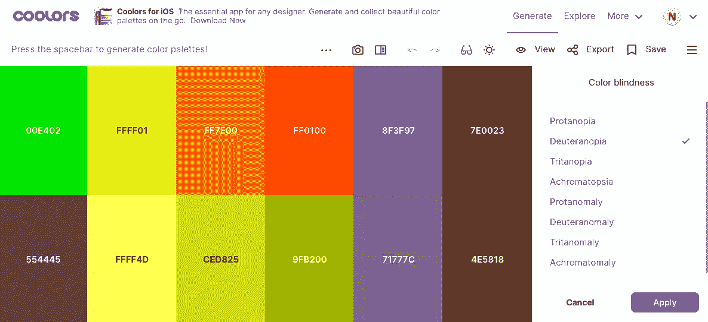
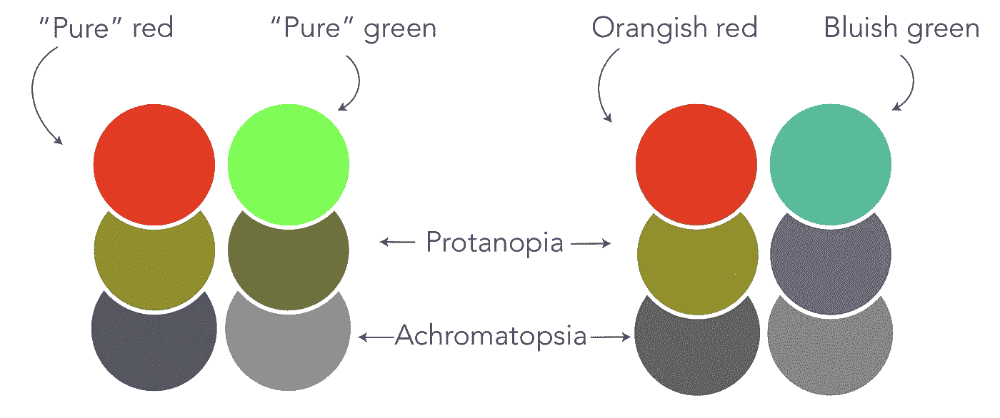
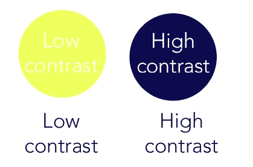
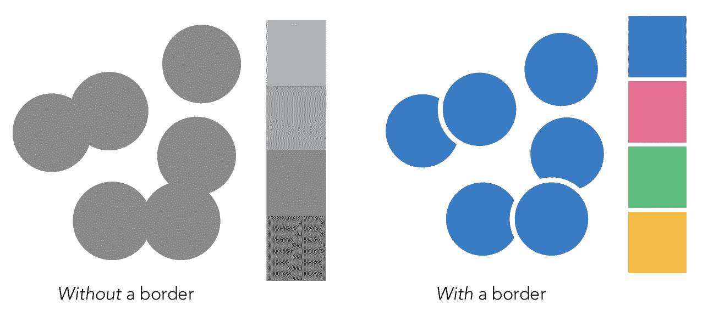
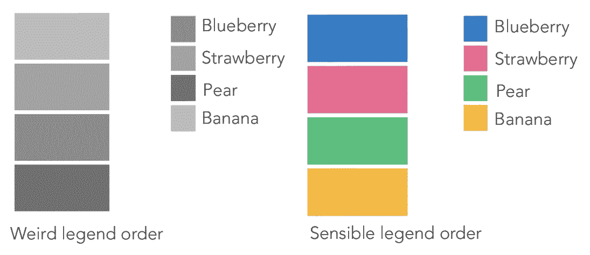
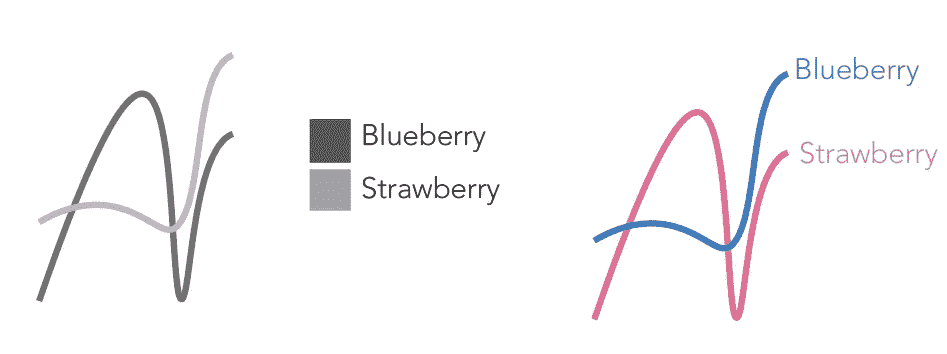

# 易访问数据可视化的不完整指南

> 原文：<https://towardsdatascience.com/an-incomplete-guide-to-accessible-data-visualization-33f15bfcc400?source=collection_archive---------15----------------------->

## 做得更好的实用技巧。


作者的原创艺术

从最直接的意义上来说，可访问的可视化旨在让读者*访问*视觉呈现的信息。最常见的是，易访问性问题是指色盲或失明。然而，实际上，可访问性超越了特定的永久性残疾，涵盖了可用性优化的所有方面——适用于所有人。

记住残疾不是少数人的固定状态是很有用的。相反，残疾是一系列的经历，既有永久性的，也有暂时性的。例如，你可能会患上白内障，或者摔断手臂。偏头痛可能会让你蜷缩在黑暗的房间里，或者一个不眠之夜可能会模糊你的理解力。

坦率地说，让可视化变得普及是困难的。许多可视化工具不支持可访问设计，那些支持的工具学习起来会很混乱。即使有了可以想象到的最好的工具，可访问性也会使*艺术*超过*科学*，对一个人来说完美的设计对另一个人来说可能是不可用的。

因此，下面的指南肯定是不完整的。毫无疑问，我错过了或过于简化了重要的事情。可能是我笨拙地冒犯了你。但是，如果完美是遥不可及的，我希望这个指南至少提供了一些可以实现的想法，如何变得更好。

# 文本、标题和题注

如果不强调可视化文本元素的重要性，我们就不能谈论访问信息。没有文字，只有形状。所以请注意，并确保你使用的文本是有目的的。

**标题**应该告诉你可以用图形回答什么问题，但不一定要写成问题。例如，“2020 年供应商销售的单位数量”回答了问题*去年每个供应商销售了多少单位？*

**图例**应清楚地标识视觉映射和图形元素，并在连续数据中直接标出有意义的界标。尽量使用事物的实际单词，而不是变量名。

**轴标签**应该是简单明了的、水平的(如果可能的话)和描述性的。例如，“时间(2004–2009)”比“x”更有用。

**标题**应该给出任何可能影响图表解释的内容。帮助读者理解他们所看到的。例如，“这些数据是通过网络调查收集的，该调查使用客户的存档地址进行管理。将该图解读为，“在应用上花费较少时间的用户倾向于在扩展和附件上花费较少的钱，其中一个显著的异常值在不到 5 秒钟内花费了 24k 美元*。”*

# 色盲友好

有 3 种主要类型的色觉缺陷。红绿色觉缺失包括**偏色**或偏色，使绿色显得更红；和 **protanomaly** 或 protanopia，使红色显得更绿。

蓝黄色觉缺陷包括**三色异常**使蓝色呈现绿色，黄色呈现红色；以及使蓝色呈现绿色、紫色呈现红色、黄色呈现粉红色的 **tritanopia** 。

最后，完全色觉缺失包括**色盲**、**色盲**或**单色。**这种情况非常罕见，通常伴有其他视觉障碍。



Coolors 调色板工具的快照

不管出于什么原因，如果你只是用颜色来区分可视化中的元素，有很多模拟器可以帮助你选择可区分的颜色。我个人使用上图所示的[酷派](https://coolors.co/)工具来检查我的调色板。

有时会有一种误解，认为你不应该在可视化中使用红色或绿色；这样做会立即使它们失去可用性。这并不完全正确，忽视两种最具文化相关性、高联想色彩是不必要的严重。

取而代之的是，试着让红色略带橙色，绿色略带蓝色。对于色觉正常的人来说，这个小小的变化不会有太大的影响。然而，对于那些难以区分红色和绿色的人来说，这些小调整可以极大地提高区分度。



作者图解

您还可以检查调色板中的颜色是否可以区分为黑色和白色。如果您需要打印没有颜色的可视化效果，这将会很方便，并且可以帮助总体色觉较低的用户。

# 亮度对比度

亮度对比度是两种颜色的亮度(或明度)之比。这个比例影响着物体被区分的程度。亮度对比通常是针对文本和背景来讨论的，但是同样的原理也适用于图形元素。您可以使用 [WebAim 对比度检查器](https://webaim.org/resources/contrastchecker/)来验证您使用的是足够高对比度的颜色。



作者图解

# 杂项设计提示和技巧

即使对于那些*能*看到的用户来说，也有一些设计技巧可以让图形看起来更舒服。一个简单的技巧是在堆叠的条和点周围添加一个细的白色边框。这使得区分形状变得更加容易，并且减少了交叉点处无意的视觉效果。



作者图解

您还可以对齐图例，使其与最接近的可视元素的结构和顺序相匹配。这确保了读者确切地知道哪个元素具有什么值，并最大限度地减少来回扫视的时间。



作者图解

使用直接标注是避免使用图例的好方法。使用图例本身没有错，但是直接的标签可能会让你的读者更容易将一个视觉元素与一个值联系起来。在某些视觉元素远离图例的情况下，您可以选择同时使用图例和直接标签。



作者图解

最后，你可以改变纹理线和点的形状。这使得颜色不再是唯一的信息载体。在可视化中，我们称之为*冗余编码*或*双重编码*，这意味着数据用多个可视属性表示。我建议用颜色更浅的虚线连接起来，这样线条就能保持连接。同样，确保选择明显不同的形状。


作者图解

# 数据导出

使数据可访问的最直接的工具之一是简单的数据导出。即使 visual 与屏幕阅读器不兼容，导出也可以允许屏幕阅读器用户浏览数据。

然而，在进行数据导出时，重要的是要记住您是从可视化中提供值*。*这意味着提供预处理值，人们可以从视觉上合理地推断出这些值，*而不是*原始的、未清理的、未聚集的数据集。

# 键盘导航和屏幕阅读器

有人可能会使用键盘导航有各种各样的原因。例如，盲人用户或那些运动受限的用户可能更喜欢使用键盘而不是鼠标来导航。其他用户可能喜欢键盘导航的效率。无论哪种方式，这都是可能的，因为网页的 HTML 结构表明了所选内容的类型及其在页面上的位置。

当你为网页制作可视化效果时，确保使用标准的 HTML 结构，并带有键盘友好的标志。你可以在 [WebAIM 网站，这里是](https://webaim.org/techniques/keyboard/)上阅读更多关于如何做到这一点的信息。

屏幕阅读器获取嵌入网页 HTML 中的信息，并大声朗读出来。关于可视化，这是我们上面提到的文本元素中最常见的。不幸的是，并不是所有的可视化工具和平台都能很好地与屏幕阅读器一起工作；例如，这个页面不支持交互式媒体。在这种情况下，您需要使用 alt-text 来描述静态可视化。

```
<button aria-label= “publish article”>Publish</button>

```

# 数据发音

进入可访问可视化的新领域，在*数据语音化领域有一些有趣的工作正在进行。*图表库 HighCharts 是这一领域的先驱。顾名思义，发音将数据映射到声音，而不是视觉元素。聆听可视化可以告诉用户趋势和异常值。也许作为一个独立的工具并不精确，但是 sonification 是对屏幕阅读器体验的一个很好的补充。也很好玩！

一个艺术的数据发音的例子，来自我们在 NASA 的朋友。这项工作是关于蟹状星云的。

# 数据物理化

最后，数据*物理化*是用物理介质表示数据的实践。这意味着除了颜色等视觉属性之外，纹理、温度、重量和大小都可以作为触觉编码。这是一个仍在研究中的领域，但却像成堆的岩石一样古老。这里有一个致力于数据物理化的维基[你可以在这里找到](http://dataphys.org/)。

没有别的办法:让数据可视化变得可访问需要额外的工作。有工具约束、知识约束和个人偏好。但是，这并不意味着我们不能在制作更容易访问的可视化方面做得更好。为了填补上面我可能遗漏的空白，我加入了社区中其他人的一些文章。欢迎在评论中分享其他资源！

[](https://medium.com/nightingale/data-visualization-accessibility-where-are-we-now-and-whats-next-b2c9eeac4e8b) [## 数据可视化可访问性:我们现在在哪里，下一步是什么？

### 将网页可访问性指南纳入数据设计

medium.com](https://medium.com/nightingale/data-visualization-accessibility-where-are-we-now-and-whats-next-b2c9eeac4e8b) [](https://medium.com/nightingale/accessibility-is-at-the-heart-of-data-visualization-64a38d6c505b) [## 为什么可访问性是数据可视化的核心

### 为了让 viz 数据更容易访问，我们首先需要了解辅助技术

medium.com](https://medium.com/nightingale/accessibility-is-at-the-heart-of-data-visualization-64a38d6c505b)