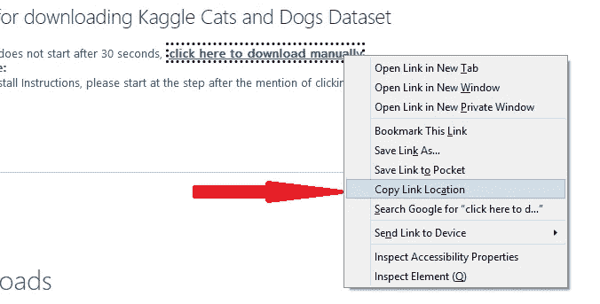
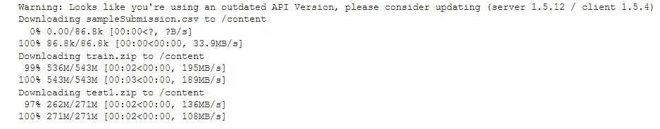

# Google Colab:如何从 Github、Kaggle 和本地机器上传大型图像数据集

> 原文：<https://towardsdatascience.com/an-informative-colab-guide-to-load-image-datasets-from-github-kaggle-and-local-machine-75cae89ffa1e?source=collection_archive---------2----------------------->

## 在 Google Colab Jupyter 笔记本上访问大型数据集，用于训练深度学习模型

约书亚·索蒂诺在 [Unsplash](https://unsplash.com?utm_source=medium&utm_medium=referral) 上拍摄的照片

∘ [了解 Colab 的文件系统](#5155)
∘ [1。从 Github](#3777)
∘ [2 这样的网站上传数据。从你的本地机器上传数据到 Google Drive，然后到 Colab](#1e32)
∘ [3。从卡格尔](#13c0)∘
上传数据集[结论](#4748)

Google Colab 是来自 Google 的免费 Jupyter 笔记本环境，其运行时托管在云上的虚拟机上。

有了 Colab，你不必担心你的计算机的内存或软件包安装。你可以获得免费的 GPU 和 TPU 运行时，笔记本电脑预装了机器和深度学习模块，如 Scikit-learn 和 Tensorflow。也就是说，所有项目都需要数据集，如果你不是使用 Tensorflow 内置数据集或 Colab 样本数据集的*T21，你将需要遵循一些简单的步骤来访问这些数据。*

## **了解 Colab 的文件系统**

您创建的 Colab 笔记本保存在您的 [Google drive](https://drive.google.com/drive/u/0/my-drive) 文件夹中。然而，在运行时(当笔记本电脑处于活动状态时)，它会根据您的喜好，从云中分配一个基于 Linux 的文件系统[或 CPU、GPU 或 TPU 处理器](https://www.tutorialspoint.com/unix/unix-file-system.htm)。点击笔记本左侧的文件夹(矩形)图标，可以查看笔记本的 [**当前工作目录**](https://linuxize.com/post/current-working-directory/) 。

按作者分类的 Colab 当前工作目录

Colab 提供了一个包含数据集的`sample-data`文件夹，您可以随意使用，或者使用上传图标(在“搜索”图标旁边)上传您的数据集。请注意，一旦运行时断开连接，您将失去对虚拟文件系统的访问，并且所有上传的数据都将被删除。但是，笔记本文件保存在 Google drive 上。

在`sample_data`文件夹上面有两个点的文件夹图标显示了 Colab 的[文件系统](https://www.tutorialspoint.com/unix/unix-file-system.htm)中的其他核心目录，比如`/root, /home, and /tmp`。

作者在 Colab 上的文件系统

您可以在“文件”面板的左下角查看您分配的磁盘空间。

作者的 Colab 的磁盘存储

在本教程中，我们将探索从三种介质上传图像数据集到 Colab 文件系统的方法，以便笔记本可以访问它们进行建模。我选择将上传的文件保存在`/tmp`中，但是你也可以保存在当前工作目录中。Kaggle 的狗与猫数据集将用于演示。

## 1.从 Github 等网站上传数据

要将数据从网站直接下载到 Google Colab，你需要一个直接指向 zip 文件夹的 URL(网页地址链接)。

*   **从 Github 下载**

Github 是一个平台，开发者可以在这里托管他们的代码，并在项目上合作。项目存储在[存储库](https://en.wikipedia.org/wiki/Repository_(version_control))中，默认情况下，存储库是公共的，这意味着任何人都可以查看或下载内容到他们的本地机器上并开始使用它。

第一步是搜索包含数据集的存储库。[这里的](https://github.com/laxmimerit/dog-cat-full-dataset)是由 [laxmimerit](https://github.com/laxmimerit/dog-cat-full-dataset/commits?author=laxmimerit) 制作的 Github repo，其中包含了猫与狗各自文件夹中的 25，000 张训练和测试图像。

*要使用此流程，您必须拥有一个免费的 Github 帐户并已登录。*

导航到包含数据集的 Github repo 。在回购的 ***主页*** 上，找到绿色的“代码”按钮。

作者图片

点击“代码”按钮右侧的*箭头*。这将显示一个下拉列表。

右键单击“下载 Zip”

*右键单击“下载 zip”上的*，并单击“复制链接位置”。注意:这将下载回购中的所有文件，但我们将在 Google Colab 上提取内容时筛选出不需要的文件。

导航到 Google Colab，打开一个新的笔记本，输入并运行下面两行代码，导入我们需要的内置 python 库。

下面的代码是我们粘贴链接的地方(第二行)。整个代码块下载文件，解压文件，并将内容提取到`/tmp`文件夹中。

**[**wget**](https://www.computerhope.com/unix/wget.htm)**Unix 命令** : `wget <link>`下载网页内容并保存到 [*当前工作目录*](https://linuxize.com/post/current-working-directory/) (注意`!`因为这是一个由系统命令行执行的 shell 命令。另外，链接必须以`.zip`结尾。在上面的代码中，我们提供了(可选)一个下载目录(`/tmp`)，以及下载的 zip 文件的期望名称(`cats-and-dogs.zip`)。我们使用`— -no-check-certificate` 来忽略 SSL 证书过期的网站上可能出现的 SSL 证书错误。**

**现在我们的 zip 内容已经提取到了`/tmp`文件夹中，我们需要数据集相对于我们正在处理的 Jupyter 笔记本的路径。如下图所示，单击文件夹图标(箭头 1)，然后单击文件系统(2)以显示虚拟系统的所有文件夹。**

****

**作者图片**

**向下滚动并找到所有图像文件夹所在的`/tmp`文件夹。**

****

**作者图片**

**您可以使用`os.listdir(path)`返回文件夹内容的一个 *python 列表*，您可以将它保存在一个变量中用于建模。下面的代码显示了 train 和 test 文件夹中猫和狗的图像数量。**

*   ****从其他网站上传数据****

**其他网站，比如广受欢迎的 [UCI 知识库](https://archive.ics.uci.edu/ml/index.php)，对于[加载用于机器学习的数据集](https://colab.research.google.com/github/diegoarriola1/Complete-Python-3-Bootcamp/blob/master/Copy_of_LS_DS_111_Exploratory_Data_Analysis_Assignment.ipynb)也很方便。一个简单的谷歌搜索把我带到了微软的这个网页，在那里你可以找到狗和猫数据集的下载链接。**

****

**当您点击“下载”按钮时，“取消”询问是“打开”还是“保存”文件的弹出消息。**

****

**网页现在显示一个链接，“点击这里手动下载”。*右键点击*，然后点击“复制链接位置”。**

****

**作者图片**

**打开一个新的 Google Colab 笔记本，按照上面 Github 链接描述的相同步骤操作。**

## **2.从你的本地机器上传数据到 Google Drive，然后到 Colab**

**如果数据集保存在您的本地机器上，Google Colab(运行在云上的一个单独的虚拟机上)将无法直接访问它。因此，我们需要首先将它上传到 [Google Drive，](https://drive.google.com/drive/u/0/my-drive)然后在构建模型时将其加载到 Colab 的运行时。**

****注意:**如果数据集很小(比如一个`.csv`文件)，你可以在运行时直接从本地机器上传到 Colab 的文件系统。然而，我们的[图像数据集](https://www.kaggle.com/c/dogs-vs-cats/data?select=train.zip)很大(543 Mb)，我花了 14 分钟将 zip 文件上传到 Google Drive。在驱动器上，我现在可以打开一个 Colab 笔记本并将其加载到运行时，这将花费大约一分钟的时间(在下面的代码中演示)。但是，如果您要将它直接上传到 Colab 的文件系统，假设上传需要 14 分钟，一旦运行时断开连接，您必须再次上传相同的时间。**

**在将数据集上传到 Google Drive 之前，建议它是一个单独的 **zip** 文件(或类似的归档文件),因为驱动器必须为每个文件分配单独的 id 和属性，这可能需要很长时间。**

**一旦数据集保存在你的本地机器上(我从这里的[下载到 Kaggle 上的](https://www.kaggle.com/c/dogs-vs-cats/data?select=train.zip)，打开你的 [Google Drive](https://drive.google.com/drive/u/0/my-drive) ，点击左上角的“新建”按钮。从下拉列表中，点击“文件上传”，然后*浏览*到您系统上的 zip 文件，然后“打开”它。**

****

**由作者将文件上传到驱动器**

**右下角将出现一个进度条，指示上传过程完成。**

****

**作者的 Google Drive“上传完成”**

**现在打开一个新的 Colab 笔记本。第一个代码块[挂载](https://en.wikipedia.org/wiki/Mount_(computing))Google Drive，这样 Colab 的文件系统就可以访问它。**

**Colab 将提供一个链接，授权其访问您的 Google 帐户的驱动器。**

****

**作者将 Google Drive 安装到 Colab**

**点击此链接(上面的箭头 1)，选择您的电子邮件地址，然后在底部点击“允许”。接下来，从弹出窗口中复制代码并粘贴到 Colab 的文本框中(箭头 2)，最后将显示这条消息:`Mounted at /content/drive`。**

**现在，当我们查看屏幕左侧的文件时，我们会看到已安装的驱动器。**

****

**按作者安装 Google Drive 文件夹**

**接下来是将数据集读入 Colab 的文件系统。我们将解压文件夹，并使用下面的代码将其内容提取到`/tmp` 文件夹中。**

**现在你可以从文件系统中查看到 Colab 的`/tmp/train`文件夹的路径。**

****

**作者的 Colab 文件系统**

**使用`os.listdir(path)`方法返回数据文件夹中的内容列表。下面的代码返回了`train`文件夹的大小(图片的数量)。**

## **3.从 Kaggle 上传数据集**

**[Kaggle](https://www.kaggle.com/) 是一个数据科学家和机器学习从业者互动、[学习](https://www.kaggle.com/learn)、[竞争](https://www.kaggle.com/competitions)和分享代码的网站。它提供了一个公共数据平台，拥有数以千计的公共数据集，这些数据集要么来自过去或正在进行的 [Kaggle 比赛](https://www.kaggle.com/competitions)，要么由希望分享其数据集的社区成员上传。**

**2013 年，Kaggle 上的一场机器学习比赛中使用了[猫 vs 狗](https://www.kaggle.com/c/dogs-vs-cats)数据集。我们将把这个数据集直接从 Kaggle 下载到 Colab 的文件系统中。以下步骤非常重要，因为从 Kaggle 下载数据集需要身份验证和权限。**

*****第一步:从 Kaggle*** 下载配置文件**

**Kaggle 提供了一种[与其 API](https://www.kaggle.com/docs/api) 交互的方式。您需要一个免费的 Kaggle 帐户并登录。**

**点击你主页右上角的头像。从下拉菜单中选择“帐户”。**

****

**作者图片**

**在“帐户”页面上，向下滚动到“API”部分，然后单击“创建新的 API 令牌”。**

****

**作者图片**

**系统会提示您下载一个文件 kaggle.json。选择将它保存到您的本地机器上。这是包含您的凭据的配置文件，您将使用它直接从 Colab 访问 Kaggle 数据集。**

****注意:**您在此文件*上的凭证将在几天后*过期，当您试图下载数据集时，将在 Colab 笔记本中得到一个`401: Unauthorised`错误。*删除*旧的 kaggle.json 文件，回到这一步。**

*****第二步:上传配置文件到 Colab 笔记本*****

**现在有了一个新的 kaggle.json 文件，你可以把它留在你的本地机器上(下面的*步骤二 a* ，或者保存(上传)到 Google Drive 上(后面的*步骤二 b* )。**

*****步骤二(a)*** :如果文件还在你的本地机器上，你可以使用上传图标，或者使用 Colab 的`files.upload()`将它上传到 Colab 的[当前工作目录](https://linuxize.com/post/current-working-directory/)。如果您的项目使用同一台计算机，此选项会更简单。如果使用代码(不是上传图标)，在新笔记本中运行下面的代码，*浏览*到下载的 kaggle.json 文件，然后*‘打开’*它。**

****

**该文件将出现在您的工作目录中。**

****

**作者上传的文件**

*****第二步(b)*** :第二个选项是将 kaggle.json 文件保存(上传)到 Google Drive。打开一个新的 Colab 笔记本，按照简单的步骤将硬盘安装到 Colab 的虚拟系统中(如下所示)。有了这个选项，你可以从另一台机器上运行笔记本，因为 Google Drive 和 Colab 都托管在云上。**

**在 Google Drive 上，*创建*一个新文件夹，命名为 Kaggle。*双击打开*该文件夹，并*上传*ka ggle . JSON 文件。**

****

**由作者将 kaggle.json 文件上传到驱动器**

**接下来，打开一个 Colab 笔记本，运行下面的代码，将驱动器挂载到 Colab 的文件系统中。**

**一旦成功，运行下面的代码将 kaggle.json 从驱动器复制到我们当前的工作目录，这个目录是`/content` ( `!pwd` 返回当前目录)。**

**刷新文件部分，在当前目录中找到 kaggle.json。**

****

*****第三步:将操作系统环境指向配置文件的位置*****

**现在，我们将使用`os.environ`方法来显示包含认证细节的 kaggle.json 文件的位置。记得导入为此所需的文件。**

*****第四步:从 Kaggle*** 中复制数据集的 API 命令**

**Kaggle 上的每个数据集都有一个相应的 API 命令，您可以在命令行上运行该命令来下载它。**注意:**如果数据集是为一个竞赛准备的，请转到该竞赛的页面并‘阅读并接受规则’，这样您就可以提交数据了；否则你会在 Colab 上得到一个`403-forbidden`错误。**

**对于我们的狗对猫数据集，打开[比赛页面](https://www.kaggle.com/c/dogs-vs-cats/data)并点击“数据”选项卡。向下滚动并找到 API 命令(下面以黑色突出显示)。**

****

**由作者复制竞赛 API 命令**

**对于其他数据集(非竞赛)，单击“新建笔记本”按钮旁边的 3 个点，然后单击“复制 API 命令”。**

****

**按作者复制其他数据集 API**

*****步骤 5:在 Colab 上运行这个 API 命令来下载数据*****

**回到我们的 Colab 笔记本，将这个 API 命令粘贴到一个新的块中。记得包括`!`符号，它告诉 python 这是一个命令行脚本。**

**如果一切正常，将会显示下载确认。我得到了下面的结果。**

****

**按作者下载确认**

**现在，从左侧的文件窗格中，您可以看到所有已下载的文件夹。**

****

**按作者下载的文件**

*****第六步:提取文件*****

**现在我们可以提取 train.zip 文件中的文件并保存到`/tmp`(或者当前目录`/content`)。**

**运行下面的代码以返回解压缩文件夹中的文件数量。**

## **结论**

**在本教程中，我们探讨了如何将图像数据集从 Github 和 Kaggle 等网站以及您的本地机器上传到 Google Colab 的文件系统中。现在你已经将数据存储起来，你可以训练一个深度学习模型，比如 CNN，并尝试正确地对新图像进行分类。对于更大的图像数据集，[这篇](/importing-data-to-google-colab-the-clean-way-5ceef9e9e3c8)文章给出了替代方案。**

**我希望你喜欢这篇文章。每当我发表新的文章时，想要收到更多这样的文章，请在这里订阅。如果你还不是一个媒体成员，并且愿意支持我作为一个作家，跟随[这个链接](https://medium.com/@suemnjeri/membership)，我将赚取一小笔佣金。感谢您的阅读！**