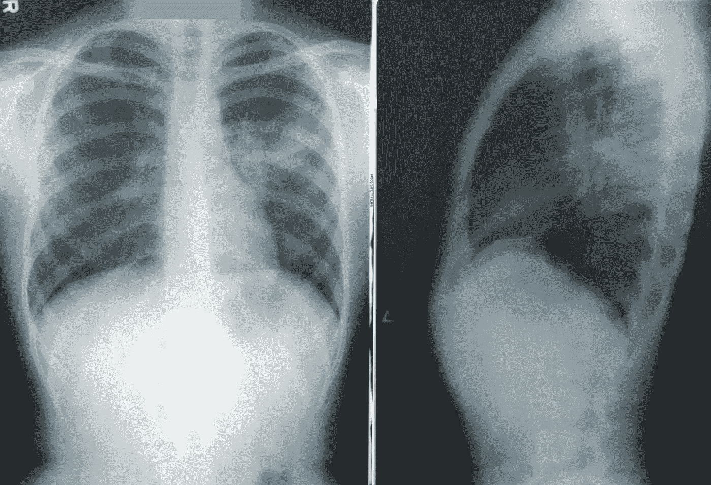

# 斯坦福人工智能在医疗保健系列课程(医疗保健专业人工智能)的初步评价

> 原文：<https://towardsdatascience.com/an-initial-review-of-the-stamford-ai-in-healthcare-courses-ai-in-healthcare-specialization-99a42532a83f?source=collection_archive---------29----------------------->

## 为什么在医疗保健环境中实施人工智能和机器学习如此具有挑战性

作者图片

开始之前，请注意以下几点:

*   虽然我被培养成科学家，但我不是医学博士。这意味着我在 Coursera 上选修了这门非 AMA 学分的课程作为证书。
*   根据打字错误和录音信号的数量等。我希望是第一批尝试这个系列课程的人之一。
*   课程系列的链接可以在这里找到:[https://www.coursera.org/specializations/ai-healthcare](https://www.coursera.org/specializations/ai-healthcare)

**格式:**

课程系列的形式是一系列人们站在原地从屏幕上阅读的视频。有两个拍摄角度，但附加的视觉效果很少，所以跟随拍摄是一个真正的听力技巧练习。所提供的学习指南提供了所有相同的视觉效果和朗读文本，因此这些课程可能很容易在播客模式下进行(只需听，然后阅读学习指南)。

作业是自我检讨(帮助你思考你是否学到了什么)和测验(无限重试的多项选择)。有些问题假设你听了例题或做了一些关于题目的课外阅读。

**序列:**

该系列的第一门课程是 ***医疗保健介绍*** 。对于那些不把“中介”作为健康保险公司的标准术语的人来说，这是一门非常有用的课程，介绍了医疗保健市场词汇。所使用的示例有助于更好地理解为什么医疗保健数据如此分散且看起来毫无关联。

该系列的第二门课程是 ***临床数据介绍*。**虽然本课程涵盖了一些标准的机器学习数据问题，但它也强调了时间的重要性，并建议所有数据都包括一个时间范围，因为程序之前和之后的测试结果可能意味着非常不同的事情。建议是将所有特征排列在一个时间线中，以允许更好的推断。另一个见解是，鉴于医疗保险报销的变化和医疗程序的进步，数据窗口可能缺少分析、建模和预测。讨论的数据来源是电子健康记录(EHR)，健康保险索赔数据和公共数据来源。

该系列的第三门课程是 ***面向医疗保健的人工智能和机器学习基础。*** 虽然本课程涵盖了从决策树到 CNN、RNNs 的标准机器学习方法，但它带来了*结果-行动-配对*的重要性。这个 OAP 概念提出了这样一个问题:“有人能够或愿意根据模型的结果采取行动吗？”在医疗保健行业，如果数据不可操作，它可能会很有趣，但可能不是特别有用。高度准确但其数据不能被采取行动的模型可能不如可能触发可采取行动的行为的较不准确的模型有用。

该系列的第四门课程是 ***医疗保健中人工智能应用的评估*。**本课程涵盖偏差的可能性、部署比例模型的挑战以及在给定人口统计范围的情况下，研究项目和可用于多个医疗机构的模型之间的适用性差异。这个单元还涵盖了医疗保健中人工智能的联邦指南和批准过程。涉众广泛参与部署，可操作的数据以问题“有时间采取行动吗？”。

*注:以上所有单元均可自定进度，并在指定日期前开始和完成。*

该系列的最后(第四)门课程是医疗保健顶点 中的 ***AI。本单元采用同伴评估的方式，在这种方式下，您可以根据提供的 3 分制评分标准对其他课程参与者进行评分。到目前为止，这些问题并不需要医学知识，但是随着我们的进展，我会学到更多。***

[疾控中心](https://unsplash.com/@cdc?utm_source=unsplash&utm_medium=referral&utm_content=creditCopyText)在 [Unsplash](https://unsplash.com/s/photos/xray?utm_source=unsplash&utm_medium=referral&utm_content=creditCopyText) 上拍照

**到目前为止课程的收获:**

整个课程假设科学词汇的合理水平。受过医学训练的人可能不需要去寻找铁蛋白和新冠肺炎之间的潜在关系。我做到了。

对统计学的基本理解是有帮助的，虽然所涵盖的机器学习主题对于完成任何机器学习课程基础的人来说都是熟悉的，但例子中提到的偏见和缺乏可解释性的应用和风险，尤其是医疗保健，可能会令人大开眼界。

由于不完整的人口统计或历史数据(主要是白人或男性)导致的偏见风险可能非常高，并且在主要不是白人和男性的医疗保健地区阻碍了有用模型的实施。

美国的医疗保健系统如此复杂，如果患者的私人数据被暴露，对患者的惩罚是如此之高，以至于人工智能的成功实施存在许多障碍。有一种感觉是，美国和欧盟对数据的保护比中国更强，可能会在医疗保健的人工智能“竞赛”中输给中国研究人员。人们只能希望美国能够找到一种方法，为患者提供隐私保障和积极的激励措施，以分享他们的医疗保健数据，这似乎是前进的方向。

**概要:**

虽然在枯燥的演示格式下，本课程要求比其他在线学习经验更高水平的注意力和听力技能，但它概述了数据、建模、偏见和实施方面的挑战，因此值得花时间学习本课程。

虽然这些课程被安排成一系列，但在很大程度上，它们可以根据兴趣相互独立地进行。

如果你对在医疗保健环境中成功实施人工智能或机器学习所面临的挑战感兴趣，这是一个有趣的概述。如果你不是听觉型学习者，你可能会发现你会更成功地下载和复习学习指南，观看更有趣主题的视频。

随着医患沟通已经转移到作为数据录入员的医生手中，通过自动化日常任务、利用计算机比人眼更好以及患者对数据的所有权，释放人工智能的力量以重新人性化医疗保健的潜力是巨大的。

照片由[乔恩·泰森](https://unsplash.com/@jontyson?utm_source=unsplash&utm_medium=referral&utm_content=creditCopyText)在 [Unsplash](https://unsplash.com/s/photos/hope?utm_source=unsplash&utm_medium=referral&utm_content=creditCopyText) 上拍摄

顶石项目可能比其他单元需要更多的医学专业知识，所以我可能不会完成该单元，所以这可能是唯一张贴的审查，而不是整个系列更全面的审查。如果没有，请查看将课程知识应用于新冠肺炎 x 射线和 EHR 数据分析和模型的最新回顾！

点击[此处](https://alison-doucette.medium.com/a-quick-review-of-the-stamford-ai-in-healthcare-courses-ai-in-healthcare-specialization-capstone-90c5eaef0ad8)查看顶点评论