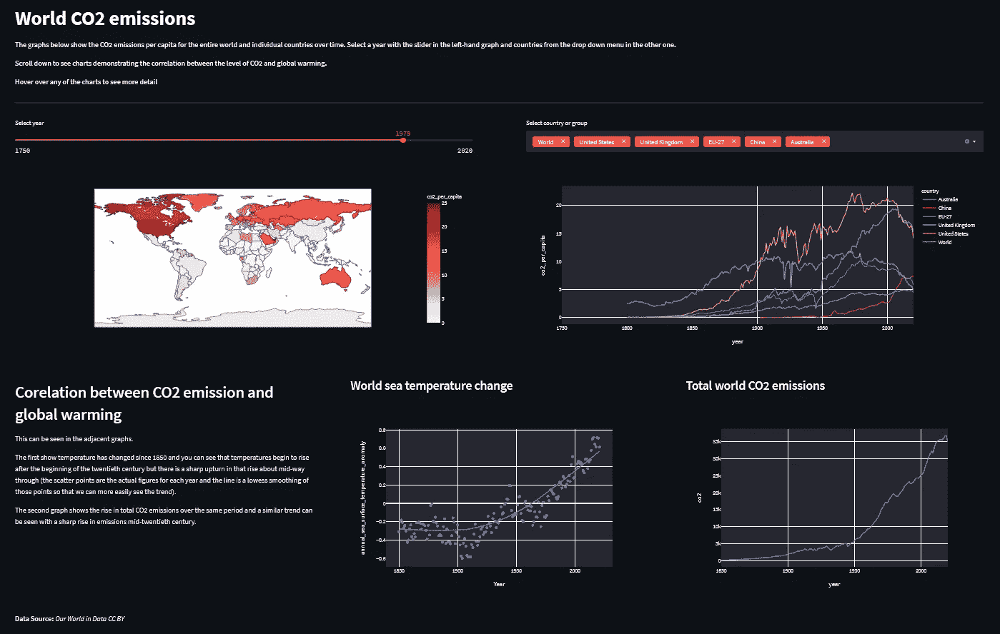
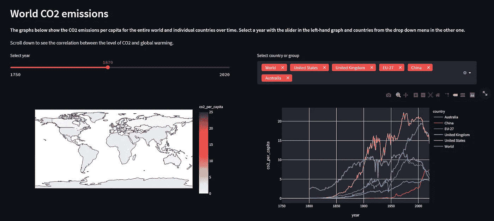
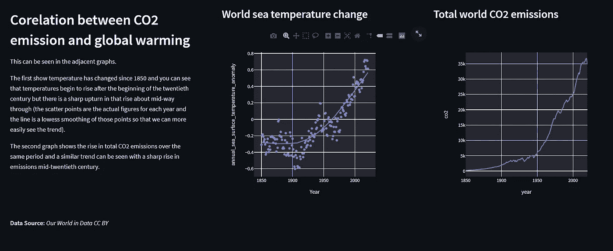
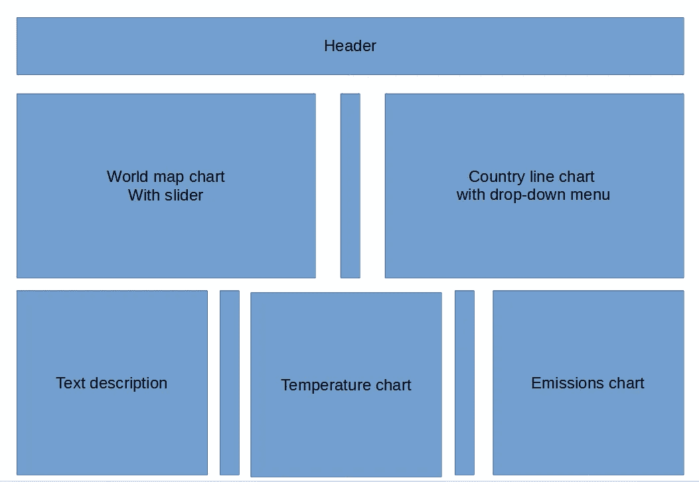

# 具有 Plotly 和 Streamlit 的交互式二氧化碳排放仪表板

> 原文：<https://towardsdatascience.com/an-interactive-co2-emissions-dashboard-with-plotly-and-streamlit-b0bd4ae80cc8?source=collection_archive---------30----------------------->

## [实践教程](https://towardsdatascience.com/tagged/hands-on-tutorials)，数据可视化

## 借助 Plotly charts 和 Streamlit 灵活的输入、布局和主题化选项，您可以从实时数据构建一个出色的交互式数据可视化应用程序



示例应用程序—作者图片

Streamlit 没有最全面的用户界面组件，但它们易于使用，只要有点想象力，就可以组合出良好的效果。

我们将看看如何在 Streamlit 中使用主题化和各种交互式输入和布局选项，以及 Plotly 图表，来制作一个有吸引力的、有希望提供信息的 web 应用程序。

要阅读本文，您需要对 Streamlit 和 Plotly 有所了解。文章中的大部分代码会以要点的形式显示，在文章的最后还有完整代码的要点以及下载链接。

上面的图片可能看起来不像一个典型的 Streamlit 应用程序，因为你看到的大多数应用程序都是用默认的 light 主题制作的。这一个利用了配置工具来选择默认的黑暗主题，但是其他定制的主题也是可能的。

你可以看到的图表是由 [*我们的世界在数据*](https://ourworldindata.org/)(CC BY license)中提供的定期更新数据 Plotly 创建的。这些图表跟踪全球二氧化碳(CO2)排放水平以及各个国家或地区(如欧盟或全世界)的人均排放量。

因为它们是 Plotly 应用程序，所以它们是交互式的，你可以用鼠标悬停在它们上面来查看更多细节。除此之外，Streamlit 滑块和多种选择输入设备让您能够更好地控制显示内容。

在下面的截图中，左边的图表显示了一张根据每个国家的二氧化碳排放水平而着色的地图。它有一个用于选择年份的滑块，当你移动滑块时，你会看到地图的颜色发生变化(随着排放量的增加，它们通常会随着时间的推移而变暗)。

右边的图表显示了单个国家或地区(如全球或欧盟)的人均排放量。设置了一些默认国家，但单击控件会显示一个下拉菜单，您可以在其中选择或取消选择任何有可用数据的国家。



作者图片

上面的截图是应用程序屏幕的上半部分，使用两列来显示图表。

下半部分，如下图所示，试图通过对比两个图表来显示二氧化碳排放量的增加和全球变暖之间的相关性。它使用了三列两列用于图表，一列用于文本描述。

然而，为了在图表之间建立适当的分隔，在应用程序的上部和下部，在包含图表的列之间插入窄的空白列。我们很快就会看到它是如何工作的。



作者图片

希望你现在能看到这个应用程序的样子，以及它的基本结构。那么，现在让我们来看看它是如何放在一起的。

# 获取数据

我们在 data 的 Github 存储库中检索来自我们世界的数据。所有 OWID 的数据都是在 CC 的许可下提供的，这意味着只要 OWID 有信用，它就可以按照你想要的方式使用。

我们使用两个文件，一个是关于二氧化碳和温室气体排放的 OWID 数据，另一个是关于气候变化影响的 OWID 数据。

> 更新:第二个数据集似乎已经从 OWID 存储库中删除，因此应用程序中依赖于此的部分将不再工作。

两者都是 csv 文件，我们把它们读入熊猫数据帧。

如你所见，有三个函数`get_data`、`get co2_data`和`get_warming_data`。第一个函数从 url 返回一个 dataframe，而另外两个函数实际上设置了适当的 url 并从第一个函数返回 dataframe 结果。

还有两件事需要注意。

首先，当返回 *warming* 数据帧时，我们过滤数据帧，只返回那些包含小于 2021 年的年份并且“实体”(即国家或地区)是“世界”的行。这样做的原因是，首先我们只对 changedata 感兴趣，其次 year 列中的条目肯定不是真实的年份。老实说，我不知道他们代表什么，但他们的数字远远高于今年。所以我们忽略这些数据。

(仔细想想，`>=2021`可能应该更高一些，比如说`>=3000`，否则这款应用在今年之后就没什么用了！)

## 贮藏

第二件要注意的事情是 Python 装饰器`@st.cache`用在了每个函数上。这个装饰器确保函数的结果被缓存，并且在应用程序的生命周期中不会不必要地调用函数。

这样做的原因是，每次进行更改时，Streamlit 应用程序都会完整地从上到下运行。因此，在我们的应用程序中，移动滑块或选择一个新的国家将导致应用程序重新运行。我们使用的数据不会经常更改，因此为了获得最佳性能，我们希望避免每次更改时都下载数据，而是使用之前缓存的数据。

如果我们要使用变化非常快的数据，比如股票行情，那么缓存数据是不合适的，因为我们会错过应用程序运行期间的更新。但其后果将是应用程序运行得更慢。

# 布局

应用程序的基本布局如下所示，其中未标记的列是空白的，用作其他列之间的填充。



作者图片

这是在 Streamlit 中实现的，如下面的代码大纲所示。

大纲代码—不用于复制！

我使用`with col2`符号，因为我认为它使代码的布局更容易理解。

这里唯一需要注意的是标有`space`的列。这些仅用作填充。所以，这一行代码

```
col2, space2, col3 = st.column((10,1,10))
```

创建三列。最外面的两个`col2`和`col3`宽度相同，将包含图表，而中间的一个`space2`是另外两个的十分之一，并且是空白的。这在外柱之间提供了合适的间隙。

# 制作图表

这四张图表都是用 Plotly 制作的。第一个是在`col2`中，但是这里我们从滑块组件开始，它允许你在 1750 年和 2020 年之间选择一年。选择的结果存储在变量`year`中。

接下来，我们创建一个 Plotly choropleth(基本上是一个带有彩色区域的地图)，其中颜色由 CO2 水平决定，数据帧由滑块设置的年份过滤。

第二张图是一个折线图，每个国家一张，显示了该国一段时间内的人均二氧化碳排放量。我们再次从输入控件开始，这次是多选框。默认国家名称列表与唯一的国家列表一起设置。除非选择了其他国家，否则 multiselect 控件将返回一组默认值。

然后，选定的国家用于设置图表上线条的颜色。

最终的图表很简单，不需要输入控件。第一个是全球海洋温度随时间变化的散点图。在此基础上，使用 lowess 平滑绘制趋势线。

第二张图表是全球排放量的折线图。

将平滑线放在第一个图表上的想法是为了让你看到它与排放线有多相似，从而试图显示两个测量值之间的相关性。

# 黑暗主题

在 Streamlit 中你可以做很多主题化的工作，但是要简单地启用*黑暗模式*你只需要在你的工作文件夹中创建一个名为`.streamlit`的文件夹，并在其中放一个名为`config.toml`的文件。在`config.toml` 文件中输入以下代码。

```
[theme]
base = "dark"
```

现在，下次你运行你的应用程序时，它将处于黑暗模式！

如果你想创建一个自定义的主题，其他的主题设置会放在同一个文件中，但是我们现在就把它放在这里。

# 就这些了

我希望从编码的角度来看这是有用的，但是我们也可以从这里展示的数据中学到一些东西。

如果你想试验代码，下面有完整代码的要点，或者你可以从我的 [Github 库](https://alanjones2.github.io/Alan-Jones-article-code/)下载(向下滚动直到你看到文章的标题——链接会在那里)。

这里有一个这个应用[的现场版](http://ajco2.herokuapp.com/)。

一如既往地感谢阅读，如果你想知道我什么时候发表新文章，请考虑在这里[注册一个电子邮件提醒](https://alan-jones.medium.com/subscribe)。我也偶尔在[子栈](https://technofile.substack.com/)上发布免费的时事通讯。请在下面留下任何评论，或者您可以通过 [LinkedIn](https://www.linkedin.com/in/alan-jones-032699100) 或 [Twitter](https://twitter.com/MrAlanJones) 联系。

## 完全码

<https://alanjones2.github.io/> 