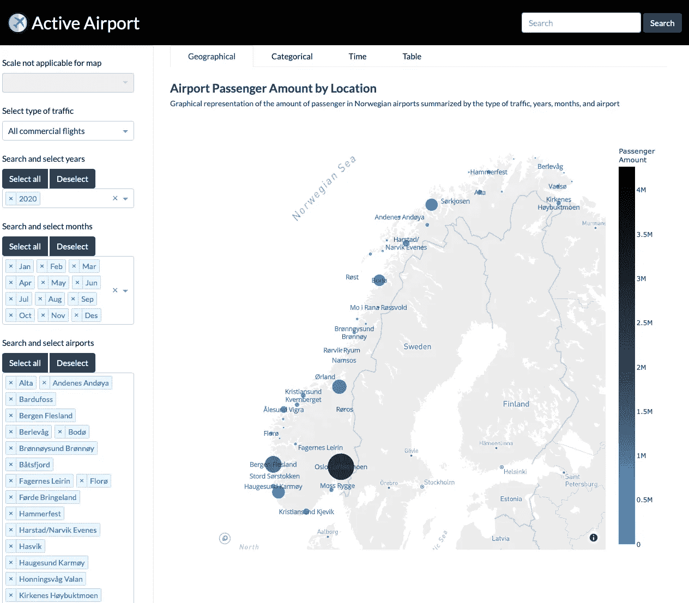
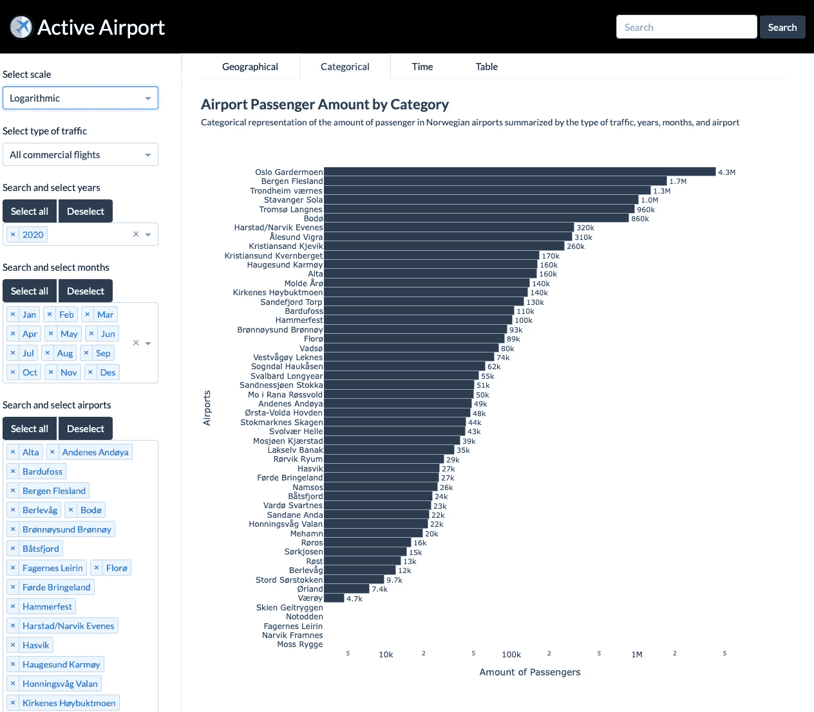
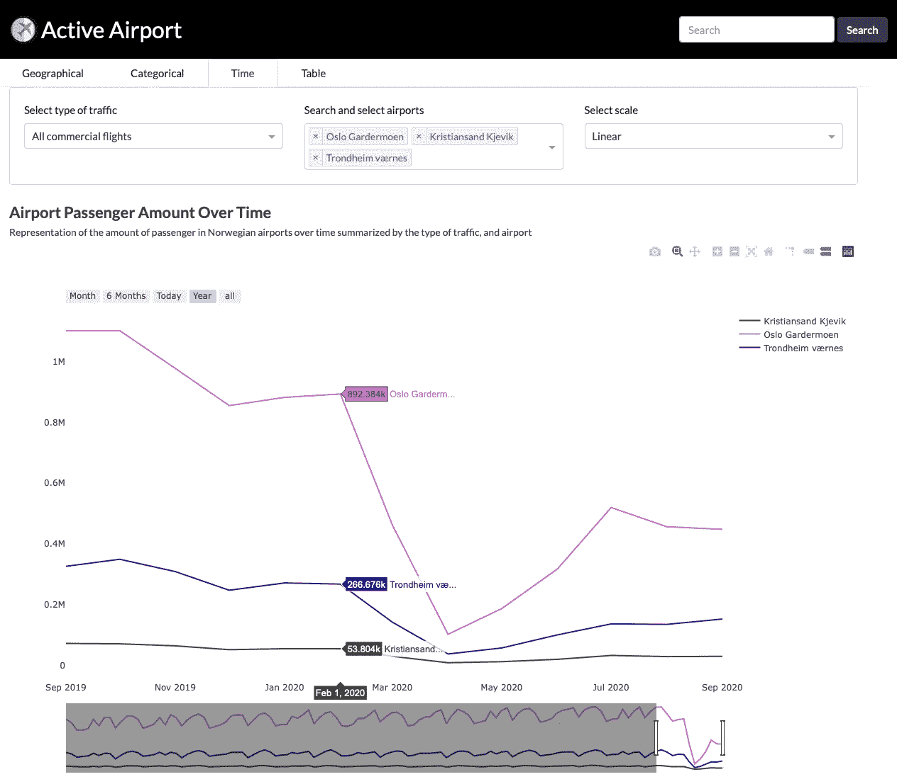
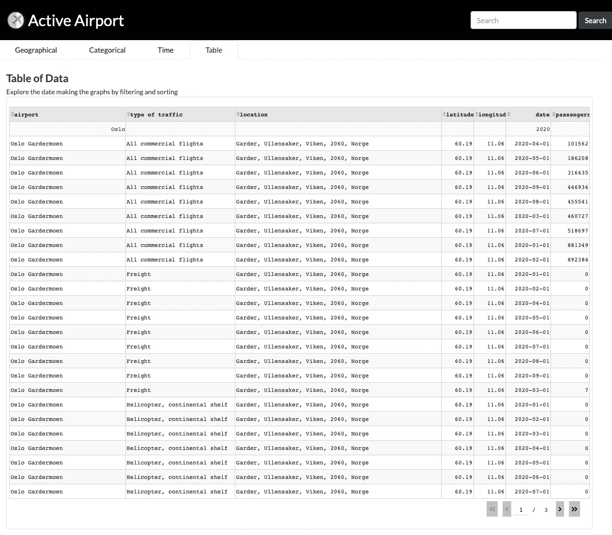

# 机场交通的交互式仪表板

> 原文：<https://towardsdatascience.com/an-interactive-dashboard-for-airport-traffic-40fcc3680042?source=collection_archive---------50----------------------->

## 挪威机场有多忙？数据，Plotly，和破折号，可以帮助我们看到。


托马斯·威廉姆斯在 [Unsplash](https://unsplash.com?utm_source=medium&utm_medium=referral) 上的照片

[**现场演示**](https://active-airport.herokuapp.com) 仪表盘活动-机场或查看项目**[**GitHub**](https://github.com/lewiuberg/Active-Airport)**。****

# **摘要**

**与其他欧洲国家相比，挪威在地理上是一个很大的国家，尤其是与它的居民相比。挪威的工业中心遍布全国。许多挪威公司经常开设新的较小的办公室，以获得合适的人，如果他们不愿意搬迁，或者如果该位置有足够的人来产生经济效益。此外，当一家公司收购另一家公司时，该公司的位置可能会在地理上被分割。这些因素导致了大量的国内航空旅行。本文中描述的公开可用的仪表板旨在提供视觉上愉悦和直观的用户体验，使用所需的工具查看给定机场的乘客数量，或者根据交通类型和日期比较不同的机场。**

# **介绍**

**本文描述了在设计和实施探索性仪表板时所使用的数据收集和准备工作，该仪表板旨在清晰地描述给定位置或日期的挪威国内机场客流量。**

# **功能**

**辅助函数定义并存储在 functions.py 中，并根据需要导入到用于准备数据的 jupyter 笔记本中。这样做的原因是为了让 Jupyter 笔记本更容易使用。已经注意到，如果笔记本有许多单元格或者很长，nbextensions 中的一些扩展往往会有滞后。我的偏好是从第一步到最后一步都在一个笔记本里。**

# **数据集收集和准备**

**仪表板中用于勘探的数据来自挪威政府统计机构 [SSB](https://www.ssb.no/en/omssb/om-oss) ，该机构拥有最新的详细数据和公开可用的 API。然而，为了简单起见，表格是从表单选择中创建的，并作为 CSV 文件下载[1]。选择包括的类别有乘客数量、月份、年份、机场名称和交通类型。然而，根据任务说明，只有国内航班和起飞及抵达时的乘客才包括在内。挪威字母表中有三个额外的字母?、和，它们都包含在机场名称中。但是，SSB 的 CSV 生成器不支持这些字符，它们被替换为“？”符号。因为没有上下文就无法创建脚本来更改这些，所以每个机场都需要手动重命名。**

# **输入数据**

**CSV 文件由每个特征的列构成，“机场”、“交通类型”、“国内/国际航班”、“乘客组”，每个日期表示为“乘客 yyyyMmm”。为了进一步处理，CSV 文件被导入到 Pandas 数据框架中。**

# **预处理**

**应用重命名列名或索引名的函数。该函数用于将“yyyy”从“mm”中拆分出来，删除“M ”,并将该列转换为“datetime”数据类型。**

**检查数据集是否有可能在以后导致问题的缺失值，但是没有发现任何缺失值。**

```
Instances of missing data: 0
Columns with missing data: 0
Column names with missing data: None
```

## **宽数据**

**当前状态的数据集被称为“宽数据”，它不太适合制作图表。但是下面的一些操作在宽表单中更容易，所以现在还不会改变。**

**对于地理表示，需要位置数据。应用上面定义的基于机场名称查找每个机场的地理点的函数，方法是向数据帧添加带有位置数据的新列。**

## **缺失数据**

**应用地理位置函数后，我们发现一些缺失值。显然，它无法识别挪威的所有机场。**

```
Instances of missing data: 70
Columns with missing data: 5
Column names with missing data: location, point, latitude, longitude, and altitude
```

**上面定义的`missing_location()`函数用于定位缺失值的位置，以便决定下一步做什么。**

**经过一番调查，找到了没有给出位置的机场名称。**

**虽然只有两个机场，这使得手动步骤快速而简单，但这也是学习如何从地理数据中获取地址的绝佳机会。在 Jupyter 中工作时，内核有时必须重新启动，其中一些步骤非常耗时，因此结果被导出到一个 CSV 文件中。现在可以导入处理过的数据，而不是重新处理。**

```
Instances of missing data: 0
Columns with missing data: 0
Column names with missing data: None
```

## **长数据**

**在制作仪表板之前，数据集被转换为“长数据”，其中日期列被融合到数据集中，因此每一行都有一个日期。不同流程生成的一些不必要的列被删除，时间和日期从日期中减去，因为它们由于无法从源中获得而完全相同。数据现在可以使用了，并且建立了快速更新数据的流程。**

# **设计和实施**

# **仪表盘**

**仪表板的用户交互设计非常强调直观性和自明性。仪表板的结构是每个图形都有自己的选项卡，因此不会给用户带来视觉负担。每个图形的控件都是自适应的，所以如果不适用于当前图形，它们会自动调整屏幕大小或隐藏起来。如果一个控件组是共享的，但是单个控件不合适，它们将被禁用并变灰，并在其标签中注明。交互的标签尽量简短明了，只陈述其功能。仪表板及其图形的视觉设计非常强调简约，以保持对数据描述内容的关注。在任何可能的情况下，蓝色、灰色和黑色的方案都被用于美学目的。第一印象对于说服用户仪表板制作精良至关重要。因此，项目标题和图标包含一个导航栏，浏览器窗格由一个 favicon 和项目标题组成。仪表板是由 Dash 框架中的自定义编码 HTML、CSS 和 Python 制作的。仪表板通过 Heroku 部署为 Flask 应用程序。尽管这不是最简单的解决方案，但它是启用所有仪表板功能所必需的。**

**如何部署应用程序不在本文讨论范围内，但是有许多关于如何部署的教程[2]。**

**要访问仪表盘，请点击此处:<https://active-airport.herokuapp.com/>**

# ****图表****

****有很多资料描述了在制作图表时应该考虑什么；PolicyViz [3]的一份整洁的备忘单总结了其中大部分的要点。所有图表的共同之处是，标题在左上角用大号粗体显示。这被大多数专业人士认为是最佳实践，因为它模仿了我们被教导阅读的方式，因此也是我们被教导对呈现给我们的信息的重要性进行优先排序的方式[4]。在适用的情况下，每个机场的值以文本或气泡尺寸的形式提供。因此，没有一个图表有任何网格线，因为它们不提供任何额外的信息，会分散注意力。此外，每个机场的任何相关信息都是通过将鼠标悬停在每个机场上来显示的。****

## ****地图图形****

****我不太喜欢 plotly 中的默认地图；我觉得它们很粗糙，视觉上也不美观。图 1 中显示的地图是使用 MapBox 提供的定制地图 Plotly 制作的，将土地灰和水白混合在一起，从而将焦点放在数据上。一个机场的旅客量由大小和颜色来表示，就像数量表示一样，它会自动调整所选择的机场数量和旅客总量。由于对数标度上的图形没有明显变化，因此该功能被禁用。请注意，当切换到“地理”标签时，地图并不总是完全加载。虽然这不是必须的，但是通过标签改变回调来更新图表大小已经过测试，但是没有影响到地图。然而，它适用于任何其他对象。发现“mapboxgl-canvas-container”CSS 类是问题所在，不可编辑。如果单击任何控制按钮，地图会调整大小。****

********

****图 1:地图(图片由作者提供)****

## ****条形图****

****图 2 所示的条形图是用 Plotly 制作的，并使用了数据集的副本，该数据集根据控件的选择与应用回调进行聚合。有很多机场可以选择，所以竖条是最好的选择。这些条根据乘客数量从高到低排序，并根据所选的机场数量自动调整，因此它们不会有令人尴尬的高度。由于各机场之间的乘客数量差异很大，可以选择对数标度来更好地表示。****

********

****图 2:条形图(图片由作者提供)****

## ****线图****

****图 3 所示的线形图对可接受的机场选择数量没有限制，但是因为在一个图中有许多线条被认为是不好的做法，所以没有制作“全选”按钮来促进这种行为。由于这个原因，线形图在颜色选择上有点突出，因为它是唯一一个需要选定机场图例的图，而且它们都需要是不同的。因为线形图的 x 轴是时间，所以可用的选项是“交通类型”、“机场”和“规模”。提供了范围滑块和“月”、“6 个月”、“今天”、“年”和“全部”的预设，以帮助用户探索数据并发现有趣的方面，如 2020 年 2 月新冠肺炎发生的时间。****

********

****图 3:折线图(图片由作者提供)****

## ****桌子****

****图 4 中所示的表格包含了所使用的数据，让用户可以看到这些图表是由什么组成的。一些数据没有包括在内，因为它只是为了功能的缘故。但是，该表是这样设置的，用户可以对数据进行筛选和排序，以找到感兴趣的特定行。****

********

****图 4:表格(图片由作者提供)****

## ****源代码****

# ****结论****

****机场数据从挪威统计局收集，并以适当的方式用于选定的任务。利用这些数据作为其来源，设计、实现和部署了一个仪表板。仪表板由 4 个选项卡组成，每个选项卡都有不同的数据交互方式。****

# ****参考****

****[1]:挪威统计局。[空运。按机场、交通类型和国内/国际航班划分的乘客。](https://www.ssb.no/en/statbank/table/08507/)(2020)，网址:【https://www.ssb.no/en/statbank/table/08507/ ****

****【2】:魅力数据。"【https://www.youtube.com/watch?v=b-M2KQ6_bM4】用 Heroku 和 Dash Plotly(2020)部署你的第一个 App，网址:[t](https://www.youtube.com/watch?v=b-M2KQ6_bM4&t)****

****[3]: PolicyViz。[数据可视化的核心原则。](https://policyviz.com/2018/08/07/dataviz-cheatsheet/)(2018)，网址:[https://policyviz.com/2018/08/07/](https://policyviz.com/2018/08/07/)dataviz-cheat sheet/****

****[4]:史蒂夫·韦克斯勒。"[不要将仪表板上的文本居中、右对齐或两端对齐。](https://www. datarevelations.com/resources/dont-center-right-align-or-justify-text-on-a-dashboard/)(2019)，网址: [https://www。](https://www.)data revenuations . com/resources/dont-center-right-align-or-justify-text-on-a-dashboard/****

# ****关于作者****

******Lewi Uberg** 是挪威应用数据科学专业的一名四年级学生，拥有各行各业的极客、IT 经理和 CAD 工程师的背景。欢迎在 媒体上 [**关注他或者访问他的**](http://lewiuberg.medium.com/) **[**网站**](http://uberg.me/) 。******