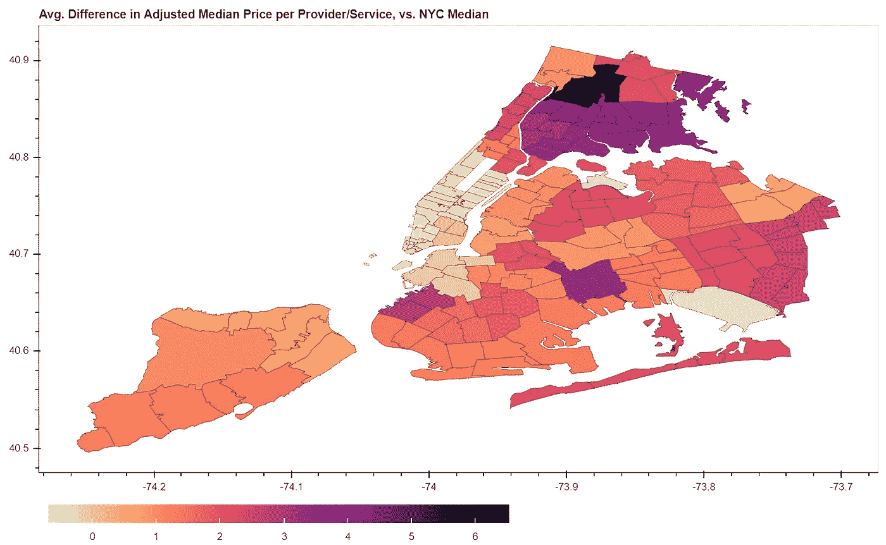

# 纽约医疗价格差异的互动研究

> 原文：<https://towardsdatascience.com/an-interactive-look-at-healthcare-price-disparities-in-nyc-66f9212bcb0b?source=collection_archive---------40----------------------->

## [数据新闻](https://towardsdatascience.com/tagged/data-journalism)

## 价格太高了。2

平均值。每个提供商/服务的调整后中间价格与每个提供商/服务的纽约市中间价格之间的差异

GitHub 资源库[T3 此处](https://github.com/abode118/NYC-Healthcare-Prices) | Jupyter 笔记本[T7 此处](https://jovian.ai/abode118/medicare-analysis-pt-2-nyc)

## *“每个人都会死——但在美国，向出价最高者提供最好的延期机会一直被认为是合理的。”—査蒂·史密斯，暗示*

# 有什么问题？

## 动机

2017 年，我定期在布鲁克林的绿点(Greenpoint)看物理治疗师，每次 80 美元。我的情况没有任何好转，在我第八次坐在椅子上，双臂被毫无意义的电击后，我决定是时候开始见其他人了。我的下一站是中城东区的一位职业治疗师，每次治疗收费约 300 美元。新的设施肯定比绿点的好，设备也更好。甚至有一台机器，我可以把胳膊伸进去，玉米皮碎片会飞来飞去打它们。现代医学！我每两周 300 美元的按摩手臂和剥玉米皮是由一个英俊的年轻人管理的，所以这次我坚持了整整一年。不幸的是，在此期间，我还做了一次无效的 19000 美元的手术(谢天谢地，由保险支付)。但最后时刻到来了。不是他，是我。我没有好转。

最终找到我的诊断的职业治疗师带来了一大笔费用——在上东区一家世界著名的医院，每次治疗大约 550 美元。当然，在我见过她之前，我不知道要花多少钱，因为医疗系统是疯狂的，买家通常在购买已经完成之前不知道价格。谢天谢地，我的雇主给我提供了不错的健康保险，这意味着四次治疗后，我基本上可以“免费”去了。想到困惑的安泰保险精算师可能会看到一个 23 岁的女人每年花费公司超过 20，000 美元的医疗索赔，我不禁笑了。我的方式~坚持到男人~我猜？

这段旅程，从绿点 80 美元的无用医疗护理到上东区 550 美元的改变生活的护理，让我对这个我们生活所依赖的古怪系统思考了很多。当然，更好的东西通常比更差的东西更值钱。我明白了。但是我在相当剧烈的疼痛中度过了两年。一想到挡在我和一生的痛苦之间的只是 3 万美元，我就觉得恶心。(有人打电话给上东区的医生……)

**如果我真的有很高的**<https://www.healthcare.gov/glossary/high-deductible-health-plan/#:~:text=For%202020%2C%20the%20IRS%20defines,or%20%2413%2C800%20for%20a%20family.>****】免赔额，或更高的最高自付费用，或没有足够的可支配收入来支付这些自付费用，或我处于工作空档期，或我正在接受医疗补助(世界著名医院不接受医疗补助)，或该医院被我的雇主保险计划视为“网络外”怎么办？我可能负担不起 550 美元的预约，更不用说去看 15 位医疗专业人士(以及毫无意义的 19，000 美元的手术)，这位职业治疗师改变了我的生活。除非我幸运地拥有一个病毒式的 GoFundMe 页面，否则我会陷入一生的痛苦之中。这是美国。《独立宣言》说了什么——生命、自由和对止痛药的追求？****

## **该项目**

**纽约拥有一些世界上最优秀、最聪明的医学专业人士。我知道是因为我现在已经见过超过 15 个了，其中有几个非常非常聪明。其中一个非常刻薄，我甚至说“你能不能不要再对我刻薄了？”所以我们就不算她了。不幸的是，对纽约的病人来说，最好的往往也是价格最高的。我亲眼看到同样的服务在三个社区之间的价格差异有多大，所以我想把我的医疗保险索赔分析的下一部分重点放在纽约市。作为复习，请查看我的 [**项目概述**](https://annebode.medium.com/the-price-is-too-damn-high-a-multi-part-analysis-of-medicare-claims-9a7dc3610804) 以及 [**我的分析**](/the-price-is-too-damn-high-part-1-9b32e13a8b3) 的第一部分，其中查看了各州和不同时间的价格差异(关键要点:从 2012 年到 2017 年的平均价格。所分析的服务价格变化为+16%，而 CPI(通货膨胀)+7%)。**

**[**许多因素**](https://harvardmagazine.com/2020/05/feature-forum-costliest-health-care) 导致美国医疗费用高昂。吝啬的保险计划、持续的药品价格上涨和不断上升的医疗索赔是许多促成因素中的三个。我想看看这第三个因素，因为它通常让人感觉不受保险公司和大型制药公司的攻击。这可能是因为我们爱我们的医生、护士和其他医疗专业人员，不想责怪他们。对大多数人来说，这并不是他们的错。他们甚至可能不知道他们的病人被要求支付的费用(尽管，他们可能应该知道)。真正的问题可能是大型医院和医疗保健集团在行业中的整合，他们吞并了私人诊所，抬高价格，并额外收取“设施费”(整合是有据可查的 [**这里**](https://www.statnews.com/2020/02/27/physician-practice-consolidation-its-only-just-begun/) ，而设施费在新冠肺炎时代成为头条新闻，见 [**这里**](https://www.nytimes.com/2020/11/13/upshot/coronavirus-surprise-bills-guide.html)；还可以看看《华尔街日报》最近的一篇文章，内容是 2021 年的一项新规定，要求医院公布秘密协商的价格。我在一家私人诊所的理疗师(可以说她的工作并不出色，但还不错):80 美元。我在世界著名医院的职业治疗师。$550.**

****在此分析中，我看一下** [**2017 年医疗保险提交的索赔**](https://data.cms.gov/Medicare-Physician-Supplier/Medicare-Provider-Utilization-and-Payment-Data-Phy/fs4p-t5eq) **从医疗保险中心获得的&医疗补助服务、种族人口统计和收入。我会在一个区和一个社区的水平上查看所有这些数据。目的是不仅找出价格如何不同，而且可能找出它们不同的原因。从 NYS 健康部门的网站上获得了一张邮政编码到社区的映射图。** [**2018 年收入数据按邮政编码**](https://www.irs.gov/statistics/soi-tax-stats-individual-income-tax-statistics-2018-zip-code-data-soi) **从国税局获得。** [**按邮政编码**](https://censusreporter.org/data/table/?table=B03002&geo_ids=860|04000US36&primary_geo_id=04000US36#) **统计的种族人口统计数据是从 2019 年美国社区调查中获得的。****

## **方法学**

**2017 年医疗保险索赔数据被过滤到纽约市，并通过邮政编码映射到街区和区。保留了 25 种最常见的提供者类型及其提供的 5 种最常见的服务。在少于 15 个(共 42 个)社区中提供的任何提供商/服务组合都将被取消。这样，我们可以降低异常值扭曲邻域统计数据的风险。我们剩下了 111 个提供商/服务组合，原来是 125 个。收入和种族人口统计数据同样映射到街区和自治市，并重新计算(因为所有数据最初都是按邮政编码计算的)。对于我们的收入指标，我们使用国税局的税收数据计算每个社区的“调整后人均总收入(AGI)”。这可能不是最理想的统计数据，因为它会被曼哈顿的超高收入者扭曲，但这是我在这样一个粒度级别上能找到的最好的数据。中等收入和中等家庭收入似乎不是最好的衡量标准，因为儿童也需要医疗保健。人均收入似乎是最好的选择。**

**一旦一切都绘制出来，我们就可以使用一系列的熊猫分组和合并来执行简单的计算。**每项服务的中间价格**是按纽约市、区和社区计算的。对“**调整后的”每项服务的中间价格**也是如此，它是通过比较社区/自治市的人均 AGI 与纽约市的人均 AGI 来计算的。以 AGI 区公园的人均 2.7 万美元和纽约市 AGI 的人均 5.3 万美元为例。如果在区公园提供的手术价格为 100 美元，其调整后的价格将为 100 美元*(53k 美元 27k 美元)=～200 美元。区公园的人均收入大约是纽约市总和的一半，所以它的医疗服务费用大约是当地居民的两倍(有点像我们在调整生活成本)。**

**一旦计算出纽约市、行政区和社区的每项服务的调整/未调整中值价格，我们就可以计算出每项服务与纽约市调整/未调整中值之间的差异。然后，我们可以对每个社区/自治市提供的所有服务的差异进行平均。最后，我们计算每个社区/自治市每个提供商/服务有多少**人，将其与纽约市的总统计数据进行比较，并取每个社区/自治市提供的所有服务的平均值。****

**对于每个具有长名称的区和街区，我们只剩下三个重要的指标，因此我将它们缩写为:**

*   **平均值。每项服务的平均价格与纽约市平均价格的差异:**平均值。中间价差异****
*   **平均值。每项服务调整后的中间价格与纽约市调整后的中间价格之差:**平均值。调整后的中间价差异****
*   **平均值。每个提供商/服务的人数与纽约市中位数的差异:**平均值。每个供应商的人员差异。****

# **结果**

## **自治市统计**

**每个纽约市行政区的主要统计数据**

**我们可以看到，即使在调整人均 AGI 之前，布朗克斯区的医疗保险索赔相对较高，平均为+33%，高于纽约市的中位数。一旦我们对 AGI 的人均收入进行调整，由于财富集中在曼哈顿，除了曼哈顿(为-51%)之外，几乎每个区的人均收入都在飙升。布朗克斯调整后的房价现在是令人震惊的+404%。如果我们看看平均值。每个供应商的人数差异，皇后区似乎有最不堪重负的供应商，为+259%。曼哈顿在这一指标上再次表现良好，平均每个供应商少了 67%的人。**

**这些都是有趣的结论，但是任何去过纽约的人都知道这些区包含了非常广泛的社区。就拿曼哈顿来说——从唐人街，到地狱厨房，到东哈莱姆区，到上东区，这些街区会有很大的不同。我们将使用 [**散景**](https://docs.bokeh.org/en/latest/index.html) 来创建这些统计数据的交互式 choropleth 地图(参见 [**jupyter 笔记本**](https://jovian.ai/abode118/medicare-analysis-pt-2-nyc) 获取代码)，并将使用 [**数据面板**](https://datapane.com/home/) 将地图嵌入到本文中，如下所示。**

## **Choropleth 地图#1:每项服务的中间价格(未调整)**

**平均值。中值价格的差异，按邻近地区(边界代表邮政编码；多个邮政编码可以是同一街区的一部分)**

**从左右滚动，我们可以看到，平均。绿点的中间价格差为-14%,而 UES 为+7%。然而，最值得注意的是，我们可以看到皇后区东南部(+69%)和布朗克斯公园/福特汉姆社区(+60%)的房价有多高。**

## **Choropleth 地图#2:每项服务的中间价格(调整后)**

**平均值。调整后的中值价格差异，按邻近地区(边界代表邮政编码；多个邮政编码可以是同一街区的一部分)**

**在这张地图上，我们可以通过考虑收入来更实际地看到价格差异。当然，人们可以去城市的其他地方寻求护理。但是，如果它就在附近，显然更容易寻求护理，获得护理的障碍更少。使用调整后的中间价格，很明显曼哈顿大部分地区的医疗费用相对较低。这个岛的最北端是个例外:东哈莱姆区、中部哈莱姆区和因伍德/华盛顿高地，在+200%/+130%/+233%。然而，即使是这样，与布朗克斯相比也相形见绌。布朗克斯公园/福特汉姆现在是+654%，它以南的社区都在+300–350%的范围内徘徊。另一个异常值是东纽约和新地段，为+337%。**

## **平均值比较:白人≥50%的社区与白人< 50%的社区**

**白人人口≥50%和白人人口< 50%的社区中关键变量的平均值比较**

**在上表中，我们比较了白人人口比例≥50%的社区(13 个社区)与人口比例为<50% white (29 neighborhoods). Note that all values should be interpreted as percentage points, except AGI per Capita (dollars) and AGI Log (the log of AGI per Capita). In this table, we can see that in majority-white neighborhoods, mean AGI per Capita is $136k vs. $32k, Avg. Difference in Median Price is -4.5% vs. +4.4%, Avg. Difference in Adjusted Median Price is +26% vs. +205%, Avg. Difference in People per Provider is +34% vs. +71%, and the percentage of all provider/service combos offered in the neighborhood (out of all 111 provider/services included in analysis) is 68% vs. 53%.**

**This indicates that healthcare conditions in majority-white neighborhoods are more optimal: lower prices (both unadjusted and adjusted for AGI), fewer people per provider, and more services offered. However, these are small sample sizes and we should check for significance before we take anything too seriously. Simple t tests (using scipy) are run to check if the differences in means are statistically significant. In the end, only AGI Per Capita and Avg. Difference in Adjusted Median Price are significant (p<0.05; last column).**

## **Checking for Correlations**

**Correlation matrix of our variables of interest**

**Before we run our regression analyses to see which variables can help us predict healthcare price disparities, it helps to first create a correlation matrix to gauge the strength and direction of relationships between our variables. In this heatmap, blue indicates a positive correlation and red a negative one. Again, we really only care about significant relationships between variables. Therefore, in the table below we include not only the correlation coefficient (as seen in the matrix above), but also the p value (calculated using pearsonr from scipy.stats) and R² (correlation coefficient²). As a reminder: we like p values when they are <0.05 and R² can be defined as the percentage of variation in y that can be explained by x ( [**(见此处**](https://www.statisticshowto.com/probability-and-statistics/coefficient-of-determination-r-squared/) )的社区的关键变量的平均值。**

**我们感兴趣的变量之间的显著相关性(p<0.05)**

**在上表中，我们只包括显著的相关性(p <0.05), and sort high to low on R². The strongest relationships are between the Avg. Difference in Adjusted Median Price and White population rate, Hispanic/Latino population rate, and AGI per Capita. Interestingly, the percent of the population that is white or Hispanic/Latino appear to explain MORE of the Avg. Difference in Adjusted Median Price (higher R²) than AGI per Capita (lower R²), even though AGI per Capita was part of the adjusted price calculation in the first place. So there might be something about a high white or Hispanic/Latino population, beyond just AGI per Capita, that explains differences in median Medicare claims?**

**Let’s take the variables with the strongest correlations and visualize them with a Pair Plot, so we can see how linear (or non-linear) their relationships seem to be.**

**Pair Plot of correlated variables to visualize their linear (or non-linear) relationships**

**The positive linear relationship between the Hispanic/Latino population and adjusted claims is very apparent. The same can be said for the negative linear relationship between the white population and adjusted claims. On the other hand, the relationship between AGI per Capita and adjusted claims seems to be logarithmically decreasing — not really a linear relationship. This might explain why the correlation between the two variables was not the strongest in the correlation matrix above, although we might have expected it to be. That matrix was looking at linear correlation, not logarithmic correlation. To account for this, we will take the log of our AGI per Capita variable and add it to our pandas dataframe for further analysis.**

**Next, we’ll run a few multiple regressions to see if we can take a closer look at the size and significance of the effects of these different variables on Avg. Difference in Adjusted Median Price.**

## **Running Regressions**

**Before we run our regressions, let’s first make sure there isn’t too much “collinearity” among our independent variables. For example, if the percent of the population that is white is too highly correlated with the percent of the population that is Black, it wouldn’t make sense to include both variables in our regression because they would essentially both be saying the same thing (in opposite directions). This could mess with our model. One way of checking for this is to see if any correlation coefficients are ≥0.8\. We didn’t have that in our correlation matrix, but a second check is to look at [“方差膨胀因子”(VIFs)](https://www.geeksforgeeks.org/detecting-multicollinearity-with-vif-python/) 。如果任何变量的 VIF ≥ 5，我们就有麻烦了。**

**检查我们感兴趣的变量的共线性**

**看起来共线性没有问题，所以我们可以进行第一次回归。我们将检验人口统计学是否有助于预测调整后的价格差异。为此，我们将对因变量(平均值)进行多元线性回归。调整后的中值价格差异)对我们的三个独立变量(黑人、西班牙裔/拉丁裔和白人的人口百分比)的影响。**

**回归:平均值。人口统计学上调整后的中间价格的差异；调整后的 R = 0.65**

**我们看到，随着西班牙裔/拉丁裔人口比例的增加，价格也在上涨。调整后的中间价格的差异，其他条件相同)。白人人口的情况正好相反(+1%白人= -3.15%平均。调整后的中间价格的差异，其他条件相同)。黑人/非洲裔美国人在人口中所占的百分比在这一回归中没有显著影响(p > 0.05)。重要的是，这个回归的调整后 R 是 0.65。在我们的下一次回归中，我们将删除“黑人或非裔美国人(%)”作为独立变量(因为它没有显著影响)，并查看它如何影响我们调整后的 R 值。**

**回归:平均值。西班牙裔/拉丁裔和白人人口比例调整后的中间价格差异；调整后的 R = 0.66**

**当我们从回归中去除“黑人或非裔美国人(%)”时，调整后的 R 略有改善，我们剩下两个与第一个回归相似大小的显著影响。调整后的 R 现在是 0.66。西班牙裔/拉美裔平均+1% =+2.92%。调整后中值价格的差异，其他条件相同。平均+1%的白人= -3.20%。调整后中值价格的差异，其他条件相同。**

**一个 0.66 的调整后 R——这还不错。这意味着只要看看西班牙裔/拉丁裔和白人的百分比，我就可以解释平均年龄变化的 66%。调整后中间价的差异。但也许人口统计学的整体效应真的只是被人口统计学和人均 AGI 之间的关系所调节。<https://www.federalreserve.gov/econres/notes/feds-notes/disparities-in-wealth-by-race-and-ethnicity-in-the-2019-survey-of-consumer-finances-20200928.htm>**按种族和民族划分的财富差距是有据可查的。我们在计算调整后的汇率时使用了人均 AGI 汇率，因此人均 AGI 汇率显然会对调整后的汇率产生影响。为了探索这种潜在的中介效应，我将使用弗吉尼亚大学描述的 [**中介分析策略**](https://data.library.virginia.edu/introduction-to-mediation-analysis/) 。****

****首先，我将根据西班牙裔/拉美裔和白人的人口比例回归 AGI 的人均人口比例。对于这种回归，我将使用人均 AGI 的日志。记住，在我们的配对图中，我们发现了人均 AGI 和平均收入之间的对数递减关系。调整后中间价的差异。****

****回归:AGI 人均对西班牙裔/拉丁裔和白人人口百分比的对数；调整后的 R = 0.56****

****在上面的回归中，我们可以看到，在其他条件相同的情况下，人口中的白人比例对人均 AGI 对数有显著影响。然而，在其他条件相同的情况下，西班牙裔/拉美裔人口的百分比对 AGI 人均对数没有显著影响。因此，我们之前发现的白人比例对平均年龄的显著负面影响。调整后的中位数价格的差异可能只是由于白人人口比例与人均 AGI 人口比例的密切关系。****

****我们可以通过把人均 AGI 的对数加到我们的原始回归中来验证这一点。如果任何其他条款失去了他们的意义，一旦 AGI 人均对数被包括在内，这意味着他们对平均的影响。调整后的中位数价格的差异实际上是由人均 AGI“调节”的。我不知道你怎么想，但我天生不会用对数思考。在我们的结果中，我们如何解释人均 AGI 对数的系数？AGI 人均收入每增加 1%，平均收入就会增加。调整后的中间价的差额(无论系数是/100)。****

****回归:平均值。AGI 人均对数调整后的中间价格与西班牙裔/拉丁裔和白人人口百分比的差异；调整后的 R = 0.76****

****在这次回归中，白人所占的百分比已经失去了它的显著性(p > 0.05)，但是西班牙人/拉丁美洲人所占的百分比仍然保持着它的显著性，甚至当 AGI 人均对数被加入到回归中时。这似乎表明，在西班牙裔/拉美裔人口较多的地区，价格较高的原因不仅仅是 AGI。也许这解释了我们在布朗克斯看到的更高的价格，不仅是 AGI 调整后的索赔(+404%)，而且是未经调整的索赔(+33%)，因为布朗克斯大多数是西班牙裔/拉丁裔(56%)。解释这一回归的结果，调整后的 R 为 0.76。西班牙裔/拉美裔人口每增加 1%,平均。在所有其他因素不变的情况下，调整后的价格中位数的差异增加了 2.3%。AGI 人均收入每增长 1%，人均收入就增长 1%。调整后的中位数价格差异减少 0.9%。****

# ****结论****

*   ****除了关注保险公司和大型制药公司，我们还需要关注不断上涨的医疗价格和差距****
*   ****纽约是世界上最好的城市，但它的众多行政区和社区之间的医疗价格差距确实很大****
*   ****无论你怎么看，布朗克斯区的医疗保健价格都更高****
*   ****平均值。调整后的中间价格的差异可以很好地解释，只要看看白人人口的百分比和西班牙裔/拉丁裔人口的百分比(0.66 R)****
*   ****人口中白人百分比对平均年龄的影响。调整后的中位数价格的差异实际上是由人均 AGI 的影响调节的(更多的白人=更高的人均 AGI =更低的调整后索赔，主要是因为更高的 AGI)****
*   ****即使控制人均 AGI，拉美裔人口较多的地方(如布朗克斯)也有较高的索赔中位数(拉美裔/拉美裔人口每增加 1%，索赔中位数就增加 2.3%，其他条件相同)****

****感谢您的阅读，并保持健康！****