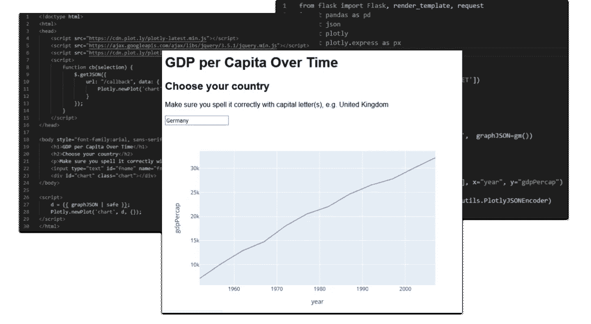
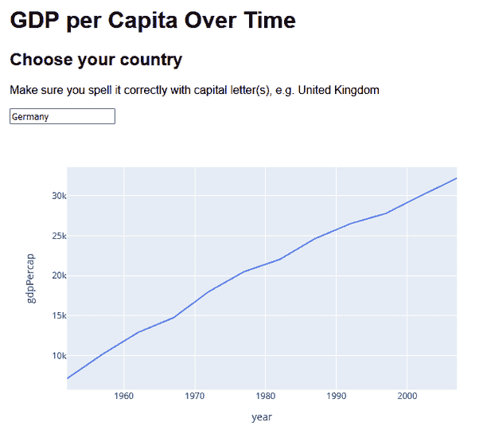
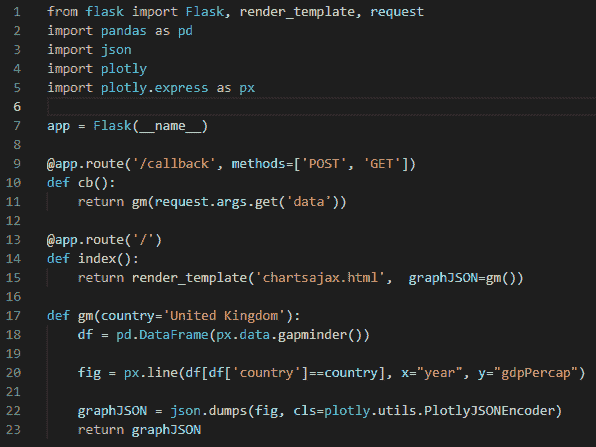
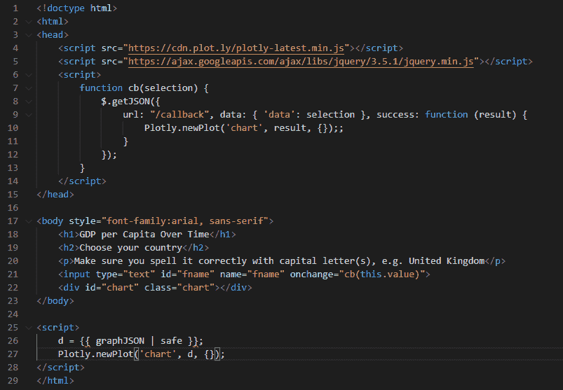

# 使用 Plotly 和 Flask 的交互式 Web 仪表板

> 原文：<https://towardsdatascience.com/an-interactive-web-dashboard-with-plotly-and-flask-c365cdec5e3f?source=collection_archive---------2----------------------->

## 数据可视化

## 要用 Dash 创建一个真正交互式的应用程序，你需要使用回调。你可以用 Plotly 和 Flask 达到同样的效果。



应用程序和代码—由 autho 提供的图像

看起来好像我对 Dash 有意见。老实说，我没有；这是一个很好的产品，得到了 Plotly 的大力支持，做了它想做的事情。

但是，正如我在[上一篇文章](/web-visualization-with-plotly-and-flask-3660abf9c946)中试图演示的那样，当您可以用 HTML 编写 HTML 时，就没有必要用 Python 编写 HTML(因为 Dash 要求您这样做)!我现在要补充的是，Flask 应用程序中不需要额外的复杂层——从根本上说，Dash 是一个 Flask 应用程序——只要一点 Javascript 和 HTML 就可以完成同样的工作。

在我的上一篇文章中，我展示了你可以创建一个简单的 web 应用程序，不需要破折号就可以合并 Plotly 图表。相反，你可以结合使用 Flask 和网页模板。这也给了你创建多页面应用的优势。

[](/web-visualization-with-plotly-and-flask-3660abf9c946) [## 用 Plotly 和 Flask 实现 Web 可视化。

towardsdatascience.com](/web-visualization-with-plotly-and-flask-3660abf9c946) 

但是 Dash 也允许你通过使用回调函数将新数据加载到图表中来创建交互式应用。所以问题是，我们能用 Plotly plus Flask 模型轻松做到这一点吗？当然，答案是肯定的。你可以用 Dash 做的任何事情也可以用它的底层技术来做:Python、Flask、HTML 和 Javascript。

但是，这真的更容易吗？

这要由你来判断，但从我(可能有偏见)的角度来看是这样的。如果你需要学习一点你以前从未接触过的 HTML 或 Javascript，那么很好，你可能会在未来找到它的用处。

为了演示这一点，我们将快速运行一个显示一系列国家人均 GDP 的基本 web 应用程序。交互性体现在您可以键入一个新的国家名称，图表会通过回调服务器并使用新数据重新加载图表来自动更新。

该应用程序如下所示:



它基于来自 [Gapminder 基金会](https://www.gapminder.org/)的数据，这些数据包含在 Plotly 库中，并在他们的一些示例程序中使用。

这个应用程序非常小，非常简单，但是演示了可以用来创建令人印象深刻的交互式仪表板应用程序的技术(并提供了可以重用的代码)。你将需要使用一点 HTML，一点 Javascript，并知道如何创建和运行 Flask 应用程序的基本知识(见这里的简单介绍:[如何创建和运行 Flask 应用程序](https://jones-alan.medium.com/how-to-create-and-run-a-flask-app-533b7b101c86))。

您可以在本文末尾找到代码的链接——以 zip 文件的形式下载它，或者从我的 Github 存储库中访问它。

# 烧瓶应用程序

您可以在下面的代码中看到定义了两条路由:第 13 行的根、 */、*和第 9 行的*回调*。他们都使用来自函数 *gm* (完成大部分工作)的数据，但是方式不同。根路径使用模板*chartsajax.html*(我们将在下面看到)并将数据传递给它，而*回调*只是返回数据本身。你大概可以看到这是怎么回事。

这个应用程序是一个由根路径和*chartsajax.html*渲染的页面。这将绘制一个初始图，但也允许用户输入一个新的国家名称。当输入该名称时，一个请求被发送到*回调*路径，从该路径返回的数据被用于更新绘图。结果是一个令人满意的图表更新，但没有您在重新加载整个页面时会遇到的空白屏幕。

第 17 行的函数 *gm* 实际上创建了情节。它需要一个参数，我们要绘制的国家的名称。该参数缺省值为‘英国’,以满足从没有传递参数的根路径进行调用的需要。然后在第 18 行从 Gapminder 数据集创建一个 Pandas 数据帧。由此我们创建了这个国家的图表。

第 22 行使用 Plotly 自带的编码器将图表编码为 JSON，这是在 HTML 页面中呈现图表所必需的，然后将它返回给调用者。



# HTML 页面

HTML 定义了一个简单的布局，如下面第 17 到 23 行所示。几个标题后面是一个单独的段落，一个文本输入框，然后是这个节目的明星，图表。Plotly 需要一个 HTML 中的 *< div >* 标签来构建一个图表，并在第 22 行显示。

这是最简单的部分——并不是说其余的部分很复杂。

当页面加载 Plotly 和 JQuery 的库时——我们需要 Plotly 来呈现图形，当然，我们将使用 JQuery 函数来实现对服务器的回调。接下来，Javascript 函数 *cb* 被定义——稍后会详细介绍。

然后加载页面主体，第 25 行到第 28 行的 Javascript 第一次也是唯一一次被执行。我们可以在这段代码中看到，变量 *d* 被设置为模板变量 *graphJSON* 的值——这是我们在 Flask 应用程序中传递给模板的值。然后使用 Plotly Javascript 库中的 *newPlot* 函数绘制 Plotly 图形。这给了我们默认的情节。



现在，如果我们想改变图表以显示不同国家的数据，我们只需输入国家的名称，然后按回车键。图表会自动更新。(注意，如果你输入一个无效的国家，你只会得到一个空白的图表。)

这通过使用第 21 行输入字段中的 *onchange* 属性来实现。 *onchange* 做的正是你所期望的:当输入字段的值改变时，函数 *cb* 用字段的值调用。

# 回电

那个函数 *cb* ，就是回调函数。它获取输入字段的值，并通过 JQuery 函数 *getJSON* 将其发送给回调路由。 *getJSON* 是一个 AJAX 调用，它对指定的 URL 执行异步 HTTP 请求，向其传递数据，接收响应(它将其解释为 JSON 编码的)，并定义当接收到成功结果时要调用的函数。

success 函数获取返回值——这是 JSON 编码的图表——并调用 Plotly *newPlot* 函数来更新图表。

(顺便说一下，AJAX 代表异步 Javascript 和 XML——换句话说，使用 Javascript 的异步 HTTP 请求使用 XML 作为数据传输的格式，只是目前 JSON 是更常见的数据传输格式，而不是 XML。)

我不会深入介绍 JQuery 函数如何工作的细节，您可以将它作为可以重用的样板代码，或者在这里了解更多关于 JQuery 的内容。然而，**了解**有用的是数据参数。这看起来像这样

```
data: { ‘data’: selection } 
```

并且它是将被发送到 Flask 应用中的回调函数的数据。*数据*是正在发送的参数的名称，而*选择*是它的值(从文本输入字段传递过来)。

# 下一步怎么样

正如所承诺的，这是一个使用 Flask、Plotly 和 AJAX 的简单交互式 web 应用程序的快速设计。我希望，随着“[Web Visualization with Plotly and Flask](/web-visualization-with-plotly-and-flask-3660abf9c946)”的发布，您可以使用 Dash 的底层技术轻松地构建交互式仪表盘，而且这并不是一项令人畏惧的任务。

Dash 教程还演示了其他一些更复杂的行为，当然，这些也可以使用与我演示的技术类似的技术来实现。但那是以后的事了。

一如既往，感谢阅读。如果你想知道我什么时候发表新文章，请考虑在这里注册一个电子邮件提醒。

如果你不是一个媒体订阅者，那就注册吧，这样你就可以每月花 5 美元阅读尽可能多的文章。在这里注册，我会赚一点佣金。

*更新:在你可以在下面下载的代码中，我包含了一个新版本，它只使用 Ajax 来加载图表，也就是说，它不使用传递给模板的参数来加载初始图表。它还在图表上标注了它所代表的国家，我认为这是一个小小的改进——详情请参见自述文件。*

# 获取代码

请在我的代码库中查看代码，或者在这里的 [Github 页面上下载这篇文章和上一篇文章的 zip 文件。](https://alanjones2.github.io/Flask-Plotly/)