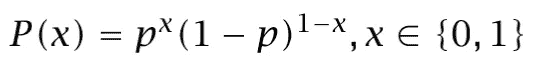

# 贝叶斯统计的一次有趣的散步:MAP 和 MLE 之间的差异。

> 原文：<https://towardsdatascience.com/an-interesting-walk-from-bayesian-statistics-differences-between-map-and-mle-2daea5fc15b?source=collection_archive---------29----------------------->

纳赛尔·塔米米在 [Unsplash](https://unsplash.com?utm_source=medium&utm_medium=referral) 上的照片

这篇文章将让你了解任何机器学习模型的基础。用简单的文字和几个公式，你将得到贝叶斯，最大似然估计和最大后验估计充分的能力。

具体来说，让我们从概率和判别函数的角度开始讨论二元分类。这是一次有趣的步行，旨在了解 scikit-learn 和 keras 设施之外的机器学习算法的原理。

想象一下，我们必须将汽车分为两类:环保型和污染型。我们拥有的关于汽车的信息是制造年份和消耗量，我们用两个随机变量 X1 和 X2 来表示。当然，还有其他影响分类的因素，但它们是不可观测的。记住我们可以观察到的，汽车的分类由伯努利随机变量 C 表示( *C=1* 表示环保， *C=0* 污染)，条件是可观察值 X =【X1，X2】。因此，如果我们知道 *P(C|X1，X2)* ，当一个新的入口数据点以 *X1=x1* 和 *X2=x2* 出现时，我们会说:

作者图片

其中错误概率为 *1-max(P(C=1|x1，x2)，P(C=0|x1，x2))* 。表示 *x=[x1，x2]* 那么我们可以使用贝叶斯定理，它可以写成:

作者图片

P(C)被称为**先验概率**，因为它是我们之前在数据集中拥有的关于 C 的信息，用来分析可观测的 *x.* 正如你所想象的， *1=P(C=1)+P(C=0)。*

P(x|C)被称为**类可能性**，因为它是属于 C=c 的事件具有相关观察值 *x.* 的概率

P(x)是**证据**，因为它是在我们的数据集中看到观察值 *x* 的概率。这个术语也称为规范化术语，因为它将表达式相除，得到一个介于 0 和 1 之间的值。证据概率是所有可能情况的总和(也称为全概率定律):

P(x)= P(x | C)1)P(C = 1)+P(x | C = 0)P(C = 0)

最后，P(C|x)是我们想要知道的，每一类给定一个观察值的概率。这被称为**后验概率**因为我们在看到观察值 x 后对其进行了分类，当然 *P(C=0|x)+P(C=1|x)=1。*

在有几个类的情况下，我们可以将这个表达式扩展到 *K* 类:

作者图片

并且贝叶斯分类器将从 *K* 个选项中选择具有最高后验概率 P(Ci|x)的类。

[在之前的文章](/maths-behind-supervised-learning-for-dummies-the-theory-in-plain-words-part-i-8f9be4d7e33a)中，我解释了如何根据区分函数来理解分类，区分函数限制了空间中的假设类别区域。按照同样的思路，我们可以实现那组判别函数。具体来说，我们选择 C_i，如果:

作者图片

如果我们将判别函数视为贝叶斯分类器，则最大判别函数对应于最大后验概率，得到:

作者图片

请注意，我们已经删除了归一化项(证据),因为它对所有判别函数都是一样的。该集合将特征空间分成 K 个决策区域:

作者图片

在实践中，我们观察到的信息片段，又名*数据点*，它们通常遵循一个给定的概率分布，我们将其表示为 *P(X=x)* ，正如我们之前所讨论的。当我们有像 P(C=1|x)或 P(X=x)这样的值时，贝叶斯分类似乎很容易计算。然而，如果我们不确切地知道*P(X)*，因为我们不能访问所有的数据点，我们试图从可用的信息中估计它，于是统计就出现了。

> 统计数据是从给定样本中计算出的任何值。

P(X)可以有不同的形状，但是如果给定的样本来自一个已知的分布，那么我们说它遵循一个参数分布。参数分布是非常理想的，因为我们只需要知道几个参数就可以画出一个完整的分布。我们该怎么办？基于我们所看到的(样本)，我们通过计算样本的统计量来估计分布的参数，即分布的*充分统计量*。这使我们能够获得数据的估计分布，我们将使用它来做出假设和决策。

# 最大似然估计

如果你已经到了这一步，请忘记之前贝叶斯解释的一切。

让我们从头开始:我们的数据集中有 N 个数据点。看起来这些数据点的概率密度遵循一个清晰的分布族 **p(x)，**但是我们对真实分布的形状没有任何线索(它的真实中心，它的真实离差，等等)。如果我们面对的是参数分布，那么计算定义真实分布的参数就很简单。怎么会？让我们根据现有的给定样本来看看最有可能的选项。

我们有一个独立同分布(iid)样本:

作者图片

它的概率密度由一组参数θ定义。让我们找出使给定样本的分布尽可能接近的具体θ参数。因为数据点是独立的，所以它们的似然性是各个点的似然性的乘积。具体来说，对于给定的θ，我们来看概率 p(x|θ)。概率越高，匹配度越高。

作者图片

那么，对于给定的数据集 X， *l(θ|X)* 的θ的可能性等于 *p(X|θ)。*为了使事情更简单，我们通常将对数应用于可能性，因为计算速度更快(求和而不是乘法):

作者图片

现在，我们只需驱动对数似然，然后根据θ将其最大化(例如使用梯度下降)。

**重要提示:**我们通常互换术语“可能性”和“概率”。然而，它们是不同的东西。概率是固定分布(特定情况)下的面积。对于概率，我们想知道给定分布情况下的概率。相比之下，可能性是分布中可以移动的固定点的 y 轴值。似然性是指为某个特征的固定值找到最佳分布。可能性包含的不确定性信息要少得多，它只是一个点而不是一个区域。

作者图片

我们搜索不同的θ值，选择使对数似然最大的θ:

图片作者。蓝点代表样本的数据点。从不同的θ值得出不同的分布，选择“最匹配”的一个。

如果我们观察许多不同的样本，分布参数的估计量将更准确，与真实参数的偏差更小。稍后我们将看到如何评估估计量的质量，换句话说，估计量与θ的差异有多大。

**将最大似然法应用于伯努利分布**

在伯努利中，有两种可能的状态:真或假，是或否。事件发生或不发生。因此，每个数据点可以取两个值:0 或 1。实际上，它以概率 *p，*取值 1，以概率 *1-p.* 取值 0，因此:

作者图片

该分布用一个参数建模: *p.* 因此，我们想从一个样本中计算它的估计量 p̂。让我们根据 *p:* 来计算它的对数似然

作者图片

现在，求解 *dL/dp=0* 以获得最大化表达式的 p̂:

作者图片

# 最大后验概率

现在是时候回到贝叶斯理论了。有时，在查看样本之前，我们可能有一些关于参数θ可能取值范围的信息。当样本很小时，这些信息会非常有用。

因此，先验概率 *p(θ)* 定义了θ在查看样本之前可能取的值。如果我们想在查看 X 样本后知道可能的θ值， *p(θ|X)，*我们可以使用贝叶斯:

图片由作者基于[1]

**注:** *我们可以忽略规格化项(或证据)，当我们在谈论优化时，它并不影响。*

因此，如果我们想要一个模型来预测给定输入 x 的输出， *y=g(x)* ，就像在回归中一样，我们实际上是计算 *y=g(x|θ)。*视分布情况而定。

然而，由于我们不知道 *θ、*的真实值，我们必须使用 *θ (* 按概率加权)的所有可能值对预测取平均值:

作者图片

积分的计算可能非常复杂和昂贵。代替这样做，我们可以只取一个点，最可能的点，最大后验概率。

因此，我们想要得到 *θ，*最可能的值，或者换句话说，最大化 *P(θ|X)，*，这与最大化 *P(X|θ)P(θ):* 相同

图片由作者基于[1]

如果你花一点时间将这个公式与 MLE 方程进行比较，你会发现它的不同之处仅在于 MAP 中包含了先验 *P(θ)* 。换句话说，可能性是用来自先验的信息来加权的。最大似然法是无先验信息映射的特例。

> MLE 是映射的一个特例。

如果这个先验信息是恒定的(均匀分布)，它对最大化没有贡献，我们将得到 MLE 公式。

具体来说，想象θ可以取六个不同的值。因此，P(θ)在分布中处处都是 1/6:

图片由作者基于[1]

然而，如果先验不是常数(它取决于分布的区域)，概率也不是常数，必须考虑它(例如，如果先验是高斯的)。

**重要:**可以选择最大后验概率而不是计算积分，前提是我们可以假设 *P(θ|X)* 在其模周围有一个窄峰。为什么？因为我们取的是单个点，而不是计算所有的区域，没有不确定性的表示。当模式周围没有窄峰时，可能会发生这样的事情:

作者图片

参考书目:

[1]奥古斯丁·克里斯蒂亚迪的博客[https://wiseodd.github.io/techblog/2017/01/01/mle-vs-map/](https://wiseodd.github.io/techblog/2017/01/01/mle-vs-map/)

[2]艾瑟姆·阿尔帕丁。机器学习导论，第 4 版。