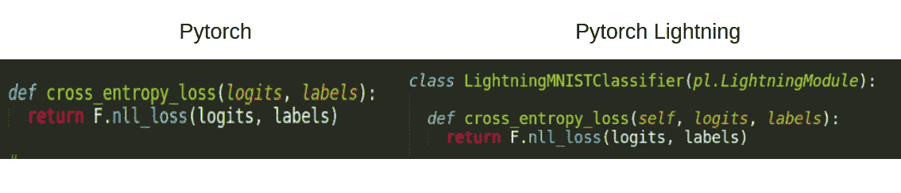

# PyTorch 闪电简介

> 原文：<https://towardsdatascience.com/an-introduction-of-pytorch-lightning-230d03bcb262?source=collection_archive---------9----------------------->

## 只需更改一个参数，即可将代码从单 GPU 移植到多 GPU 训练

## PyTorch lightning 帮助您将代码扩展到多 GPU 培训，无需任何工程工作


Johannes Plenio 在 [Unsplash](https://unsplash.com?utm_source=medium&utm_medium=referral) 上拍摄的照片

坊间传言 PyTorch lightning 是普通 PyTorch 的更好版本。但是，它能给我们的世界带来什么样的共识呢？嗯，它帮助研究人员通过多 GPU 训练、Fp-16 训练和 TPU 支持的训练来扩展模型，只需改变一个参数。

由[吉菲](https://giphy.com/)

是的，你没看错。只要改变一个论点，你就可以做所有这些惊人的事情。还记得我们过去是如何编写多 GPU 训练代码的吗？我们必须了解 PyTorch 支持的不同训练架构，然后自己实现它们。谢天谢地，再也没有了！PyTorch Lightning 将改变我们编写代码的方式，并帮助我们在一秒钟内完成所有这些任务。

为了涵盖所有的变化，我用以下方式构建了这个博客:

*   PyTorch 和 PyTorch Lightning 在实现上的差异的总体比较
*   比较每个模块，如模型、损失函数等。为了 PyTorch 和 PyTorch 闪电
*   多 GPU 训练
*   TPU 培训
*   FP16 培训
*   提前停止
*   LR 取景器

# **py torch 和 PyTorch Lightning 的基本对比**


两个框架之间的比较(图片由作者提供)

> 具有相同颜色的代码块表示相同模块的实现。例如，两个框架中的模型定义都是浅绿色的。

首先要注意的是，PyTorch lightning 在类 *Net* 本身*中加入了 *train_dataloader、configure _ optimizers、training_step* 。*另外，请注意，我们在 PyTorch 中编写的整个训练循环在 PyTorch lightning 中只有几行。

# 通用深度学习代码组件

一般来说，深度学习代码具有以下组件

*   模型
*   数据
*   失败
*   【计算机】优化程序
*   训练和测试回路
*   记录

让我们了解 PyTorch 和 PyTorch lightning 在上述组件方面的区别。

## 模型

正如我们上面注意到的，模型架构和定义是相同的，除了在 Pytorch Lightning 中所有其他函数定义也在同一个类中。


模型对比(图片由作者提供)

## 数据

在 Pytorch Lightning 中定义数据加载器有两种方法。

*   您可以在 *Net* 类中定义 *train_dataloder* 和 *val_dataloader* 函数，就像前面所做的那样(在第一个例子中)
*   你可以像 PyTorch 中一样定义自己的 *train_dataloader* 和 *val_dataloader* 到 *trainer.fit* ，如下图所示。

MNIST 数据加载器

使用上述方法，您可以为 PyTorch 和 PyTorch lightning 定义数据加载器。两者的主要区别在于 Pytorch Lightning 中的 *trainer.fit()* 将所有数据加载器作为参数。

```
trainer.fit(net, train_dataloader, val_dataloader)
trainer.test(net, test_dataloader)
```

## 失败

对于 n 类分类，我们要计算交叉熵损失。交叉熵与 NegativeLogLikelihood(log _ soft max)相同，所以我们将使用它来代替。



损失比较(图片由作者提供)

## 【计算机】优化程序

让我们使用 Adam 优化器。


优化程序比较(图片由作者提供)

*自我*。 *parameters()* 这里传递的，包括模型中定义的所有可学习的参数。

## 训练和验证循环

在 PyTorch，我们必须

*   定义训练循环
*   加载数据
*   通过模型传递数据
*   计算损失
*   做零工
*   反向传播损失函数。

然而，在 PyTorch 闪电中，我们必须

*   定义 *training_step* 和 *validation_step，*在这里我们定义我们希望数据如何通过模型
*   计算损失

我们甚至不用指定 *model.train()* 和 *model.eval()* 。


训练和验证比较(图片由作者提供)

## 记录

Tensorboard 是美国研究人员最常用的记录器之一。所以正如你在 PyTorch lightning 上面注意到的，在函数 *training_step* 和 *validation_step 的最后一行，提到了 self.log()* ，这是用来记录训练损失的。这将创建一个名为 lightning_logs 的文件夹，并在其中保存所有日志和时期。

## 概述

*   模型定义过程类似，但有两个主要区别。1)所有其他函数也是用 PyTorch lightning 的模型类本身定义的。2)神经网络。Pytorch 中的模块在 PyTorch lightning 中被 nn.LightningModule 覆盖。
*   可以用同样的方式定义数据加载器。对于 PyTorch lightning，我们必须在 *train.fit()* 时通过 *train_loader* 和 *val_loader*
*   Optimizer 和 loss 可以用同样的方式定义，但是它们需要作为 PyTorch lightning 的主类中的一个函数存在。
*   培训和验证循环在 PyTorch lightning 中预定义。我们必须定义*训练 _ 步骤*和*验证 _ 步骤*，即给定一个数据点/批次，我们希望如何通过该模型传递数据。
*   用于记录的函数是预定义的，可以在 Pytorch Lightning 中直接调用。

既然我们知道了这两者之间的区别，那就让我们来理解为什么我们首先要开始这个比较。为了使代码可伸缩并减少我们的工程工作，让我们看看感兴趣的特性。

## 多 GPU 训练

我们可以使用下面的代码来实现。

```
trainer = Trainer(gpus=8, distributed_backend='dp')
```

您可以定义要用于分布式培训的 GPU 数量，以及要使用的后端。这里我定义了“dp ”,它是并行分布的。也可以定义为‘DDP’，即分布式数据并行。

## TPU 培训

我们可以使用下面的代码来实现。

```
trainer = Trainer(tpu_cores**=**[5])
```

这个代码意味着模型将在 ID 为 5 的 TPU 核心上训练。我们还可以通过使用单个参数启用多 TPU 训练来定义需要使用多少个内核。

## FP16 培训

这是我最喜欢的。FP16 有助于加快训练过程，而不会对性能造成太大影响。

```
trainer = Trainer(precision**=**16)
```

## 提前停止

这用于在训练模型时，如果您看不到模型性能有任何进一步的提高，则停止训练。我们如何持续检查模型性能是否在提高？为此，我们可以使用验证损失或准确性。

```
from pytorch_lightning.callbacks.early_stopping import EarlyStoppingdef validation_step(...):
    self.log('val_loss', loss)trainer = Trainer(callbacks=[EarlyStopping(monitor='val_loss', patience=3)])
```

在上面的例子中，培训师将跟踪验证的准确性。如果过去 3 个时期(耐心值)的性能没有改善，那么它将停止训练，从而防止过度拟合。

## LR 取景器

学习率是最重要的超参数之一，正确设置初始学习率至关重要。否则，在训练模型时，可能会出现模型收敛到无法提供最佳性能的局部最优值的情况。

```
net **=** LightningMNISTClassifier()

*# finds learning rate automatically*
*# sets hparams.lr or hparams.learning_rate to that learning rate*
trainer **=** Trainer(auto_lr_find**=True**)

trainer**.**tune(net)
```

为了找到最佳学习率，你必须使参数 *auto_lr_find* 为真*，*，然后调整训练器(使用 *trainer.tune()* )，这将帮助你找到学习率。之后可以调用 *trainer.fit()* 对模型进行训练。

只需添加一些参数，Pytorch Lightning 就能帮助我们享受许多功能，而每一项功能对我们来说都至关重要。现在您有了一个基本的想法，通过编写您的第一个神经网络并探索该库提供的不同功能，开始实践 PyTorch lightning。

如果你想学习深度学习的很酷的应用，请查看我们关于深度学习语音处理的博客[这里](/all-you-need-to-know-to-start-speech-processing-with-deep-learning-102c916edf62)。

*成为* [*介质会员*](https://medium.com/@AnveeNaik/membership) *解锁并阅读介质上的许多其他故事。关注我们的* [*中*](https://medium.com/@AnveeNaik) *阅读更多此类博文*。