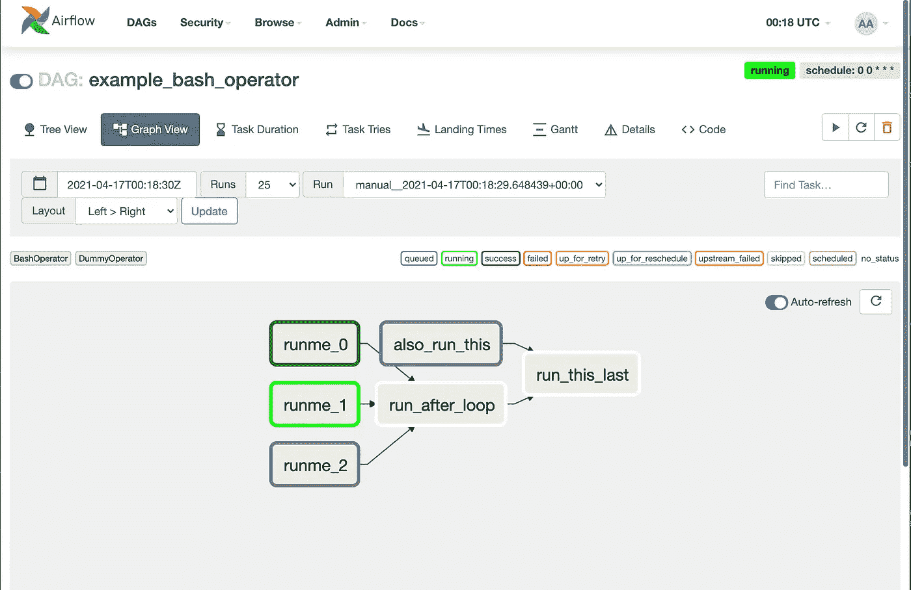
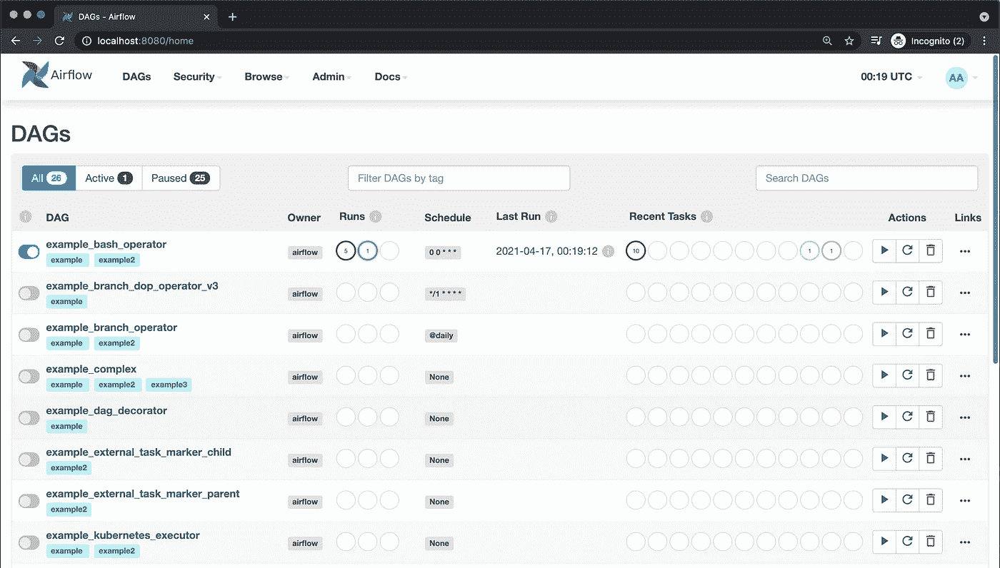
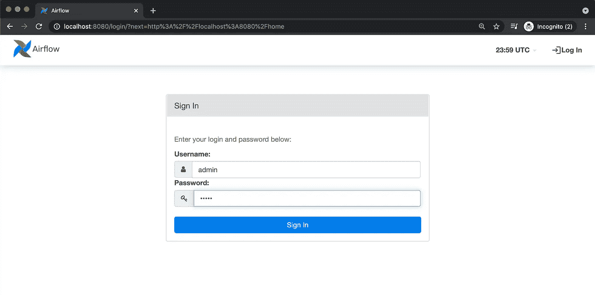

# 阿帕奇气流简介

> 原文：<https://towardsdatascience.com/an-introduction-to-apache-airflow-21111bf98c1f?source=collection_archive---------6----------------------->

## 作为数据科学家，这是一个很好的管道自动化工具


克里斯托夫·高尔在 [Unsplash](https://unsplash.com/s/photos/tech?utm_source=unsplash&utm_medium=referral&utm_content=creditCopyText) 上拍摄的照片

# 什么是阿帕奇气流？

成为数据科学家的很大一部分是能够自动进化模型并生成报告。对于需要定期收集数据、生成周期报告等的模型。手动运行程序非常耗时且不可扩展。能够自动化整个数据管道来生成报告是非常有用的。这正是阿帕奇气流带来的东西。

Apache Airflow 是一个开源的作业调度程序，它可以组织、执行和监控任何周期性时间间隔内的任何工作流。这个项目是从 Airbnb 开始的，已经被很多大公司如谷歌和亚马逊接手。

# 气流是如何工作的？

Airflow 利用有向无环图(Dag)来创造就业机会。



DAG 由节点和有向箭头组成。每个节点都是一个函数，当该函数运行时将被执行，每个箭头都指向当前节点之后将被执行的下一个节点。对于有多个箭头进入的节点，必须先完成所有的依赖关系，然后节点才能启动。

图中的每个节点都由一个运算符定义。有许多运算符，如 BashOperator、PythonOperator 等。每个操作员负责运行该操作员类型的功能。例如，如果您有一个 PythonOperator，您可以告诉操作员运行 python 函数。这是所有可能的[气流操作员](https://airflow.apache.org/docs/apache-airflow/stable/_api/airflow/operators/index.html)的列表。

每个 DAG 由 DAG python 文件指定，该文件指定节点和节点之间的依赖关系。

## 气流 DAGs 页面

从 Dag 视图中，您可以看到当前注册到 Airflow 中的所有 Dag。从这里，您可以查看作业的状态、触发现有作业、刷新作业等等。



# 设置气流

设置气流非常简单。此设置过程将用于 MacOS，但在线也有相应的 Windows 设置步骤。在安装过程之前，请确保您已经安装了自制软件[ [说明](https://brew.sh/) ]。家酿是一个软件包安装程序，它使得安装程序和软件包更加简单。

## 1.安装 Python3 和 pip

安装 Python3，然后检查以确保 Python 版本是 3+

```
% brew install python% python --version
python 3.8.3
```

安装 pip

```
% curl [https://bootstrap.pypa.io/get-pip.py](https://bootstrap.pypa.io/get-pip.py) -o get-pip.py% python get-pip.py
```

要安装 Airflow，请确保 pip 版本为 20.2.4

```
% pip install --upgrade pip==20.2.4% pip --version
pip 20.2.4 from /usr/local/anaconda3/lib/python3.8/site-packages/pip (python 3.8)
```

## 2.[可选]创建虚拟环境安装气流

一般来说，安装一个虚拟环境是一个很好的实践，这样你就不会把你的本地环境和很多包聚集在一起。虚拟环境可以很容易地激活和停用。安装`virtualenv`并为虚拟环境创建一个名称，本例中的名称是`venv`。

```
% pip install virtualenv% virtualenv -p python venv
```

现在激活虚拟环境，这样所有的包都会安装到虚拟环境中，而不是您的计算机上。

```
% source venv/bin/activate
```

现在，您的虚拟环境被激活。你的控制台现在应该有`(venv)`在它前面。

## 3.安装和设置气流

在新的`airflow`目录中安装气流

```
(venv) % mkdir airflow && cd airflow(venv) % pip install apache-airflow
```

设置正确的目录结构，并创建一个新的气流文件夹。首先用`pwd`获得 airflow 文件夹的路径，然后将其作为 airflow 主目录导出到该路径。

```
(venv) % pwd
/Users/<username>/airflow/airflow(venv) % export AIRFLOW_HOME=/Users/<userid>/airflow/airflow
```

最后，初始化气流数据库。Airflow 使用 Sqlite 数据库来跟踪所有 airflow DAGs 的元数据。

```
(venv) % airflow db init
```

现在，您应该会看到 airflow 目录中的一堆文件。在下面的终端输出中，我使用了一个名为`tree`的包，但是`ls`也可以工作。是一个非常有用的查看目录结构的包。

```
(venv) % brew install tree(venv) f.liang@fliang-ltm airflow % tree
.
├── airflow.cfg
├── airflow.db
├── logs
│   └── scheduler
│     ├── 2021-04-16
│     └── latest -> /Users/<userid>/airflow/logs/scheduler/2021-04-16
├── unittests.cfg
└── webserver_config.py
```

## 4.启动气流

在第一次启动 Airflow 时，您必须创建一个新用户。我刚刚对大多数字段使用了简单的`admin`，但是你可以自定义它。

```
(venv) % airflow users create \
      --role Admin \
      --username admin \
      --email admin \
      --firstname admin \
      --lastname admin \
      --password admin
```

要检查用户是否已成功添加，请列出所有用户

```
(venv) % airflow users list
id | username | email | first_name | last_name | roles
===+==========+=======+============+===========+======
1  | admin    | admin | admin      | admin     | Admin
```

然后启动 Airflow 作业调度程序

```
% airflow scheduler
```

创建一个新的终端(Mac 上的`CMD + T`，并再次设置`AIRFLOW_HOME`路径。如果您之前设置了虚拟环境，请不要忘记激活虚拟环境。如果不这样做，那么`airflow`命令在新的终端中将不起作用。然后启动 web 服务器。

```
(venv) % export AIRFLOW_HOME=/Users/<userid>/airflow/airflow(venv) % airflow webserver
```

从这里开始，一切都应该设置好了，所以打开任何网络浏览器并转到 [localhost:8080](http://localhost:8080) 。8080 应该是您的`airflow.cfg`文件中的默认端口，但是如果这不起作用，请打开您的 airflow.cfg 文件，查找`web_server_port`字段并将其设为 8080。在这里，只需输入您之前创建的用户名和密码(用户名和密码都是`admin`)并登录。



登录后，您可以浏览并运行许多示例 airflow 作业。


# 5.创建您自己的 Dag

要阻止示例 dag 的显示，请打开您的`airflow.cfg`文件并将`load_examples`设置为`False`，然后创建一个 Dag 文件夹，如`airflow.cfg`中的`dags_folder`变量所指定的。故障 dags 文件夹路径为`AIRFLOW_HOME/dags`。

```
(venv) % mkdir /Users/<userid>/airflow/airflow/dags
```

将您的 DAG 文件添加到`dags/`文件夹中，Airflow scheduler 将自动拾取 DAG，并在几分钟内将其反映在 web 服务器中。任何编译错误也会显示在 UI 和 logs 文件夹中。

# 结论

Apache Airflow 对于任何机器学习工程师或数据科学家来说都是一个非常方便的工具，可以用来安排和自动化工作流。通过用 docker 容器替换虚拟环境并将 docker 映像托管在云中，工程师可以在几分钟内部署和监控整个数据管道。