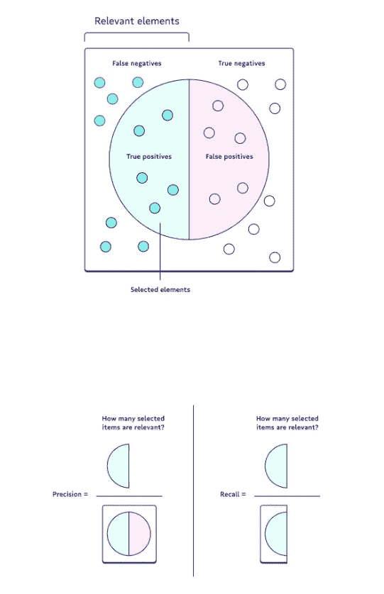

# 构建世界级欺诈预测模型简介

> 原文：<https://towardsdatascience.com/an-introduction-to-building-a-world-class-fraud-prediction-model-aed1c3c314d2?source=collection_archive---------32----------------------->

## 模型的类型、要使用的关键特性以及如何评估模型

[Bermix 工作室](https://unsplash.com/@bermixstudio?utm_source=unsplash&utm_medium=referral&utm_content=creditCopyText)在 [Unsplash](https://unsplash.com/s/photos/fraud?utm_source=unsplash&utm_medium=referral&utm_content=creditCopyText) 拍摄的照片

# 介绍

随着世界变得越来越数字化，人们更好地配备了新技术和工具，欺诈活动的水平继续达到创纪录的高水平。[根据普华永道](https://www.pwc.com/gx/en/services/forensics/economic-crime-survey.html)的一份报告，2020 年欺诈损失总计 420 亿美元，在过去 24 个月中影响了 47%的公司。

矛盾的是，同样的技术进步，如大数据、云和现代预测算法，让公司比以往任何时候都更好地应对欺诈。在本文中，我们将特别关注最后一点，欺诈预测算法，具体来说，我们将了解欺诈模型的类型、欺诈模型中使用的功能以及如何评估欺诈模型。

# 欺诈预测模型的类型

因为“欺诈”是一个非常全面的术语，所以您可以构建几种类型的欺诈模型，每种模型都有自己的用途:

## 特定于配置文件的模型与特定于交易的模型

**档案特定模型**专注于识别用户级别的欺诈活动，这意味着这些模型可以确定用户是否欺诈。

**交易特定模型**采用更精细的方法，识别欺诈交易，而不是欺诈用户。

乍一看，这些模型似乎服务于相同的目的，但欺诈交易并不总是来自欺诈用户。这方面的一个例子是信用卡盗窃-如果用户的信用卡被盗，并且在该信用卡上进行欺诈性交易，则该用户不应被视为欺诈。类似地，欺诈用户进行欺诈交易的情况并不总是如此——是否应该允许该用户进行任何交易是另一个话题。

因此，考虑特定于概要文件和特定于事务的模型是很重要的。

## 基于规则的模型与机器学习模型

**基于规则的模型**是带有硬编码规则的模型，想想“if-else”语句(或者 case-when 语句，如果你是 SQL 天才的话)。对于基于规则的模型，您有责任自己提出规则。如果您知道指示欺诈活动的确切信号，基于规则的模型非常有用。

例如，信用卡公司通常有一个基于规则的方法来检查您使用信用卡的位置。如果你用信用卡消费的地方和你的家庭住址位置之间的距离超过某个阈值——如果你离家太远——交易可能会自动被拒绝。

随着过去十年数据科学的出现，机器学习欺诈检测模型变得越来越受欢迎。当您不知道指示欺诈活动的确切信号时，机器学习模型非常有用。相反，你提供一个具有少量特征(变量)的机器学习模型，并让该模型自己识别信号。

例如，银行将数十种工程特征输入机器学习模型，以识别哪些交易可能是欺诈性的，并进入第二阶段进行进一步调查。这将进入下一部分，这是您应该在欺诈模型中使用的功能。

# 在您的模型中使用的关键功能

为您的模型选择特征的主要目的是包含尽可能多的指示欺诈活动的“信号”。

为了帮助激发一些想法，下面是机器学习模型中常用的关键功能的非穷举列表:

*   **注册或交易时间**:用户注册或交易的时间是一个很好的信号，因为欺诈用户的行为并不总是与普通用户相同。这意味着他们可能会在人们通常不进行交易的时候进行大量交易。
*   **交易地点**:正如我之前提到的，交易发生的地点可以很好地表明交易是否欺诈。如果交易是在远离家庭住址 2000 英里的地方进行的，这是一种不正常的行为，可能是欺诈行为。
*   **成本与平均支出比率**:这是给定交易的金额与给定用户的平均支出的比较。比例越大，交易越不规范。
*   **邮件信息**:您可以实际查看邮件的创建时间。如果在同一天创建了电子邮件和帐户，这可能意味着欺诈行为。

您可以提供的信号越多，信号越强，您的模型在预测和识别欺诈活动方面就越好。

# 如何评估一个欺诈模型

由于问题的性质，评估欺诈预测模型必须以不同于正常机器学习模型的方式进行，这将在下一节中详细阐述。

## 为什么你不应该使用准确性

欺诈检测被归类为**不平衡分类问题。**具体来说，欺诈性档案/交易的数量与非欺诈性档案/交易的数量之间存在显著的不平衡。因此，使用准确性作为评估标准是没有帮助的。

举例来说，考虑一个包含 1 个欺诈性交易和 99 个非欺诈性交易的数据集(在现实世界中，这个比例甚至更小)。如果一个机器学习模型将每一笔交易都归类为非欺诈性的，那么它的准确率将达到 99%。然而，这未能解决手头的问题，即对所有欺诈交易进行分类。

## 要使用的度量标准

相反，在评估欺诈预测模型时，您应该考虑两个指标:

**精度**也称为正预测值，是相关实例在检索到的实例中所占的比例。换句话说，它回答了“多大比例的积极认同是正确的？”

当将非欺诈性交易归类为欺诈性交易的成本太高，并且您可以接受仅捕获一部分欺诈性交易时，Precision 是首选。

**回忆**，也称为敏感度、命中率或真阳性率(TPR)，是实际检索到的相关实例总数的比例。它回答了“有多少比例的实际阳性被正确识别？”

当确定每一笔欺诈性交易至关重要，并且可以接受将一些非欺诈性交易错误归类为欺诈性交易时，最好使用召回。

每种方法都有自己的优缺点，应该根据手头的业务问题进行选择。下面是一张图片，可以更好的理解两者的区别。

作者创建的图像

# 感谢阅读！

如果你想了解更多关于欺诈、电子商务和数据科学的知识，[请收听 Riskified 数据科学副总裁 Elad Cohen](https://www.datacamp.com/community/blog/preventing-fraud-in-ecommerce-with-data-science) 的播客。同样，如果您想了解如何用 Python 构建一个实际的欺诈预测模型，您可以查看这个 [Kaggle 的信用卡欺诈预测模型库](https://www.kaggle.com/gpreda/credit-card-fraud-detection-predictive-models#Predictive-models)。

一如既往，我祝你学习一切顺利:)

不确定接下来要读什么？我为你挑选了另一篇文章:

 [## SQL 和 Python 收入群组分析完全指南

### 了解客户行为的重要数据分析工具

towardsdatascience.com](/a-complete-guide-to-revenue-cohort-analysis-in-sql-and-python-9eeecd4c731a) 

**又一个！**

 [## 2021 年建立营销组合模式的完整指南

### 充分理解什么是营销组合模型以及如何使用它

towardsdatascience.com](/an-complete-guide-to-building-a-marketing-mix-model-in-2021-fb53975be754) 

# 特伦斯·申

*   ***如果你喜欢这个，*** [***跟我上中等***](https://medium.com/@terenceshin) ***更多***
*   ***有兴趣合作吗？让我们连线上***[***LinkedIn***](https://www.linkedin.com/in/terenceshin/)