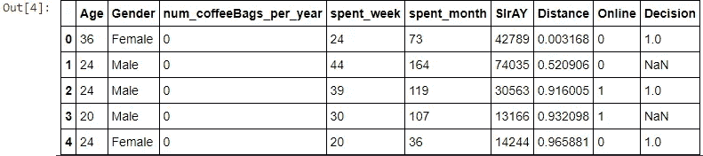
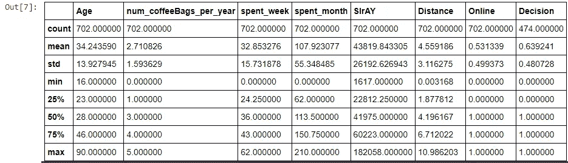
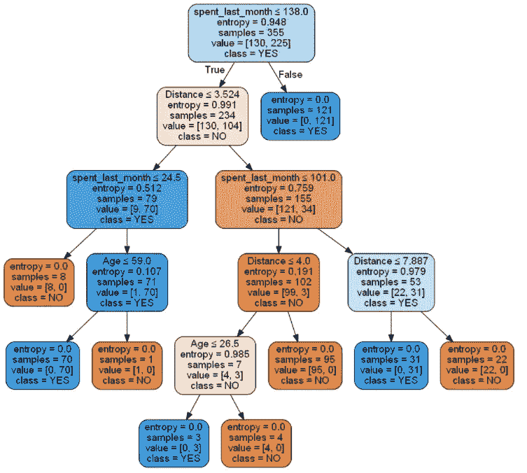
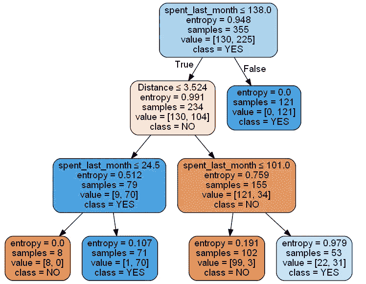
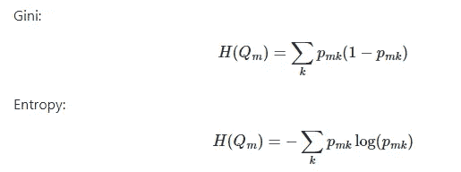
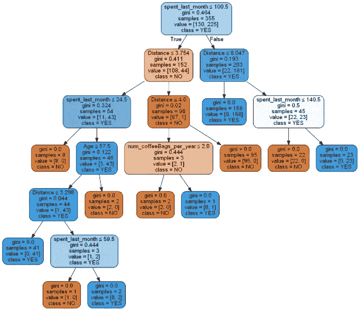
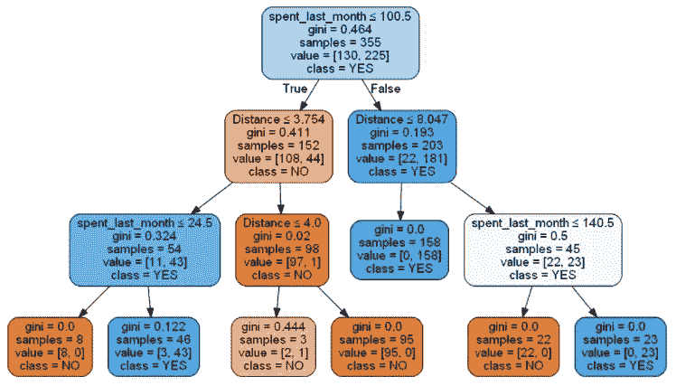

# 决策树和预测分析简介

> 原文：<https://towardsdatascience.com/an-introduction-to-decision-trees-and-predictive-analytics-92924a8a77e7?source=collection_archive---------6----------------------->

## 你如何确保产品发布会成功？决策树是使用数据科学解决这类业务问题的绝佳入门

图片由 [Pixabay](https://pixabay.com/) 上的 [fietzfotos](https://pixabay.com/users/fietzfotos-6795508/) 拍摄

决策树表示一系列连接的测试，这些测试越来越向下分支，直到特定的路径匹配一个类或标签。它们有点像抛硬币的流动图表，if/else 语句，或者当满足时导致最终结果的条件。决策树对于机器学习中的分类问题非常有用，因为它允许数据科学家选择特定的参数来定义他们的分类器。因此，无论您面对的是降价还是数据的目标 KPI 值，您都有能力在多个级别对数据进行排序，并创建准确的预测模型。

现在有很多很多的应用程序利用决策树，但是在这篇文章中，我将着重于使用决策树来做出商业决策。这涉及到衡量客户对新产品的兴趣，我们将使用来自在线咖啡豆经销商的数据！

**问题:**

图片由[内森·杜姆劳](https://unsplash.com/@nate_dumlao)在 [Unsplash](https://unsplash.com/) 上拍摄

您的客户 RR Diner Coffee 是一家总部位于美国的零售商，在世界各地销售特种咖啡豆。他们希望增加一个精选品牌的新产品。这种新的增加将大大提高销售额，改善他们的声誉，但他们需要确保产品将实际销售。为了添加该产品，您需要向您的客户证明至少有 70%的客户可能会购买它。幸运的是，您的营销团队发出了一份调查，您已经获得了大量数据。让我们来看看。

**探索数据**

作者图片

作者图片

在继续之前，我们肯定需要清理我们的数据，但是仅仅通过查看数据，我们就可以知道如何处理它。关于这些数据，非常方便的是，由于“决策”列，我们已经知道一些客户是否会购买这种新产品，因为我们不必对我们的训练数据进行任何猜测，我们可以建立一个监督模型。在确定哪类客户会说“是”时，任何其他特征都可能是有用的，但我们稍后会弄清楚。

为了清理这些数据，我所做的就是:

*   更改一些列名，使其更容易理解
*   确保所有的性别回答都是相同的格式，比如把“男性”、“M”、“M”和“男性”都变成“男性”，反之亦然。
*   将决策列中的 1.0s 和 0.0s 分别更改为“是”和“否”，暂时保留空数据。

现在我们知道了我们的数据是什么样的，我们可以采取什么方法，让我们继续为我们的模型进行训练/测试分割

**训练/测试分割**

因为只有 702 个条目，所以我想保存尽可能多的数据，即使是那些具有空决策的数据。对于这个训练/测试分割，我创建了一个决策值不为空的数据子集，并将其称为 NOPrediction。

就像这样，我们有了训练/测试分割，可以用来评估我们的模型。现在让我们开始真正的表演:决策树模型！

**车型**

就像每一种机器学习方法一样，在选择模型时，有大量不同的方法可供选择。我只是给你看一些我在这个项目中尝试过的，但是你应该多读一些，找出哪些最适合你！Scikit-learn 的网站有大量优秀的文档:点击这里查看[。](https://scikit-learn.org/stable/modules/tree.html)

**熵模型**

你可能还记得高中物理，熵测量系统中的无序或随机。当使用决策树时，你会遇到很多随机性，但作为一名数据科学家，你的工作就是用最小的熵来建立预测模型。基本熵模型试图从最大熵的树的顶部开始，向下到最小熵的根部，这就是如何准确地对数据进行分类。这在视觉上更容易解释，所以让我告诉你我的意思。

输出应该如下所示:

作者图片

如果你从顶部开始，你可以看到，随着你的工作沿着模型向下，你会做出正确和错误的决定。随着这些决策分支，熵变得越来越低，我们能够创建定义清晰的数据集群。

在这种情况下，我们从未定义最大深度或给模型任何其他参数，因此这个版本是最准确的，平衡精度得分为 98.7%。不过，有时为了时间和计算机处理能力的限制，牺牲一些准确性也是好的。就像在这个例子中，我们将最大深度设置为 3:

作者图片

该模型需要做出的决策更少，并且产生了 86.5%的平衡准确度分数。这仍然是一个非常可靠的预测模型，只有没有最大深度的模型的一半决策。你现在大概能明白我在说什么了。如果你在寻找最精确的模型，时间和计算能力不是问题:没有必要设置最大深度。但是，如果你时间紧迫或者资源有限:设置一个最大深度将会节省你很多时间，并且给你带来非常相似的结果！

**基尼杂质模型**

就像熵模型一样，这种决策树模型在对数据进行分类时寻求最小化任何随机性。然而，与前两个模型不同，基尼杂质模型不使用对数函数，随着时间的推移，它可以为您节省大量计算能力。这两者的区别如下:

图片来自 [scikit-learn 文档](https://scikit-learn.org/stable/modules/tree.html)

设置与熵模型非常相似，让我们看看它是如何执行的。

作者图片

这样，我们得到了 98.1%的平衡准确度，只是比第一个熵模型稍差一些。就像熵模型一样，你也可以设置基尼决策树的最大深度。

作者图片

这个模型惊人地拥有 96.9%的平衡精度！与原始基尼模型相比，只有 1.2%的差异，决策数量要少得多。

每个模型都有自己的优点和缺点，除了这四个例子之外，还有其他的可以探索。你会选哪一个？在我看来，最大深度为 3 的基尼模型为我们提供了良好性能和高度准确结果的最佳平衡。肯定存在这样的情况，其中最高的准确度或最少的总决策是优选的。作为一名数据科学家，你可以选择哪个对你的项目更重要！

**做预测**

现在我们已经创建了模型，让我们使用它们吧！为了证明 RR Diner 的咖啡会引起至少 70%顾客的兴趣，我们必须向预测模型中输入一些新数据。还记得在我们的数据集中，实际上只有 474/702 人做决定吗？如果我们使用其他 228 个条目进行预测呢？我们必须建立一个新的数据框架，添加一些虚拟变量，然后将它们输入到模型中。看起来是这样的:

这将输出 45NO 和 183 YES 的数组。如果我们使用 value_counts()原始数据集的“决策”列，我们会得到 151 个否和 323 个是。现在我们可以把它们加在一起:

*   183 是+ 323 是= 506 是
*   506 个是/ 702 个客户总数= 0.72

这意味着，根据我们进行的调查和我们的模型预测，72%的客户会有兴趣购买 RR Diner 咖啡！在这种情况下，我们已经满足了供应商设定的标准，应该能够将他们的产品添加到我们的业务中。如果你真的想打动他们，你甚至可以补充说，我们的预测模型准确率超过 96%。谁知道呢，获得这样一笔交易可能会给你带来奖金，甚至升职；数据科学是商业世界中极其宝贵的资产。

**结论**

我希望通过这个例子，你已经很好地了解了决策树，以及如何使用它们来帮助你或你的企业做出准确的预测！关于决策树，还有很多很多有趣的事情我没有提到，比如随机森林模型或者在衡量整体准确性时使用精度/召回分数。我很想在未来写更多关于它们的文章，但是现在，有很多很好的资源可以让你了解更多关于预测分析的知识。查看 scikit-learn 的文档进行真正的深度探索，或者[观看来自 Edureka 的这个信息丰富的视频！](https://www.youtube.com/watch?v=qDcl-FRnwSU&ab_channel=edureka%21)如果你想了解更多！

一如既往，非常感谢您阅读这篇文章！如果你喜欢我的内容，请考虑在 medium 上关注我，因为我希望在未来发布更多数据科学内容。希望你有一个伟大的一天！:)

*跟我来！——*[https://bench-5.medium.com/](https://bench-5.medium.com/)

*数据源-*[https://github . com/akthammomani/Decision-Tree-Based-Binary-Classifiers/Tree/main/Tree _ Based _ Classifier _ RR _ Diner _ Coffee/raw _ data](https://github.com/akthammomani/Decision-Tree-Based-Binary-Classifiers/tree/main/Tree_Based_Classifier_RR_Diner_Coffee/raw_data)