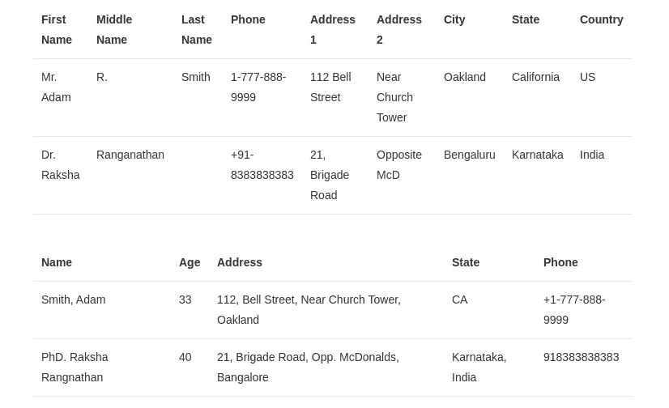

# 实体解析简介——需求与挑战

> 原文：<https://towardsdatascience.com/an-introduction-to-entity-resolution-needs-and-challenges-97fba052dde5?source=collection_archive---------2----------------------->

## 因为好的分析和数据科学始于正确的数据

# 介绍

实体解析是一种技术，用于识别单个数据源或多个数据源中引用同一现实实体的数据记录，并将这些记录链接在一起。在实体解析中，几乎相同但可能不完全相同的字符串在没有唯一标识符的情况下进行匹配。

真实世界的数据远非完美。各种组织经常面临各种人以自己的方式从不同的来源多次输入的大量客户数据。

这里有两种不同的客户规格。

在上述记录中，姓名或者分为名、中、姓、首字母，或者是组合在一起。名字有时与称呼混在一起，头衔不同，中间名不见了，电话号码写得不同，地址被拆分和组合，一个城市的新旧名字被记录为同一地址，使用缩写，标点符号不同，一些字段被省略。

当您阅读这些记录时，您会理解这两个数据源描述的是同一个人。但是，只知道相等或不相等的计算机会将这些数据值标记为相同吗？

为了理解数据，计算机需要识别引用同一个现实世界实体*的记录。这个识别谁是谁的过程——不考虑无数的表示——是实体解析或记录匹配。实体解析也称为模糊匹配、合并清除和数据匹配。当在人的上下文中使用时，实体解析被称为身份解析。当涉及单个数据源并且目的是删除重复条目时，模糊匹配被称为记录重复数据删除或重复数据删除。

公司服务提供商可以使用实体解析来解析组织名称，尽管存在不同的表示、拼写错误、缩写和印刷错误。

一家保险公司需要协调拼写差异、缩写、同义词和不同的词序来关联其数据。

金融和银行公司要求匹配不同的数字和百分比表示。

前导和尾随空格、连字符、大小写差异和点可以使任何两个地址看起来不同，而实际上它们并不不同。

此外，国际客户数据库可能包含不同语言的数据。总而言之，由于数据的非标准化，在同一实体的不同记录中，每个属性都可能以多种方式变化，数据库中充满了这些变化。

公司使用[实体解析](https://github.com/zinggAI/zingg)来连接不同的数据源以清理数据，查看多个数据仓库之间不明显的关系，并获得数据的统一视图。在这个过程中，他们可能通过组合来自各种来源的数据来构建主数据管理系统(MDM ),从而开发出单一的真实来源。

# 企业实体解析

我们都知道数据质量的 1-10-100 规则，而 [Gartner 将](https://www.data.com/export/sites/data/common/assets/pdf/DS_Gartner.pdf)规则描述为:在记录输入时验证一条记录需要 1 美元，清理和删除重复数据需要 10 美元，如果什么都不做，则需要 100 美元，因为错误的后果会反复出现。

实体解析是至关重要的，因为它匹配不相同的记录，尽管所有的数据不一致，而不需要不断制定规则。通过使用模糊匹配连接数据库，我们可以清理数据和分析信息。我们可以在统一的数据上绘制模式，得出结论，并看到更大的画面。

这种更干净、更精简、关联度更高的数据对于高效运营和防止欺诈也至关重要。最重要的是，我们以更低的运营成本获得了单一客户视图。

让我们来看一些不同的场景，在这些场景中，模糊数据匹配使组织能够提供个性化的客户体验，高效地推动营销工作，提高销售额，并保持合规性。

# 行业使用案例

## 生命科学和医疗保健

[《金融时报》援引麦肯锡全球研究所的一份报告称，通过更好地整合和分析从临床试验到医疗保险交易到智能跑鞋的所有数据，美国医疗体系每年可以节省 3000 亿美元——每个美国人 1000 美元。](https://www.ft.com/content/21a6e7d8-b479-11e3-a09a-00144feabdc0#axzz32CdBNqMs)

生命科学和医疗保健行业需要关于医疗保健组织和提供商、患者及其互动和治疗、医院、医生、实验室和产品的最新和最相关的数据，以便不仅清楚地了解这些相互依赖的利益相关方，而且在适当的时间在他们喜欢的平台上向他们提供统一和个性化的信息。

例如，一家制药公司可以使用模糊匹配来汇总从其所有地点配送的药物数据，以了解一年中每种药物的处方量和销售量。由于数据输入不同的系统，药品名称会有差异，模糊匹配将能够协调名称。该公司还可以使用其所有购买者(医院和诊所)的单一视图来查看谁需要新的供应品以及谁欠他们钱。

制药公司还必须整合全球实验室科学家的生物和医学研究数据，以进行研究和制造新药。模糊匹配在这里很方便，可以连接和匹配包含数百万行的数千个电子表格中的化合物和反应，所有这些电子表格都有不同的列名、格式和不一致性(如甘精胰岛素和甘精胰岛素)。

除了一般的研究和分析之外，医疗保健系统还需要对每位患者的医疗旅程有一个全面的了解(也许是一个 MDM 平台)。他们利用患者的这种实时 360°视图来提供个性化的智能医疗建议，改善患者体验以建立强大的客户关系，并创造更好的产品。干净和匹配的患者数据也可用于创建健康指标。实体解析支持整合来自各种数据源的患者数据，匹配来自医院和私人诊所、保险提供商和理赔、个人档案以及来自互联网和社交平台的数据，以创建每个患者的独特档案。

例如，医疗保健行业可以分析汇编的数据，以了解患者过去是否有任何过敏反应，或者上次适合患者的确切布洛芬混合物。使用这些数据，医疗保健提供者可以计算出统计数据，如定期心脏健康检查期间印度 55-60 岁年龄组男性的平均心率，并得出结论。

制药公司还在推出任何新产品之前，使用关联数据进行市场研究，进行竞争和定价分析。如果他们对市场没有一个统一的看法，产品发布要么失败，要么推迟。

生命科学和健康行业有着复杂的法规遵从性要求。如果一家公司未能遵守各种健康责任法案或消费者数据隐私法规中的任何一项，它可能会受到严厉处罚或被关闭。

以前，公司要花费前所未有的大量时间来汇总报告以提交给监管机构。但是，敏捷记录匹配可以连接和协调生命科学数据的各种大量流入，如来自医院、内部记录、第三方来源、离线媒体和社交媒体的数据，以确保永远符合法规要求。

## 保险

保险公司经常与碎片化的数据孤岛作斗争，因为不同的保单(汽车、健康、家庭等)维护着他们自己的个人记录。因此，它们无法协调客户的人口统计数据、偏好、过去的保险单和信用评级。

在缺乏对客户的整体看法的情况下，保险业缺乏对她理想的保险范围、风险暴露和其他分析的理解。个性化营销和交叉销售的机会也被错过了。

例如，如果保险提供商不知道申请健康保险的感兴趣的客户是该公司现有保险持有人的丈夫，他们将无法提供组合方案，并将在客户服务和/或这些客户的最佳回报上妥协。投保者可能不知道他们的选择，但公司应该能够告诉他们。在这种情况下，将所有内部数据与可能的潜在客户进行集成和匹配，可以提供特定地理位置的大量客户的统一视图。

实体解决方案是保险业以客户为中心的关键。如果保险管理人员对他们的潜在客户有统一的看法，他们可以为他们提供高度个性化的保险计划，从而轻松击败竞争对手。

欺诈检测是保险行业中模糊记录匹配的最大用例之一。如果保险公司不能识别出那些在过去犯有保险欺诈的人，而这些人现在申请了细节略有变化的高额保险计划，他们可能会遭受巨大的损失。

索赔管理、策略管理和法规遵从性也依赖于策略和法规数据的整合。

## 制造业

借助模糊数据匹配，制造商可以分析他们在大范围内的支出，优化供应商和原材料采购。这种分析将允许公司通过缩小支出差距、聘用最便宜的供应商并从他们那里采购来降低成本。库存分析有助于消除库存和配送中的盲点。

例如，如果一个制造单位已经有 100，000 个单位的过去库存，那么他们不需要生产更多的单位，直到收到新的订单。但是，如果他们来自中国的零部件供应链由于政治动荡而中断，那么他们需要迅速查看整合的供应商数据库，以确定下一个最便宜的供应商，并立即下订单。

对客户的统一看法将允许制造企业提供一致的客户体验，并交叉销售和追加销售他们的产品。交叉连接来自研究、过去的设计项目、竞争、制造质量、故障和维护报告的数据也可以为卓越的质量铺平道路。

实体解析还允许合并产品目录和价目表。多个条目，因此，同一产品的不同定价会在任何公司引起混乱。协调定价对于向每位买家展示一致和正确的产品信息至关重要。

## 金融服务

由于金融服务的高风险性，如果客户经理的服务质量差或态度不认真，金融服务可能会失去很多客户。不连续和不干净的数据也可能使企业面临不必要的风险。

支持统一投资组合准备和审计的单一客户数据源对于每个金融公司的顺利运营和成功至关重要。例如，不同关系经理为同一客户输入的不同客户数据(姓名、电话号码、地址等的拼写错误)必须使用实体解析进行汇总和清理，以获得客户的整体视图。

只有统一的客户观才能使金融公司提供良好的客户服务，这将导致更高的客户保留率，从而带来更高的投资组合价值。如果你和一家投资银行有值得信赖的关系，你会希望他们将你每年的储蓄持续投资，而不是寻找新的金融服务。

关联客户数据对于建立个人信用评级和财务稳定性也至关重要。这些评级可用于在发放贷款、移交信贷和检测欺诈活动方面做出明智的决策。模糊数据匹配用于将 KYC 数据与客户投资联系起来。KYC 信息连同信用评级可以证明是非常有助于检测和避免债务欺诈。

[麦肯锡关于反洗钱的一篇文章指出](https://www.mckinsey.com/business-functions/risk/our-insights/the-new-frontier-in-anti-money-laundering)“在美国，主要银行的反洗钱(AML)合规人员在过去五年左右的时间里增加了十倍。”文章强调，模糊逻辑(众多工具之一)可以让银行验证更多的客户身份，并映射特定客户与高风险个人和法律实体之间的联系。

## 能源、石油和采矿

全球能源、采矿和石油公司需要清理、分类、统一和理解来自各种来源、地理位置和工程角度的不同数据，以降低运营成本并平稳运营。这些公司需要对零件和材料进行分类，了解他们把钱花在哪里，并发现更好更便宜的机械供应商。

能源组织需要统一的数据，这不仅是为了降低成本，也是为了保持合规性并高效准确地报告。模糊匹配帮助这些公司整合他们的数据，并为他们提供一个强大的数据管理平台，可以提供上述所有功能。

随着用例列表变得越来越长，模糊记录匹配有着无尽的好处这一认识令人欣喜。

我们没有将两个记录理解为一个实体，这可能会破坏主数据。关系和模式会被错过。聚合和计算没有任何意义。关键信息将会被搁置。关键的决定会失控。生活、国家、组织和社区的方方面面都可能受到威胁。

在所有情况下，我们可以通过链接记录来了解情况，并可以跟踪从人到疾病到新计划的任何事情。整合不同行业的数据仓库具有指数级的价值。

# 功能用例

## 销售和营销

向客户提供的建议和有效的营销方案无法基于不同的数据孤岛进行预测。

如果在整合中没有查看买家数据，大多数营销工作都会白费，因为外联计划和客户互动不会个性化，购物者不会购买。在缺乏有用的客户体验的情况下，公司会因为糟糕的客户服务而被抛弃，从而输给竞争对手。

通常，由于客户姓名的不同拼写或电话号码的键入错误，客户在两个不同的商店数据库中被多次列出不同的购买记录。来自该公司的重复电子邮件只会错失销售机会，或者更糟的是，可能会导致客户将该公司的营销电子邮件标记为垃圾邮件。

CRM 中的客户重复数据删除是实体解析非常有效的另一个领域。由于不同销售人员的不同条目，或者从多个渠道获得的潜在客户名单，客户关系管理系统通常具有同一客户的多个条目。在外展过程中，多次联系同一个销售线索是一种浪费，因为这会导致糟糕的品牌体验和接受者的不适。宝贵的销售周期也被浪费了，因为不止一个销售人员在联系同一个人。通过记录匹配进行的客户重复数据删除确实有助于销售和营销的卓越运营。

在另一个场景中，汽车供应商需要通过网站和移动应用程序来协调所有线索，以消除重复的线索，然后专注于紧凑列表。

例如，如果一位顾客退回一件产品，但第二天又买了一件更大的，公司会发送以下信息:

方案一:你退了产品，买了一个更大的。请放心，我们会尽快把它寄给你。

选项 2:您刚刚退回了一件产品。再来这里购物。

信息 2 对客户来说是多余的。在这种情况下，退货详情必须首先与客户档案进行核对。

在所有场景中，在进行任何营销之前，必须通过实体解析来统一客户数据。

通过模糊匹配和统一来自不同内部和外部数据仓库(如网上商店、移动应用程序、线下商店、忠诚度计划和个人资料)的客户数据，企业可以创建一个 360 度的客户视图，并通过为每个客户提供独特的个性化体验，将营销工作提升到一个新的水平。

360 度客户视角也是了解交叉销售和追加销售产品和服务机会的非常有效的工具。现在，以低得多的客户获取成本增加客户终身价值将成为可能。

如果顾客在商店买了一件大衣，这些离线信息可以用来给她发送冬季服装的折扣代码。不管接触点是什么，对客户来说都是同一个品牌。

这种客户统一可以通过更新和匹配来自客户独特旅程之上的所有来源的实时客户交互数据来实现。

所有数据驱动和面向客户的企业，如酒店、医疗服务提供商、保险公司、零售品牌、汽车公司，都将从这种个性化营销方法中受益匪浅。[根据麦肯锡](https://www.mckinsey.com/business-functions/marketing-and-sales/our-insights/what-matters-in-customer-experience-cx-transformations)的说法，以客户为中心的思维模式的根本改变，以及运营和 IT 方面的改进，可以使客户满意度提高 20%到 30%。

通过将各种营销计划和最终的销售联系起来，公司可以了解带来最高投资回报率的广告渠道和形式。买家行为也可以用来修改营销活动和预算。

## 供应链

准确、互联的供应商数据对于保持敏捷的供应链至关重要。在缺乏供应商统一的情况下，供应链的竞争力将会下降，大量的资金将会花在应对供应和库存问题上。

匹配供应商并建立统一的供应商档案并不容易。除了体积复杂之外，描述中的变化可能是巨大的，名称可能会被拼错或以不同的方式表示。每个季度都会有不同描述的新采购。

实体解析通过整合分布在各种业务单位、地区、地理位置以及零件和材料类别的数据仓库中的供应商数据来维护一个强健的供应链。

供应商匹配还将使公司能够了解跨部门的定价，轻松找到给定产品的最佳供应商，协商价格，更快地加入新供应商，消除重复供应商，并管理与供应商地理位置相关的风险。

假设一家 CPG 公司想要比较两家类似产品的供应商，以确定谁以更低的价格销售了大部分产品。两家厂商会用不同的方式表达产品名称。一个卖主可能称这种产品为薄纸，另一个卖主可能称它为纸手帕、薄纸或卫生纸。

由于产品名称不会完全匹配，实体解析用于协调产品，比较它们的价格，并决定哪个供应商卖得更便宜。实体解决方案还将阻止再次注册的欺诈性卖家，他们的详细信息略有变化。

# 挑战

比较来自不提供任何唯一标识符的不同数据源的充满非标准和不一致数据的大数据记录是一个复杂的问题。

计算机可以评估等式并进行数学比较，但无法自行理解模糊匹配。尽管人们可能会把记录中的两个人——卡玛拉·哈里斯夫人和哈里斯·卡玛拉——称为同一个名字，但一个编程系统却不知道该怎么办。

不同的用户、技术系统、地理位置、地区、年份和组织可以用不同的格式表示相同的数据。记录在打字错误、称呼、空格、缩写、语言、拼写、完成、省略、语音、顺序、后缀、前缀等方面有所不同(如上所示)。数据输入中的错误会导致一个实体的多个记录，即使是在一个源中。

考虑到表现形式的变化，相同数据的排列和组合的数量是空前的。根据各个实体的类型，名称匹配、地址匹配、位置匹配、供应商匹配、产品匹配都具有独特的匹配标准。

数据管理系统应该理解所有标准，并匹配各种记录来代表一个客户或产品或销售商或供应商。姓名、地址、位置、零件、产品、电话号码、日期匹配对于协调来自不同仓库的数据至关重要。

我们谈论的是大量的数据。庞大的数据量加上丰富的格式使得匹配成为一项艰巨的任务。微调任何算法以适应每种实体类型、记录类型和值将是一项艰巨的工作。

传统的数据管理方法无法在实际的时间范围内处理这些不同的数据。

为了理解数据匹配解决方案的复杂性，让我们更仔细地分析基于规则的匹配。为了匹配同一实体的任意两个记录，将定义各种基于字符串的比较规则。每个记录将与所有这些规则上的其他记录一起运行，以推断这两个记录是否相同。

这里只是这种基于规则的匹配的一些限制。

## 完全

考虑到一个属性的单个数据值的不可预测的变化数量，为一个字段定义匹配规则并不容易，需要对数据配置文件有深刻的理解。你能涵盖阿尔茨海默氏症的所有拼写或所有不同的细长纤维的描述吗？例如，在我们写这篇文章并研究汽车行业的模糊匹配之前，我们不知道底盘是指车架。那就忘了同义词相等规则吧。

设置匹配规则是一个麻烦、昂贵且冗长的过程。

## 复杂性

除了定义规则之外，组合记录的不同属性的匹配规则将更具挑战性。如果街道 1 和街道 2 看起来相似，但电话号码不匹配或不相交，记录应该相同吗？

## 维护

必须定义大量的规则来涵盖各种各样的数据表示。但规则仍会被遗漏，角落案件会不了了之。

更新规则并使其适应不断变化的数据也很棘手。随着数据源数量的增加，格式和数据类型随着数据量的增长而增长，定义规则变得越来越复杂。

无论您创建多少规则，一组固定的规则都无法处理所有前所未有的数据变化，这使得基于规则的匹配非常难以实施和维护，并且成本高昂。

## 规模

由于大多数实体缺少可以比较的唯一键，所以每条记录都以强力方式与其他记录匹配。对于 n 个记录，存在 n*(n-1)/2 个唯一对。为了建立平等，每一个规则将在每一对上运行。

当记录数增加 10 倍时，比较次数增加 100 倍。因此，随着记录数量的增长，比较的次数会呈指数增长。因此，即使我们假设最快的比较技术，比较的时间也是指数级的。

基于规则的数据匹配是一种计算上具有挑战性且不可扩展的解决方案。运行这些规则的时间也将立即呈指数增长。

## 精确

即使在推导出匹配逻辑之后，区分匹配和不匹配的最佳匹配阈值是什么？由于规则的性质，许多误报和漏报肯定会出现在结果中。

## 回忆

你在匹配标准中犯了一个错误，整个数据匹配将被连根拔起。许多真正的积极因素可能会被遗漏。理解属性和记录为什么可以说是相同的是一个游戏改变者。

## 其他挑战

除了基于规则的集成解决方案的复杂性之外，这里还有更多适用于所有数据匹配解决方案的复杂性，这说明了为什么匹配是最难解决的问题之一，

**变量数据存储器**

数据将保存在各种数据存储中，如关系数据库、NoSQL 数据存储、云存储和本地文件系统。不同的数据库意味着数据会以不同的格式出现——文本、专有、JSON、XML、CSV、Parquet、Avro 等等。

**数据源中的模式变化**

实体表示通常因系统而异。属性的数量可以不同，它们的表示也可以有很大的不同。一个数据系统中的地址属性可以在另一个数据系统中分为地址 1 和地址 2。或者，即使是相同的属性，列的命名也可能不同。例如，可以写街道 1 和街道 2，而不是地址 1 和地址 2。价格可以写成 MRP 或销售价格。对齐各种模式是一项具有挑战性的任务。

*实体定义:正如我们所知，实体是一种独特的东西——一个人、一家企业、一种产品、一个供应商、一种药物、一个组织。每个实体都有其描述属性，如名称、地址、日期、颜色、形状、价格、年龄、网站、品牌、型号、容量等。

实体解析是匹配不一致数据的一种很好的技术，但它也带来了挑战。我们最近开源了一个基于 Spark 的工具 [Zingg](https://github.com/zinggAI/zingg) ，通过使用机器学习来解决实体解析。如果您需要帮助来协调您组织的数据，请务必查看。