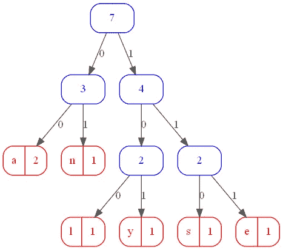
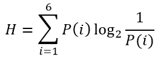
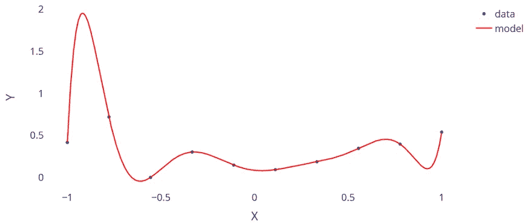
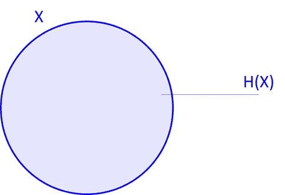
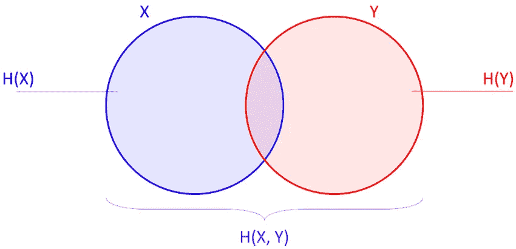
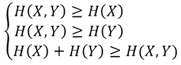
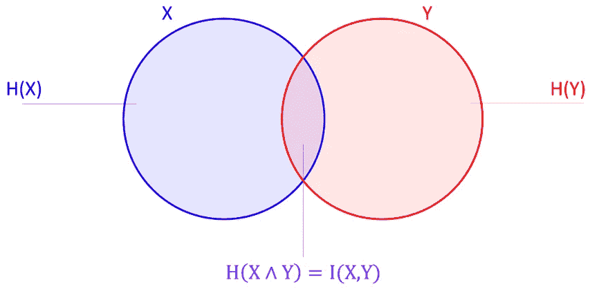
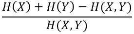
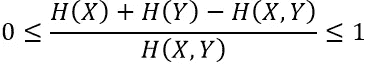
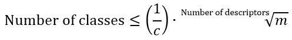

# 数据科学信息论导论

> 原文：<https://towardsdatascience.com/an-introduction-to-information-theory-for-data-science-4fcbb4d40878?source=collection_archive---------11----------------------->

## [思想和理论](https://towardsdatascience.com/tagged/thoughts-and-theory)，[机器学习](https://medium.com/analytics-vidhya/machine-learning/home)

## 定义一般相关性度量的第一步

*本文旨在信息论框架内简要介绍信息量的概念，并概述这一概念在数据分析领域的可能用途。从这些简单的元素中，我想到了本文*<https://medium.com/analytics-vidhya/how-to-measure-the-non-linear-correlation-between-multiple-variables-804d896760b8>**中提出的多元非线性相关性度量。**

# *代表信息可变性*

## *信息量代表描述任何情况所需的最少字数*

*信息论在很大程度上是基于克劳德·香农在 20 世纪 40 年代末发表的著作(参见文章*一种通信的数学理论*，发表于 1948 年的*贝尔系统技术杂志*，以及次年发表的 [*《通信的数学理论*](https://www.amazon.com/Mathematical-Theory-Communication-Claude-Shannon-dp-0252725484/dp/0252725484/) )。*

*它的主要目标是提供工具来改善电信系统中的信号传输。这意味着对信息的含义有一个特殊的定义，尽管如此，在数据分析等领域，这个定义还是很丰富的，乍看之下，它与电信系统中的信号编码技术没有什么关系:一条消息中包含的信息被定义为编写该消息所需的最少比特数。*

## *哈夫曼树的实用方法*

*为了更清楚地理解这个定义，让我们假设我想用特定的编码来写单词“analyse ”,以便将每个字母翻译成 0 和 1 的序列。*

*我可以选择任何编码，比如这个:*

```
 *╔════════╦══════════╗
                         ║ Letter ║ Encoding ║
                         ╠════════╬══════════╣
                         ║   a    ║    111   ║
                         ║   n    ║    110   ║
                         ║   l    ║    101   ║
                         ║   y    ║    100   ║
                         ║   s    ║     01   ║
                         ║   e    ║     00   ║
                         ╚════════╩══════════╝*
```

*因此，单词“分析”将被写成:111–110–111–101–100–01–00(我写破折号只是为了简化阅读，当计算机编写或解密消息时，它们不存在)。因此，这个词是用 19 位编码的:“分析”这个词包含的信息量最多等于 19。*

*然而，字母“a”的出现频率高于其他字母，这意味着如果该字母例如由 01 编码，而字母“s”由 111 编码，那么该单词的编码将只需要 18 位。这使得我们可以确认“分析”一词所包含的信息量最多等于 18。*

*为了定义简约编码，这意味着用最少的比特数对文本进行编码，可以使用霍夫曼码，基于这样的想法，即最好用短的二进制数对频繁符号进行编码，并且仅对最不频繁的符号使用最长的二进制数。*

*霍夫曼码可以用霍夫曼树来定义(这里我不详细介绍)。对于单词“分析”,可能的树是:*

**

*单词“分析”的霍夫曼树(图片由作者提供)*

*该树提供了以下代码:*

```
 *╔════════╦══════════╗
                         ║ Letter ║ Encoding ║
                         ╠════════╬══════════╣
                         ║   a    ║     00   ║
                         ║   n    ║     01   ║
                         ║   l    ║    100   ║
                         ║   y    ║    101   ║
                         ║   s    ║    110   ║
                         ║   e    ║    111   ║
                         ╚════════╩══════════╝*
```

*我们最终得到了“分析”这个词的二进制编码:00–01–00–100–101–110–111。*

*单词“分析”再次由 18 位编码。这个位数是对单词“分析”进行编码所需的最少位数吗？一般来说，给定任何消息，有人能容易地确定消息中包含的信息量吗？克劳德·香农给出了这些问题的答案。*

## *香农熵的理论方法*

*如果我们注意到 P(1)字母“a”在单词“analyse”中出现的频率，P(2)字母“n”出现的频率，等等。，那么 Claude Shannon 告诉我们，对单词“analyse”的每个字母进行编码平均所需的最少位数是:*

**

*熵的定义(作者图片)*

*他把这个量命名为“熵”。对于“分析”这个词，我们得到数量 2.5。*

*由于这代表了对单词“analyse”的每个字母进行编码所绝对需要的平均位数，所以这个数量必须乘以单词中的字母数，最终得到 17.5。*

*因此，对该字进行编码所需的最小位数是 18 位，因为只能使用整数位，而数字 17.5 被解释为包含在“分析”字中的信息量。*

*从现在开始，我将把重点放在熵上，也就是说每个字母编码所需的平均比特数。事实上，这赋予了消息(或数据)内在的“可变性”，而不管其长度(或数据量)。*

*“可变性”的概念对于研究变量之间的相关性是至关重要的，因为研究相关性是关于研究变量如何相对于彼此变化。例如，在气象学中，如果一个人注意到在地球的一部分，当温度上升时降水量增加，那么这两个变量是相关的，不管记录温度和降水量的天数是多少。*

## *为什么不考虑方差而不是检查香农的熵呢？*

*因此，熵表征了集合的“可变性”:元素的集合越多样化，这个集合的熵就变得越重要。然而，在统计学领域，集合的可变性可以由集合中元素之间的方差来表示。为什么我们不满足于方差，而使用熵呢？*

## *方差要求对数据进行推测*

*方差虽然众所周知并且非常有用，但它需要对所研究的数据做出许多假设。*

*首先，方差只能对数值型数据进行计算。*

*另一方面，方差的确定是基于均值的估计:*

*Var(X) = E[(X - E[X]) ]*

*当数据是数字的并且有足够数量时，这并不构成问题:通常的均值和方差估计量给出非常精确的结果。*

*然而，最终目的不是确定不同变量的方差，而是确定几个变量之间的相关性。因此，我们必须计算一个变量的方差，假设另一个是已知的:*

*Var(Y|X) = E[(Y|X - E[Y|X]) ]*

*在这种情况下，如果我不假设变量 X 和 Y 之间的关系，方差的任何估计都是可能的。事实上，如果我拒绝做出任何假设，对我来说，考虑一个从可用数据中过拟合的足够程度的多项式模型就足够了，因此当 X 的实现已知时，断言 Y 的方差为零。*

**

*“完美”的模型总是可以找到的(图片由作者提供)*

*所以，要计算两个变量之间的皮尔逊相关，我们假设 X 和 Y 的关系是线性的，除了测量误差；在所有可能的方差中，我们选择最小方差。由于这个原因，皮尔逊相关是线性相关，并且通过普通最小二乘法与线性回归有内在联系，该方法包括最小化:*

*Var(Y|X) = E[(Y|X - E[Y|X]) ]*

*假设:*

*E[Y|X = x] = αX+β*

## *熵不需要假设，以数据离散化为代价*

*与方差不同，熵不能从数值数据中计算，而是需要分类数据。*

*一个集合中的类别越多，这些类别被发现的可能性越大，熵就越大。因此，熵度量的是可变性，即数据集中数据的“内在无序”，而不对数据应该如何组织做出任何假设。*

*因此，熵使得克服关于数据之间关系的假设成为可能，特别是线性假设，但是以离散化信息为代价。在考虑数字数据时，试图定义一个不是基于任何假设的相关性在任何情况下都是注定要失败的。事实上，如果我拒绝对变量之间的关系做出任何假设，这意味着我没有限制潜在模型的复杂性。因此，我总是能够找到一个模型，将完美地插值数据，这将允许我说，两个变量之间的相关性总是完美的。这当然是过度拟合的情况:因此，必须通过表达假设(如线性假设)或通过离散化数据来防止过度拟合，从而限制基础模型的复杂性。*

*最后，应该注意，任何多样性指数都可以替代熵，因为它们具有对于非线性相关性的定义至关重要的相同性质。*

# *量化两个变量之间的互信息*

*第一部分的考虑，尤其是方差和熵之间的比较，值得更详细地解释。从今以后，我认为我们正在研究两个变量 X 和 y 之间的关系。我们如何测量这两个变量之间的相互信息，或者说得不那么细致，一个可以在多大程度上预测另一个？*

*为了避免皮尔逊线性相关性和非线性相关性之间的任何混淆，我将讨论线性情况下的相关性，以及非线性情况下两个变量之间的互信息。*

*然而，在我们研究互信息的理论方面之前，让我们看看熵如何帮助我们比较不同的变量。*

## *信息论和集合论*

*香农的信息测度和集合论之间存在联系，集合论以一种非常实用的方式允许我们使用集合论进行推理，并利用维恩图来直观地表示公式。*

## *理论辩护*

*我在这里不提出信息论和集合论之间联系的理论依据。有兴趣的读者可以参考 Raymond T. Weung 的《信息论初级教程 第六章 [*。*](https://www.amazon.com/First-Course-Information-Theory-Technology-dp-0306467917/dp/0306467917/)*

## *公式的可视化*

*通过考察信息论和集合论之间的联系，我们可以得出结论:用文氏图直观地表示信息论公式是可能的。在这样的图中，每个圆盘代表一个变量的“可变性”，而“可变性”的度量就是香农熵。因此，我使圆盘 X 的面积等于相关的熵 H(X)。*

**

*单个随机变量的熵(图片由作者提供)*

*多元熵 H(X，Y)被定义为变量 Z=(X，Y)的熵。在图形术语中，H(X，Y)是 X 和 Y 圆盘并集的面积。*

**

*两个随机变量的联合熵(图片由作者提供)*

*因此，图表显示:*

**

*联合熵不等式(图片由作者提供)*

*两个变量共有的“可变性”是两个变量圆盘的重叠表面:这个交集的面积是两个变量之间的互信息。换句话说，X 和 Y 之间的互信息 I(X，Y)由圆盘 X 和 Y 之间的相交面积表示，并对应于 X 和 Y 之间“共享”的熵。*

**

*两个随机变量之间的互信息(图片由作者提供)*

*当变量 X 和 Y 完全相关时，那么两个圆盘 X 和 Y 完全重叠，因此 H(X，Y)=H(X)=H(Y)。相反，当 X 和 Y 没有任何共同点时(变量之间没有相关性的情况)，则盘 X 和 Y 不相交，H(X，Y)=H(X)+H(Y)。*

## *互信息的定义*

*考虑到数据分析的实际应用，现在有可能以简化的方式介绍 Claude Shannon 的互信息定义。*

*在离散变量 X 和 Y 的情况下，两个变量之间的归一化互信息的度量可以定义为:*

**

*两个变量的归一化互信息(图片由作者提供)*

*这种互信息的标准化度量假定值在 0 和 1 之间。事实上，从前面的公式可以推断出:*

**

*归一化互信息的界限(图片由作者提供)*

*当变量 X 和 Y 完全“相关”时，则 H(X，Y)=H(X)=H(Y)，因此标准化互信息值为 1。相反，当 X 和 Y 没有共同点时，则 H(X，Y)=H(X)+H(Y)并且互信息因此也为零。*

## *连续变量的情况*

*对于连续的 X 和 Y 变量，我们必须:*

*   *将变量离散化，以便能够应用前面的部分公式(或类似的公式)*
*   *或者使用一种形式的微分熵(例如 Kullback-Leibler 散度——一种非对称互信息的度量),它假设我们知道随机变量 X 和 y 的概率分布。*

*当变量 X 和 Y 的概率分布已知时，第二种方法可以给出 X 和 Y 之间的互信息的精确测量。为此，Kullback-Leibler 散度可以被视为一种定义互信息的精确测量的方法，而无需离散化变量。事实上，这是一个比较与变量相关的分布的问题，可能是连续的。*

*然而，在实践中，变量的分布往往不是一眼就能看出来的。估计它们迫使我们要么对分布的形状作出假设，要么通过创建直方图来离散化变量，这些直方图随着观察次数的增加，最终与未知分布的形状相匹配。因此，最后一种方法相当于离散化数据的行为，因为从直方图估计分布相当于采用数据的离散化视图。*

*概括地说，要计算任何类型的“相关性”，要么对所研究的变量之间的关系做出假设，要么将数据离散化，这一点似乎至关重要。*

# *线性相关的相似性*

*归一化互信息非常类似于皮尔逊相关。一个显著的区别是皮尔逊相关性在-1 和 1 之间，而归一化互信息在 0 和 1 之间。这是因为在两个变量之间存在线性关系的情况下，它们可以以两种方式相关，并且只有两种方式:正相关或负相关。然而，在变量之间有任何关系的情况下，它们之间有无数种相互关联的方式。因此，归一化互信息应该主要与皮尔逊相关的绝对值进行比较。*

## *皮尔逊相关的几个性质*

*类似于标准化的互信息，皮尔逊的绝对值总是在 0 和 1 之间，并且当 X 和 Y 独立时，它们之间的相关性为零。*

*相比之下，如果 Y=αX+β(完全线性相关)，那么皮尔逊相关等于 sgn(α)。因此，根据α是正还是负，相关等于 1 或-1。*

## *学习所需的数据量*

*我说过，为了测量几个变量之间的非线性“相关性”，数据科学家面临着一个两难的境地:要么对变量之间的关系做出假设，要么对数据进行离散化。*

*实际上，这两种可能性是等价的。事实上，对于任何对学习理论感兴趣的人来说(Vapnik-Chervonenkis 理论或 PAC-Bayesian 理论——“PAC”的意思是“可能大致正确”)，很明显有四个方面是相关联的:*

*   *可供学习的数据量*
*   *研究空间中的数据分布(数据是集中在一起，还是非常分散？换句话说，数据方差是多少？)*
*   *用于表达变量之间关系的模型的复杂性(模型是线性模型还是 10 次多项式？)*
*   *模型的泛化误差。*

*我们拥有的数据越少，我们就越被迫局限于简单的模型，以便能够合理地希望模型在一般情况下给出令人满意的结果:这就是为什么当只有两个点可用时，使用线性模型是无用的。*

*当考虑到大量变量时，这种情况更为明显，这就是所谓的“维数灾难”。*

*通过使用大量的类来离散化数据，我们允许计算机观察变量之间非常复杂的关系。这相当于考虑非常复杂的模型:互信息的测量因此可能是极好的，但是泛化误差将很可能非常大。相反，通过只使用几个类，计算机只能考虑它们之间的基本关系:因此，互信息分数会降低，另一方面，泛化误差通常会更低。*

*因此，进行离散化的方式直接关系到可用的观察值的数量和问题的维数。在一般情况下，数据科学家可以多次这样做:例如，他可以在训练数据上建立决策树，然后检查验证数据，泛化错误似乎是合理的。如果在验证样本上获得的结果不令人满意，数据科学家可以在这种情况下考虑新的模型，并重复他的工作，直到他获得适当的结果(同时注意不要过度拟合验证样本本身)。*

*不幸的是，这种方法在目前的情况下毫无意义，因为我们要寻找几个变量之间“相关性”的度量。让我们想象一位数据科学家，在发现两个变量之间的高度“相关性”后，决定建立将它们绑定在一起的线性关系。然后，他注意到，即使在训练样本上，这种线性关系也是不存在的(例如，学习样本上的线性回归呈现 5%的 R):最初使用的“相关性”将是非常无用的(这同样适用于任何降低问题维度的尝试，例如主成分分析基于变量之间相关性的测量)。*

*如果我们不谨慎的话，在线性相关情况下不可能发生的事情很可能在互信息测量的情况下发生。特别是，能够定义“良好的离散化”仍然是必不可少的。然而这是一块绊脚石。关于这个主题的文献浩如烟海，结果有时非常复杂，据我所知，没有完美的解决方案(至少目前是这样)。*

*因此，我在这里只提出一些实际实现互信息测量的经验法则。假设我们试图测量一组称为描述符的变量所提供的信息，以描述称为目标变量的其他变量。*

*第一条规则是，目标变量必须根据实际情况的需要和需要进行离散化。例如，如果目标变量由以摄氏度为单位的温度数据组成，并且如果对于用例来说区分“低”、“中”和“高”温度是必要且充分的，那么将目标变量离散成三个相应的类别是必要且充分的。目标变量的类的数量越多(对于描述符以相反的方式工作)，过度拟合(即，不适当地获得高互信息分数)减少得越多；尽管如此，要求超过必要的水平会产生为利息问题获得人为的低互信息分数的风险(除非你有非常大量的数据)。*

*第二个规则是，描述符必须根据不同的分位数进行离散化，以使类别尽可能平衡。为了确定要考虑哪些分位数，我假设每个描述符的类数量对应于以下公式的一个不等式:*

**

*离散化的经验法则(图片由作者提供)*

*在这个等式中，m 是可用数据项的数量。为了确定 c，让我们假设我们必须回答以下问题:如果我想在两个变量 X 和 Y 之间建立可能的线性关系，我可以从训练样本的多少最小数据量允许自己执行线性回归(希望泛化误差将“非常可能足够接近”学习误差)？这个量等于 c。*

*假设上一个问题的答案是 c = 7。假设我们试图预测 Z 是 X 和 Y 的函数(因此描述符的数量是 2)，并假设我们有 500 个数据项。因此，变量 X 和 Y 中每一个的最大类别数将是:*

*(1/7) ∙ √500 ≃ 3,20.*

*因此，我们可以使用中位数(将数据分为两类)或三分位数(创建三类)来离散化 X。对于 y 也是一样。*

*在一些变量(描述符或目标变量)已经是离散的情况下，为了满足前面的要求，一些类最终必须被合并。*

*正确量化两个变量 X 和 Y 之间的线性关系所需的最小数据量并不明显，我将在以后的文章中详细介绍一种可能的方法。*

# *结论*

*简而言之，信息论是一个特别广泛的理论，超出了电信应用的范围，可以方便地用于数据分析。它通常用于构建某些决策树，但据我所知，只考虑了单变量的影响。然而，从这里提出的基本考虑，有可能制定一个多元非线性相关定义，这是我上一篇文章的主题。然而，当从线性相关性转移到非线性相关性时，复杂性出现了，因为被认为是潜在模型的函数的复杂性不再是有限的，于是话题转向了学习理论。*