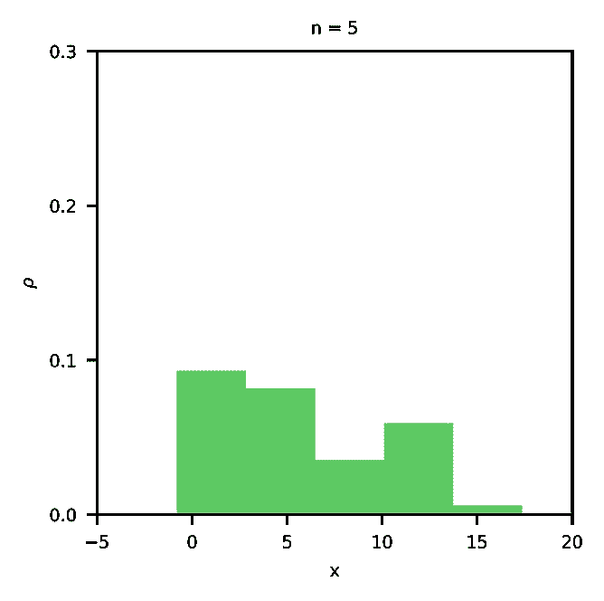
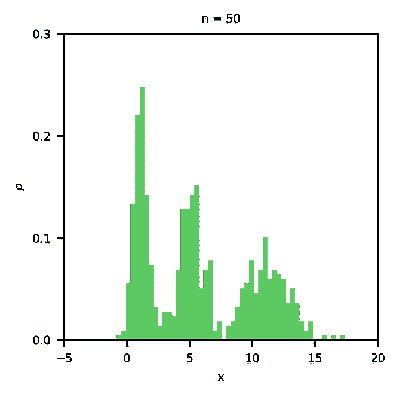
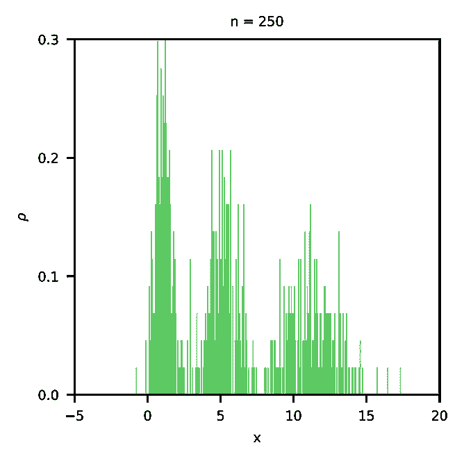
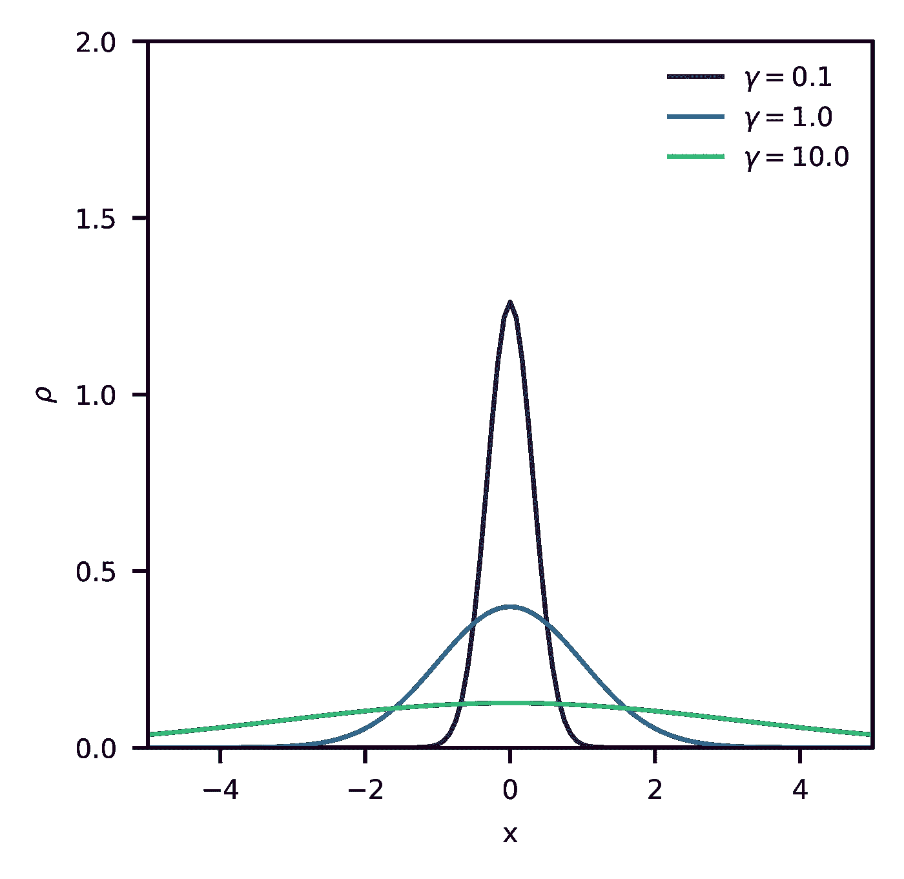
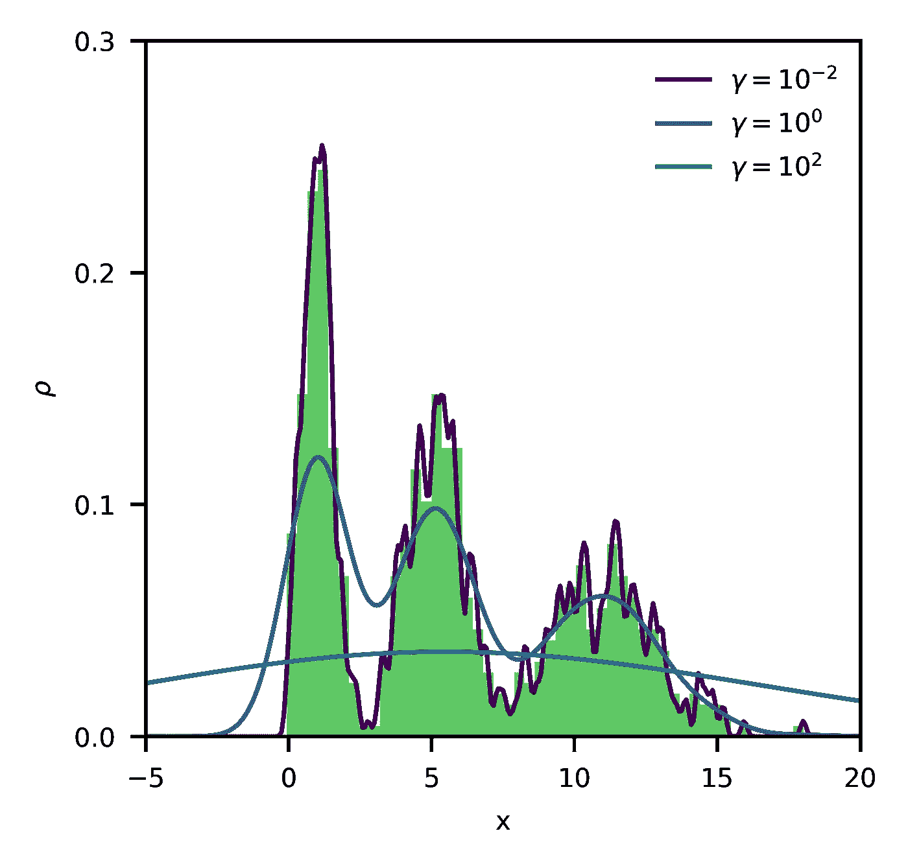
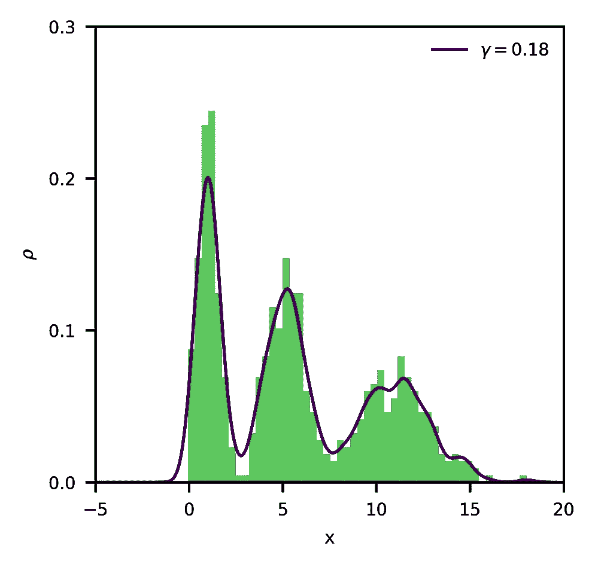
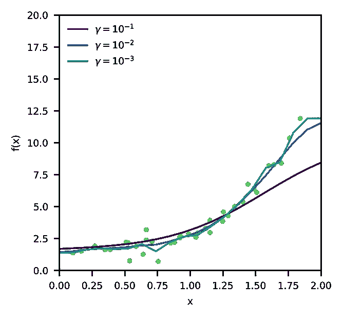
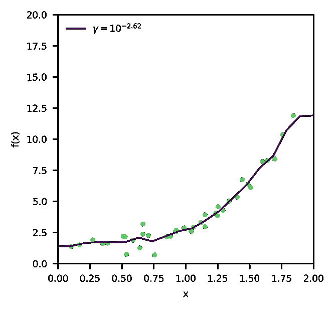

# 内核方法介绍

> 原文：<https://towardsdatascience.com/an-introduction-to-kernel-methods-9c16fc8fefd2?source=collection_archive---------25----------------------->

## 从核密度估计到非参数回归。

斯科特·韦伯在 [Unsplash](https://unsplash.com?utm_source=medium&utm_medium=referral) 上拍摄的照片

# 介绍

**统计**和**机器学习**中的许多技术都源自“从某种概率分布中抽取数据”的概念。**概率分布**本身是数据点可能性(或者频率，如果你愿意的话)的模型，即观察到某个值、结果等的可能性有多大。基于这种想法的方法(或算法)被称为**参数化**，因为它们是由底层分布(如高斯分布)的参数指定的。

然而，假设的可能性模型可能不真实；“真实的”分布可能是偏斜的，具有不同成分的多模态，等等。一般来说，这对于分析数据的科学家来说是未知的。为了克服参数模型的局限性，一类基于所谓的 [**内核**](https://en.wikipedia.org/wiki/Kernel_(statistics)) 的**非参数**方法被并行开发。这篇文章旨在展示内核背后的基本思想以及它们在统计学和机器学习中的应用。

# 核密度估计

当估计某个变量 *x* 的概率分布时，会出现第一个问题。为了获得分布的第一印象，绘制了具有不同**仓宽**的三个**直方图**(图 1)。

**图 1:** 不同仓宽下 x 的经验分布。(来源:作者)

根据仓宽的不同，关于底层分布的结论完全不同；它可以是均匀的，也可以是具有三种或更多模式的多模式。因此，不清楚使用哪个概率分布来估计相应的参数(如均值和方差)。注意，每一次观察都将 *ρ* 的一些“量”添加到它所在的仓中。因此，上面的图可以通过在 *x* 的不同水平的个人贡献的总和来构建。假设样本是独立同分布的。因此，我们所能做的就是将概率分布表示为数据点 *xᵢ* 周围的“小密度”的叠加，即所谓的 [**核密度**](https://en.wikipedia.org/wiki/Kernel_density_estimation) (通过观察量归一化)。因此，*p(x)= 1/nσk(x，xᵢ)* ，以 *K(x，y)* 为内核。

核密度函数。

一个可能的内核是 [**高斯内核**](https://en.wikipedia.org/wiki/Radial_basis_function_kernel)；高斯核的公式如下所示。它本质上是一个以 xᵢ为中心的概率分布。

高斯核函数。

**图 2:** 高斯核对于 *γ* 有不同的取值。(来源:作者)

高斯核由一个**超参数** *γ* (图 2)进行参数化，该参数作为方差并确定点 *xᵢ* 周围的密度“浓度”。还有其他可用的核(均匀核、抛物线核、余弦核等)。)，但是现在使用这个就足够了。

形式上，内核是一个具有两个输入 *x* 和 *y* 的非负函数。对内核 *K(x，y)* 的要求是

*   它是对称的，即 *K(x，y) = K(y，x)* ，
*   半正定的，即具有成对评估的有限矩阵应该没有负特征值，
*   它应该整合成一个。

**图 3:** 不同 *γ值的概率密度。*(来源:作者)

出现的一个问题是 *γ* 的选择，其值必须是固定的。根据 *γ* 的值，密度可能看起来非常不同(图 3)，就像图 1 中的面元宽度一样。对于太大的值，模型过于简单，重要信息丢失(拟合不足)，而对于太小的值，情况正好相反(拟合过度)。这里的主要问题是“小”样本量，因为通常估计量是 [**一致的**](https://en.wikipedia.org/wiki/Consistency_(statistics)) 并且收敛于无限多个样本的极限中的真实密度。虽然有选择 *γ* 的经验公式，但最简单的方法是进行 [**交叉验证**](https://en.wikipedia.org/wiki/Cross-validation_(statistics)) 寻找其最优值。

核密度估计的交叉验证。

更准确地说，使验证集中的数据概率最大化的值 *γ* 被认为是最优的。图 4 显示了作为 *γ* 的函数的负对数似然性，以及具有最佳参数的密度，这似乎非常符合。

**图 4:** 负对数似然和核密度，以及 *γ的最佳值。*(来源:作者)

# 非参数回归

因为回归和分类问题可以从概率分布中导出，所以核也可以用于执行回归和分类。一条回归线是条件分布 *p(y|x)* 的期望 *E* ，即*f(x)= E【p(y | x)】*。而且认为 *p(y|x) = p(x，y)/p(x)* 。于是， *E[p(y|x)] =* *∫ y[p(x，y)/p(x)]dy* 。

这产生了 *f(x)* 的以下表示，称为 [Nadaraya-Watson 核估计器](https://en.wikipedia.org/wiki/Kernel_regression)。

非参数回归函数。

预测可以被视为加权平均，而权重是训练数据中的样本到新点的相对位置。因此，核充当相似性度量。此外，出现与上述相同的问题，因为超参数 *γ* 必须被“调整”。这一次，要优化的度量将是 [**均方误差**](https://en.wikipedia.org/wiki/Mean_squared_error) 。

回归问题的交叉验证。

*γ* 的最佳值是最小化均方误差的值。在图 5 中，最左边的图显示，对于高值，函数过于简单(欠拟合)，而对于低值，函数变得有些嘈杂(过拟合)。最佳值似乎在 0.01 和 0.001 之间，最右边的图显示了通过交叉验证发现的该问题的最佳回归线。注意，均方误差的最小值对应于数据中不可约的误差(噪声)。

**图 5:** 非参数回归。(来源:作者)

# 内核作为内积

除了作为一种表达概率分布的方式，内核还可以以另一种方式进行解释，这在对高斯内核进行**泰勒级数展开**时变得清晰(图 6)。

**图 6:** 高斯核的泰勒级数展开。(来源:作者)

展开表明，核 *K(x，y)* 实际上是两个向量 *x* 、 *y* 的多项式**基展开**φ的<(*x*)、φ(*y*)>(具有无限阶)。因此，原始数据被隐式地映射到由多项式的新基向量构建的新空间，即**特征图** — ，在**支持向量机**中被用作所谓的**核技巧**。

# 结论

总之，核方法是估计函数的另一种简单的方法。然而，这种非参数技术也有一些缺点。例如，计算从训练转移到评估([懒惰学习](https://en.wikipedia.org/wiki/Lazy_learning))，因为训练几乎是免费的(除了只有一个超参数估计)。另一方面，他们不能在训练数据之外进行外推，这在图 5 中最右边的图中是可见的；对于 *x* 的高值，曲线变平，这直观上看起来是“错误的”。最后，潜在的机制没有被发现，也就是说，模型不是真正可解释的，除非应用一些模型检查技术。对于参数模型，参数的大小表示变量的相关性。尽管如此，如果唯一的目标是预测，核方法无疑是经典方法的一种替代方法。

斯蒂芬·菲利普斯-Hostreviews.co.uk 在 [Unsplash](https://unsplash.com?utm_source=medium&utm_medium=referral) 上的照片