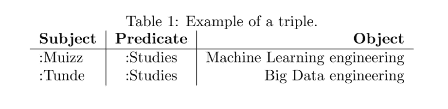

# 知识图导论

> 原文：<https://towardsdatascience.com/an-introduction-to-knowledge-graphs-faedb6f2435a?source=collection_archive---------13----------------------->

了解如何使用知识图不仅可以让数据科学家能够从大量数据中提取相互关联的事实和假设，还可以帮助他们了解如何通过链接和语义元数据形成上下文联系和理解数据，这有助于提供统一的数据分析和智能方法。本文是对知识图、重要概念及其应用的介绍。

杰森·温加特在 Unsplash 上拍摄的照片

# **简介**

知识图用于绘制来自不同来源的数据集合，并在给定主题(如人、地点或事物)的不同实体之间建立联系，以提供数据的意义并消除任何语义模糊(Ristoski 和 Paulheim，2016 年)。图表技术和分析为连接驱动的系统提供了工具——从社交连接到金融连接，它有助于将数据分析和智能从仅仅制表和检索数据转移到形成现实世界的意义和关系(Needham 和 Hodler，2019)。

知识图可以被认为是一种语义网络，它形成了网络中概念和实体之间关联的基础——现实世界对象、事件、情况或抽象概念之间的连接(“语义网络”，2021)。尽管它们可以互换使用，但知识库和知识图并不相同，因为知识图中的信息是用图来组织的，这并不适用于所有的知识库。不同的组织提出了不同版本的知识图，每个版本都有不同的复杂程度，如谷歌的知识图、知识库、微软的 Satori、脸书的实体图等。作者图片

2012 年，谷歌推出了名为“谷歌知识图”的知识图，利用现代人工智能诞生以来一直存在的方法，使用户能够快速发现与他们的查询相关的新信息(Singhal，2012)。

**资源描述框架和本体**

知识图是不同范例的组合，一个提供通过结构化查询探索数据的方法的数据库，一个提供网络数据结构的图，一个解释数据和推断新事实的知识库，以及一个用作正式语义数据模型的本体，该模型用于定义主题中存在的对象类型和用于描述它们的属性(本体文本，无日期)。

**资源描述框架**

资源描述框架是一种图形数据模式，用于以三元组的形式描述信息的语义或含义，三元组基于实体属性值(EAV)模型，即资源、属性和属性值(主语、谓语、宾语)的组合，形成用于表示不同资源之间复杂关系的语句(Wu et al .，2014)。这意味着 RDF 让我们有机会通过基于一组规则发现关于数据的新事实来从数据中进行推断，并且由于 RDF 的语义性质，我们不需要存储显式的关系，这意味着 RDF 可以从现有的三元组中生成新的事实。

在表 1“Muizz 研究机器学习工程”中，Muizz 是主语，Studies 是谓语，机器学习是宾语。与示例中的 RDBMS 相比，它旨在通过预先创建的连接向计算机应用程序提供可理解的信息。

作者图片

图 1 中的 RDF 模式是与 rdf:type 数据科学相关的一切，我们看到指向数据科学的实体是数据科学下的一个主题，我们看到项目管理虽然与数据科学有相似的特征，因为他们都学习项目管理课程，但他们不是数据科学 rdf:type 的一部分，因此也不是数据科学家。这使得查看实体之间的连接变得容易，而不必创建复杂的连接，因为我们知道任何指向数据科学的实体都是该类的一部分。RDF 通过支持现有标准和本体重用的按作者的统一图像结构提供互操作性。他们使用跨不同系统的独特标准，通过使不同的代理、服务和应用程序能够共享知识和情报来促进数据集成和发布(Noy et al .，2005)。

作者图片

**本体**

在计算机科学中，本体是我们如何正式创建命名和定义类别、属性和话语域之间关系的约定(“本体(信息科学)”，2021)。本体论不同于分类学，分类学是一组受控的词汇表，用于使相关信息的查找、管理和呈现变得更容易——它们表达了一个类别内的层次关系(SCHWEIZER，无日期)。

本体是一种知识库，帮助建立人、地点和事物之间的关系，即类、实体和属性，使用户能够以各种方式将多个概念与其他概念联系起来。本体表示允许知识的语义建模，这意味着它为数据和它们之间的关系添加了基本的意义，并用于形成人工智能(AI)应用程序中的知识库(SCHWEIZER，无日期)。

知识图可以被描述为一个非常大的本体，具有额外的功能，如数据收集、提取、整合来自外部来源的数据，扩展了基于知识的系统和推理引擎(Ehrlinger 和 W o，2016)。诸如网络本体语言(OWL)之类的语言用于表达本体，它们被设计成通过指定对象类和关系属性以及分类法(本体文本，无日期)来表示关于对象和它们之间的关系的广泛知识。

# **知识图表的可用性**

我们将探索知识图表在分析和商业智能中的应用。电信是关于连接的——在人、卫星或计算机之间交换信息，这使得知识图成为建模、存储和查询各种电信数据的完美候选。电信系统具有结合了各种复杂网络结构和系统的体系结构，它们提供各种各样的产品供应和捆绑，并在高度竞争的环境中高度投资于客户满意度和流失率，实施知识图不仅提供了监控网络系统本身的有效手段，而且使企业能够更加敏捷地处理他们的客户需求和要求。

考虑一家拥有数百万客户、代理和合作伙伴的大型电信公司。他们使用监控系统来监控客户使用情况、关键绩效指标、应用程序运行以及报告和事件通知的生成(SLAC，2021)。此类组织通常会有分析问题，例如:

作者图片

知识图降低了传统数据库中使用的一些昂贵连接的成本，因为它需要较少的资源来回答分析问题。在传统的商业智能平台中，寻找不同关系数据库之间的连接需要耗时的数据建模和查询操作。随着每一个新的业务问题的出现，我们将需要一个新的数据集和模式，这不是一个智能和知识的可持续方法(Clark，2020)。实施客户智能知识图，重点关注与客户最相关的实体，如其用户中最常见的实体:捆绑包类型、投诉、数据使用和订阅率，将为企业带来竞争优势。专注于那些最有可能提供最佳和令人愉快的用户体验的领域将有助于提高此类组织的分析和智能(Kempe，2014)。

# **真实世界知识图示例:微软学术图**

Microsoft academic graph 是学术信息和数据的知识图实现，它收集了诸如人员、出版物、研究领域、会议和位置等实体。它提供了研究人员和与他们相关的研究之间的联系，这可能很难确定(Noy 等人，2019 年)。

Microsoft Academic Knowledge Graph(MAKG)是一个大型 RDF 数据集，包含超过 80 亿个关于科学出版物和相关实体(如作者、机构、期刊和研究领域)的三元组信息。MAKG 使用在开放数据共享归属许可(ODC-By)下许可的数据。通过使用 RDF 转储文件，这种知识图能够将大量的学术出版物和数据汇集到网络上，这些数据来源于与 URIs 相链接的开放数据云，该开放数据云能够工作并连接到多个数据源(Farber，2006)。Microsoft academic graph 以通过识别表示实体或联系的语义对象的词汇结构从文本中获取知识为中心。MAKG 使用一种称为概念的分层实体类型来表示文档的语义内容，这是一种定义作者和从属关系等实体的抽象方法，因此没有定义它们的具体方法(Kuansan 等人，2019)。

***参考文献***

[1]克拉克，K. (2020)什么是知识图？。可在以下网址查阅:https://www . stardog . com/blog/what-is-a-knowledge-graph/(访问日期:2021 年 5 月 11 日)。

[2] Ehrlinger，L .和 W . o . W .，《走向知识图的定义》语义学(2016)。

[3] Farber，M. (2006)微软学术知识图:具有 80 亿三元学术数据的链接数据源。德国卡尔斯鲁厄理工学院 AIFB 学院。

[4]C . Feilmayr 和 W . o . W .,“对应用于商业数据知识工程的本体论及其成功因素的分析”语义学(2016)。

[5] Kempe，S. (2014)为什么您的企业需要客户数据知识图？。可从以下网址获得:https://www . data versity . net/business-needs-customer-data-knowledge-graph/(访问日期:2021 年 5 月 11 日)。

[6]关山，w .，智宏，s .，池源，h .，杰汉，w .，达林，e .，小宇，d .，接君，q .，安舒尔，k .，阿尔文，c .，和理查德，R.(2019)“微软科学学学术服务的生物学家观点”，大数据前沿杂志，(2)，第 45 页。可在:[https://www . frontiersin . org/article/10.3389/fdata . 2019 . 2020015(访问日期:2021 年 5 月 11 日)。](https://www.frontiersin.org/article/10.3389/fdata.2019.00045)

[7] Noy，n .，Gao，Y .，Jain，A .，Narayanan，A .，Patterson，A，和 Taylor，J .(2019)行业规模知识图表:经验和挑战。可查阅:[https://cacm . ACM . org/magazines/2019/8/238342-industry-scale-knowledge-graphs/](https://cacm.acm.org/magazines/2019/8/238342-industry-scale-knowledge-graphs/)(查阅时间:2021 年 5 月 10 日)。

[8]诺伊，麦克吉尼斯，和海斯，P.J. (2005)“使用 RDF 和 OWL 的语义集成互操作性”，W3C 期刊。可在:【https://www.w3.org/2001/sw/BestPractices/OEP/SemInt/ (访问时间:2021 年 5 月 11 日)。

[9]《本体论》(2021)。维基百科。在 https://en.wikipedia.org/wiki/Ontology.[可用](https://en.wikipedia.org/wiki/Ontology.)(访问时间:2021 年 5 月 11 日)。

[10]《本体论(信息科学)》(2021)。维基百科。可在[https://en . Wikipedia .](https://en.wikipedia.)org/wiki/Ontology _(information _ science)获取。(访问日期:2021 年 5 月 11 日)。

[11] Ontotext(无日期)可在以下网址查阅:[https://www . onto text . com/knowledge hub/fundamentals/what is-a-knowledge-graph/](https://www.ontotext.com/knowledgehub/fundamentals/whatis-a-knowledge-graph/)(查阅日期:2021 年 5 月 11 日)。

[12] Ontotext(无日期)可在以下网址查阅:[https://www . onto text . com/knowledge hub/fundamentals/whatare-ontologies/](https://www.ontotext.com/knowledgehub/fundamentals/whatare-ontologies/)(查阅日期:2021 年 5 月 11 日)。(正文，无日期)

[13] Needham，m .和 Hodler，E. A. (2019)图形算法:O'Reilly Media，Inc .

[14] Ristoski，p .和 Paulheim，H.(2016)“数据挖掘和知识发现中的语义网:一个全面的调查，Web 语义学杂志”，Web 语义学杂志，4(2)，第 1–22 页。可用时间:[https://doi.org/10.1016/j.websem.2016.01.001.](https://doi.org/10.1016/j.websem.2016.01.001.)(访问时间:2021 年 5 月 11 日)。

[15] SCHWEIZER，c .(无日期)分类学和本体论有什么区别？这是一个复杂的问题。可从以下网址获得:[https://www . earley . com/blog/what-difference-between taxonomy-and-ontology-it-matter-complexity](https://www.earley.com/blog/what-difference-betweentaxonomy-and-ontology-it-matter-complexity)(访问日期:2021 年 5 月 11 日)。

[16]《语义网络》(2021)。维基百科。可在[https://en.wikipedia.org/wiki/](https://en.wikipedia.org/wiki/)语义网获得。(访问日期:2021 年 5 月 11 日)。

[17] SLAC 国家加速器实验室(2021 年)可在:[https://www.slac.stanford.edu/xorg/nmtf/nmtf-tools.html](https://www.slac.stanford.edu/xorg/nmtf/nmtf-tools.html)获得(访问日期:2021 年 5 月 11 日)。

[18] Singhal，A. (2012)介绍知识图:事物，而不是字符串。可在:[https://blog . Google/products/search/introducing-knowledge-graph-things-not/](https://blog.google/products/search/introducing-knowledge-graph-things-not/)(访问时间:2021 年 5 月 11 日)。

[19] Stanford CS 520(无日期)可在以下网址查阅:【https://web.stanford.edu/class/cs520/2020/】T4notes/What _ Are _ Some _ High _ Value _ Use _ Cases _ Of _ Knowledge _ graphs . html(访问日期:2021 年 5 月 11 日)。

[20] Wu，b .，Zhou，y .，Yuan，p .，Jin，h .和 O'Hara，j .(2014)“SEM Store:一个语义保持的分布式 RDF 三元组存储。”，载于第 23 届 ACM 信息和知识管理国际会议(CIKM '14)的会议录。美国纽约州纽约市计算机械协会，网址:https://doi . org/10.1145/2661829.2661876(访问日期:2021 年 5 月 11 日)。