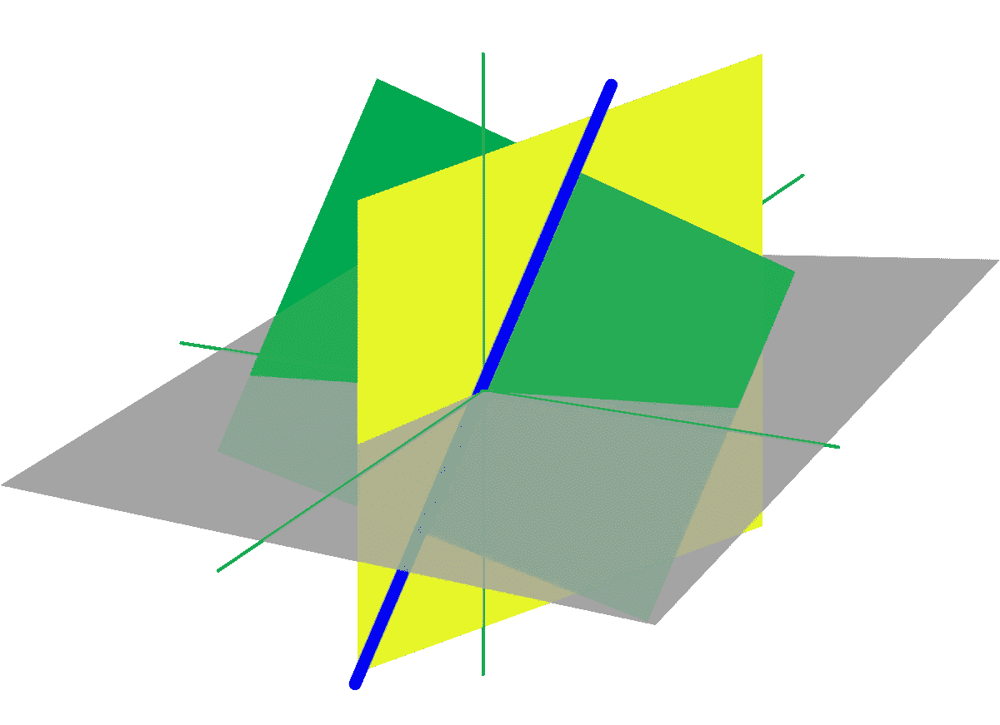
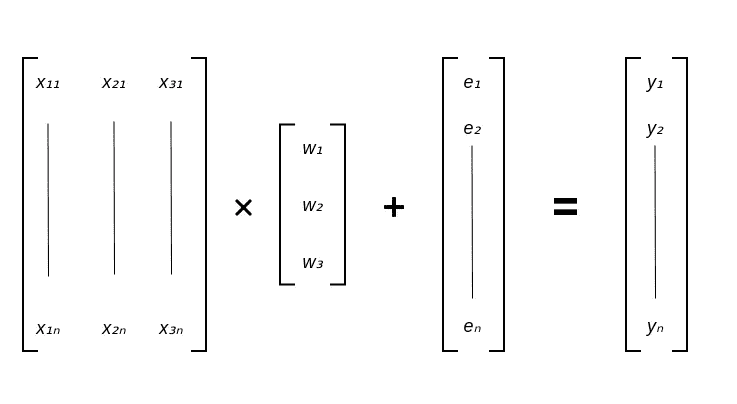
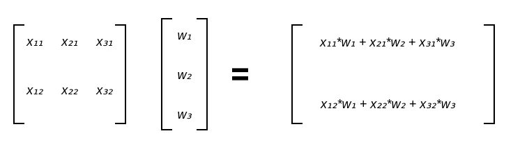
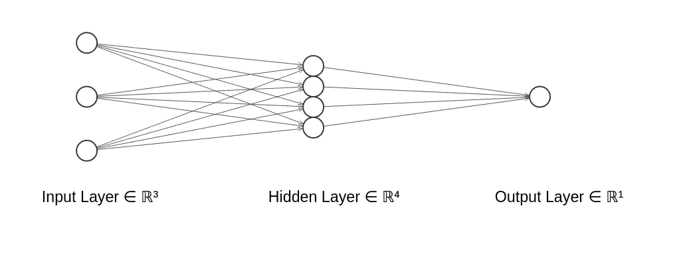
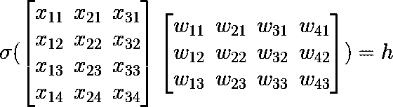
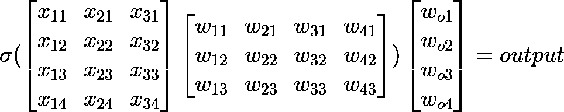

# 面向深度学习的线性代数导论

> 原文：<https://towardsdatascience.com/an-introduction-to-linear-algebra-for-deep-learning-c1b72de78543?source=collection_archive---------20----------------------->

## 深度学习都是关于数据的，我们需要表示数据并对其进行操作，以训练我们的深度网络。

> 线性代数构成了深度学习的基础。更好地掌握该领域的基础知识将有助于你对深度学习算法中数据的处理方式有更好的直觉。



[https://en.wikipedia.org/wiki/Linear_algebra](https://en.wikipedia.org/wiki/Linear_algebra)

深度学习都是关于数据的，我们需要表示数据并对其进行操作，以训练我们的深度网络。数据必须用矩阵形式表示。更好地理解矩阵运算和矩阵代数将有助于你对深度学习算法如何工作有更好的直觉。这就是为什么线性代数可能是深度学习中最重要的数学分支。在这篇文章中，我将试着澄清这个领域的基本话题。

## **我们所说的数据是什么意思？**

让我们考虑一个简单的例子，其中你有每所房子的属性，你的目标是尝试并预测给定房子的价格。这些属性也称为解释变量，我们将利用它们来训练我们的模型。为了简单起见，我们只考虑三个属性:卧室数量、房子大小、位置。现在，每座房子将被表示为一个包含三个值的向量。

*【X _ number of bedrooms，X_size，X _ location】*
但是等等，这里我们只考虑单套房子。我们通常有由数千所房子组成的数据集，每所房子被称为一个数据点。至此，我们要做的就是把房子的向量叠加起来，形成一个矩阵。每行代表一所房子，每列代表一个解释变量。太好了，我们现在已经有了设计矩阵！

x₁₁:第一栋房子的房间数
x₂₁:第一栋房子的大小
x₃₁:第一栋房子的位置

## **简单线性回归**

这里，我们将尝试建立一个简单的模型来预测给定房屋的价格。让我们来看看这三个解释变量的线性组合。我的意思是，这可能是你能得到的最简单的模型；简单的线性回归。现在让我们正式地看看这个:

y =xβ+ϵ

如你所见，我们有三个权重，每一个都乘以 EV。你可以认为它们是决定价格的每个变量的重要性。简单的想一想，如果房子大，位置好，价格肯定高。因此，所有电动汽车都与价格正相关。通过查看最高权重，我们可以确定最相关的变量，这将为我们提供模型对每个变量的敏感性的良好感觉。现在，让我们用矩阵符号重写一切。



作者图片

如您所见，以矩阵形式编写所有内容可以更简洁地描述正在发生的事情。但是我们如何乘矩阵呢？别担心。这是令人震惊的简单和直观。

## **乘法矩阵**

首先让我们直观地思考一下。我们只想将每个 EV 乘以其相应权重。我们有 *n* 个房屋/示例，所以从逻辑上讲，我们应该将设计矩阵中的每一行乘以列向量 w。为了简洁起见，我们将考虑一个简单的示例，其中有两个示例和三个解释变量:



作者图片

矩阵和列向量的乘法将产生另一个列向量。

现在让我们考虑两个矩阵相乘。不要忘记，要乘矩阵，第一个矩阵的列数应该与第二个矩阵的行数相同。结果矩阵的大小可以很容易地计算出来:如果 A=[aij]是 m×n 矩阵，B=[bij]是 n×k 矩阵，则 AB 的乘积是 m×k 矩阵。我有一些好消息；你已经知道如何乘两个矩阵。这个过程与矩阵乘以向量是一样的，但是这一次，假设您有不止一个列向量。然后，将得到的列向量并排放到一个矩阵中。

## **PyTorch 和 Tensors**

在这一节中，我们将研究 PyTorch 张量，并使用它们进行矩阵乘法。PyTorch 是著名的深度学习库，张量起着至关重要的作用。你可以把张量想象成更高维的矩阵，PyTorch 让我们可以高效地对它们进行数值运算。现在你可能已经猜到了，矩阵和张量构成了深度学习的基础。
让我们看一个简单的例子，我们初始化两个矩阵并对它们执行矩阵运算:

```
*A = torch.tensor([[1,2,3] , [2,3,4]])**B = torch.tensor([[3,1] , [4,2] , [2,3]])**torch.matmul(A,B)*
```


矩阵乘法的输出

## **神经网络。**

考虑到目前为止我们所学的一切，我们可以开始应用矩阵运算来表示神经网络。在这里，我将假设你知道神经网络的基础知识。因此，首先，让我们看看我们的模型架构在单一隐藏层的情况下会是什么样的。



[http://alexlenail.me/NN-SVG/index.html](http://alexlenail.me/NN-SVG/index.html)

从上图可以看出，我们有输入神经元，它们的表现方式和我们的房子数据一样。接下来，我们有四个神经元的隐藏层。每个神经元将是通过非线性函数的输入神经元的线性组合。在这个例子中，我们将考虑一个广泛使用且简单易懂的激活函数。整流线性单元是一个激活函数，如果输入值为负，则输出零，否则输出输入。数学上，ReLU 函数为 *f(x)=max(0，x)* 。为了表示隐藏层中的四个神经元，我们将把我们的设计矩阵乘以具有四列三行的权重矩阵；行数应等于输入的维数，列数应等于后续层中目标神经元的数量。



作者图片

剩下的就是最终的输出层了。输出神经元也是前一层神经元的线性组合。因为我们正在处理一个回归问题，其中我们想要一个没有边界的值，所以我们不需要最后一层的激活函数。这一层的矩阵乘法要容易得多，因为我们将只采用隐藏层的线性组合。这应该类似于线性回归，事实上，它确实是线性回归。整个模型可以表示如下:



## 摘要

所有的深度学习操作都用矩阵计算来表示。学习数据如何用矩阵和张量表示的基础知识，将会让你对事情的本质有更好的直觉。我建议任何人通过观看 3Blue1Brown 关于线性代数本质的系列文章来学习更多的线性代数知识。当然，人们永远不会忘记吉尔伯特·斯特朗教授的精彩讲座。学习愉快，愿母体与你同在！

## 参考

<https://en.wikipedia.org/wiki/Linear_algebra>  <https://ocw.mit.edu/courses/mathematics/18-06-linear-algebra-spring-2010/> 