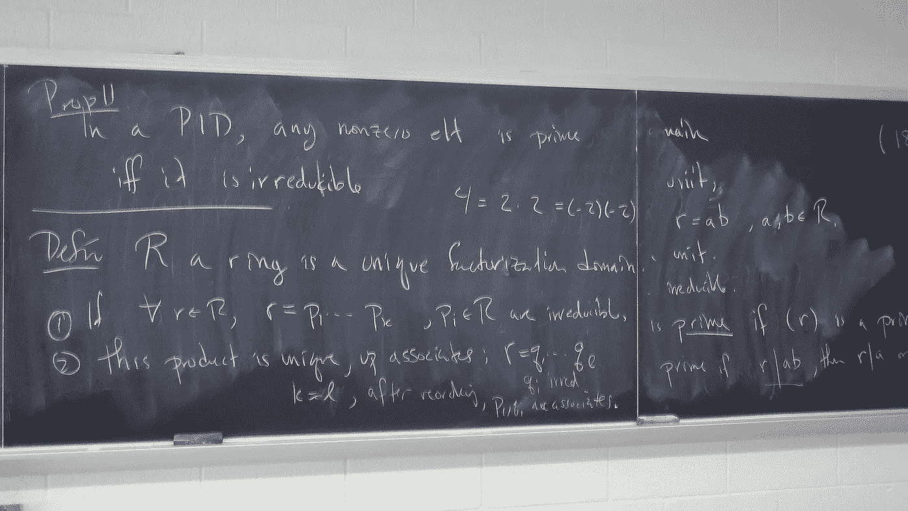
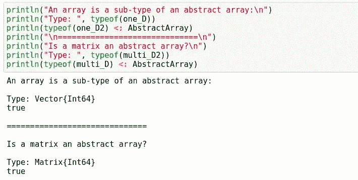
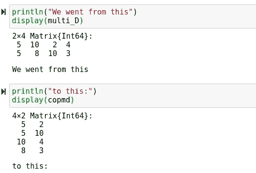

# 朱莉娅中的线性代数导论

> 原文：<https://towardsdatascience.com/an-introduction-to-linear-algebra-in-julia-1d6f8764c910?source=collection_archive---------19----------------------->

## Julia 中线性代数包的快速概述。



(src =[https://pixabay.com/images/id-327488/](https://pixabay.com/images/id-327488/)

# 介绍

OJulia 编程语言的一个伟大之处是语言中强大的数学功能。这种语言有一些非常棒的特性，在这方面使它有别于类似的语言。线性代数对于数据科学极其重要。Julia 的目标是科学计算和数值分析，因此可以假设 Julia 非常擅长线性代数。这当然是事实，然而，Julia 中的线性代数被构建在语言的核心中，这在编程中并不常见。除了 Julia 和其他类似编程语言之间的差异之外，代数表达式和语法与许多其他选项也有很大不同。

每当我考虑有人想使用 Julia 语言进行数据科学研究时，我总是会想到 Python 用户。话虽如此，Python 和 Julia 还是有很多区别的。其中一些只是方法调用上的细微差别，其他的则是相当戏剧性的，改变了我们在语言中处理数字的方式。考虑到这一点，我想在本文中为那些对编程和线性代数不熟悉，但对 Julia 语言不熟悉的人创建一个基础速成班。

> [笔记本](https://github.com/emmettgb/Emmetts-DS-NoteBooks/blob/master/Julia/Introduction%20to%20linear%20algebra%20in%20julia.ipynb)

# 阵列和矩阵

在我们开始在 Julia 中创建代数表达式之前，我们首先需要回顾一下我们在做线性代数时可能会看到的不同类型以及它们之间的区别。这个类型列表中的第一个是向量。Julia 中的 vector 与 Python 中的 list 概念完全相同，我们可以使用[]元素语法创建一个 vector:

```
one_D = [5, 5, 7, 2, 3]
```

这将创建一个一维数组。为了创建一个多维数组，我们改为像 Lisp 那样用空格分隔元素，然后用分号分隔行。

```
multi_D = [5 10 2 4; 5 8 10 3]
```

这将创建一个新的 2 x 4 矩阵。我还做了另一个同样尺寸的，用来执行一些基本的算术运算:

```
multi_D2 = [10 7 4 3; 9 5 3 10]
one_D = [5, 5, 7, 2, 3]
```

让我们也考虑一下这些新变量的类型。多维数组是矩阵类型的，一维数组是向量类型的。然而，这两种类型都是抽象数组类型的子类型，如下图所示:

```
println("An array is a sub-type of an abstract array:\n")
println("Type: ", typeof(one_D))
println(typeof(one_D2) <: AbstractArray)
println("\n==============================\n")
println("Is a matrix an abstract array?\n")
println("Type: ", typeof(multi_D2))
println(typeof(multi_D) <: AbstractArray)
```



(图片由作者提供)

这意味着尽管它们是不同的类型，但它们通常会被分派给相同的方法。这意味着可以使用一个到另一个的许多方法。举个例子，

```
println(length(multi_D))8
```

让我们也考虑一下这些数组的形状。我们可以使用 shape()方法来重塑我们的数组。我们还可以使用 size()方法来检查数组的大小:

```
size(one_D)
size(multi_D)
```

例如，我将复制并重塑我们的多维数组:

```
copmd = copy(multi_D)
copmd = reshape(copmd, (4, 2))
```

尽管该方法通常不会对类型进行变异，也没有变异函数(带有！，)我还是复制这个数据结构以防万一。没有什么比丢失数据更糟糕的了，尤其是如果它只是请求的数据，而不是本地存储的数据。让我们来看看两者的区别:

```
println("We went from this")
display(multi_D)
println("to this:")
display(copmd)
```



作者图片

# 发电机

我们接下来要看的是发电机。生成器是线性代数中非常重要的一部分，尤其是在机器学习应用中。Julia 拥有你能想到的所有生成器，比如零，都是受支持的。然而，在 Julia 中有一些相当独特的生成器怪癖，其中一些是最近才出现的。不赞成使用 eye 方法，而赞成使用 UniformScaling 运算符。只需在整数后加一个 I 就可以使用这个运算符，这是一种非常朱利安式的方法:

```
5I
```

让我们来看看零的例子:

```
zeros((5, 10))
```

单位矩阵和零可能是两种最常见的生成器，但是您可以随意查看完整的文档来了解其他各种生成器:

 [## 多维数组

### 与大多数技术计算语言一样，Julia 提供了一流的数组实现。大多数技术计算…

docs.julialang.org](https://docs.julialang.org/en/v1/manual/arrays/#Construction-and-Initialization) 

# 操作

现在我们已经完全熟悉了处理和创建矩阵的一些基本方法，让我们来看看一些基本操作。我们将从可以用来执行一些运算的基本操作符开始。第一个是逐元素乘法。这将把每个元素乘以另一个数组中相应的元素，这个运算的运算符是。*.

```
multi_D .* multi_D2
```

对于 Julia 中的所有数学位操作符，也有等价的元素操作符。

```
multi_D .+ multi_D2
multi_D .- multi_D2
multi_D ./ multi_D2
```

由于这些是基于元素的，所以它们也可以用于一维数组:

```
one_D .* one_D2
```

现在我们已经看了所有的元素操作符，让我们考虑一些处理矩阵的基函数。我首先要介绍的是 transpose 方法，它将执行与我们在前面的示例中所做的完全相同的整形操作:

```
transpose(multi_D)
```

如您所料，还有 dot():

```
dot(multi_D, multi_D2)
```

还有通过 cat、vcat、hcat …方法的串联:

```
hcat(multi_D, multi_D2)
```

最后，我们可以使用 cumsum()方法进行累积求和。我们需要为这一呼叫提供 dims 关键字参数:

```
cumsum(multi_D, dims = 5)
```

当然，还有很多这方面的功能可以从 Julia 的基础上使用。此外，LinearAlgebra.jl 包中还有更多可以使用的内容。但是，浏览它们可能需要相当长的时间，所以我将提供文档链接:

 [## 数组

### Array { T }(unde，dims) Array{T，N }(unde，dims)构造一个包含 T 类型元素的未初始化的 N 维。

docs.julialang.org](https://docs.julialang.org/en/v1/base/arrays/#Array-functions) 

[https://docs.julialang.org/en/v1/stdlib/LinearAlgebra/](https://docs.julialang.org/en/v1/stdlib/LinearAlgebra/)

# 结论

感谢您阅读我在 Julia 中的线性代数入门。虽然与许多其他语言相比，它肯定是独一无二的，但它肯定适合这份工作。我认为，人们可能会发现，朱莉娅处理这类任务的方式实际上是相当令人印象深刻的！尽管这仅仅是对该语言能力的一个简要介绍，但是您还可以做更多的事情，尤其是使用 LinearAlgebra.jl。希望这篇文章能够很好地介绍整个伟大的数组数学世界！