# 线性回归导论

> 原文：<https://towardsdatascience.com/an-introduction-to-linear-regression-9cbb64b52d23?source=collection_archive---------21----------------------->

## 回归主要用于预测或解释数字数据


回归|照片由[王昊](https://unsplash.com/@danranwanghao)拍摄

这篇文章是上一篇讨论[贝叶斯统计](/bayesian-statistics-11f225174d5a)的系列文章的继续。

波动性是股票市场固有的，但也许“迷因股票”的兴起超出了传统的理解。这篇文章不是关于这种“股票”——这是一种讽刺性的股票拼写错误，概括了千禧一代中新的投资时代精神(广义而言)。相反，我在思考乘坐$GME 过山车的神话般的感觉，这是应用线性回归的一个及时的例子；人们可以对给定的股票应用线性回归模型来预测其未来的价格。本文和后续文章将详细阐述线性回归的概念和几种相关的方法，模型分析的相关误差以及残差。

但是什么是回归呢？回归的目标是生成一个模型，该模型代表某些观察数据的最佳拟合。一个更好、更具体的说法是，回归被用来预测或解释数字数据**——比我聪明的人几十年来一直在将这种模型应用于金融数据(如$GME)。但是，如果你想预测某人是否会生病，或者某人是否会穿黑色衣服，或者某项资产是否会升值或贬值，这些都不是回归，而是分类。**回归是数字数据的解释模型或预测模型**。在大多数情况下，我们将处理可以描述一个函数的函数，这意味着一个输出，我们可以描述一个或多个输入变量和一个输出变量之间的关系(对于线性回归)。**

# **历史**

**回归基于最小二乘法或最小均方误差法。围绕最小二乘或平均误差的想法已经发展了近三个世纪。已知的第一份“平均法”出版物是德国天文学家托拜厄斯·迈耶在 1750 年发表的。皮埃尔·西蒙·拉普拉斯在 1788 年发表了一个类似的方法。最小二乘法的第一个出版物是由法国数学家阿德里安-玛丽·勒让德在 1805 年发表的。**

**撇开历史不谈，德国物理学家和数学家卡尔·弗里德里希·高斯很可能早在 1795 年就发展了最小二乘法，但他直到 1809 年才发表了这一方法。勒让德坚决反对任何认为高斯在 1805 年出版日期之前就已经使用这种方法的观点。**

**查尔斯·达尔文的表兄弗朗西斯·高尔顿在 1886 年创造了回归这个术语。高尔顿感兴趣的是确定包括人类在内的动植物的哪些特征可以说是遗传的。虽然高尔顿发明了一种现代形式的回归，但却是卡尔·皮尔逊将回归和多元回归置于坚实的数学基础之上。他在 UCL 创建了世界上第一个大学统计系。皮尔逊 1898 年的出版物提出了我们今天所理解的回归方法。**

**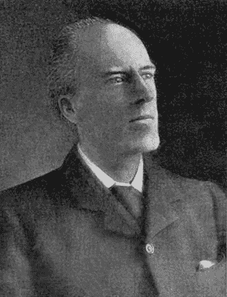**

**卡尔·皮尔逊|来源[维基百科](https://en.wikipedia.org/wiki/Karl_Pearson)**

**自皮尔森的关键论文发表以来的一个世纪里，许多其他人扩展了回归理论。值得注意的是，约瑟夫·伯克森在 1944 年发表了逻辑回归方法，这是最早的分类算法之一。近年来，对机器学习(ML)的兴趣激增，导致回归模型的数量和类型迅速增加。**

## **回归的类型**

**有各种类型的回归，包括许多非线性的，与我要讲的内容完全无关的回归；它们用于预测数字结果，但使用不同的底层技术。一些常见的回归类型有:**

*   **线性—最常见**
*   **逻辑—二元结果(成功/失败)**
*   **多项式-当直线不是最佳拟合时**
*   **阶梯式脊线和套索(常见于 ML)**

## **最小二乘线性回归**

**最小二乘回归是我今天要阐述的类型。注意，大多数人会把这和线性回归混为一谈。现在这两者不一定是相同的，但只是警告你，大多数人会把这两者混为一谈。线性回归仅仅意味着你将使用一个**线性参数集合**来做一些事情。还有各种其他方法来进行回归，这些方法不会使用这些参数的线性集合；其中每个参数与一个变量相关联。**

**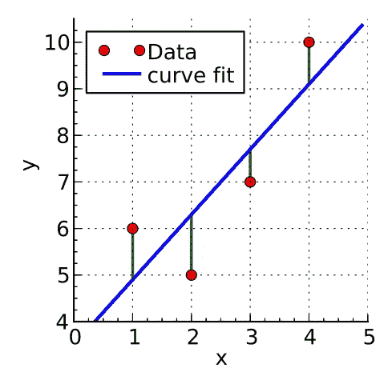**

**线性回归|来源[维基百科](https://en.wikipedia.org/wiki/File:Linear_least_squares_example2.svg)**

**我们有线性回归，它最常用于描述如上图所示的直线，但对于逻辑和多项式也是如此。并且可能也适用于阶梯式脊和套索的大多数情况。所以有两种关于线性的定义——这将会令人困惑。**

**线性的一个定义是穿过数据的**线。换句话说，一条线适合你的数据。线性的另一个定义是当你有一个参数**的线性集合**，每个参数与一个变量相关联。换句话说:基于解释变量的相关(目标)值的线性可预测行为。****

**这是一种奇特的说法:**

**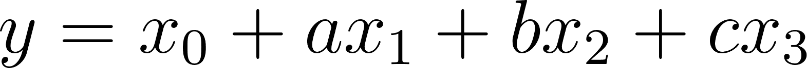**

**参数的线性集合**

**在上面的示例中，参数 a、b、c 与输入变量 x1、x2 和 x3 具有线性关联，x0 是偏移量。当我说变量时，那意味着**它们是回归**的输入。**

**最小二乘线性回归是借助线性代数和一些微积分推导出来的。我相信理解线性模型是理解一大堆统计和 ML 模型行为的基础。事实上，我相信大约一半的机器学习模型会使用这种形式的线性回归，至少在它们的起点。**

## **型号选择:11 点**

**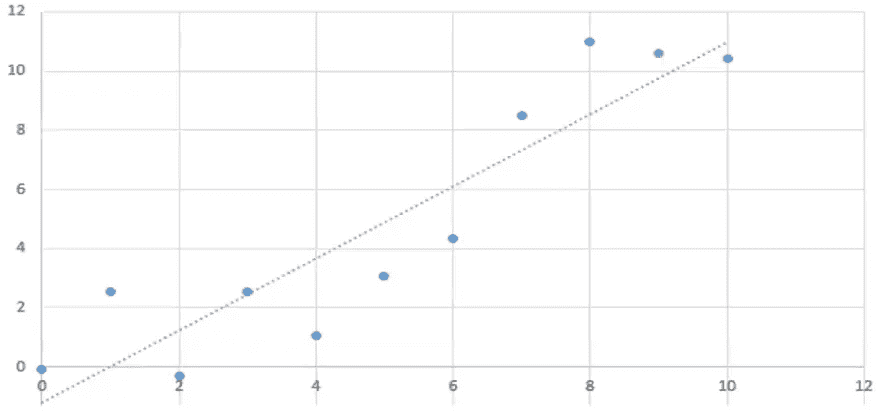**

**模型 1 |一阶线性回归，最佳拟合的简单直线**

**对一些数据进行回归的一个非常合理且可接受的方法(比如上面的例子)就是盯着它，然后在上面画线。你想称之为倒退，那很好。我怀疑它还能被称为线性回归，但它肯定是一个回归。这是一个非常有效的方法。现在我们将讨论回归，我们可以展示从数据点到最佳拟合线的数学规则。**

**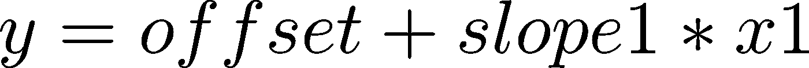**

**数学上定义上面的线**

**前面我定义了线性回归，现在我将展示一个二次方程的例子，它仍然是我们定义的线性方程:**

**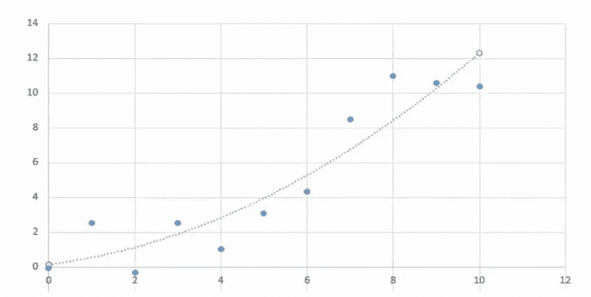**

**模型 2 |二阶二次回归**

**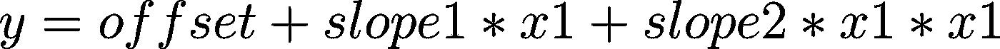**

**等效地:**

**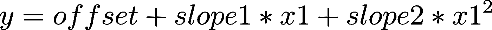**

**我们要做的或者我们能做的是，我们可以说，“好的”，y 不是接受一个变量，即 x1 的函数的输出，而是接受两个变量的函数的输出；第一个是 x1，第二个是 x1。事实上，我们可以称 x1 乘以 x1 为变量 x2。**

**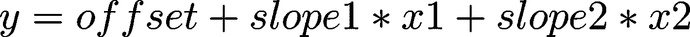**

**通过将 x1 重新标记为 x2，我们恢复了线性回归**

**我们可以用非直线来拟合线性方程！从这里延伸，我们基本上可以得到任何多项式。下图具有与二次示例相同的数据，但最佳拟合线不同。**

**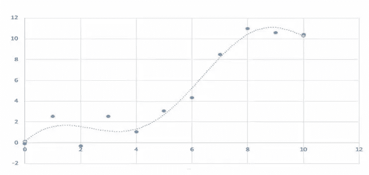**

**模型 3 |使用与二次示例相同的数据的高阶回归**

**唯一真正改变的是我们对他们的划分。在这两种情况下，我们都在使用我们所谓的线性关系——从事回归业务的人(数学家/物理学家)这样称呼它。他们非常清楚这不是一条直线。但是他们声称在更高维度中，这实际上是直的；称之为超平面而非直线。**

**超平面在那些维度上不是弯曲的。尺寸可能是:**

**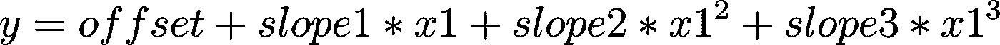**

**也许需要一个四阶。**

**这是毗邻拓扑学的数学领域，与粒子物理学家和爱因斯坦的广义相对论非常相关，总的来说(哈哈)！物理学家会说棒球击球的轨迹是一条直线。在高中，我们学习了这条路径是一条抛物线但是在弯曲的时空中，路径是一条直线测地线(测地线是弯曲拓扑景观中的一条“直”线)。你可能熟悉的测地线包括地球上的纬线。**

**所以这里要问的相关问题是，这三个过程模型中哪一个是正确的？一阶线性的？二阶线性的那个？四阶线性的那个？好吧，更好的问题是这三个中哪一个更有用，这自然需要我们知道模型的用途。**

**一般规则是，这是一个非常重要的规则，模型越简单，它就越有用。记住这个启发！稍后我会写正则化，这只是一种使模型更简单的方法。当你简化你的线性模型(任何模型，但这里的上下文是线性模型)时，它不仅更容易理解，更重要的是，它们工作得更好！**

**没有完美的数据，误差永远存在。另一个需要记住的有用的启发是“所有的模型都是错误的，但有些是有用的！”事实是，上面的一些数据可能只是错误。上面的 11 个点是训练数据。当我们观察新数据时，可能会发现，或者可能会发现，它们不会遵循有趣的曲线，即我们的高阶模型。“超平面”模型很可能就是我们所说的过度拟合的一个例子。并且过拟合的逆过程或撤销过拟合的过程被称为正则化。因此，概率的平衡表明我们的第一个模型是进行进一步分析的最有用的模型。**

## **术语**

*   ****反应**(因变量):主要感兴趣的变量，我们试图预测或解释的变量。就像上面 Jupyter 笔记本中的例子一样，答案在等号的左边——“y”依赖于等号右边的值**
*   ****解释性**(独立)变量:试图解释反应变量的观察结果的变量。在一个等式中，如果你改变“y”(因变量)，你不会改变右边的“x”变量，因此它们与“y”的变化无关**

**线性模型中有两种类型的参数:**

*   ****y 轴截距，**以上称为偏移量**
*   ****斜率**，上升超过游程，y 的变化除以 x 的变化。如果有多个输入，那么我们有多个斜率(我们称之为部分斜率)**

**作为题外话，但是我想提一下，数据通常不是线性的，因此数据需要被转换以应用回归分析。一个重要的此类转换是在处理非线性数据时进行对数转换。**

**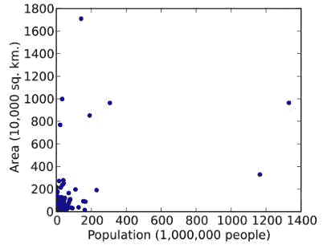**

**国家面积与人口|来源[维基百科](https://en.wikipedia.org/wiki/Data_transformation_(statistics))**

**这个原始数据不是线性的，但是，我们可以通过应用对数变化使它看起来是线性的，这里它将是以 10 为底的对数:**

**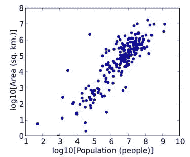**

**同样的数据，转换后|来源[维基百科](https://en.wikipedia.org/wiki/Data_transformation_(statistics))**

**进行对数转换的原因是因为现在你的错误可能会始终一致，这很可能会更好。可以用指数线拟合数据，进行非参数线拟合，但这样误差就不一致了，它们的规模也不一样，这使得下游分析更加困难。**

## **错误术语**

**在解释最小二乘回归之前，我们需要了解误差是什么:**

**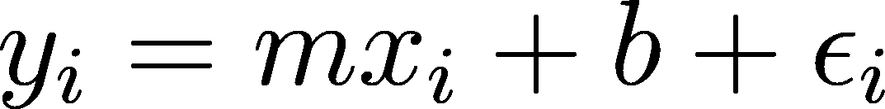**

**ε表示误差，I 表示它是哪个数据点(第一、第二等。)**

**E(误差)是每个点和回归线之间的距离。我们选择每个点和直线之间的平方差和最小的直线。**

**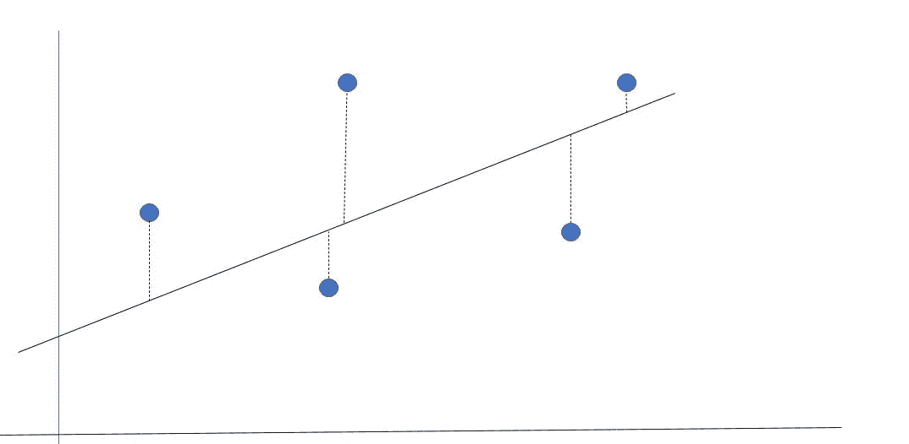**

**回归线和每个点的误差**

**上面的线非常适合上面的五个点，但它并不完美。我们想知道的是因变量的误差有多大。添加ε项是为了弥合我们的预测值(y_hat)和实际观察值之间的差距，预测值是红点跟随绿线并与回归线相交的位置。误差是预测变量和观察变量之间的差异。这将在下面的代码分析中进一步解释。**

**利用一点微积分和线性代数，我们试图找到所有可能的回归线的误差总和的最小值。这个总和就是最佳拟合线。这是非常费力的计算。相反，如果你说你想最小化这个值的平方，结果是有很好的解析解。这就是为什么我们做最小二乘拟合。所以我们并不试图最小化这些虚线，或者这些虚线的总和，而是试图最小化它们的平方和。那么平方和是多少呢？**

**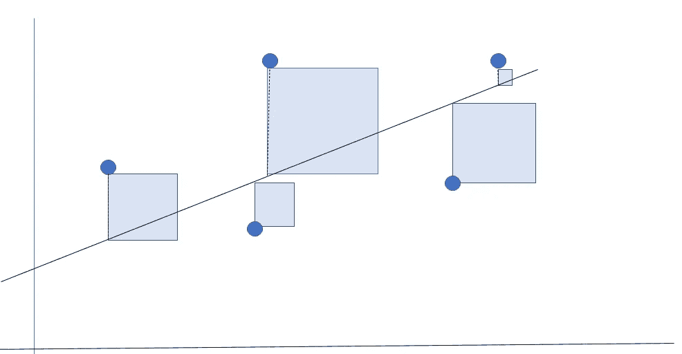**

**回归线误差平方和的可视化**

**现在，平方相加。这些正方形的最小总面积就是我们认为的最佳拟合线。除了漂亮的解析解之外，这种方法的优点还在于它惩罚了较大的误差——惩罚了异常值。在上例中，假设最大误差比最小误差大 6 倍。在最小二乘回归中，误差是最小平方的 36(6×6)倍。**

**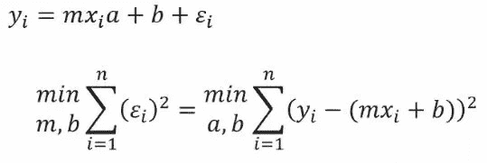**

**显式解决方案存在使用微积分**

**我们让计算机求解上面的方程，通过摆弄斜率和截距来找到最小二乘方的和。从实际(观察)值中减去预测(理论)值并求和。**

# **Python 示例:回归模型**

**下面的代码可以在 Jupyter 笔记本中运行，以帮助获得最小二乘线性回归的感觉和可视化。**

**注意:我们使用合成数据，因为我们对发生的事情有很大的控制权。合成数据并不总是最好的。**

```
# relevant imports
import numpy as np
import pandas as pd
import matplotlib.pyplot as plt
%matplotlib inline# synthetic data points between 0 and 10 with standard deviation of #the errors of 1 (std deviation of y should be around 3-the square #root of 10)
n_points = 80
x_start, x_end = 0, 10
y_start, y_end = 0, 10
y_sd = 1 # std deviation of the errors# data columns, the y values are the errors added to the x values
x_data = np.linspace(x_start, x_end, n_points)
y_error = np.random.normal(loc=0, scale=y_sd, size=n_points)
y_data = np.linspace(y_start, y_end, n_points) + y_error# create dataframe
syn_data = pd.DataFrame({‘x’:x_data, ‘y’:y_data})syn_data.head()
```

**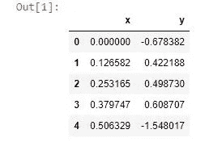**

**我们 80 个合成数据点的前五行**

**现在让我们将数据可视化—注意数据的强线性。记住这个练习的目的是回答这个问题“如果我们知道 X 的值，我们能预测 Y 的值吗？”我们相信，通过画出最佳拟合线，如果有人给我们一个 X，比如说一个我们还没有的 X，那么我们就能算出 Y 值是多少。**

```
plt.plot(syn_data[‘x’], syn_data[‘y’], ‘ko’) # ko = black points
plt.grid(True)
plt.xlabel(‘x’)
plt.ylabel(‘y’)
plt.title(‘x vs y’)
plt.show()
```

**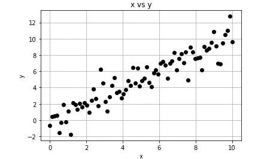**

**我们的合成数据-在大多数情况下，x 值大约是 y 值**

## **建立线性回归模型**

**按照一个简单的模板，我们可以建立我们的模型。您可能熟悉一个可以做到这一点的常见包:Sci-Kit Learn。`sklearn` 的一个怪癖是它最适合 NumPy 数组，这正是它所习惯的。以下模板为模型定型和评估重塑和转换数据:**

```
# standard lin reg template# imports
import numpy as np
import matplotlib.pyplot as plt
from sklearn.linear_model import LinearRegression
from sklearn.metrics import mean_squared_error, r2_score# create numpy arrays for the x (independent) and y (dependent) #variables
x = syn_data.x.values.reshape(-1,1)
y = syn_data.y.values.reshape(-1,1)# model initialization
regression_model = LinearRegression()# train the model (fit data)
regression_model.fit(x, y)

y_predicted = regression_model.predict(x)# model evaluation
rmse = mean_squared_error(y, y_predicted)
r2 = r2_score(y, y_predicted)# printing values
print(‘Slope:’ ,regression_model.coef_)
print(‘Intercept:’, regression_model.intercept_)
print(‘Root mean squared error: ‘, rmse)
print(‘R2 score: ‘, r2)# plotting values
plt.scatter(x, y, s=10)
plt.xlabel(‘x’)
plt.ylabel(‘y’)plt.plot(x, y_predicted, color=’r’)
plt.show()
```

**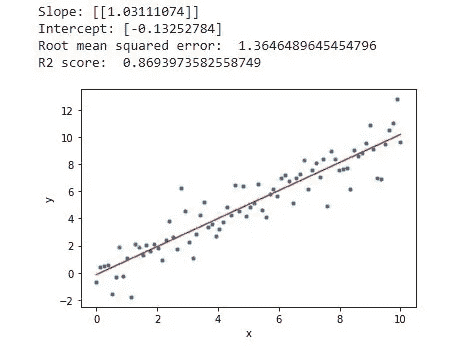**

**这条线很适合数据**

**当我们评估模型的性能时，下面将更详细地解释统计值。**

## **绘制残差**

**以下是理解您的回归模型有多好的重要工具——残差图。正在发生的是，对于每个点，观测值和预测值之间的差异被绘制出来。**

```
import seaborn as sns
sns.residplot(x, y)
plt.show()
```

**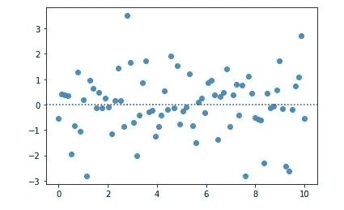**

**预测 y 值与实际 y 值的差异**

**残差是误差，我们之前画过了。x 轴是 x 值。y 轴是实际 y 值和预测 y 值之间的差异，即误差。**

```
from sklearn import linear_model
# from sklearn.linear_model import LinearRegression# initialize the model.
linear_model = linear_model.LinearRegression()# define x and y
x_input = syn_data['x'].values.reshape(n_points, 1)
y_output = syn_data['y'].values.reshape(n_points, 1)# fit the model to the existing data with lm.fit(x,y)
linear_model.fit(x_input, y_output)# fit model to make predictions
y_pred = linear_model.predict(x_input)# plot
plt.scatter(x_input, y_output)
plt.plot(x_input, y_pred, linewidth=2)
plt.grid(True)
plt.xlabel('x')
plt.ylabel('y')
plt.title('x vs y')
plt.show()# model parameters
print('Intercept: {0:.5f}'.format(linear_model.intercept_[0]))
print('Slope : {0:.5f}'.format(linear_model.coef_[0][0]))
```

**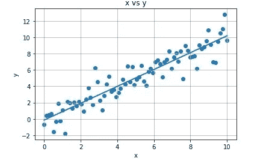**

## **统计模型包**

**另一个较老且较少使用的 Python 包是 Stats Model `sm`。下面的代码重复了 Sci-Kit 的学习工作。请注意两个 w/r 在输出显示方式上的细微差异。**

**注意:统计数据是相同的，但是软件包之间的表示和健壮性是不同的。`sklearn` 是这几天学习的首选套餐。**

```
import statsmodels.formula.api as sm# ols = ordinary least squares
ols_model = sm.ols(formula = ‘y ~ x’, data=syn_data)# fit the model
results = ols_model.fit()print(‘Intercept: {0:.5f}’.format(results.params.Intercept))
print(‘Slope : {0:.5f}’.format(results.params.x))
```

**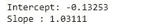**

```
# add predicted to dataframe
syn_data[‘predicted’] = y_pred# add residuals to dataframe
syn_data[‘resids’] = y_output — y_pred# verify data is as expected
syn_data.head()
```

**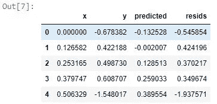**

```
# coefficients of line of best fit
m = linear_model.coef_[0]
b = linear_model.intercept_
print(‘m = {}’.format(m[0]))
print(‘b = {}’.format(b[0]))
```

**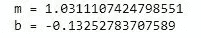**

## **解释参数**

**知道如何解释参数非常重要(由于创建数据时的随机种子，您的结果会有所不同)。**

*   ****y 截距(b)** :当 x 为零时，y 为-0.13…**
*   ****slope (m)** :当我们将 x 增加 1 时，我们预计 y 将增加 1.03…**

**很简单，我敢打赌大多数读者对这些基础知识都有很强的掌握，但重要的是要让每个人耳目一新，并建立在一个坚实而通用的基础上。**

## **模型汇总统计**

**这就是 SM 的闪光点——漂亮的成果总结。目前，本地显示的数据比我们理解最小二乘回归所需的数据要多得多。残差也在 OLS 报告后绘制。**

```
import statsmodels.formula.api as sm
import seaborn as snsols_model = sm.ols(formula = ‘y ~ x’, data=syn_data)results = ols_model.fit()# print slope (m) and y-intercept (b)
print(‘Intercept, Slope : {}’.format(results.params))print(‘\nSSE, SST, SSR, and RMSE:’)
mean_y = np.mean(y_output)
sst = np.sum((y_output — mean_y)**2)
ssr = np.sum((y_pred — y_output)**2)
sse = np.sum((y_pred — mean_y)**2)print(‘Sum of Squares Explained (SSE): {}’.format(sse))
print(‘Total Sum of Squares (SST): {}’.format(sst))
print(‘Sum of Squared Residuals (SSR): {}’.format(ssr))
print(‘RMSE: {}’.format(np.sqrt(results.mse_resid)))# print linear regression statistics
print(‘\n’, results.summary())
```

**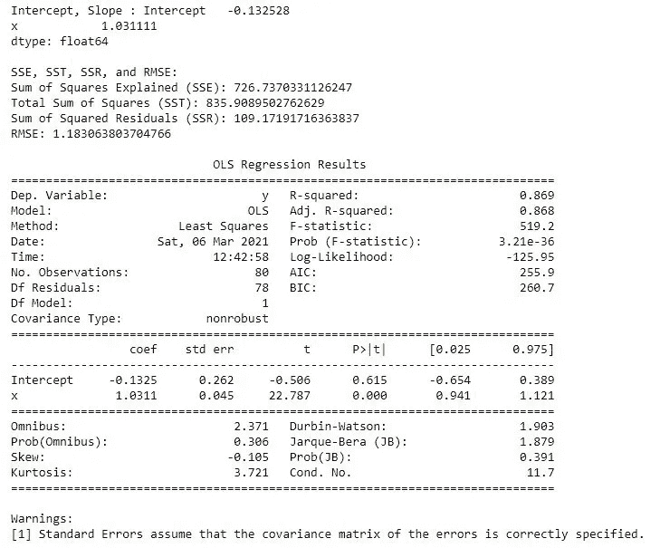**

```
# plot histogram of the residuals
sns.distplot(results.resid, hist=True)
plt.xlabel(‘Residual’)
plt.ylabel(‘Frequency’)
plt.title(‘Residual Histogram’)
plt.show()
```

**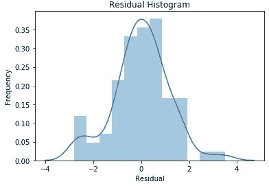**

**关于上面绘制的残差，首先要注意的是，它们大致是正态的。这是可以预料的，因为合成数据就是这样产生的，所以这有点像自我实现的预言。y 数据是从添加到随机生成的 x 数据的误差中创建的，y 数据具有+/-1 的标准偏差。**

## **回归模型的评估**

**现在我们已经建立了一个回归模型，我们可以定量地评估我们的回归模型的性能。回归模型的评估是基于误差的测量。**

**如果我们想知道我们做得有多好，我们必须考虑什么是好的基准。一个常见的简单基准是看看我们是否能比仅仅预测目标变量的**均值更好。****

**我们定义了以下术语:**

**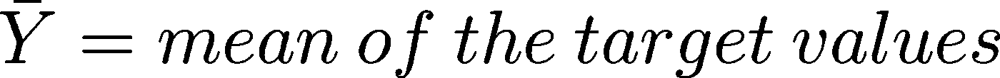****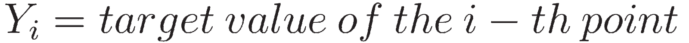****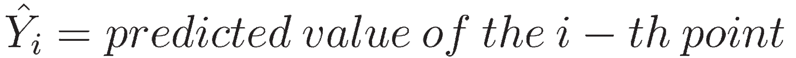**

**现在，我们需要定义以下误差指标:**

*   ****残差平方和(SSR)** :这是最小二乘法能够用最佳拟合线最小化的值。回归的目标是最小化这个量。**

****

**回归的目标——最小化它**

*   ****总平方和(SST)** :这是对目标均值预测有多差的度量**

**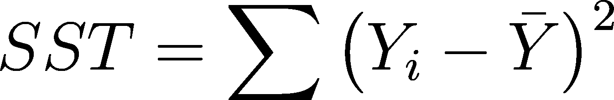**

*   ****解释的平方和(SSE)** :这是(SST — SSR)的逐点差平方和。你也可以认为这是一种衡量，我们对变异的解释比均值好多少**

**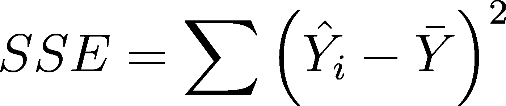**

**请注意 **SST = SSR + SSE****

*   **只有在对训练数据进行回归时，该公式才成立！如果你在测试数据上这么做，这个公式就不再成立了。这个公式适用于你的决定系数(COD)与你的皮尔逊相关系数 R 相同的情况。**他们不一样！**它们有时可能是相同的，但仅在对训练数据进行最小二乘拟合的情况下，而不是在使用测试数据或不使用非最小二乘拟合的情况下。SSR 可以变得比 SST 大，导致 R 为负！**

**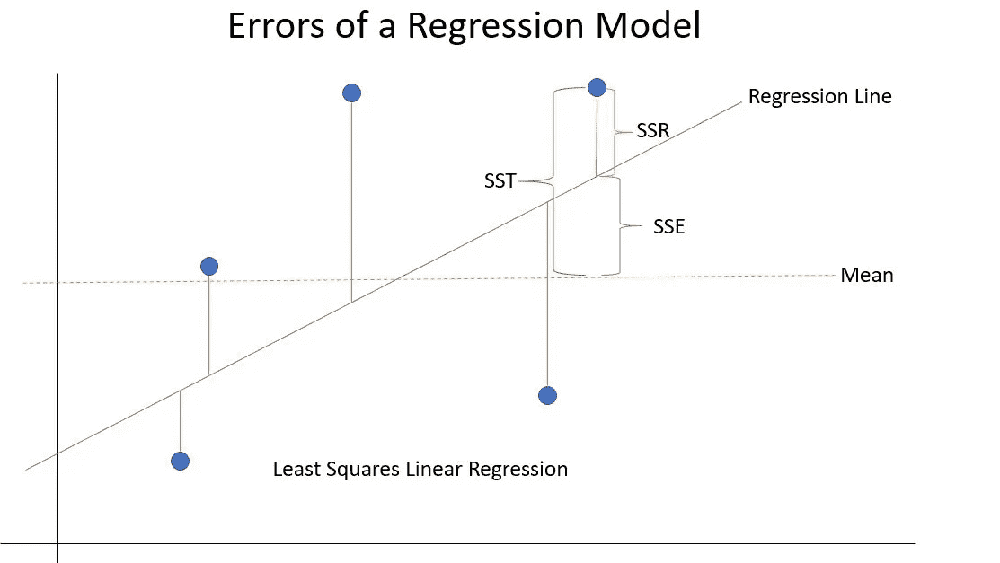**

**线性回归模型误差的可视化**

**我们现在可以谈论**均方根误差(RMSE)** 。我们这样做的原因是“平方和误差”(也称为均方误差)的单位是 **x** 。要将误差转换为单位 **x** ，我们需要均方误差的平方根或残差平方和的平方根。这是 RMSE:**

**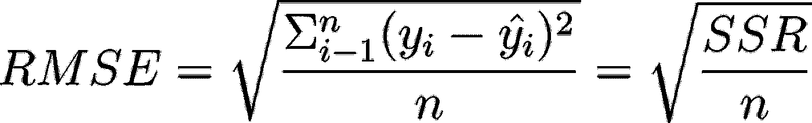**

**记住回归的目标是最小化残差， **SSR** 。具体来说，我们希望用我们的模型尽可能解释原始数据中的最大方差。我们可以用决定系数(COD)来量化这个想法，也称为 **R** :**

**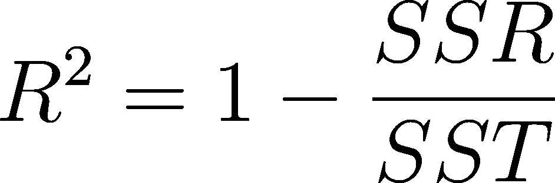**

**仅使用最小二乘拟合和测量训练数据进行校正**

**只要**

**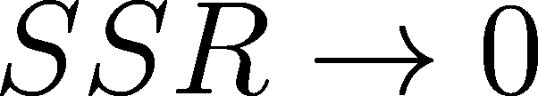****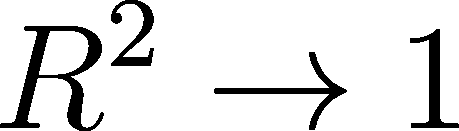**

****R 是模型**解释的原始数据方差的分数。一个完美解释数据的模型，R = 1。一个完全不能解释数据的模型 R = 0。这意味着训练数据分布得如此均匀，以至于您无法通过它绘制任何最佳拟合线。你可以在数据中画一条线，但这条线不会是最佳拟合线。**

**然而，R 并不完美:**

*   **r 不针对自由度进行偏差调整**
*   **更重要的是，模型参数的数量没有调整。随着模型参数数量的增加，SSR 一般会降低。没有调整，你会得到一个错误的模型性能**

**我们通过定义**调整后的 R (R adj)** 来解决这个问题:**

**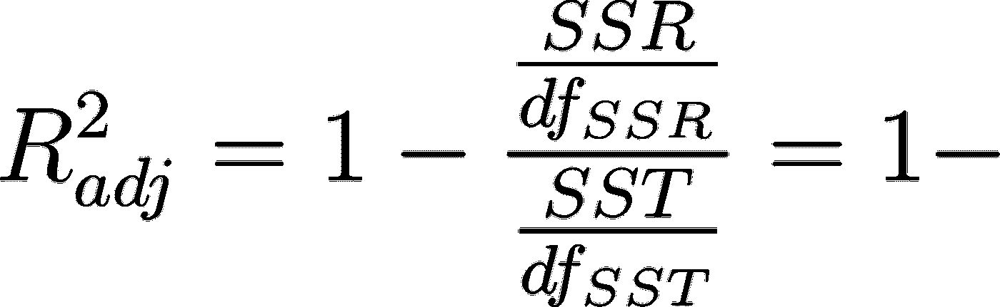****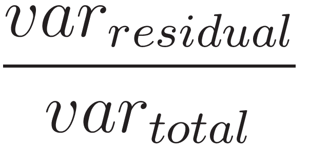**

**在哪里**

**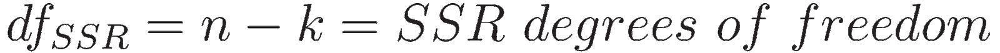****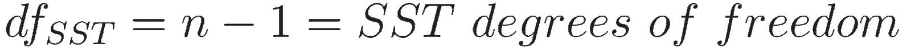**

**这使得 **R adj** 为:**

**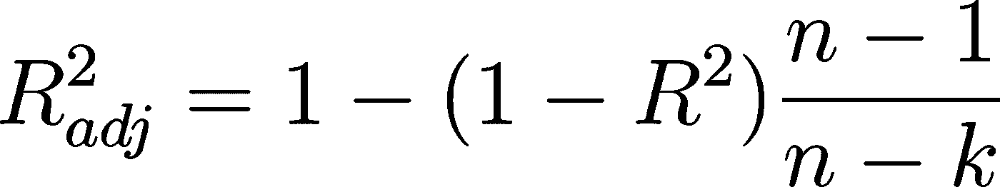**

**在哪里**

**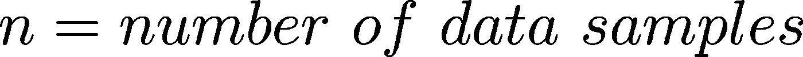****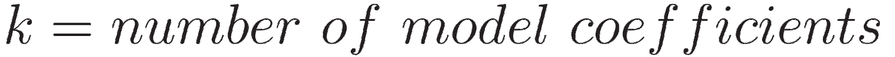**

**可以重写:**

**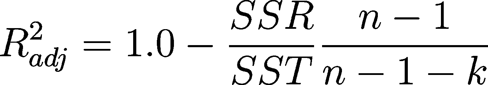**

**现在，我们有了一个随着更多参数的增加而减少的指标，奖励简单性——记住前面的内容，简单的模型比复杂的模型更受欢迎。**

# **结论**

**到目前为止，我们已经介绍了许多回归概念:**

*   **直线的单一回归方程为**

****

*   **使用 Python 模型对象`linear_model.LinearRegression()`初始化模型**
*   **使用`fit`方法使模型符合数据**
*   **使用`predict`方法计算因变量(y)的分数(预测值)**
*   **用`coef`拉模型参数——m(斜率)和 b(y 轴截距)——用`intercept`**
*   **残差是 y 输出和 y 预测之间的差值**
*   **使用`statsmodels`和`seaborn`库获取汇总统计数据并绘制诊断图**
*   **`sklearn`优于`sm`包，它使用起来更简单，也更健壮**
*   **什么是残差，为什么我们要画它们**

**我们用`summary`方法评估了 OLS 回归结果**

*   ****SSR** (残差平方和)是与回归线的误差差(尽量最小化)**
*   ****SST (** 总和的平方和)是目标平均值的差值**
*   ****SSE** (解释的平方和)是回归直线到平均值的变化**
*   ****RMSE** (均方根误差)是 SSR 的平方根**
*   ****R** 是由模型解释的原始数据的方差的分数，想要一个接近 1 的数字**
*   ****SST = SSR + SSE** 只适用于你的决定系数(COD)与你的皮尔逊相关系数 R 相同的情况。对于训练数据的最小二乘回归，是的。在这种情况之外，根据测试数据或当 SSR > SST 时，公式不成立**

**在我的下一篇文章中，我将介绍[多元回归](/multivariant-linear-regression-e636a4f99b40)和[用回归模型自举](/linear-regression-with-bootstrapping-4924c05d2a9)！**

**在 [Linkedin](https://www.linkedin.com/in/james-a-w-godwin/) 上找到我**

***物理学家兼数据科学家——适用于新机遇| SaaS |体育|初创企业|扩大规模***