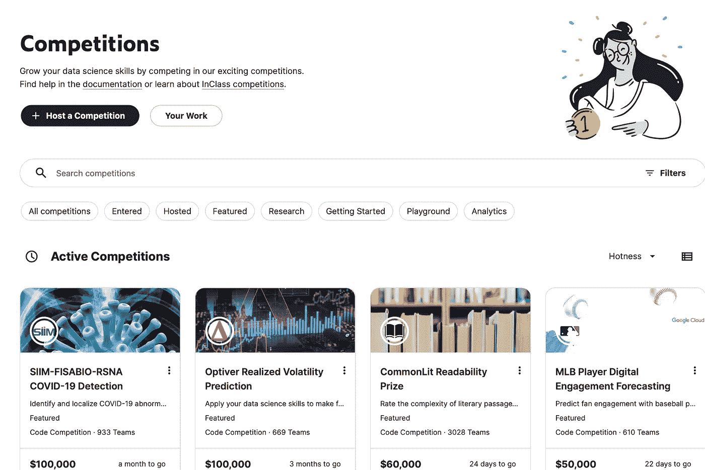
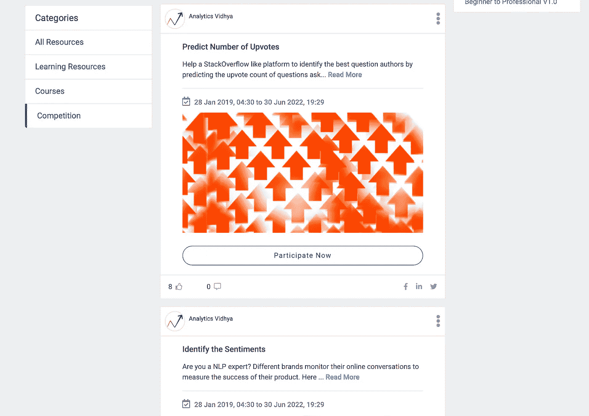
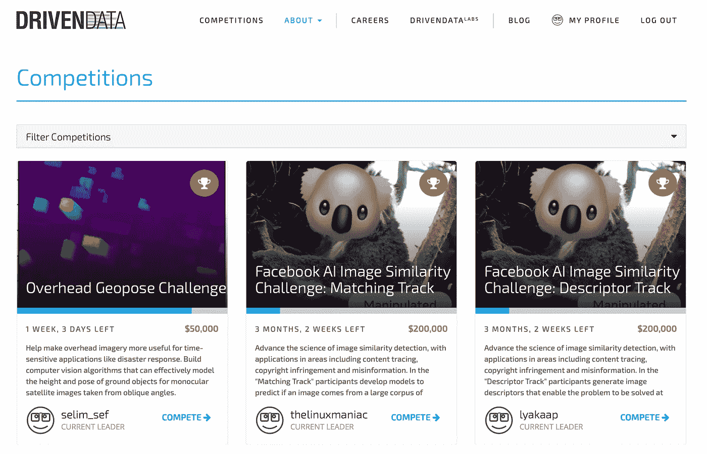

# 机器学习竞赛简介

> 原文：<https://towardsdatascience.com/an-introduction-to-machine-learning-competitions-133cce76e219?source=collection_archive---------12----------------------->

## 通过这三个竞争平台进行竞争、练习和赢取

由 [Serghei Trofimov](https://unsplash.com/@sergeytrofimov?utm_source=unsplash&utm_medium=referral&utm_content=creditCopyText) 在 [Unsplash](https://unsplash.com/s/photos/competition?utm_source=unsplash&utm_medium=referral&utm_content=creditCopyText) 拍摄的照片

学习数据科学最重要的一个方面是将你的知识付诸实践。在我看来，数据科学是最好通过实践来学习的东西。

如果你在正规教育或工作经验之外学习数据科学，找到练习你所学技能的地方可能会很棘手。机器学习竞赛为数据科学技术的实际应用提供了一个非常有效的平台。

参加数据科学竞赛可以帮助你学习、赚钱，还可以提供项目组合，帮助你在该领域获得第一份工作。

作为初学者或更高级的从业者参加机器学习竞赛提供了一系列好处，包括:

*   建立一个可以展示你技能的项目组合。
*   将你的技能与该领域的其他人进行比较。
*   利用您的技能解决接近真实世界的数据科学问题。
*   学习新技能。
*   潜在的收入，有些奖金高达 20 万美元。

有几个网站举办机器学习比赛。大多数都有类似的格式。这通常包括技能水平范围内的各种比赛的可用性，以及无奖励练习问题和附有经济奖励的比赛。

比赛本身通常会提供一个数据集和要解决的问题，以及一个排行榜，当你提交你的结果时，你会在那里。大多数比赛允许无限的条目，这意味着你可以不断完善你的模型，提高你的分数。

这是一个很好的学习方式，因为排行榜让您了解潜在的模型性能，并且您可以通过反复试验，很好地了解最适合改进模型以解决特定问题的技术和工具。

在本文的剩余部分，我将介绍三个我最喜欢的机器学习竞赛网站。这将包括每个网站的简要说明，谁最适合比赛，以及你可能获得的奖励水平的想法。

# 卡格尔

***最适合:*** *从初学者到高级修炼者的所有人。*

***典型头奖:*** *$10 万。*

***突出特点:*** *有一个很棒的社区为初学者提供支持。*

[Kaggle 比赛主页](https://www.kaggle.com/competitions)。图片作者。

[Kaggle](https://www.kaggle.com/competitions) 可能是最广为人知的机器学习竞赛网站。它还建立了一个优秀的社区来支持人们学习数据科学。教程、课程、示例内核和一个论坛都提供支持，帮助初学者开始比赛。

Kaggle 竞赛有一些重要的奖励，最高奖金在 10 万美元左右。比赛的复杂程度和所需的技术水平也各不相同。这意味着，无论你是希望将所学付诸实践的初学者，还是希望进一步拓展技能的高级从业者，都有合适的挑战来竞争。

# 分析 Vidhya

***最适合:*** *初学者。*

***典型头奖:*** *学习潜力。*

***脱颖而出特色:*** *竞赛涵盖的问题比较全面。*

[分析 Vidhya 竞赛页面](https://www.analyticsvidhya.com/myfeed/?resource_type=contest#)。作者图片

[Analytics Vidhya](https://www.analyticsvidhya.com) 是另一个出色的数据科学社区，也定期举办机器学习竞赛。然而，与 Kaggle 不同的是，大多数比赛纯粹是为了学习，而不是任何经济奖励。这样做的好处是，比赛通常更适合该领域的初学者，并提供了一个很好的机会来与其他也在学习的人对比你的技能。

总有一系列的竞赛，涵盖了数据科学的大多数关键领域，包括自然语言处理、图像识别、一般分类和回归以及预测。

# 驱动数据

***最适合:*** *中级到高级武者。*

***典型头奖:****20 万美元。*

***脱颖而出特色:*** *争夺头奖的机会，同时为解决社会问题做出贡献。*

[驱动数据](https://www.drivendata.org/competitions/)竞赛页面。图片作者。

DrivenData 的目标是众包数据驱动的解决方案来解决一些世界上最大的社会问题。因此，这个网站上的比赛让你能够学习和竞争奖品，同时还有助于解决重要的社会挑战的额外奖励。

这些比赛通常相当具有挑战性，但会吸引一些非常大的经济回报。目前提供的头奖价值 20 万美元。除了这些更难的问题，还有一些初级水平的练习问题。虽然这些通常没有奖金。

在这篇文章中，我已经给出了三个机器学习竞赛网站的描述。然而，还有许多其他地方可以竞争，如 [Innocentive](https://www.innocentive.com) 、 [Codalab](https://codalab.org) 和 [CrowdANALYTIX](https://www.crowdanalytix.com) 等等。数据科学竞赛提供了一种将您的技能付诸实践的有用方法，也是一个学习的好地方。

如果你是独立学习，这也是了解你的技能水平的一个很好的方法。如果你不像在正规教育中那样受益于同龄人或通过考试，就很难了解你的学习进展如何。参加机器学习比赛并了解自己能够在排行榜上获得多高的名次是实现这种了解的一个绝佳方式。

如果您目前正在学习数据科学，无论技能水平如何，请从今天开始参加竞赛。你越早开始在实践中应用你的技能，你就越早发现你不知道的地方和你需要改进的地方。这是迄今为止最快的学习方法。在你知道之前，你将在排行榜上名列前茅，并赢得那些 [Kaggle 奖牌](https://www.kaggle.com/progression)！

感谢阅读！

[**我每月发一份简讯，如果你想加入，请通过此链接注册。期待成为您学习旅程的一部分**](https://datacademy.eo.page/h7g4c)