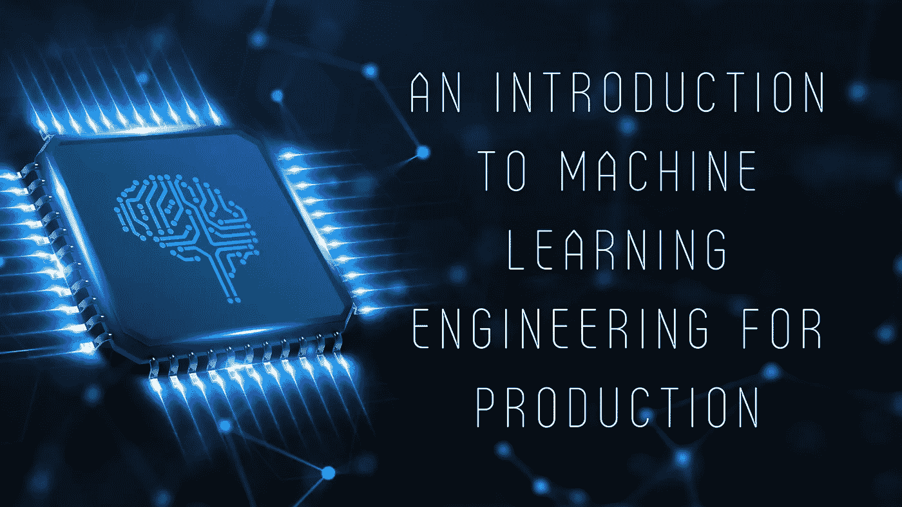

# 面向生产/多任务生产的机器学习工程介绍——多任务生产中的阶段

> 原文：<https://towardsdatascience.com/an-introduction-to-machine-learning-engineering-for-production-mlops-phases-in-mlops-43fd22567366?source=collection_archive---------21----------------------->

(图片作者来自 [Canva](https://www.canva.com/) )

## 关于机器学习模型生产阶段的讨论，即范围、数据、建模和部署。

欢迎回来！这将是 MLOps 系列的第二篇文章。之前，我们简要介绍了生产中面临的挑战以及应对这些挑战的一些简单解决方案。如果你没有机会看我以前的文章，你可以在这里查看[。](/an-introduction-to-machine-learning-engineering-for-production-part-1-2247bbca8a61)

现在，正如我们之前讨论的，生产部分可以大致分为 4 个阶段。在本文中，让我们探索这些阶段以及它们各自的真正含义。

# 1.辖域

简而言之，范围界定有助于确定问题的可行解决方案。让我们考虑一个例子，你正在为你的公司做一个手写识别项目。现在，解决这个问题的一些初始步骤可以是查看这个问题的基准论文/开源实现。通常，对于大多数项目来说，这是一个很好的起点，因为在你之前几乎总会有人试图解决相同的问题陈述。在此之后，您可以将您的数据提供给这个开源模型并对其进行微调，或者从开源模型中提取一些数据并制作您自己的模型。基本上，查看这些预先存在的解决方案可以让您对可达到的精度水平有一个基本的了解。这就是范围界定所需要的。范围界定中涉及的一些要点是-

*   集思广益解决商业问题
*   集思广益人工智能解决上述问题
*   评估解决方案的可行性和潜力(我认为这非常重要)

这就是范围界定的本质。它帮助你或你的团队更好地了解手头的问题以及如何着手解决它。

# **2。数据**

众所周知，数据在很大程度上统治着人工智能世界。我们的模型，至少在监督学习的情况下，只和我们的数据一样好。重要的是，尤其是在团队中工作时，要对你所拥有的数据保持一致。考虑我们前面定义的相同的手写识别任务。假设你和你的团队决定暂时丢弃点击不好的图片。现在，什么是点击不好的图像？对你的队友和你来说可能都不一样。在这种情况下，建立一套规则来定义什么是点击不好的图像是很重要的。也许如果你很难在一页上读到 5 个以上的单词，你会决定扔掉它。诸如此类的东西。即使在研究中，这也是极其重要的一步，因为数据和标签的模糊性只会给模型带来更多的混乱。

另一件需要考虑的重要事情是您正在处理的数据的类型，即结构化或非结构化。你如何处理你拥有的数据很大程度上取决于这个方面。非结构化数据包括图像、音频信号等，在这些情况下，您可以执行数据扩充来增加数据集的大小。然而，对于结构化数据，数据扩充是不可取的。标记也是一样——作为人类，我们发现非结构化数据比结构化数据更容易标记。

处理数据时要记住的一些要点是-

*   干净的标签至关重要
*   贴标机必须就贴标的标准程序达成一致，以确保一致性
*   仅将人的水平的性能(我们将很快对此进行更多讨论)作为非结构化数据任务的基准
*   确保您在收集数据时从容不迫，但同时也开始处理模型。让数据收集方法在本质上是迭代的。

# **3。建模**

许多人可能认为这是最重要的阶段，然而，这是不正确的。我仍然认为数据阶段要重要得多。话虽如此，我承认建模也是一个重要的阶段。它围绕着微调，开发你的模型，并试图达到一定程度的准确性。不像简单的项目，在开发/测试集上做得好可能是模型做得好的指示，这不是 MLOps 的情况。这是因为部署时模型将与之交互的真实世界的数据可能会导致模型的行为方式与预期的不同，因此了解如何处理您的模型非常重要。

有一些关键的步骤来确保你得到正确的建模部分。大致可以总结如下-

*   **建立基线**:一些经常被忽视的事情(个人犯了这个错误，请不要犯这个错误*内心尖叫*)，建立基线非常重要，因为它有助于给你一个如何前进的想法。它基本上包括查阅相关领域的先前研究，或者看看做同样事情的其他公司的产品，看看他们的模型有多好。这再加上了解所需/可用的计算资源，可以帮助您复制一些最先进的(SOTA)结果。DL 社区的一个好处是 SOTA 的大部分论文都是开源的。这使得不仅建立基线变得容易，而且建立相似的或者在某些情况下甚至更好的模型也变得容易。对于非结构化数据，可以以人的水平的表现作为评判你的模型的标准。考虑前面给出的手写识别任务——如果一个开源模型能够以大约 20%的错误率阅读单词，那么这就是你的任务基线。如果你觉得你有办法复制 SOTA 的论文，那么你也可以用他们的结果来建立你的基线。都是主观的。
*   **以数据为中心的方法**:以数据为中心的方法正在社区中迅速获得牵引力，它涉及到关注数据而不仅仅是模型。努力尝试并确保数据的高质量并得到保持。虽然这在研究中并不常见，但在我看来，以数据为中心的方法是改善模型结果的唯一确定的方法。确保您的数据覆盖重要的测试用例，被一致地定义，并且尽可能平均地分布，这些都是以数据为中心的方法的一部分。就我个人而言，在我参与的项目中，每当我尝试采用以数据为中心的方法时，我总能看到对看不见的数据的准确性略有提高。它可以是一些小事情，比如在将图像提供给模型之前修复图像中的光照条件等等。
*   **实验跟踪/版本控制**:devo PS 中一个众所周知的步骤，版本控制帮助我们跟踪变化，并让我们在应用程序可能抛出错误的情况下恢复到以前的工作版本。在 MLOps 中，跟踪所用算法的**代码**、**超参数**、**数据集**(如果有的话)的变化，以及为某组超参数获得的**结果的种类**等非常重要。

# 4.部署

现在我们已经准备好了模型，下一步是什么？当然是部署！这包括在现实环境中发布您的模型，或者将其集成到为其开发的应用程序/边缘设备中。即使在部署中，也有某些类型的部署。这些是-

*   影子部署(Shadow Deployment):在这种类型的部署中，模型被部署，但是最终的决定由人做出，不管模型预测什么。这样做通常是为了衡量模型做得有多好以及它在哪里失败了。
*   **金丝雀部署**:在这种类型的部署中，模型只暴露给一小部分允许它做出决策的数据。例如，模型可能只暴露于每 1000 张图像中的 10 张。根据模型的表现，流量会逐渐增加，或者模型会被拉回并进行调整。
*   **蓝绿部署**:在这种部署中，流量逐渐从旧版本或*蓝*版本迁移到新版本或*绿*版本。这有助于防止任何类型的停机，并且在任何错误/错误的情况下，应用程序可以很容易地回滚到以前的稳定版本或蓝色版本。

接下来要看的是对我们部署的模型的监控。请记住，部署是一个迭代的过程。因此，总有改进的空间，唯一可以改进的方法是，即使在部署后也要监控他们的模型。有许多软件可以用来监控指标等。我可能会在以后的文章中谈到这些。现在，让我们关注一些关键点，以确保我们部署的模型能够顺利运行-

*   考虑服务器负载的种类并对其进行监控
*   检查所有可能的情况，在这些情况下你的模型可能会失败或者可能会出错，然后尝试纠正这些情况或者确保正确的错误处理
*   和你的团队一起，决定几个关键指标来判断你的模型的性能
*   不要固执于你的性能指标，对变化保持开放的态度，并且总是尝试和致力于确定最适合你的模型的指标
*   确保不仅模型而且 ML 管道都受到监控。有时，由于预处理步骤中的一个小错误可能会导致错误，这可能会导致整个系统的崩溃(在那里，搞乱了输入形状，并试图通过只查看模型的代码来解决错误；-;)
*   对于您正在处理的问题陈述，了解真实世界的数据可以/可能变化得有多快。

这就对了。关于 MLOps 的阶段，我要说的就是这些。如果你已经做到了这一步，并且想了解更多关于 MLOps 的知识，请随时查看我的 [**GitHub 库**](https://github.com/praatibhsurana/Machine-Learning-Engineering-for-Production) 。我会用相关的材料和 Jupyter 笔记本不断更新它！

**参考文献**

1.  [https://www . red hat . com/en/topics/devo PS/what-is-blue-green-deployment](https://www.redhat.com/en/topics/devops/what-is-blue-green-deployment)
2.  [https://www . coursera . org/learn/introduction-to-machine-learning-in-production](https://www.coursera.org/learn/introduction-to-machine-learning-in-production)
3.  [https://cloud . Google . com/blog/products/ai-machine-learning/key-requirements-for-an-m lops-foundation](https://cloud.google.com/blog/products/ai-machine-learning/key-requirements-for-an-mlops-foundation)
4.  [https://blog.ml.cmu.edu/2020/08/31/3-baselines/](https://blog.ml.cmu.edu/2020/08/31/3-baselines/)
5.  [https://blog . tensor flow . org/2021/01/ml-metadata-version-control-for-ml . html](https://blog.tensorflow.org/2021/01/ml-metadata-version-control-for-ml.html)