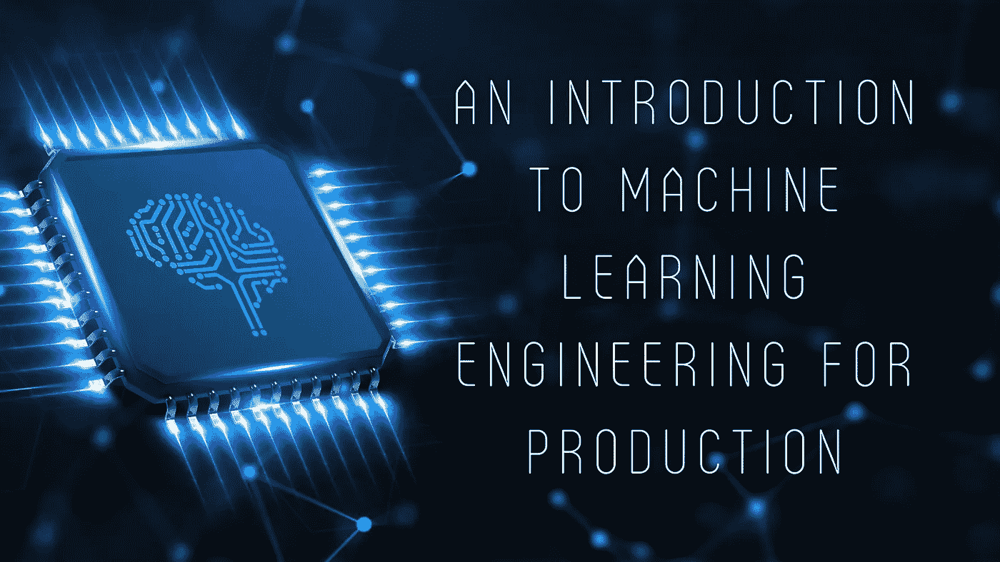

# 面向生产/物流的机器学习工程导论——概念和数据漂移

> 原文：<https://towardsdatascience.com/an-introduction-to-machine-learning-engineering-for-production-part-1-2247bbca8a61?source=collection_archive---------31----------------------->

(图片作者来自 [Canva](https://www.canva.com/) )

## 简要介绍数据漂移、概念漂移和 MLOps 中面临的挑战，以及解决这些问题的一些最佳实践。

可以肯定地说，我们大多数人从机器学习/深度学习开始，都能够轻松地开发基本模型，并取得不错的结果。然而，从个人经验来说，我们很少接触到我们模型的部署，特别是如果我们对 Flask、Django 等框架几乎没有经验的话。

许多机器学习课程都复习了解决某些类型问题所需的算法、代码片段和库的基础知识。然而，我还没有特别找到任何专门针对生产相关主题的课程。直到 DeepLearning.ai 就这个话题发布了他们的[特殊化](https://www.coursera.org/programs/manipal-education-tguaf/browse?currentTab=CATALOG&productId=UTg2EeldEeq3QQ5dqWzZRQ&productType=s12n&query=MLOps&showMiniModal=true)！这篇文章(或者可能是一系列文章)本质上是这个专业的[第一门课](https://www.coursera.org/learn/introduction-to-machine-learning-in-production)所讲内容的总结，同时也混合了我对这个主题的看法。

每个 ML/DL 项目大致可以分为 4 个阶段——即**范围界定**、**数据**、**建模**、**部署**。现在，在我们查看每个阶段(可能在后续文章中)和最佳实践之前，重要的是要理解在现实世界中生产可伸缩模型所面临的挑战。

**ML 项目开发阶段**(图片由作者提供)

模型部署后经常出现的两种情况是**概念漂移**和**数据漂移。**

*   概念漂移指的是在一段时间内输入数据‘x’和输出数据‘y’之间关系的*变化。 **Eg-** 考虑一个房价预测模型。在像疫情这样的异常情况下，房地产价格会突然发生变化，因此模型可能不再做出准确的预测。在正常情况下，一个价值 500 万印度卢比的住宅现在可能要花费 750 万印度卢比才能获得同样数量的功能，如卧室、空调、平方英尺面积等。*

**概念漂移**(图片作者提供)

*   数据漂移是指输入特性的*变化。从数学上来说，是变量分布的变化导致了它们意义的变化。**考虑一个处理银行交易的模型。通常，必须有某种交易限制，超过某个阈值的任何交易都可能导致信用卡出于安全目的而被冻结。然而，再想想疫情的情况，那里由于必需品的有限供应而出现了支出增加(或囤积必需品)的情况。这将导致正常的 ML 模型阻塞每个人的卡以限制交易。因此，由于正常事务数量(输入特征)的变化，模型的性能不如预期。***

**数据漂移**(图片由作者提供)

除了部署后面临的这些挑战之外，在部署您的模型之前需要问的一些关键问题是-

*   该模型是否将被实时使用？
*   部署模型的设备可以访问互联网吗？
*   该模型将部署在边缘设备还是云上？
*   需要哪种计算资源？

如果这些问题能够得到回答，那么作为一名机器学习工程师，你的生活会轻松很多，而且在项目中途进行更改时也不会浪费太多时间。令人惊讶的是，我还发现这些问题中的一些在开始任何以研究为导向的项目时很有用。

现在，因为我已经告诉了你们所面临的挑战，所以讨论解决这些挑战的可行方案是有意义的。这些可以大致概括如下-

*   在发生变化/漂移之前和之后，使用所有可用的数据重新训练您的模型。
*   微调模型超参数以尝试和调整模型可能遇到的新模式会有所帮助。此外，这比数据相关的方法相对容易。一个优势是模型部署不必是一次性的过程，而是本质上的**迭代**。每隔几周/几个月，你就可以推出你的模型的一个改进版本，而且几乎总是这样，因为现在你的模型对真实世界的数据有了更多的经验。
*   最后，如果你觉得你已经获得了足够的新数据，丢弃旧数据。数据越新鲜，你就越容易训练你的模型来适应问题陈述(在大多数情况下)。

这就对了。这是对 MLOps 的简要介绍，还有很多内容要介绍，但我认为这是结束本文的好地方。在接下来的文章中，我们将更详细地讨论开发和部署模型的 4 个阶段，并进一步深入研究用于确保平稳操作的技术。

如果你已经做到这一步，并想了解更多关于 MLOps 的信息，请随时查看我的 [**GitHub 库**](https://github.com/praatibhsurana/Machine-Learning-Engineering-for-Production) 。我会用相关的材料和 Jupyter 笔记本不断更新它！

参考

1.  [https://machinelingmastery . com/gentle-introduction-concept-drift-machine-learning/](https://machinelearningmastery.com/gentle-introduction-concept-drift-machine-learning/)
2.  [https://www . explori um . ai/blog/understanding-and-handling-data-and-concept-drift/](https://www.explorium.ai/blog/understanding-and-handling-data-and-concept-drift/)
3.  [https://towards data science . com/machine-learning-in-production-why-you-should-care-data-and-concept-drift-d 96d 0 BC 907 FB 0](/machine-learning-in-production-why-you-should-care-about-data-and-concept-drift-d96d0bc907fb0)
4.  [https://youtu.be/06-AZXmwHjo](https://youtu.be/06-AZXmwHjo)
5.  [https://www . coursera . org/learn/introduction-to-machine-learning-in-production](https://www.coursera.org/learn/introduction-to-machine-learning-in-production)