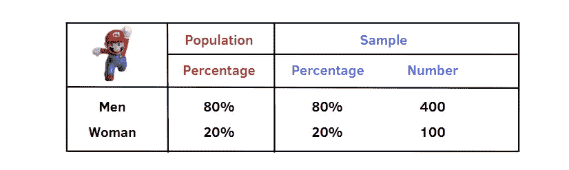
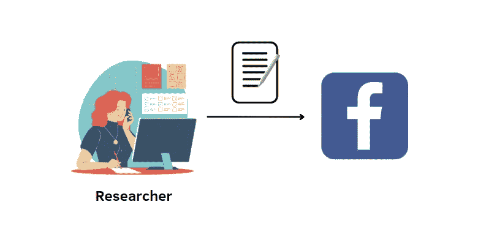

# 非概率抽样方法介绍

> 原文：<https://towardsdatascience.com/an-introduction-to-non-probability-sampling-methods-b74c76f7f710?source=collection_archive---------7----------------------->

## 探索数据科学的其他采样技术

克里斯汀娜·戈塔迪在 [Unsplash](https://unsplash.com/photos/BiUioL7G4yc) 上的照片

> 本文是上一篇文章[的续篇，介绍概率抽样方法](/an-introduction-to-probability-sampling-methods-7a936e486b5?sk=590cb6b5faf84709f158b77b998b6c1a)。抽样方法不仅在统计学研究中有相关作用，而且在许多机器学习方法中也有相关作用，例如 K-fold 交叉验证和基于决策树的模型。为此，我决定对这些方法进行更多的研究。此外，它们可以主要分为两大类，概率方法和非概率方法。由于概率技术在上一篇文章中已经介绍过了，现在我们将学习另一类技术。

# 非概率抽样方法

在非概率抽样方法中，每个被选总体元素的概率是**未知**。这是与概率方法最明显的区别，在概率方法中，被选择的群体中的每个单元的概率是已知的并且可以被估计。非概率抽样方法的另一个重要方面是，研究者的角色在他/她所进行的研究中起着核心作用。参与者的选择取决于数据收集者的主观性。虽然它们提供了许多优势，如简单的组织、低成本和执行速度，但使用这些技术也有缺点，在进行任何市场或其他类型的研究之前必须考虑这些缺点:

*   所选单位的选择依赖于研究者的判断，因此，样本中可能存在**选择偏差**。
*   样本不具有代表性，因此，对样本**进行的结果不能扩展到所有总体**。
*   不可能估计结果的精确度。

你可能会问自己为什么要使用这些方法，因为它们有很多缺点。这是因为概率抽样方法在金钱和时间上是昂贵的，并且不可能有一个完整的人口列表。因此，非概率方法提供了一种更简单、更便宜的收集数据的方法。

作为概率抽样方法，非概率抽样方法可以进一步分为四类。

**非概率抽样方法:**

1.  **配额抽样**
2.  **判断取样**
3.  **方便取样**
4.  **雪球取样**

# 1.定额抽样

作者插图

配额抽样可能与分层抽样相混淆，因为它们都是根据某些特征，如性别、年龄和教育程度，将人口分成不同的阶层。此外，*团队需要内部同质，内部异质。*

即使乍看起来相似，配额抽样在许多方面也不同于分层抽样:

*   每个组由配额表示，配额是要调查的单元的数量
*   为每个阶层选择单位时考虑了它在整个人口中的分布。
*   在每个名额内，面试官可以自由选择面试的参与者。

例如，我们可以按性别研究 2020 年人口为 1 万的超级马里奥 Run 应用内支出者。如上表所示，我们计算每一组在总体中的百分比**，**，然后，研究人员可以计算他需要每一组多少个样本来保持相同的比例。在这种情况下，我们抽取了 500 个单位的样本，其中研究者采访了 400 名男性和 100 名女性。

**优点:**

*   这既省时又省钱，尤其是在分层抽样方面。

**缺点:**

*   由于面试官的谨慎或不回答的偏见，结果可能会被扭曲
*   配额样本会产生选择偏差

# 2.判断抽样

判断取样。作者插图。

判断性抽样，也称为目的性抽样，考虑了研究者的判断。对于调查研究，他/她选择参与者，因为他认为他们是人群的代表。一般来说，当只有有限数量的人具有特定的特质时，这是有用的。

例如，如果你想调查技术工作中的性别差距，样本不是随机选择的，而是为特定目的而选择的。应该有一些标准来选择受访者。我们可以只考虑来自美国、加拿大和英国的 35 岁以下的男性和女性。此外，参与者至少应完成科学领域的学士学位。

**优点:**

*   又省时又划算
*   它适合于研究某个文化领域，在那里需要专家的知识

**缺点:**

*   研究人员的知识和人口的实际情况之间的差距越大，就可能导致较高的选择偏差

# 3.方便抽样

方便取样。作者插图

在方便抽样中，研究者选择任何对他“方便”的人，即可以立即回答问题的人，没有任何特定的标准。很多时候，参与的人都是志愿者。招募人员没有特定的策略:研究人员可以招募朋友、家人或社交媒体中的人。这种方法导致选择有偏差的样本，不能代表总体。

大多数时候，它构成了一个非常危险的数据来源，因为它会带来关于所研究现象的误导信息。一个典型的例子是，当你在网上点击一个选项，给出你对一个敏感话题的看法，比如政治。它会导致错误的结论，从而出现极端的观点。

**优点:**

*   它既便宜又快捷

**缺点:**

*   这导致样本不具有代表性

# 4.滚雪球抽样

滚雪球抽样。作者插图

在滚雪球抽样中，研究人员要求已经招募的人识别其他潜在的参与者，等等。因此，样本的单位像滚雪球一样增加。它特别适合于稀有人群，对于稀有人群，不可能有人群列表，并且很难在区域内定位结果，即使是很少的人。

例如，如果我们想对没有居住许可的移民的工作条件进行研究，收集数据可能会很困难。最快的方法是联系一个移民，让他联系其他他认识的人。

**优点**:

*   这对于市场研究或关于敏感话题的研究很有用。

**缺点:**

*   样本可能不具有代表性，因为它不是随机的，而是取决于研究者直接或间接接触的人
*   这很费时间

# 最终想法:

在这篇文章中，我提供了非概率抽样方法的概述。总的来说，它们具有成本和时间效益，但同时，获取非代表性样本的风险也很高。它们应该在没有完整的人口名单和概率方法不能应用的情况下使用。与概率抽样方法不同，非概率抽样方法用于数据收集。希望这个故事和之前关于概率抽样方法的故事帮助你掌握了抽样方法。感谢阅读！祝你有愉快的一天。

你喜欢我的文章吗？ [*成为会员*](https://eugenia-anello.medium.com/membership) *每天无限获取数据科学新帖！这是一种间接的支持我的方式，不会给你带来任何额外的费用。如果您已经是会员，* [*订阅*](https://eugenia-anello.medium.com/subscribe) *每当我发布新的数据科学和 python 指南时，您都可以收到电子邮件！*