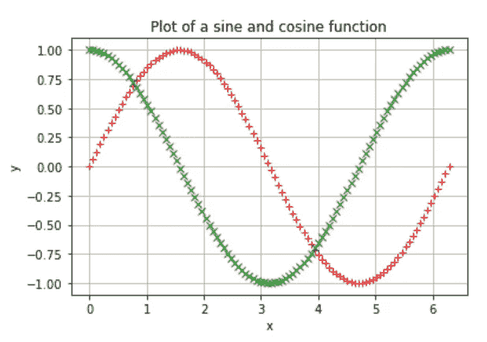
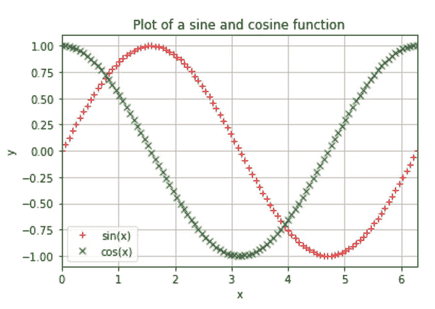

# Python 中 Matplotlib 绘图简介

> 原文：<https://towardsdatascience.com/an-introduction-to-plotting-with-matplotlib-in-python-6d983b9ba081?source=collection_archive---------20----------------------->

## UCL 数据科学协会工作坊 7:创建一个基本图形，在同一个图形上绘制不同的信息，并创建多个支线图形


尼古拉斯·卡佩罗在 [Unsplash](https://unsplash.com?utm_source=medium&utm_medium=referral) 上拍摄的照片

今年，作为 UCL 数据科学学会的科学负责人，该学会将在整个学年举办一系列 20 场研讨会，涵盖的主题包括数据科学家工具包 Python 和机器学习方法简介。每一篇文章的目标都是创建一系列的小博客，这些小博客将概述要点，并为任何希望跟进的人提供完整研讨会的链接。所有这些都可以在我们的 [GitHub](https://github.com/UCL-DSS) 资源库中找到，并将在全年更新新的研讨会和挑战。

本系列的第七个研讨会介绍了 matplotlib python 包，它是数据科学家工具包系列的一部分。在本次研讨会中，我们将介绍如何构建一个基本的绘图，在同一个图表上绘制不同的信息，以及跨多个轴绘制信息。虽然这里将分享一些亮点，但完整的研讨会(包括自测题)可以在这里找到[。](https://github.com/UCL-DSS/matplotlib-workshop)

如果您错过了我们之前的任何研讨会，您可以在以下链接中找到最后三场:

</ucl-data-science-society-pandas-8ad28c2b22e5>  </ucl-data-science-society-introduction-to-numpy-7d962d63f47d>  </ucl-data-science-society-object-oriented-programming-d69cb7a7b0be>  

## **什么是 Matplotlib？**

Matplotlib 是另一个应该包含在任何数据科学家工具包中的核心数据科学库，以及之前介绍的 Numpy 和 Pandas 库。这个库的主要目的是创建可视化，以便能够更好地理解您所拥有的数据，pandas 基于这个库构建了自己的功能。

在 [Matplotlib 网站](https://matplotlib.org/stable/index.html)上描述为:

> Matplotlib 是一个用于在 Python 中创建静态、动画和交互式可视化的综合库。

该库的目标和目的是使绘图尽可能简单，因为它还声明:

> Matplotlib 让简单的事情变得简单，让困难的事情变得可能。

虽然 Python 中有许多其他可视化库，包括 [seaborn](https://seaborn.pydata.org/) 和 [plotly](https://plotly.com/) ，但这通常是你学习的第一个可视化工具，因此这也是我们在一个研讨会中讨论它的原因。

## 创建您的第一个情节

在创建任何图之前，我们需要做的第一件事是实际创建我们将用于绘图的数据！因为我们已经了解了 Numpy 库及其丰富的功能，所以我们可以使用 Numpy 数组及其数学功能来创建我们可以绘制的数据。我们可以这样做:

```
# Creating an array with 100 values from 0 to 2pi
x = np.linspace(0,2*np.pi,100)# An array with the sine of all the values in array x
y = np.sin(x)
```

现在我们有了 x 和 y 的数据，我们可以开始创建我们的图了！

为此，我们可以从创建一个相当基本的图开始，其中我们将数据非常简单地显示为轴上的一条线，如下所示:

```
# Produces the figure
plt.figure()# Plots the sine function
plt.plot(x,y)
```


作者图片

简单来说，我们只使用了两行代码来创建我们的图表(您甚至可以删除第一行，它仍然可以工作！).那是多么美好和简单啊！

当然，这是一个相当基本的情节，所以我们可以开始改善它。我们注意到的第一件事是，我们不一定能看到数据在图上如何排列，因为没有网格来显示正弦波的波峰和波谷。因此，我们可以使用`plt.grid`将网格添加到我们的图中，如下所示:

```
# Produces the figure
plt.figure()# Adds a grid
plt.grid(True)# Plots the sine function
plt.plot(x,y)
```


作者图片

由此我们可以看到，y 值在 1 处达到峰值，在-1 处降至最低点，我们可以更准确地读取与 x 和 y 值相关的数据。

然后，我们可以开始定制情节的外观。例如，如果我们想将颜色从蓝色变为红色，我们可以指定颜色为`r`，如果我们想将线条样式从实线变为圆点，我们可以如下指定`r.`:

```
# Produces the figure
plt.figure()# Adds a grid
plt.grid(True)# Plots the sine function with red dots
plt.plot(x,y,'r.')
```


作者图片

其他方法也可以使用图的`color`和`linestyle`参数来改变外观，包括各种颜色的线条和不同外观的线条样式。

当然，我们已经能够使我们的线条看起来更好、更清晰，但其他任何看这个情节的人可能不明白我们试图用情节本身来展示什么。因此，为此我们需要添加一个标题和标签来表明我们想要展示的内容。我们可以这样做:

```
# Produces the figure
plt.figure()# Adds a grid
plt.grid(True)# Adds a title
plt.title("Plot of a sine function",
         fontsize = 20,
         pad = 15)# Adds label for the x-axis
plt.xlabel("x",
          fontsize = 15,
          labelpad = 20)# Adds label for the y-axis
plt.ylabel("sin(x)",
          fontsize = 15,
          labelpad = 15)# Plots the sine function with red + signs
plt.plot(x,y,'r+')
```


作者图片

我们使用了`plt.xlabel`、`plt.ylabel`和`plt.title`函数将它们添加到图中。我们还指定了`fontsize`来指定标签上使用的字体大小，并指定了`labelpad`和`pad`来将标签从轴上移开，以便于阅读。

由此，我们可以开始在我们的地块中添加更多的功能，并创建我们自己的风格，可以在我们创建的所有地块中使用。然而，Matplotlib 有丰富的内置样式表，我们可以使用`plt.style.use(`namedstyle`)`来访问。其中我最喜欢的一个是`fivethirtyeight`样式表，因为它能够产生漂亮清晰的视觉效果，以及干净容易识别的调色板。我们可以这样实现:

```
# Changing style to fivethityeight
plt.style.use('fivethirtyeight')# Produces the figure
plt.figure()# Adds a grid
plt.grid(True)# Adds a title
plt.title("Plot of a sine function",
         fontsize = 20,
         pad = 15)# Adds label for the x-axis
plt.xlabel("x",
          fontsize = 15,
          labelpad = 20)# Adds label for the y-axis
plt.ylabel("sin(x)",
          fontsize = 15,
          labelpad = 15)# Plots the sine function with red + signs
plt.plot(x,y, "+")
```


作者图片

现在看起来干净多了！更多这些，以及它们的样子的例子，可以在这里的[链接](https://matplotlib.org/stable/gallery/style_sheets/style_sheets_reference.html)找到。

## 同一轴上的多个图

虽然我们现在有了一个看起来不错的图，显示了我们想要的所有信息，但是如果我们想在同一个图中添加更多的信息呢？我们可以通过重用相同的轴并绘制新数据来简单地做到这一点。

在我们的例子中，由于我们已经创建了一个正弦波，我们也可以使用相同的 x 序列创建一个余弦波，以比较它们如何在相同的值上变化。我们可以这样做:

```
# Generates an array of cos(x) values
y1 = np.cos(x)# Produces the figure
plt.figure()# Adds a grid
plt.grid(True)# Adds a title
plt.title("Plot of a sine and cosine function")# Adds label for the x-axis
plt.xlabel("x")# Adds label for the y-axis
plt.ylabel("y")# Plots the sine function with red + signs
plt.plot(x,y,'r+')# Plots the cos function with green crosses
plt.plot(x,y1,'gx')
```



作者图片

太好了！我们可以看到，我们已经能够使用与之前相同的函数来添加网格和标签，但现在我们已经能够添加余弦函数以及绿色十字。现在唯一的问题是，除非我们看到正弦函数开启时的原始图(或者我们知道正弦函数应该是什么样子)，否则我们不一定知道如何区分它们。这就是传说派上用场的地方！

为了给我们的图添加图例，我们需要为正弦和余弦函数的图指定一个标签，以便能够区分它们。这是通过向`plt.plot`函数添加一个额外的参数`label=`来实现的。这个标签需要被设置为我们想要标记图的字符串。然后我们添加一行额外的`plt.legend`来显示图例。这里的可选参数`loc="best"`经常被使用，它只是试图确保图例被放置在图中最合适的位置。我们可以这样尝试:

```
# Produces the figure
plt.figure()# Adds a grid
plt.grid(True)# Adds a title
plt.title("Plot of a sine and cosine function")# Adds label for the x-axis
plt.xlabel("x")# Adds label for the y-axis
plt.ylabel("y")# Plots the sine function with red + signs and defines a legend label
plt.plot(x,y,'r+',label="sin(x)")# Plots the cos function with green crosses and defines a legend label
plt.plot(x,y1,'gx',label="cos(x)")# Adds a legend in the best position
plt.legend(loc='best')
```


作者图片

现在我们可以清楚地分辨出哪个是正弦函数，哪个是余弦函数。唯一剩下的问题是，我们现在在绘图的两端都有一些空白空间，我们的行基本上在这里用完了。因此，我们可以尝试限制我们的轴，以便我们只显示使用`plt.xlim`和`plt.ylim`函数实际绘制值的位置，如下所示:

```
# Produces the figure
plt.figure()# Adds a grid
plt.grid(True)# Adds a title
plt.title("Plot of a sine and cosine function")# Adds label for the x-axis
plt.xlabel("x")# Adds label for the y-axis
plt.ylabel("y")# Defines a region along the x-axis to be displayed
plt.xlim(0,2*np.pi)# Plots the sine function with red + signs and defines a legend label
plt.plot(x,y,'r+',label="sin(x)")# Plots the cos function with green crosses and defines a legend label
plt.plot(x,y1,'gx',label="cos(x)")# Adds a legend in the best position
plt.legend(loc='best')
```



作者图片

## 使用多轴

到目前为止，我们已经能够创建一个显示单个数据的图，然后我们能够创建一个显示多个数据的图。如果我们有两个独立的数据，我们想在多个图中显示，但我们不想创建两个独立的图呢？嗯，我们可以通过创建一个支线剧情数组来做到这一点！

有两种方法可以做到这一点。第一个是创建一个基础图形，就像我们已经做的那样，然后向原始图形添加支线剧情，我们可以向其中添加数据。为此，我们可以使用`fig.add_subplot(1,2,1)`，其中前两个数字表示创建的数组的大小(这里是 1 行 2 列)，而第三个数字表示这将是哪个子情节。我们可以将它赋回一个变量，将其创建为一个轴。我们之前所做的和现在所做的唯一区别是，我们现在有了一个轴，而不是使用`fig.title`或`fig.xlabel`，我们现在必须使用`ax.set_title`和`ax.set_xlabel`。例如，我们可以像以前一样创建两个子轴来添加我们的图:

```
# Defines a variable for your array of subplots
fig = plt.figure(figsize=(10,5))# Adds a subplot to the array
ax1 = fig.add_subplot(1,2,1)# Plots the sine function on the first subplot
ax1.plot(x,y1,'r')
ax1.set_title("Sine function")
ax1.set_xlabel("x")
ax1.set_ylabel("y")
ax1.grid(True)# Plots the cosine function on the second subplot
ax2 = fig.add_subplot(1,2,2)
ax2.plot(x,y2,'g')
ax2.set_title("Cosine function")
ax2.set_xlabel("x")
ax2.set_ylabel("y")
ax2.grid(True)#to ensure no overlapping
plt.tight_layout()
```


作者图片

我们可以看到，现在我们已经创建了两个独立的轴，然后我们可以绘制我们的数据！

另一种方法是使用`fig, ax = plt.subplots(1,2, figsize = (10,5))`直接指定我们正在创建子情节，其中`fig`是我们的基轴，`ax`是一个轴数组，我们可以像访问列表或数组一样访问它。因此，我们可以绘制出与前面相同的信息，如下所示:

```
fig, ax = plt.subplots(1,2, figsize = (10,5))# Plots the sine function on the first subplot
ax[0].plot(x,y1,'r')
ax[0].set_title("Sine function")
ax[0].set_xlabel("x")
ax[0].set_ylabel("y")
ax[0].grid(True)# Plots the cosine function on the second subplot
ax[1].plot(x,y2,'g')
ax[1].set_title("Cosine function")
ax[1].set_xlabel("x")
ax[1].set_ylabel("y")
ax[1].grid(True)#to ensure no overlapping
plt.tight_layout()
```


作者图片

我们现在有完全相同的图，但是使用了稍微不同的符号！然后，我们可以使用这些来创建多个子情节数组，以在同一个整体情节中显示多种类型的数据！

为此，后一种创建支线剧情的方法更常用，因为你直接指定你正在创建几个子轴，而不是稍后指定。当您创建一个单轴(指定`1,1`)时，也经常使用它，因为它确保当您绘制多条信息时，所有内容都绘制在同一个轴上！

当然，Matplotlib 可以做的不仅仅是像这样绘制基本信息，我们还会在实际的[研讨会中介绍如何创建矩阵图、choropleth 图、雷达图等等。Matplotlib 是一个非常广泛的库，它允许你用它做很多事情，包括箱线图、散点图、条形图和直方图等，但也有其他可视化库，如 seaborn 和 plotly。我建议你探索和练习绘图，包括尝试我们的](https://github.com/UCL-DSS/matplotlib-workshop)[问题工作表](https://github.com/UCL-DSS/matplotlib-workshop/blob/master/problem.ipynb)来挑战你！

完整的研讨会笔记，以及更多的例子和挑战，可以在 [**这里**找到。](https://github.com/UCL-DSS/matplotlib-workshop)如果您想了解我们协会的更多信息，请随时关注我们的社交网站:

https://www.facebook.com/ucldata 脸书

insta gram:[https://www.instagram.com/ucl.datasci/](https://www.instagram.com/ucl.datasci/)

领英:[https://www.linkedin.com/company/ucldata/](https://www.linkedin.com/company/ucldata/)

如果你想了解 UCL 数据科学协会和其他了不起的作者的故事，请随时使用我下面的推荐代码注册 medium。

<https://philip-wilkinson.medium.com/membership>  </introduction-to-decision-tree-classifiers-from-scikit-learn-32cd5d23f4d> [## scikit-learn 决策树分类器简介

towardsdatascience.com](/introduction-to-decision-tree-classifiers-from-scikit-learn-32cd5d23f4d) </multi-variate-outlier-detection-in-python-e900a338da10>  </london-convenience-store-classification-using-k-means-clustering-70c82899c61f> 