# 多项式回归导论

> 原文：<https://towardsdatascience.com/an-introduction-to-polynomial-regression-9aa6a8c0ce95?source=collection_archive---------15----------------------->

## [实践教程](https://towardsdatascience.com/tagged/hands-on-tutorials)

## R 语言中的数值例子及实现


图片来自[像素](https://www.pexels.com/cs-cz/foto/umeni-vzor-abstraktni-barevny-310452/)

在介绍多项式回归之前，我们需要有一个概念，线性回归是做什么的。线性回归的主要思想是**利用基函数的线性组合建立模型**。为了引入这个概念，有一个问题需要回答。

「线性组合」是什么意思？它是几个项的组合，通过标量进行加法和乘法，形式如下

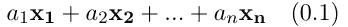

线性组合的定义。作者图片

其中 a₁、a₂,…是标量，x₁、x₂,…是项，或者用线性代数的语言来说，是向量。无论这些项是什么，模型都与**参数**成线性。

一个**多项式回归**模型可以被认为是*几个单项式的线性组合*并采取以下形式

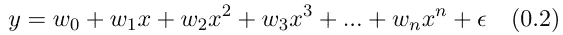

多项式回归模型。作者图片

# 线性回归模型的变异

在线性回归领域，可能会遇到一些变化，有时很容易被看起来相似的术语搞混。

**多元线性回归**:试图用一个线性模型来描述一个因变量与两个或两个以上自变量之间的关系。在本文中，我们将关注多项式回归，它被认为是多元线性回归的一个特例。

**简单线性回归** : 也是多元线性回归的特例，只涉及一个自变量。它使用一条直线来模拟数据，这条直线是一次多项式。

**一般多元回归模型**:它是几个多元线性回归同时写在一起的形式

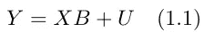

一般多元回归模型。作者图片

其中 Y 是一个 n 乘 p 的矩阵，每列有 p 个因变量，每行有 n 个个体，X 是一个有观测数据的 n 乘 q 的已知矩阵，B 和 U 分别表示未知参数和噪声。

**广义线性模型**:应用 **链接函数**将因变量分布的参数链接到线性预测器(因变量的线性组合)。与其他线性模型不同，它允许因变量的误差项具有不同于正态分布的分布。

当连接函数为恒等式时，该模型退化为具有正态误差的普通线性模型。

# 拟合数据

要使用多项式找到合适的模型来拟合数据，需要完成两件事情:

1.  我们需要知道它的**度**是多少。
2.  我们需要找到每个单项的**系数**。

## 确定系数

上面描述的第一个任务实际上更困难，所以我们可以先看看第二个。为了说明线性回归的原理，让我们生成一些带有白噪声的数据

```
X <- seq(from=-10, to=10, by=1)
Y <- vector(mode = "double", length = length(X))
lenY <- length(Y)**for** (i **in** seq(from = 1, to = lenY)){
  noise <- runif(1, min=-1, max=1)[1]
  rangeNoise <- 25
  Y[i] <- X[i]^2 + 2*X[i] + 2 + noise*rangeNoise
}df <- data.frame(X, Y)
```

当然，拟合该数据的最佳模型是二次多项式。让我们试着拟合数据，看看它是什么样子的。这很简单，这就是我们需要做的

```
model <- lm(Y ~ I(X^2)+ I(X), df)
```

事实上，使用`poly(X, 2)`更好，因为它使用正交多项式，可以避免 X 和 X 之间的相关性引起的问题。然而，为了比较来自`lm`的结果和来自手动计算的结果，我们仍然使用`Y ~ I(X^2) + I(X)`。

拟合数据的最佳多项式看起来是这样的(显然，线性模型不一定是一条线，因为它只是一些项的线性组合，项可以是任意的，线性模型看起来可以是任意的。但是它**关于参数是**线性的。)

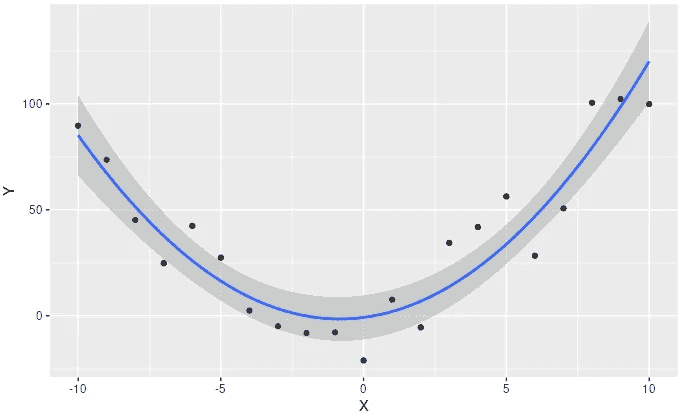

拟合的结果。作者图片

其中灰色区域描述了[置信区间](https://en.wikipedia.org/wiki/Confidence_interval)。

`lm`函数使用了什么方法，我们获得了什么结果，如何解读？让我们用`summary`来看看吧

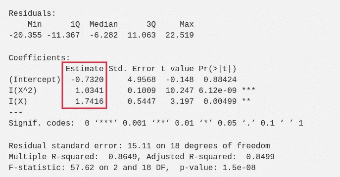

线性模型概述

首先让我们看一下`Estimate Std.`，那里的数字是我们模型的系数，也就是说得到的多项式是 f(x) = 1.0341x + 1.7416x-0.7320。计算系数的方法是最小化成本函数，在这种情况下，成本函数被选择为均方误差函数

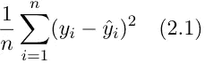

MSE(均方差)函数。作者图片

其中，yᵢ是观测值，yᵢ哈特是预测值。由于 yᵢ是单项式 x，x，x，…和系数(我也将互换使用“**权重**”)w₁，w₂，…的函数，确定成本函数何时达到最小值给了我们关于 x 的 w 的表达式，x-es 是已知的，因此我们可以求解系数。这就是**最小二乘法**。

系数也可以通过**伪逆**来计算。将输入数据、权重和观察值写入矩阵

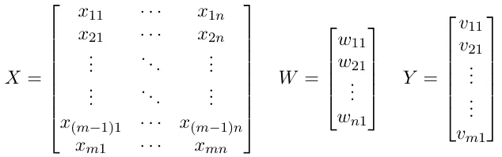

输入数据、权重和观察值。作者图片

预测值将是 XW，我们希望 XW 尽可能接近 Y。权重可以通过以下方式获得

因此，损失函数为

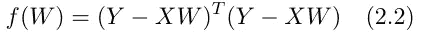

损失函数。作者图片

这是我们计算重量的方法

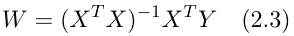

使用伪逆计算权重。作者图片

现在我们要证明这是作为最小二乘法的东西，也就是说我们可以从(2.2)推导出(2.3)。

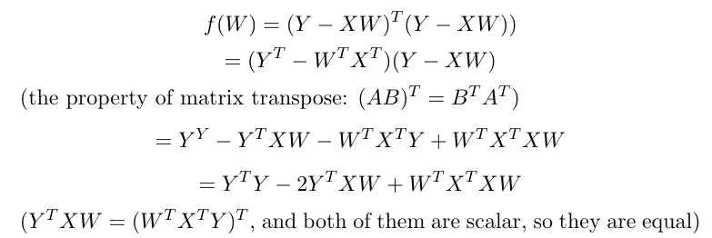

从(2.2) (a)推导出(2.3)。作者图片

然后我们对 *f* 对 w 求导

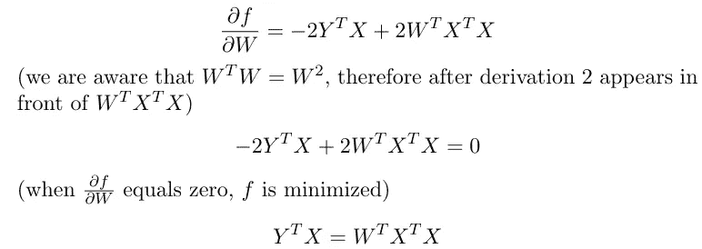

从(2.2) (b)推导出(2.3)。作者图片

在转置两边乘以(X^T X)的逆后，我们立即得到(2.3)。

为了验证这一点

存储在`Wm`中的结果对应于使用`lm`找到的系数。(此处[截距](https://www.theanalysisfactor.com/interpreting-the-intercept-in-a-regression-model/)为常数)。

```
[,1]
X^2  1.0340966
X    1.7415511
1   -0.7320286
```

## 拟合误差及评价

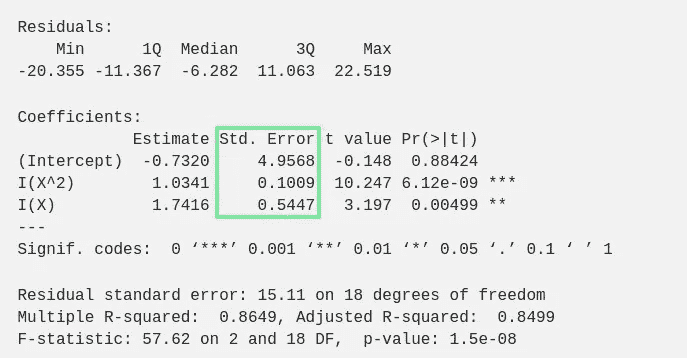

线性模型概述。作者图片

`Std. Error`是**标准** **误差的估计参数**。由于我们拥有的数据是来自总体的样本，因此整个总体的最优回归模型可能在一个范围内——我们获得的最优解是**而不是**(对于样本来说，它是最好的，但是对于整个总体来说，基本关系可能有点不同)。在统计学中，重要的是要知道，我们谈论的是什么数据，整个人口，还是只有样本数据。这些误差用于计算距离。那我们如何计算这些误差呢？

在表格中填写我们的模型

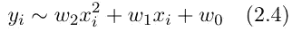

我们例子中的线性模型。作者图片

这意味着

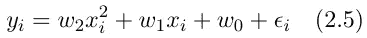

。作者图片

其中εᵢ是误差项，它是观测值和预测值之间的差值。

根据[这个](https://people.duke.edu/~rnau/mathreg.htm#slopeintercept)，我们可以通过以下方式计算系数

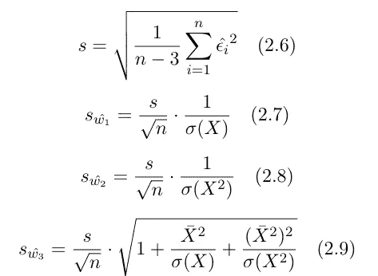

估计系数误差的计算公式。作者图片

其中，变量上的帽子表示它们是估计值，σ(X)是 X 的标准差，X_hat 是 X 的平均值。[自由度](https://www.investopedia.com/terms/d/degrees-of-freedom.asp\)是 *n-3* (在本例中，n-3 = 21–3 = 18，我们在样本中有 21 个点)。s 就是`Residual standard error`，这里 s = 15.11。

在[这个源](https://people.duke.edu/~rnau/mathreg.htm#slopeintercept)中，符号似乎不是很常见和清晰，所以也参考了[维基百科](https://en.wikipedia.org/wiki/Simple_linear_regression#:~:text=is%20the%20standard%20error%20of%20the%20estimator)。在这两个来源中，仅给出了最简单模型(a 线 Y = aX + b)的公式，但是可以推导出我们的二次示例的公式。但是当然，鼓励读者尝试实现它们，并用一些数据验证它们。

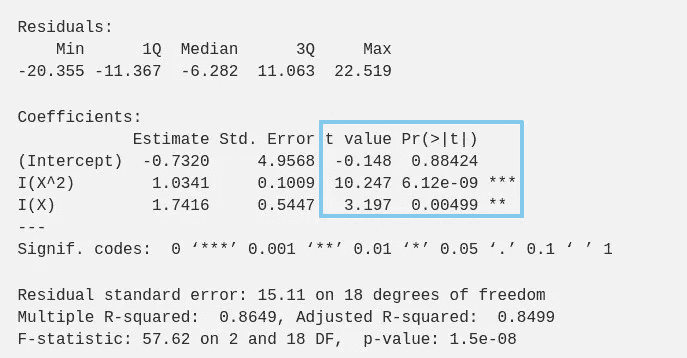

线性模型概述。作者图片

`Coefficients`中的最后两列告诉我们模型中的一个组件是否重要。方法是计算一个 t 统计量，即`t value`。然后我们计算 p 值，即`Pr(>|t|)`，这是反对零假设的证据(H₀: *模型中的成分在统计上不显著*，我们在模型中不需要它)。如果 p 值足够小，我们可以拒绝零假设(值得注意的是，我们不能**永远**接受零假设，因为我们只有证据**反对**它)。

以 x 项为例，x 的系数为 w₁，t 值为 w₁

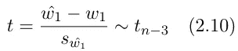

t 值。作者图片

t 遵循学生的 t 分布，自由度为 n-3。在这个例子的情况下，t 值简单地通过系数/标准误差来计算。

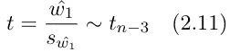

函数 lm 中 t 值是如何计算的？作者图片

而结果是`3.197`。为了找到 p 值，我们需要参考[学生 t 分布临界值表](https://www.sjsu.edu/faculty/gerstman/StatPrimer/t-table.pdf)。我们可以看到我们的 t 值在 2.878 到 3.610 之间。所以累积概率在 0.002 和 0.01 之间——结果是`0.00499`。总体中基本关系式(2.4)中参数的区间可由下式确定

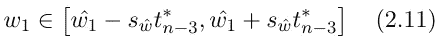

总体参数的区间。作者图片

其中 t*ₙ₋₃是 tₙ₋₃分布的第(1-α/2)分位数，这个值也可以在[这个表](https://www.sjsu.edu/faculty/gerstman/StatPrimer/t-table.pdf)中找到。默认情况下，α = 0.05，置信区间为 1-α=0.95。如果 p 值小于α，我们可以拒绝零假设。因此，X 项在我们的例子中很重要。

这个预测将在最后一节讨论。在 R 中非常方便，我们只需要应用函数`predict`。

# 比较和选择模型

这里我们回到第一个任务，我们要用什么样的线性模型？线性组合的项应该是什么？

当使用多元线性回归时，我们经常需要减少因变量的数量，因为**如果一个更复杂的模型并不比一个更简单的模型好多少，我们应该使用更简单的模型**。对于一个非常复杂的模型，我们可能会获得高性能，但它也更加难以解释。有时过度拟合也会发生。有几种简化的方法，例如，[主成分分析](https://en.wikipedia.org/wiki/Principal_component_analysis)就是一个有用的工具。

由于这里我们只处理多项式，PCA 不是很合适，**逐步回归**将是一个更好的方法，我们可以应用它来降低模型的阶数。但是减少多项式模型的次数的任务类似于减少任何多变量线性回归模型中的独立变量的数量。对于多项式回归模型，次数越高，多项式就能更好地拟合数据，但同时会包含更多的噪声，这将导致非常差的预测(过度拟合)。

我们可以对我们的数据使用一个 5 次多项式，当然这不是必须的，它也不利于预测。如果我们检查这个模型的摘要，我们会发现组件具有较大的 p 值—它们在统计上不显著。以下代码可用于进行逐步回归(需要库`MASS`)

```
fullModel <- lm(Y ~ I(X^5) + I(X^4) + I(X^3) + I(X^2) + I(X) + 1, df)
stepModel <- stepAIC(fullModel, direction = "backward", trace = FALSE)
summary(stepModel)
```

正如我们已经知道的，结果`stepModel`是一个二次多项式。

# 什么时候应该使用多项式回归，什么时候不应该？

1.速度和距离

使用的例子将是 R 中的内置数据集`car`，它记录了汽车的速度和停车时所经过的距离。多项式回归在这里是合适的。事实上，根据我们的物理知识，这是正确的答案。

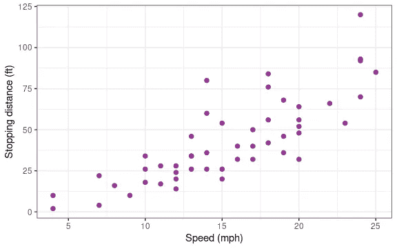

图 3.1 速度和距离。使用此处的[代码制作的图像。](http://sia.webpopix.org/polynomialRegression1.html)

我们将数据分为训练集和测试集，并用测试数据绘制线性模型。

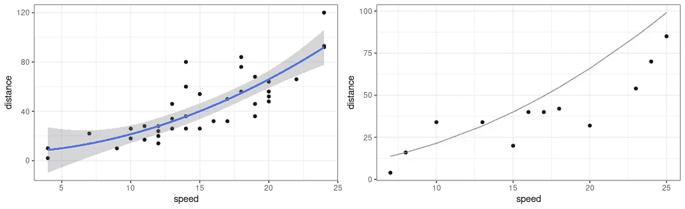

图 3.2 拟合(75%随机选择的训练数据)和预测。作者图片

如果我们运行一个 [R 测试](https://en.wikipedia.org/wiki/Coefficient_of_determination#:~:text=%22r%20squared%22%2C%20is%20the%20proportion%20of%20the%20variation%20in%20the%20dependent%20variable)，它会告诉我们这个模型解释了测试集中 80.089%的数据可变性。

2.油价

这里是我们不应该使用线性回归的时候。假设我们想根据历史数据预测油价(数据来源:【https://finance.yahoo.com/quote/OIL/history?p=OIL】[)。](https://finance.yahoo.com/quote/OIL/history?p=OIL)

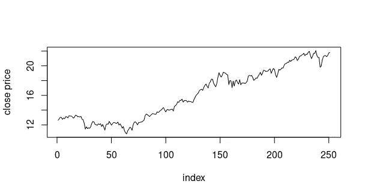

图 3.3 一年的每日油价。作者图片

我们用了一个三次多项式，这个图看起来不错。(`index`为天数指数，`CloseP`为每天收盘价)。但在测试数据上，这似乎并不可信

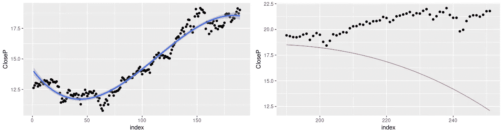

图 3.4 拟合(从数据集开始的 75%的数据)，和预测。作者图片

事实上，在这个例子中，它永远不会工作，因为如果我们使用一个偶数阶的多项式，当指数变大时，曲线将上升，奇数阶的曲线将下降。但是很明显，这不是商品价格的变化方式。

为什么比第一个例子差那么多？图 3.1 看起来没有图 3.3 那么混乱和嘈杂。然而，在图 3.1 中有一个时间序列，距离与速度之间的关系和油价与时间之间的关系是完全不同的故事。更多的因素使价格变化变得复杂，例如，时滞、周期性等。

# 摘要

本文试图介绍多项式回归，并把它与一元线性回归和多元线性回归联系起来。它还简要描述了什么是线性回归和有什么变化。

在关注多项式回归的部分，首先，我们知道如何拟合数据和如何确定系数(使用 R 中的内置函数实现，但也可以手动实现)。然后介绍了模型和评估中的误差，主要是 t 值和 p 值的计算。此外，对统计推断也作了简要介绍。

最后，我们看了两个例子，多项式回归模型分别适用和不适用。

## 资源

[1] [线性组合](https://ncatlab.org/nlab/show/linear+combination) (2015)， *nLab* 。

[2]米歇尔·莱西*，*，[多元线性回归](http://www.stat.yale.edu/Courses/1997-98/101/linmult.htm)

[3]肯特，J. T .，毕比，j .，&马迪亚，K. V. [多变量分析](https://statisticalsupportandresearch.files.wordpress.com/2017/06/k-v-mardia-j-t-kent-j-m-bibby-multivariate-analysis-probability-and-mathematical-statistics-academic-press-inc-1979.pdf) (1979)。*阿姆斯特丹:学术出版社*。

[4]内尔德，J. A .，，威德伯恩，R. W . [广义线性模型](https://docs.ufpr.br/~taconeli/CE225/Artigo.pdf) (1972)。*英国皇家统计学会杂志:A 辑(总论)*， *135* (3)，370–384。

[5] Jonathan Bartlett，[线性回归的假设](https://thestatsgeek.com/author/jwb133googlemail-com/) (2013)

[6] Alboukadel Kassambara，[R](http://www.sthda.com/english/articles/37-model-selection-essentials-in-r/154-stepwise-regression-essentials-in-r/#comments-list)中的逐步回归要点(2018)