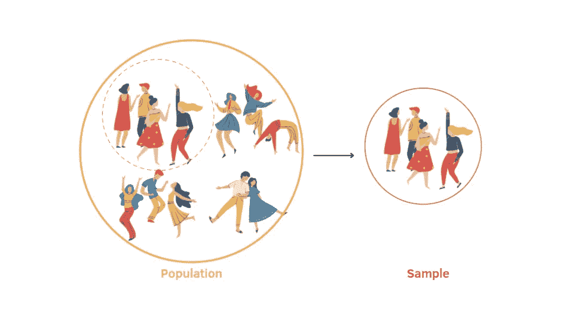
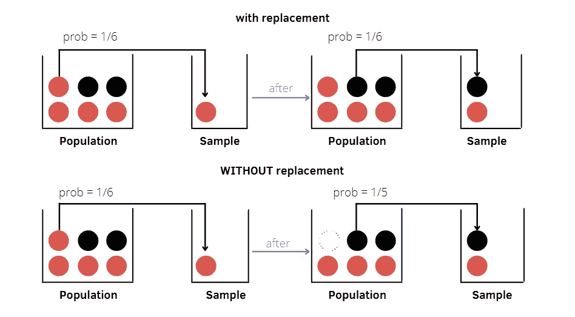
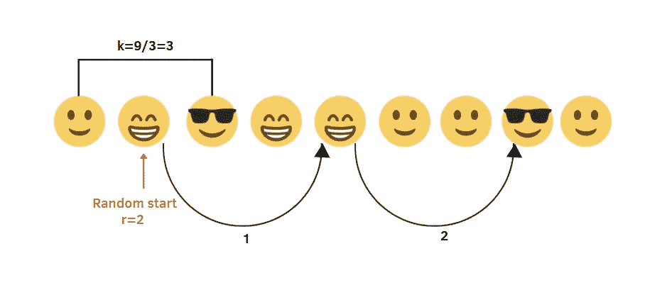
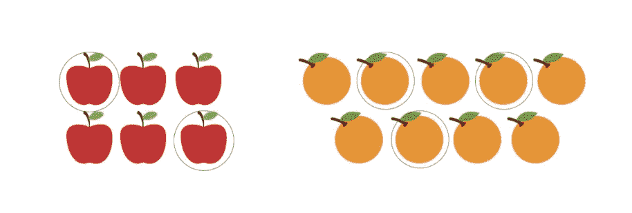
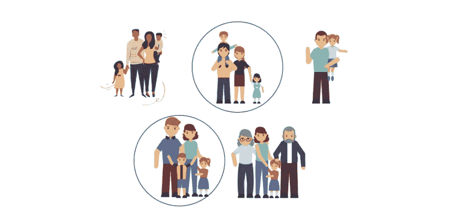
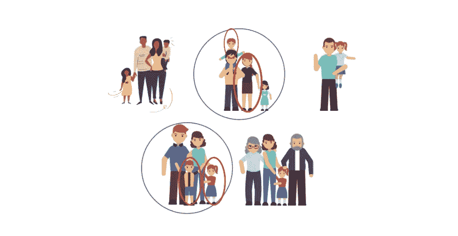

# 概率抽样方法介绍

> 原文：<https://towardsdatascience.com/an-introduction-to-probability-sampling-methods-7a936e486b5?source=collection_archive---------6----------------------->

## 为什么采样方法是您的数据科学之旅的关键

作者插图

还在学习统计学的时候就接触到了抽样技术。我记得这是我更喜欢的话题之一，因为教授深入地解释了它们，让我明白它们是许多调查研究的基础，但在那段时间里，我充满了其他课程和其他想法，以至于我一通过考试就忘记了这些有用的概念。

但是在我读数据科学硕士期间，在我的实际研究工作中，我间接看到了很多机器学习模型中涉及到的采样方法，比如决策森林、随机森林、隔离森林等等。它们还用于解决数据集中的不平衡类分布等问题，并通过使用重采样过程(称为 K-fold 交叉验证)来改进模型性能的评估。

出于这个原因，我决定进一步研究这个惊人的主题，它在处理大量数据时具有关键作用。我将从定义什么是采样开始。一旦基本概念清楚了，下一步就是解释不同的抽样技术，重点是概率抽样方法。

# 介绍

在统计研究中，并不总是能够获得所有案例的数据。为此，最实用的方法是纳入总体的一部分，称为**样本**。

在进行采样时，我们需要定义一些相关术语。首先，**目标人群**包括我们理论上感兴趣的所有项目。我们需要区分目标人群和**研究人群**，有时也称为样本人群，它是我们可以获得的目标人群的子集。

抽样本质上是从研究人群中选择样本的过程。一个重要的要求是，样本需要尽可能地代表总体，以便概括整个总体的特征。

这可以通过采用不同的采样方法来实现，这些方法可以分为两大类:

*   **概率抽样方法**:被选择的群体中每个单元**已知**的概率。
*   **非概率抽样方法**:总体中每个单元被选中的概率**未知**，与收集数据的研究者的主观性更相关。

在这篇文章中，我将重点介绍概率抽样方法。这种类型的方法可以进一步分为不同的类别，如下所示。

**概率抽样方法:**

1.  **简单随机抽样**
2.  **系统采样**
3.  **分层抽样**
4.  **整群抽样**
5.  **多级采样**

# 1.简单随机抽样

简单随机抽样。作者插图

简单随机抽样(SRS)是对人口进行抽样的最简单的方法，人口只是项目的集合[1]。如果检查简单随机抽样的定义，你可能会在某处发现这一点:

> 简单的随机抽样确保了群体中的每个元素都有相等的选择概率

这并不完全错误，但这取决于提取过程的类型:

*   **具有替换**的 SRS:群体中的所有单元将具有相同的被选择概率 **1/N** 。例如，让我们考虑一个装有 4 个红球和 2 个黑球的骨灰盒。在第一次抽取中，红球是从瓮中随机抽取的。所有的球总会有 1/6 的概率被抽样。
*   **无替换的 SRS**:在第一次抽取时，每一个群体单元将有相等的选择概率 **1/N** 。在第二次提取时，剩余的 N-1 个单元将具有等于 **1/(N-1)** 的选择概率。在这个例子中，我们观察到选择概率在第二次提取中发生了变化。**这违反了顶部显示的定义！**

**优势:**

*   它很简单，并且不使用关于人口的辅助信息
*   选择是随机的，然后，任何单位都是受青睐的
*   样本具有代表性

**缺点:**

*   元素的选择是完全随机的
*   需要一份完整的人口单位清单
*   这既费时又费钱

# 2.系统抽样

系统抽样。作者插图

系统取样可以归纳为两个步骤:

1.  计算**采样间隔 k** =N/n .在图示中，我们有 9 个微笑，我们想获得 3 个单位的样本，那么 N=9，n=3，k=9/3=3。
2.  在 1 和 k 之间选择一个**随机整数 r**:1≤r≤k，例子中我随机选择 r=2，其中 1≤r≤3。
3.  一旦选择了第一个单元，我们就取接下来的第 k 个项目来构建样本:r，r+k，r+2k，…，r+(n-1)k。

**优点:**

*   随机选择仅应用于第一个项目，而选择的其余项目取决于第一个项目的位置和选择项目的固定间隔。

**缺点:**

*   如果群体元素的列表呈现确定的顺序，则存在获得不具有代表性的样本的风险

# 3.分层抽样

分层抽样。作者插图

根据一些分类特征，如年龄、性别和教育程度，人口被分为亚人口，称为**阶层**。如果*组内部同质，且组间异质*，分层抽样是有效的。从每一层，我们提取一个简单的随机样本。这些样本的集合产生分层样本。

要计算地层样本大小，有两种常用的分配方法:

*   **比例分配**是实践中最简单、应用最广泛的方案。它在每个地层 **nₕ/Nₕ** 内提供相同的采样分数，对应于全局采样分数**n/n**:*fₕ=nₕ/nₕ=f=n/n*。在插图中，我们根据水果的类型分为两组。阶层人口分别是 N₁=6 和 N₂=9.通过比例分配，我们选择总样本量为 n=5 的样本。根据理论，我们希望相同的采样分数等于 5/15=1/3。正如你所观察到的，这个标准得到了尊重:n₁/N₁ **=** 2/6=1/3 作为苹果组的样本分数，n₂/N₂ **=** 3/9=1/3 作为橙子组的样本分数。

*   **最优或奈曼分配**基于每个地层中取样分数应该不同的想法，并假设地层取样大小 *nₕ* 与地层 S *ₕ* 的标准差成正比。当阶层差异不同时，这种分配比比例分配更有效、更精确。

**优点:**

*   这比简单的随机抽样更有效
*   获得非代表性样本的风险较小

**缺点:**

*   它需要获得关于人口的辅助信息。
*   对阶层有严格的条件，需要面面俱到，互相排斥。

# 4.巢式抽样法

整群抽样。作者插图。

整群抽样假设总体可以由基本单位的子集构成，这些子集称为群。显然，它可能看起来类似于分层抽样，但原理完全不同。

在分层抽样中，各组内部是同质的，相互之间是异质的*。*与分层抽样不同，聚类之间 ***相似，每个聚类包含具有不同特征的元素*** 。

例如，如果我们有兴趣研究纽约的居民，我们可以考虑由属于同一城市的家庭的人构成的人口。一个家族是一个典型的集群，其中包含不同的成员。

整群抽样允许从群体中随机抽取一些群体，而不是从群体中抽取一些元素。如果我们考虑将人口分成家庭，我们可以随机抽取一些家庭，如图所示。

**优点:**

*   当集群构成自然形成的子群时，这是有效的，因为我们不拥有群体的列表
*   如果这些单位的特点是分散在整个地区，而且有必要进行直接接触，那么只研究某些集群比简单的随机抽样花费要少。

**缺点:**

*   集群的条件并不总是被尊重。这些簇可以包含相似的元素。

# 5.多阶段取样

两阶段抽样。作者插图。

实际上，自然形成的人口子群**集群**，如果集群规模较小，并且集群是基于地域特征确定的，则可能包含类似的单元。

为每个集群分析一些单元可能更方便，而不是考虑所有的元素。这种设计叫做**两阶段整群抽样**。如果我们再次考虑居住在纽约的家庭，我们可以从已经选择的群中随机抽取两个人。

因此，多阶段抽样将大量人口分成“阶段”,以使抽样过程更有效。

**优点:**

*   当集群之间同质而内部异质时，多阶段采样可能比集群采样更有效。
*   抽样规模减小
*   组织起来更简单，成本效益更高

**缺点:**

*   在不考虑聚类条件的情况下，多阶段采样结果不如简单随机采样有效。

# 最终想法:

我希望这篇教程对你学习更多概率抽样方法有用。不看例子来研究这个话题是很有挑战性的。在机器学习领域，简单随机抽样和分层抽样是最广泛用于评估模型性能的方法。这里肯定还有我没有提到的其他采样方法。我的目标是关注最相关的技术。我将在下一篇文章中介绍[非概率抽样方法](/an-introduction-to-non-probability-sampling-methods-b74c76f7f710?sk=8ba145ecf97368d2ff295df87edfe98a)。感谢阅读！祝你有愉快的一天。

[1]“[调查抽样参考指南，样本设计和估计技术介绍](https://ec.europa.eu/eurostat/documents/3859598/5901961/KS-RA-08-003-EN.PDF/833f7740-0589-47e1-99a5-c14878a2c1a8)”，欧盟统计局

你喜欢我的文章吗？ [*成为会员*](https://eugenia-anello.medium.com/membership) *每天无限获取数据科学新帖！这是一种间接的支持我的方式，不会给你带来任何额外的费用。如果您已经是会员，* [*订阅*](https://eugenia-anello.medium.com/subscribe) *每当我发布新的数据科学和 python 指南时，您都可以收到电子邮件！*