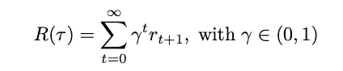

# 强化学习导论

> 原文：<https://towardsdatascience.com/an-introduction-to-reinforcement-learning-4ecc096ee80f?source=collection_archive---------43----------------------->

## 展示支持 RL 的关键概念

最近在强化学习的帮助下取得的成功被媒体广泛报道。人们可以想到 DeepMind 的 [AlphaGo](https://deepmind.com/research/case-studies/alphago-the-story-so-far) 算法:使用强化学习(和大量昂贵的硬件来训练它)，AlphaGo 学会了玩围棋这一古老的游戏，甚至开发了自己的游戏风格。

OpenAI 展示了另一个例子，其研究人员[教会了一只机器手解魔方](https://openai.com/blog/solving-rubiks-cube/)。有趣的是，它是在虚拟环境中训练的；因为即使拿着一个立方体转动而不掉它也是相当困难的，这是令人惊奇的第一步。

我写这篇文章的目的是首先解释使这种成功成为可能的概念。我从介绍开始，然后逐步完善 RL 的定义。

由[大卫·莱维克](https://unsplash.com/@davidleveque?utm_source=medium&utm_medium=referral)在 [Unsplash](https://unsplash.com?utm_source=medium&utm_medium=referral) 上拍摄的照片

# 介绍

强化学习是机器学习的一个领域。您可能已经使用过监督学习(数据被标记)和非监督学习(未标记的数据，例如，用于生成技术)。这两大领域由强化学习领域补充。两个关键区别在于，数据通常不是独立且相同地分布的(即，它可能非常杂乱，没有明显的结构)，并且代理的行为决定了它遇到的未来数据。

用一句非正式的话来说，强化学习学习通过互动来达到一个目标。

让我们来看看机器学习这一分支背后的基本成分:

首先，我们有提到的代理。代理既是学习者又是决策者。现实生活中的类比就是你和我，都在做决策，都在不停地学习。第二，代理可以与之交互的一切都是环境(对我们来说是我们的正常环境:其他人、建筑物、汽车、狗、猫等等)。第三，这种环境可以通过互动来改变，这是代理人产生影响的唯一方式。在每一种可能的情况下，代理人可以决定一个行动，并依次获得奖励。这种奖励会影响学习过程。

# MDP

这个描述相当模糊。为了给强化学习下一个更精确的定义，我们需要一种数学方法。这就是马尔可夫决策过程的用武之地，它是一种对状态之间的转换进行建模的数学方法。我们有一个五元组(s，a，r，p，p₀) [1，2]:

S 是状态空间，包含一个代理可能遇到的所有可能的状态。因此，每一个状态 s ∈ S。

a 是动作空间，包含代理可能的动作。同样，我们有每一个动作。

*R* 是奖励函数，它基于当前状态 sₜ、选择的动作 aₜ和结果状态 sₜ₊₁.，传递代理动作的奖励我们包括结果状态也是为了考虑状态之间的转换。如果没有它，在不同的时间步骤在相同的状态下行动会产生相同的回报——不考虑代理人可能已经学到了什么。换句话说，动作 a 在 *t* 和 *t+k* 可以是相同的，但是可能导致不同的新状态。我们通过添加 sₜ₊₁.来考虑这一点奖励是一个实数，比如+1，-2.5 等等。

P 是将状态和动作映射到概率的函数。它决定了从 sₜ出发并选择 aₜ.行动时到达 sₜ₊₁州的概率我们的环境可能会受到我们无法控制的事件的影响。为此，我们有 P，它考虑了外部影响。如果我们没有这样的影响，我们简单地使用一个确定性的转变，也就是说，新的状态是保证达到的。

最后，我们有 p₀，这是初始状态的分布，也就是说，它包含了所有我们可以开始的状态。

[Roméo A.](https://unsplash.com/@gronemo?utm_source=medium&utm_medium=referral) 在 [Unsplash](https://unsplash.com?utm_source=medium&utm_medium=referral) 上拍摄的照片

你还记得手机游戏 DoodleJump 吗？还是任天堂设备上的马里奥游戏？让我们构建一个与这两个类似的设置:

我们的敌人从右侧进来(这是来自马里奥)，我们向上跳一级就可以躲开他们(这是来自嘟嘟跳)。我们的状态空间 *S* 由两个状态组成，*低*和*高*。

在这两种状态下，我们有两种可能的动作，*跳转*和*等待*，它们构成了动作空间 *A* 。

每次我们从低处跳到高处或者从高处跳到高处，我们都会得到+1 的奖励。当我们被敌人击中时，我们会下降一级，奖励是-1(注意，这里的奖励不是与一个动作相关联，例如跳跃或等待，而是与我们被外部影响击中的事实相关联)。等待的回报是 0。

现在到 *P* ，它决定了我们达到下一个水平的可能性有多大。这是 80 %，有 20 %我们保持在目前的水平。等待可能导致停留在当前水平或被敌人击中的概率相等；因此，两者的概率都是 50 %。最后，我们的 *p* ₀只包含状态*低*。

# 政策

到目前为止，我们已经讨论了动作和环境，但是没有讨论如何在给定的状态下确定适当的动作。因为我们有多个状态和多个时间步，我们需要一些进一步的算法来帮助我们。这是策略的任务π，从一个状态到一个动作的映射:π(aₜ|sₜ)是在状态 sₜ选择 aₜ的概率[1，2](你可以想一套规则:如果这个那么那个)。由此出发，我们可以从所有可能的动作中抽取动作，用 aₜπ表示。|sₜ).

该策略是可以由深度 RL 中的神经网络建模的部分[1]。

对于我们的示例，我们的策略由以下映射组成:(jump|low) = (jump|high) = 50 %。这意味着在低和高的状态中，我们以 50 %的概率选择动作*跳转*。(等待|低)和(等待|高)的概率各为 50 %。

# 奖励

到目前为止，我们已经介绍了政策，但还没有介绍奖励的形式和作用。开始时，我注意到我们希望代理实现一个目标。这个比较模糊。更正式地说，我们希望代理人最大化预期报酬。

让我们来看看这个:

从我们最初的状态，s₀和 a₀把我们带到 s₁.和 a₁一起我们去了 s₂.和 a₂一起，我们前进到 s₃.这种情况可能会持续无限长的时间。这种状态和动作的序列被称为*轨迹*，表示为τ。此外，我们还会在每个动作之后获得奖励，奖励 rₜ₊₁(因为奖励考虑了结果状态，所以奖励也会在下一个时间步支付， *t+1* )。有了轨迹和奖励，我们可以通过对所有个人奖励求和来计算我们的最终*回报*，或累计奖励【1，2】

回到我们的例子，考虑这个轨迹:(低，跳，高，跳，高)。由低到高过渡的奖励是+1，由高到高的奖励也是+1。对于这个轨迹，回报是 2。

在有限的动作序列的情况下，这就是我们所需要的。但是当我们处理无休止运行的环境时，这就产生了一个问题:

每个奖励目前都具有相同的重要性，无论它发生在一个近时间点(因此可能更有形)还是无限的边缘(非常无形)。此外，这也是更重要的，我们的回报是没有界限的，它不会收敛到一个固定的值。这使得比较两个策略变得很困难:一个可能总是得到+1，-1，+1，-1，…，而另一个策略可能经常得到+10，+10，+10，只是后来犯了一个严重的错误，抵消了我们到目前为止所取得的一切。换句话说，当轨迹无穷无尽时，我们不知道从长远来看哪种政策会更好，因为一切都可能发生。

幸运的是，这可以通过使用折扣回报来解决，这是一种更通用的方法:我们用折扣乘以每个奖励，这量化了它的重要性(将折扣设置为 1 导致之前的未折扣回报)[1，2]:

因此，贴现回报迫使代理人“早赢比晚赢好”[3]。

为了最大化预期回报，我们需要我们的政策(检查)，我们的轨迹(检查)，和回报(检查)。配备了它们，我们开始:

让我解释一下这个等式:给定一个策略π，我们想知道我们得到一个特定的状态和动作序列的可能性有多大(这是轨迹，τ)。为此，我们取我们的初始状态 s₀的概率，然后乘以所有进一步的概率(这是∏部分)。对于我们到达的每一个后来的状态 sₜ₊₁，我们检查它到达这个状态(这是 P(sₜ₊₁|sₜ,aₜ)的可能性，并且将它乘以采取引导我们到达那里的行动的可能性(这是π(aₜ|sₜ)).)

在此基础上，我们写下预期回报是我们通过政策π获得的回报，然后根据它采取行动(这为我们提供了轨迹，即状态-行动序列的列表)。如上所述，对于每个这样的轨迹，我们都有一个回报。检查所有可能的轨迹(所有可能的状态-行动序列)，并总结它们各自的回报，我们就有了预期的回报[1，2]:

让我更详细地描述这个方程:我们通过写出τ∞p(⋅|π).来取每个可能的轨迹正如我上面所写的，每个轨迹都有发生的概率，每个轨迹都有回报。通过将概率乘以回报(用 R(τ)来描述)，我们根据可能性对结果进行加权。这遵循了[计算期望值](https://en.wikipedia.org/wiki/Expected_value#Finite_case)的正常方式:

对于我们的例子，我们有这两个轨迹:(低，跳，高，跳，高)(奖励为 2)，以及轨迹(低，跳，高，等待，低)(奖励为 0: +1 表示前进，-1 表示等待并被敌人击中，从而下降一级)。

现在让我们计算第一个轨迹的概率:它是 1×0.8×0.5×0.8×0.5 = 0.16；1 是开始状态低的概率，0.8 × 0.5 是前进到下一个级别的概率，乘以选择动作跳转的概率。类似地，我们继续第二个轨迹:1 × 0.8 × 0.5 × 0.5 × 0.5 = 0.1，唯一的区别是 0.5 × 0.5。这里，我们取等待的概率为 0.5(也就是在这种情况下下降一级)，并将其乘以成功率，0.5。

有了每条轨迹的回报和概率，我们现在可以按照上面的等式计算预期回报:0.16 × 2 + 0.1 × 0=0.32。因此我们的预期收益是 0.32。

这样，我们可以进一步形式化我们的 RL 定义:找到最大化期望回报的策略[1，2]

这是最佳策略。

# 价值函数

说了这么多，我们怎么知道一个动作是好的动作，或者一个状态是好的状态呢？我们可以通过价值函数和行动价值函数找到答案。简而言之，给定一个策略π，一个状态的值就是从这个状态得出的预期回报，并且此后总是按照π行事。使用数学符号，我们把它写成

类似地，对于行动价值函数，我们也需要策略π。与之前不同，我们现在将值分配给一对状态和动作[1，2]。同样，这个价值也是我们在 s₀开始与 a₀:合作时的预期回报

有了 *Q* ，我们就可以简单地选择一个状态的下一个动作，作为最大化期望回报的动作

同样，我们可以通过查询 *V* 来检查一个状态的值。

酷的是，有了最优政策，我们可以找到最优价值和最优行动价值函数。这个最优策略对于任何 MDP 都是存在的。挑战在于找到它。

# 参考

[1]乔希·阿奇姆，[在《极深 RL》](https://spinningup.openai.com/en/latest/spinningup/rl_intro.html)(2020)，OpenAI

[2]萨顿，理查德 S 和巴尔托，安德鲁 G，[《强化学习:导论》](https://web.stanford.edu/class/psych209/Readings/SuttonBartoIPRLBook2ndEd.pdf) (2018)，麻省理工学院出版社

[3]迈克尔·l·利特曼，[马尔可夫博弈作为多主体强化学习的框架](https://www2.cs.duke.edu/courses/spring07/cps296.3/littman94markov.pdf) (1994)，机器学习论文集