# 使用 OpenAI Gym、RLlib 和 Google Colab 进行强化学习的介绍

> 原文：<https://towardsdatascience.com/an-introduction-to-reinforcement-learning-with-openai-gym-rllib-and-google-colab-48fc1ddfb889?source=collection_archive---------15----------------------->

## 使用 OpenAI Gym、RLlib 和 Google Colab 进行强化学习的入门教程

本教程将使用强化学习(RL)来帮助平衡一个虚拟的横竿。上面来自 PilcoLearner 的[视频](https://www.youtube.com/watch?v=XiigTGKZfks)展示了在现实生活中使用 RL 的结果。

**作者** : [迈克尔·加拉尼克](https://twitter.com/GalarnykMichael)和[斯文·米卡](https://twitter.com/sven_mika)

强化学习(RL)的一个可能的定义是学习如何在与环境交互时最大化总回报的计算方法。虽然定义是有用的，但本教程旨在通过图像、代码和视频示例来说明什么是强化学习，同时介绍代理和环境等强化学习术语。

特别是，本教程探索了:

*   什么是强化学习
*   开放的健身房钢管环境
*   代理在强化学习中的作用
*   如何使用 Python 库 RLlib 训练代理
*   如何使用 GPU 加速训练
*   使用光线调节进行超参数调节

# 什么是强化学习

正如[之前的一篇帖子提到的](https://www.anyscale.com/blog/reinforcement-learning-with-rllib-in-the-unity-game-engine)，人工智能的一个子领域机器学习(ML)使用神经网络或其他类型的数学模型来学习如何解释复杂的模式。ML 的两个领域由于其高度的成熟度而最近变得非常受欢迎，这两个领域是监督学习(SL)和强化学习(RL)，在监督学习中，神经网络学习基于大量数据进行预测，在强化学习中，网络使用模拟器以试错的方式学习做出良好的行动决策。

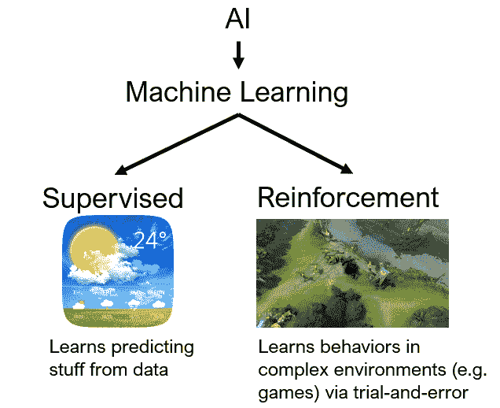

作者图片

RL 是令人难以置信的成功背后的技术，例如 DeepMind 的 AlphaGo Zero 和《星际争霸 2》AI(alpha star)或 OpenAI 的 DOTA 2 AI(“open AI Five”)。请注意[强化学习有许多令人印象深刻的用途](https://www.anyscale.com/blog/best-reinforcement-learning-talks-from-ray-summit-2021)，它在现实生活决策问题中如此强大和有前途的原因是因为 RL 能够持续学习——有时甚至在不断变化的环境中——从不知道要做出什么决定(随机行为)开始。

# 代理和环境

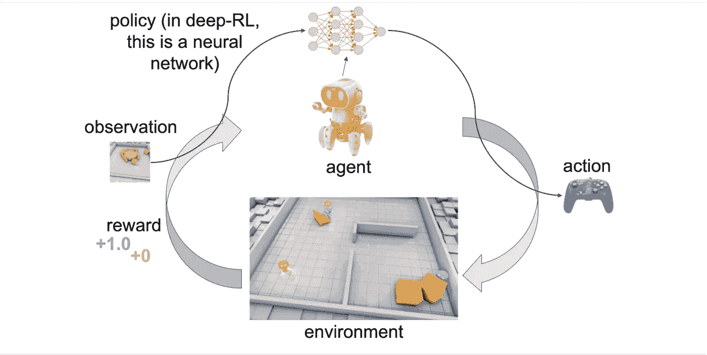

作者图片

上图显示了代理和环境之间的交互和通信。在强化学习中，一个或多个智能体在一个环境中相互作用，这个环境可以是本教程中类似 CartPole 的模拟，也可以是与真实世界传感器和执行器的连接。在每一步，代理接收一个观察(即环境的状态)，采取一个行动，并且通常接收一个奖励(代理接收奖励的频率取决于给定的任务或问题)。代理人从重复的试验中学习，这些试验的序列被称为一个事件——从最初的观察到导致环境达到其“完成”状态的“成功”或“失败”的动作序列。RL 框架的学习部分训练关于哪些动作(即，顺序决策)导致代理最大化他们的长期累积回报的策略。

# 开放的健身房钢管环境

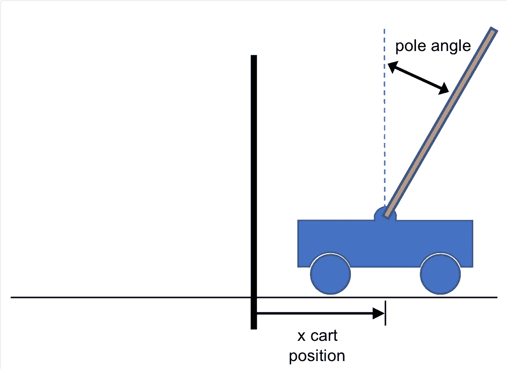

作者图片

我们试图解决的问题是试图保持一根柱子直立。具体来说，该杆通过一个非驱动关节连接到一个小车上，小车沿无摩擦轨道移动。钟摆开始直立，目标是通过增加和减少小车的速度来防止它倒下。

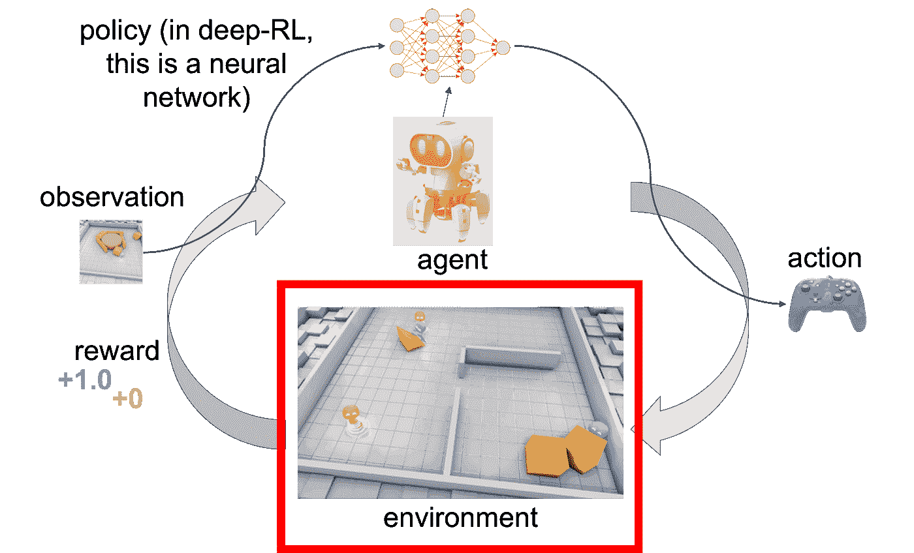

作者图片

本教程将使用 [OpenAI Gym](http://gym.openai.com/) 而不是从头开始编写这个环境，OpenAI Gym 是一个工具包，它提供了各种各样的模拟环境(雅达利游戏、棋盘游戏、2D 和 3D 物理模拟，等等)。Gym 对您的代理的结构没有任何假设(在这个 cartpole 示例中，是什么推动小车向左或向右)，并且与任何数值计算库兼容，比如 numpy。

下面的代码加载 CartPole 环境。

```
import gym
env = gym.make("CartPole-v0")
```

现在让我们通过观察动作空间来开始理解这个环境。

```
env.action_space
```

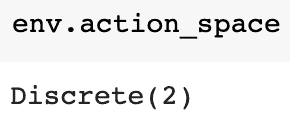

输出离散(2)意味着有两个动作。在 CartPole 中，0 对应“向左推车”，1 对应“向右推车”。请注意，在这个特定的例子中，静止不动不是一个选项。在强化学习中，代理产生一个动作输出，这个动作被发送到一个环境中，然后环境做出反应。环境会产生一个观察结果(以及奖励信号，此处未显示)，我们可以在下面看到:

```
env.reset()
```

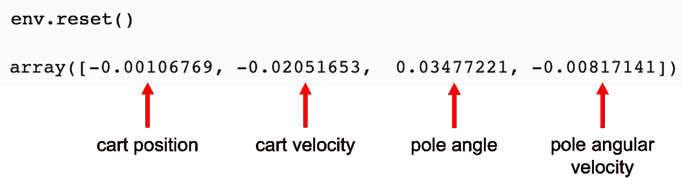

观察值是 dim=4 的向量，包含小车的 x 位置、小车的 x 速度、以弧度表示的极角(1 弧度= 57.295 度)以及极的角速度。上面显示的数字是开始新一集(` env.reset()`)后的初步观察。随着每个时间步长(和动作)，观察值将会改变，这取决于小车和杆子的状态。

# 培训代理

在强化学习中，代理的目标是随着时间的推移产生越来越聪明的行为。它通过一项政策做到了这一点。在深度强化学习中，这种策略用神经网络来表示。让我们首先在没有任何神经网络或机器学习算法的情况下与健身房环境进行交互。相反，我们将从随机运动(向左或向右)开始。这只是为了理解机制。

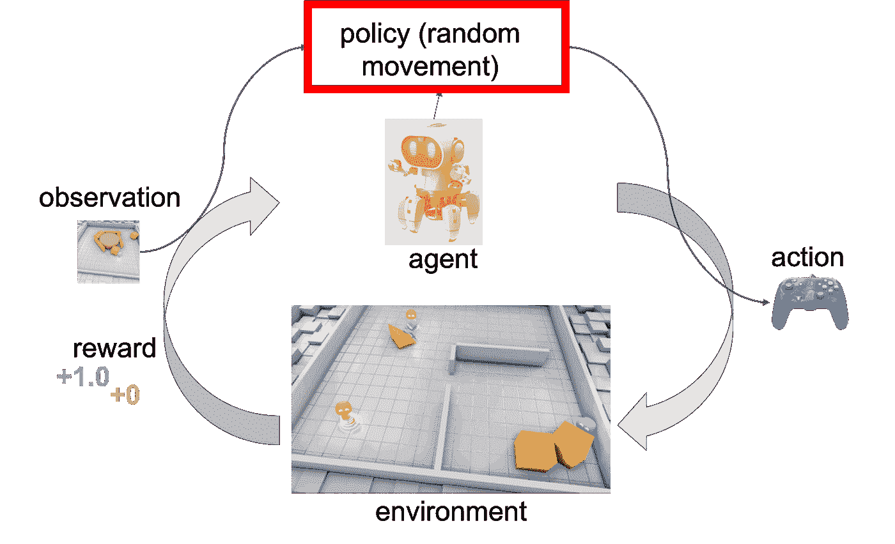

作者图片

下面的代码重置环境，需要 20 个步骤(20 个周期)，总是采取随机操作并打印结果。

```
# returns an initial observation
env.reset()for i in range(20): # env.action_space.sample() produces either 0 (left) or 1 (right).
   observation,reward,done,info =env.step(env.action_space.sample()) print("step", i, observation, reward, done, info)env.close()
```

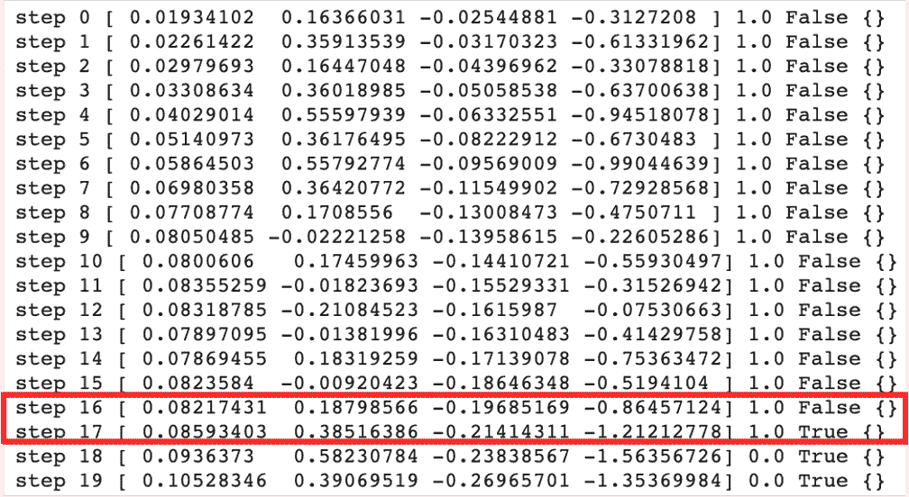

样本输出。在钢管舞中有多种终止情节的条件。在图像中，该集因超过 12 度(0.20944 rad)而终止。情节终止的其他条件是推车位置大于 2.4(推车的中心到达显示器的边缘)，情节长度大于 200，或者当 100 次连续试验的平均回报大于或等于 195.0 时的解决要求。

上面的打印输出显示了以下内容:

*   步骤(它在环境中循环了多少次)。在每个时间步中，代理选择一个动作，环境返回一个观察和一个奖励
*   环境观察[x 推车位置、x 推车速度、杆角度(rad)、杆角速度]
*   前一次行动获得的奖励。规模因环境而异，但目标始终是增加你的总回报。包括终止步骤在内，每一步的奖励是 1。之后为 0(图中的步骤 18 和 19)。
*   done 是一个布尔值。它指示是否该再次重置环境。大多数任务被划分为定义明确的情节，如果 done 为 True，则表明该情节已经终止。在推车杆中，可能是杆倾斜过远(超过 12 度/0.20944 弧度)，位置超过 2.4 表示推车的中心到达显示器的边缘，情节长度大于 200，或者解决的要求是在 100 次连续试验中平均回报大于或等于 195.0。
*   info 是对调试有用的诊断信息。对于这种横向环境，它是空的。

虽然这些数字是有用的输出，但视频可能会更清晰。如果您在 Google Colab 中运行这段代码，需要注意的是，没有可用于生成视频的显示驱动程序。但是，可以安装一个虚拟显示驱动程序来让它工作。

```
# install dependencies needed for recording videos
!apt-get install -y xvfb x11-utils
!pip install pyvirtualdisplay==0.2.*
```

下一步是启动虚拟显示器的实例。

```
from pyvirtualdisplay import Display
display = Display(visible=False, size=(1400, 900))
_ = display.start()
```

OpenAI gym 有一个 VideoRecorder 包装器，可以录制 MP4 格式的跑步环境视频。下面的代码和前面的一样，除了它是 200 步，并且是录音。

```
from gym.wrappers.monitoring.video_recorder import VideoRecorderbefore_training = "before_training.mp4"video = VideoRecorder(env, before_training)# returns an initial observation
env.reset()for i in range(200):
   env.render()
   video.capture_frame() # env.action_space.sample() produces either 0 (left) or 1 (right).
   observation, reward, done, info = env.step(env.action_space.sample()) # Not printing this time
   # print("step", i, observation, reward, done, info)video.close()
env.close()
```

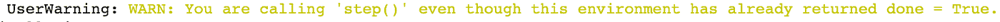

通常，当 done 为 1(真)时，您将结束模拟。上面的代码让环境在达到终止条件后继续运行。例如，在 CartPole 中，这可能是杆翻倒、杆脱离屏幕或达到其他终止条件的时候。

上面的代码将视频文件保存到 Colab 磁盘中。为了在笔记本中显示它，您需要一个助手函数。

```
**from** base64 **import** b64encode
**def** **render_mp4**(videopath: str) -> str:
  """
  Gets a string containing a b4-encoded version of the MP4 video
  at the specified path.
  """
  mp4 = open(videopath, 'rb').read()
  base64_encoded_mp4 = b64encode(mp4).decode()
  **return** f'<video width=400 controls><source src="data:video/mp4;' \
         f'base64,{base64_encoded_mp4}" type="video/mp4"></video>'
```

下面的代码呈现了结果。你应该得到一个类似于下面的视频。

```
**from** IPython.display **import** HTML
html = render_mp4(before_training)
HTML(html)
```

播放视频表明，随机选择一个动作并不是保持侧手翻直立的好策略。

# 如何使用 Ray 的 RLlib 训练代理

教程的前一部分让我们的代理做出随机的行为，而不考虑环境的观察和奖励。拥有一个代理的目标是随着时间的推移产生越来越聪明的行为，而随机的行为并不能实现这个目标。为了让代理人随着时间的推移做出更明智的行动，itl 需要一个更好的策略。在深度强化学习中，策略用神经网络来表示。

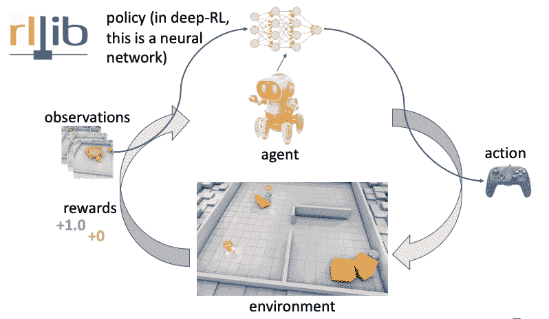

作者图片

本教程将使用 [RLlib 库](https://docs.ray.io/en/master/rllib.html)来训练一个更聪明的代理。RLlib 有许多优点，例如:

*   极度的灵活性。它允许您定制 RL 周期的每个方面。例如，本节教程将使用 PyTorch 创建一个定制的神经网络策略(RLlib 也有对 TensorFlow 的本地支持)。
*   可扩展性。强化学习应用程序可能是计算密集型的，并且通常需要扩展到一个集群以实现更快的训练。RLlib 不仅对 GPU 有一流的支持，而且它还建立在 [Ray](https://ray.io/) 之上，后者是[并行](https://www.anyscale.com/blog/parallelizing-python-code)和[分布式](https://www.anyscale.com/blog/writing-your-first-distributed-python-application-with-ray) Python 的开源库。这使得将 Python 程序从笔记本电脑扩展到集群变得容易。
*   统一的 API 和对离线、基于模型、无模型、多代理算法等的支持(本教程不探讨这些算法)。
*   成为 [Ray 项目生态系统](https://github.com/ray-project/ray)的一部分。这样做的一个优点是，RLlib 可以与生态系统中的其他库一起运行，如[Ray tuning](https://docs.ray.io/en/master/tune/index.html)，这是一个用于实验执行和任何规模的超参数调整的库(稍后将详细介绍)。

虽然有些功能在这篇文章中不会被完全利用，但是当你想做一些更复杂的事情和解决现实世界的问题时，它们是非常有用的。你可以在这里了解一些令人印象深刻的 RLlib [用例。](https://www.anyscale.com/blog/best-reinforcement-learning-talks-from-ray-summit-2021)

要开始使用 RLlib，您需要首先安装它。

```
!pip install 'ray[rllib]'==1.6
```

现在，您可以使用近似策略优化(PPO)算法来训练 PyTorch 模型。这是一个非常全面的，适合所有类型的算法，你可以在这里了解更多关于[的信息。下面的代码使用了一个由 32 个神经元和线性激活函数组成的单一隐藏层的神经网络。](https://docs.ray.io/en/master/rllib-algorithms.html#proximal-policy-optimization-ppo)

```
import ray
from ray.rllib.agents.ppo import PPOTrainerconfig = { "env": "CartPole-v0",

   # Change the following line to `“framework”: “tf”` to use tensorflow
   "framework": "torch",
   "model": {
      "fcnet_hiddens": [32],
      "fcnet_activation": "linear",
   },
}stop = {"episode_reward_mean": 195}ray.shutdown()ray.init(
   num_cpus=3,
   include_dashboard=False,
   ignore_reinit_error=True,
   log_to_driver=False,
)# execute training
analysis = ray.tune.run(
   "PPO",
   config=config,
   stop=stop,
   checkpoint_at_end=True,
)
```

这段代码应该会产生相当多的输出。最后一个条目应该是这样的:

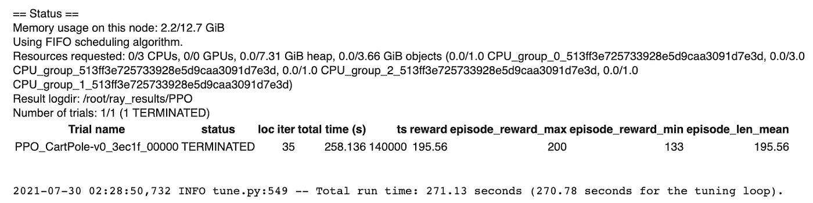

条目显示，解决环境问题需要 35 次迭代，运行时间超过 258 秒。每次都不一样，但是每次迭代大概需要 7 秒(258 / 35 = 7.3)。注意，如果你想学习 Ray API，看看像 ray.shutdown 和 ray.init 这样的命令是做什么的，你可以[看看这个教程](https://www.anyscale.com/blog/writing-your-first-distributed-python-application-with-ray)。

# 如何使用 GPU 加速训练

虽然本教程的其余部分使用了 CPU，但需要注意的是，您可以通过在 Google Colab 中使用 GPU 来加速模型训练。这可以通过选择**运行时>更改运行时类型**并将硬件加速器设置为 **GPU** 来完成。然后选择**运行时>重启并运行所有**。

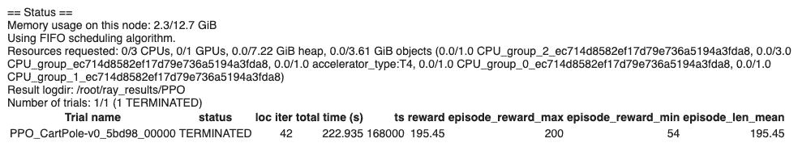

请注意，虽然训练迭代的次数可能大致相同，但是每次迭代的时间已经显著减少(从 7 秒减少到 5.5 秒)。

# 创建训练模型的视频

RLlib 提供了一个 Trainer 类，它保存了一个环境交互策略。通过训练器界面，可以对策略进行训练、操作计算和检查。虽然之前从`ray.tune.run`返回的分析对象不包含任何训练器实例，但是它拥有从保存的检查点重建一个所需的所有信息，因为`checkpoint_at_end=True`是作为参数传递的。下面的代码显示了这一点。

```
# restore a trainer from the last checkpoint
trial = analysis.get_best_logdir("episode_reward_mean", "max")
checkpoint = analysis.get_best_checkpoint(trial,
   "training_iteration",
   "max",
)trainer = PPOTrainer(config=config)
trainer.restore(checkpoint)
```

现在让我们创建另一个视频，但这一次选择由经过训练的模型推荐的动作，而不是随机动作。

```
after_training = "after_training.mp4"
after_video = VideoRecorder(env, after_training)observation = env.reset()
done = False
while not done:
   env.render()
   after_video.capture_frame()
   action = trainer.compute_action(observation)
   observation, reward, done, info = env.step(action)
after_video.close()
env.close()# You should get a video similar to the one below.
html = render_mp4(after_training)
HTML(html)
```

这一次，杆子平衡得很好，这意味着代理已经解决了横竿环境！

# 使用光线调节进行超参数调节

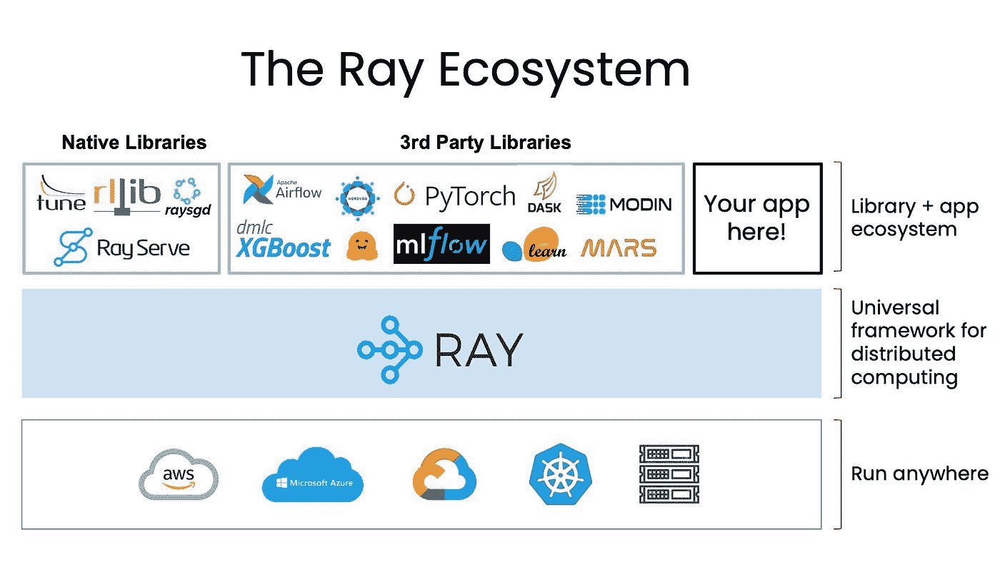

射线生态系统(图片由作者提供)

RLlib 是一个强化学习库，是 Ray 生态系统的一部分。Ray 是一个高度可扩展的并行和分布式 python 通用框架。它非常通用，这种通用性对于支持其图书馆生态系统非常重要。这个生态系统涵盖了从[培训](https://docs.ray.io/en/latest/tune/index.html)，到[生产服务](https://docs.ray.io/en/master/serve/index.html)，到[数据处理](https://www.anyscale.com/blog/data-processing-support-in-ray)等等。您可以一起使用多个库，并构建完成所有这些事情的应用程序。

教程的这一部分利用了 [Ray Tune](https://docs.ray.io/en/latest/tune/index.html) ，这是 Ray 生态系统中的另一个库。这是一个用于任何规模的实验执行和超参数调整的库。虽然本教程将只使用网格搜索，但请注意，光线调整还可以让您访问更有效的超参数调整算法，如基于群体的训练，BayesOptSearch 和 HyperBand/ASHA。

现在让我们试着找出能够在最少的时间内解决 CartPole 环境的超参数。

输入以下代码，并准备好它需要一段时间才能运行:

```
parameter_search_config = {
   "env": "CartPole-v0",
   "framework": "torch",# Hyperparameter tuning
"model": {
   "fcnet_hiddens": ray.tune.grid_search([[32], [64]]),
   "fcnet_activation": ray.tune.grid_search(["linear", "relu"]),
   },
   "lr": ray.tune.uniform(1e-7, 1e-2)
}# To explicitly stop or restart Ray, use the shutdown API.
ray.shutdown()ray.init(
   num_cpus=12,
   include_dashboard=False,
   ignore_reinit_error=True,
   log_to_driver=False,
)parameter_search_analysis = ray.tune.run(
   "PPO",
   config=parameter_search_config,
   stop=stop,
   num_samples=5,
   metric="timesteps_total",
   mode="min",
)print(
   "Best hyperparameters found:",
   parameter_search_analysis.best_config,
)
```

通过向 ray.init 传递 num_cpus=12 来请求 12 个 CPU 内核，可以在三个 CPU 上并行运行四次试验。如果这不起作用，也许谷歌已经改变了 Colab 上可用的虚拟机。任何大于或等于 3 的值都可以。如果 Colab 因内存不足而出错，你可能需要做**运行时>工厂重置运行时**，紧接着**运行时>运行所有**。请注意，在 Colab 笔记本的右上角有一个区域显示 RAM 和磁盘的使用情况。

指定 num_samples=5 意味着您将获得学习率的五个随机样本。对于其中的每一个，隐藏层的大小有两个值，激活函数有两个值。因此，将有 5 * 2 * 2 = 20 次试验，在计算运行时，在单元的输出中显示它们的状态。

注意，Ray 会打印当前的最佳配置。这包括所有已经设置的默认值，这是找到其他可以调整的参数的好地方。

运行此命令后，最终输出可能类似于以下输出:

*INFO tune.py:549 —总运行时间:3658.24 秒(调优循环为 3657.45 秒)。*

*找到的最佳超参数:{'env': 'CartPole-v0 '，' framework': 'torch '，' model': {'fcnet_hiddens': [64]，' fcnet_activation': 'relu'}，' lr ':0.006733929096170726 }；' ' ' '*

因此，在二十组超参数中，具有 64 个神经元、ReLU 激活函数和大约 6.7e-3 的学习率的超参数表现最好。

# 结论

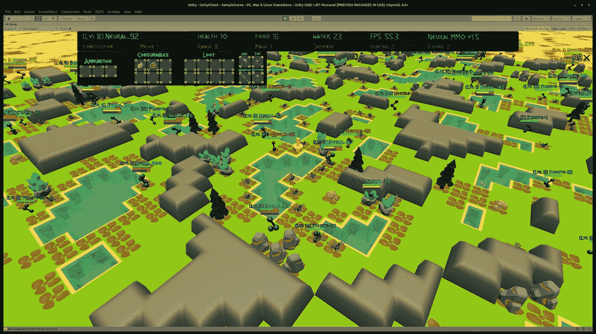

神经 MMO 是一个模拟大型多人在线游戏的环境——一种支持数百到数千个并发玩家的类型。你可以在这里了解 Ray 和 RLlib 如何帮助实现这个项目和其他项目的一些关键特性[(图片由](https://www.anyscale.com/blog/best-reinforcement-learning-talks-from-ray-summit-2021) [Joseph Suarez](https://twitter.com/jsuarez5341?lang=en) 提供，经许可使用)

本教程通过介绍强化学习术语，展示代理和环境如何交互，并通过代码和视频示例演示这些概念，说明了什么是强化学习。如果你想了解更多关于强化学习的知识，请查看斯文·米卡的 [RLlib 教程](https://www.anyscale.com/events/2021/06/24/hands-on-reinforcement-learning-with-rays-rllib)。这是了解 RLlib 的最佳实践、多代理算法以及更多内容的好方法。如果你想了解所有关于 RLlib 和 Ray 的最新消息，可以考虑[关注 twitter 上的@ Ray distributed](https://twitter.com/raydistributed)和[注册 Ray 简讯](https://anyscale.us5.list-manage.com/subscribe?u=524b25758d03ad7ec4f64105f&id=d94e960a03)。

*原载于*[*https://www.anyscale.com*](https://www.anyscale.com/blog/an-introduction-to-reinforcement-learning-with-openai-gym-rllib-and-google)*。*