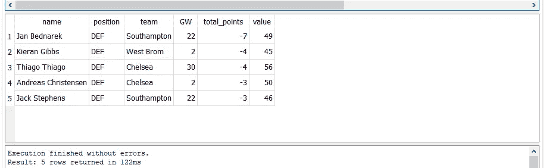

# 使用 FPL 数据的 SQL 简介

> 原文：<https://towardsdatascience.com/an-introduction-to-sql-using-fpl-data-8314ec982308?source=collection_archive---------24----------------------->

## 使用梦幻超级联赛数据的 SQL 基础指南


内森·罗杰斯在 [Unsplash](https://unsplash.com?utm_source=medium&utm_medium=referral) 上拍摄的照片

对于任何与数据打交道的人来说，SQL 是一项非常有用的技能。这是一个教程，为那些想学习一些基础知识，并有兴趣这样做与幻想英超联赛数据。

## 数据

在本教程中，我使用来自 https://github.com/vaastav/Fantasy-Premier-League[的数据。这是一个用于获取游戏周数据的 FPL 库。以前的比赛周可以在资源库中找到。我用的是一个叫 merged_gw 的文件。每个玩家的每个游戏都有一行。](https://github.com/vaastav/Fantasy-Premier-League)

## 工具

在本教程中，我使用数据库浏览器的 SQLite([https://sqlitebrowser.org/](https://sqlitebrowser.org/))。我选择了这个，通常也选择了 SQL Lite，因为设置非常简单。DB Browser for SQLite 将让我们创建数据库，添加数据，然后查询数据。

# 创建数据库和表

我们需要做的第一件事是创建一个数据库。在数据库浏览器中:

1.  转到**文件>新数据库**。
2.  保存文件——我将其命名为 *FPL.db*

接下来，您将看到一个创建表的选项。在这里，我们只需单击 cancel，因为我们将利用 DB Browser 的功能，根据我们要导入的 CSV 来定义表，然后导入数据。

1.  转到**文件>从 CSV 导入>表。**
2.  选择文件并点击**打开**
3.  给这张桌子起个名字——我把它命名为 *Players_GWs*
4.  选中复选框，说明 CSV 中的第一行代表列名(这些将成为我们的表名列)。


这样做将创建表格。该应用程序还显示了用于创建表的查询。CREATE TABLE 后面是我们正在创建的表的名称，然后在括号中是每列的名称，后面是数据类型，每列名称用逗号分隔:

```
CREATE TABLE "Players_GWs" (
 "name" TEXT,
 "position" TEXT,
 "team" TEXT,
 "xP" REAL,
 "assists" INTEGER,
 "bonus" INTEGER,
 "bps" INTEGER,
.........
```

# 探索数据

要执行 SQL，我们转到*执行 SQL* 选项卡:


以下示例中的所有查询都是通过输入查询并单击工具栏中的“运行”按钮(或 CTRL + Enter)来执行的:


## 选择基础

我们使用 SELECT 来查询数据库。下面是一个从数据库中获取数据的基本 SELECT 语句。我们说我们想要从哪个表中选择哪些列。*表示我们选择所有列。

```
SELECT * FROM Players_GWs
```


## 限制

这将返回我们所有的行和列。不是很有用，因为有 20，700 行。如果我们想快速查看我们拥有的数据类型，我们可以运行上面的限制，只返回指定数量的行。这里我们返回 5 行:

```
SELECT * FROM Players_GWs LIMIT 5
```


## 选择特定列

所以我们有更少的行，但是通过使用*我们仍然可以看到所有的列，这使得我们很难看到最有趣的列。我们可以用我们想要查看的特定列替换*。让我们加上*姓名，职位，团队，GW，总积分，*和*值。*

```
SELECT name, position, team, GW, total_points, value FROM Players_GWs LIMIT 5
```


同样值得注意的是，这些列可以按照我们选择的任何顺序排列。

```
SELECT position, GW, name, team, total_points, value FROM Players_GWs LIMIT 5
```


## 以...排序

到目前为止，我们有一个按名称字母顺序排列的记录列表(因为这就是 CSV 中的数据以及它保存到包中的方式)。更有趣的是根据某种度量标准来查看前 5 行。我们可以将 total_points 列添加到查询中，并根据它进行排序。这需要在限制前进行。

```
SELECT name, position, team, GW, total_points, value FROM Players_GWs ORDER BY total_points LIMIT 5
```



## 由 DESC 订购

如我们所见，数据从最小到最大。这是单场得分最低的五位选手。通过将 DESC 添加到我们的订单中，我们可以看到前五名。


## 在哪里

如果我们想查看某个特定团队的情况，我们可以使用 WHERE 来过滤团队。让我们看看马刺。所以就是[我们要匹配的列]=[我们要匹配的值]:

```
SELECT name, position, team, GW, total_points, value FROM Players_GWs WHERE team='Spurs' ORDER BY total_points DESC LIMIT 5
```


## 喜欢

“马刺队”寻找一个精确的匹配。我们也可以用 LIKE 来匹配一个模式。例如，假设我们想同时匹配曼城和曼联，我们可以用 LIKE 替换=并将' Man% '作为我们想要匹配的。这将查找所有以“Man”开头的团队。%是一个通配符，匹配其后任意数量的字符。

```
SELECT name, position, team, GW, total_points, value FROM Players_GWs WHERE team LIKE 'Man%' ORDER BY total_points DESC LIMIT 5
```


## 分组依据

到目前为止，我们一直返回单行(每一行代表一个游戏)。如果我们想要查看某个特定团队或玩家在所有游戏周的一些指标的总和，我们可以使用 GROUP BY 和对 total_points 执行的 SUM 函数。

```
SELECT name, team, SUM(total_points) FROM Players_GWs GROUP BY name
```


我们也可以按多列分组。比方说，我们希望先按团队再按球员进行细分。

```
SELECT team, name, SUM(total_points) AS 'overall points' FROM Players_GWs GROUP BY team, name
```


在第一组示例中，如果玩家在整个赛季中为不同的球队效力，球队栏将随机显示一个球队。但是第二组可以让我们看到每支球队的得分——因为我们是按球队和球员的名字分组的。

## 如同

代表所有游戏周中每个玩家点数的列的名称不是最具描述性的。它显示为我们对数据库中的 total_points 数据执行的函数。我们可以用 AS 给它起一个更好的名字。

```
SELECT name, team, SUM(total_points) AS 'overall points' FROM Players_GWs GROUP BY name
```


这些是 SQL 入门的一些基本查询类型。这里，我们只处理一个表中的数据，但是我们可以在另一个表中包含详细的团队信息，然后使用查询从两个表中获取数据。我将在以后的教程中研究这个和更复杂的查询。

如需进一步阅读，请查看位于 https://sqlite.org/docs.html 的 SQLite 文档

作者拍摄的所有截图。由[内森·罗杰斯](https://unsplash.com/@nathanjayrog?utm_source=medium&utm_medium=referral)在 [Unsplash](https://unsplash.com?utm_source=medium&utm_medium=referral) 上做的介绍性图片。