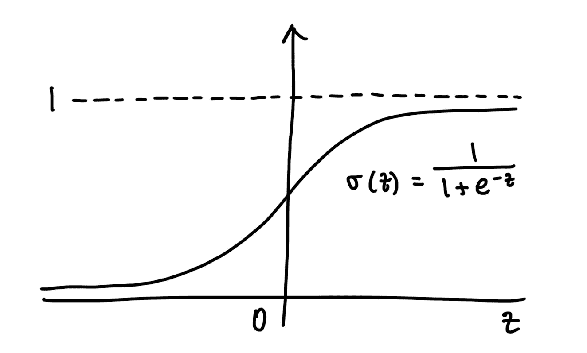
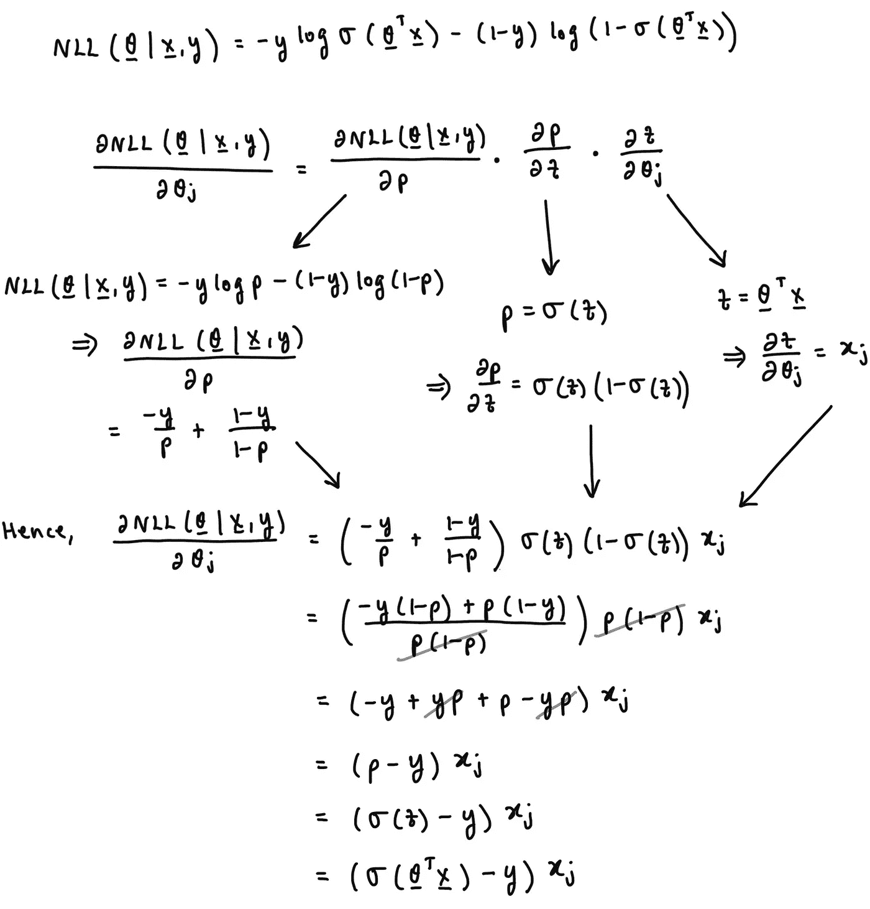
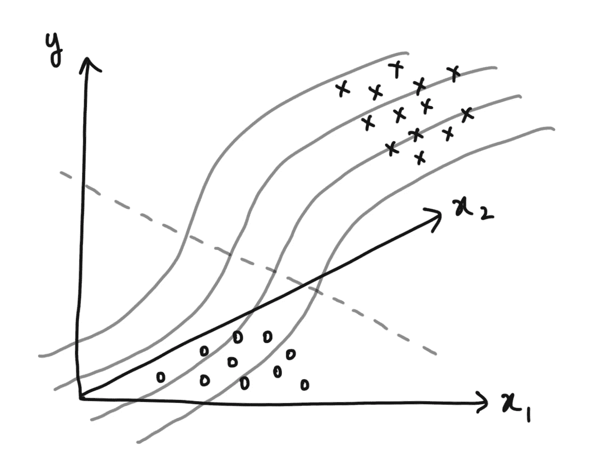

# 机器学习的魔力介绍

> 原文：<https://towardsdatascience.com/an-introduction-to-the-magic-of-machine-learning-6b213e88b54c?source=collection_archive---------1----------------------->

## 用数学代替代码

所有插图均由作者提供。

这些天我们经常听到机器学习，事实上它就在我们身边。这听起来可能有点神秘，甚至有点可怕，但事实证明，机器学习只是数学。为了证明这只是数学，我将用传统的方式写这篇文章，用手写的方程代替代码。如果你更喜欢通过听和看来学习，我在这里贴了一个涵盖本文内容的视频[。否则，请继续阅读！](https://www.youtube.com/watch?v=mWxzRtYlstU&ab_channel=BlakeBullwinkel)

为了解释什么是机器学习以及数学是如何让它工作的，我们将全面演练一下*逻辑回归*，这是一个相当简单但基本的模型，从某种意义上说，它是神经网络等更复杂模型的构建模块。如果我必须选择一个机器学习模型来真正理解，这将是它。

最常见的情况是，我们将逻辑回归用于一个叫做*二元分类*的任务。在二进制分类中，我们想学习如何预测一个数据点是否属于两个组或*类*中的一个，标记为 0 和 1。

为了进行这些预测，我们对给定数据点属于标记为 1 的类别的概率进行建模。

在这个设置中，我们将类标签的单个观察值写成小写的" *y* "，它可以取值 0 或 1，并将单个数据点写成小写的" *x* "，带下划线以表示它是一个向量。

更具体地说，它是一个由 *m* 个元素组成的向量，其中 *m* 是我们必须描述每个数据点的信息或*特征*的数量。一会儿就会明白，为什么我们把 1 作为每个向量的第一个元素。

现在我们需要决定如何对这个概率建模。逻辑回归通过以下假设做到了这一点。

我将回到这个“sigma”函数是什么，但是在这个函数内部，我们注意到我们的模型是基于数据点特征的加权和。

我们现在可以看到，通过将每个数据点向量的第一个元素设置为 1，我们获得了截距或*偏差*项。我们为什么要那样做，以后会变得很清楚。

因此，我们使用这些 *m* 特征来说明该数据点属于标记为 1 的类别的概率，并且我们可以通过改变θ参数的值来控制这些特征对该概率的贡献程度。在计算这个加权和之后，我们将它传递给这个 sigma 函数。

那么什么是西格玛呢？请注意，如果我们只是计算一个加权和，我们可以得到任何实际值，因为每个数据点的特征可能呈现任何实际值。但是我们想建立一个概率模型，这个概率在 0 到 1 之间。所以我们需要一个函数，将所有实数值映射到区间[0，1]。

其中一个函数叫做逻辑函数或 sigmoid 函数，看起来像这样。

正如我们所见，它接受任何实数值，并将其压缩在 0 和 1 之间。原来在机器学习中有很多情况是我们要这么做的，包括在神经网络中，所以 sigmoid 函数出现的很多。

好了，现在的问题是，这个θ矢量应该是什么？

这取决于我们的数据。为了有一个对一般数据点进行良好预测的模型，它可以采用各种特征的许多不同值，我们需要根据各种数据点及其相应的类别标签来选择θ参数。假设我们有 *n* 个数据点，称它们为我们的*训练数据*。

这些训练数据允许我们学习*最佳*θ参数。最优是什么意思？一个合理且普遍的定义是，最优θ是最大化获取训练数据概率的一组参数。

这正是我们通过最大化所谓的*似然函数*得到的结果，它是θ的函数，定义为整个数据集(即我们所有的训练数据)的联合概率分布。假设我们的数据是独立的，我们可以把它写成每个数据点的所有个体概率分布的乘积。

但是我们如何表达一个普通数据点的概率分布，它可能属于标记为 0 或 1 的任何一类？利用我们只有两个类的事实，我们知道每个数据点属于一个类的概率就是一个减去它属于另一个类的概率。

利用指数定律，我们可以用下面的巧妙方法把这两个表达式结合起来。尝试将标签 0 和 1 插入下面的表达式，以说服自己它涵盖了这两种情况。

如果你学过概率，你可能会认识到这是一个伯努利随机变量的概率质量函数。

太好了。所以我们想最大化关于θ参数的似然函数。如果你记得一些微积分，你可能记得这将涉及到求导。很难找到这个乘积的导数，但是通过取它的对数，我们可以把这个乘积的对数重写为对数的和。我们可以这样做，因为 log 是一个单调函数，所以最大化对数似然性的θ值也会最大化似然性，我们真正关心的是这些最佳θ值。

这看起来更容易处理，但事实证明，如果我们试图找到它对θ参数的导数，我们将会没有封闭形式的解。这是机器学习中的一个常见问题，处理它的标准方法是应用类似梯度下降的迭代优化算法，这允许我们找到局部最小值。但是我们希望*最大化*对数似然，所以我们将该算法应用于*负*对数似然，因为最小化负对数似然的θ参数也将最大化原始对数似然。

有很多很棒的视频解释梯度下降是如何工作的，包括 StatQuest 的[这个](https://www.youtube.com/watch?v=sDv4f4s2SB8&ab_channel=StatQuestwithJoshStarmer)，如果你是算法新手，你一定要看看。对于我们的问题，我们将通过迭代应用以下更新，使用它来计算每个*m*θ参数的最佳值:

为了应用这种算法，我们所需要的只是负对数似然相对于每个θ参数的偏导数。

为了使事情变得简单一点，我们可以首先在给定单个数据点而不是所有训练数据的情况下找到负对数似然的偏导数。因为和的导数等于导数的和，所以给定整个训练数据集，重写这些偏导数将是容易的。单个数据点的负对数似然性很简单:

但即使这样也很难区分，所以我们可以使用链式法则将导数分成更小的块(这也用于计算神经网络中的梯度，所以这是一个很好的实践)。

利用链式法则，不是直接对每个θ参数的负对数似然进行微分，而是可以对另一个我们称之为 *p* 的量进行微分，然后对 *z* 进行微分，进而可以对θ参数进行微分。这些衍生产品都很容易找到。将它们相乘，我们得到原始导数。

最后，在给定单个数据点的情况下，我们有负对数似然的导数，我们可以通过对所有训练示例求和来使用该表达式覆盖整个数据集。

好了，现在我们可以把这个导数直接代入我们的梯度下降公式，应用算法得到优化的或“拟合的”θ参数，我们把它放入一个叫做“θ帽”的向量中

这给了我们最终模型所需要的一切，它和我们开始时的一样，但是现在——关键的是——包括了“theta hat！”

这很有用，但是请记住，我们进行逻辑回归的最初目标是进行二元分类，并预测给定的数据点是属于标记为 1 还是 0 的类别。我们将这些类预测称为“ *y* hat”，并说如果数据点属于标记为 1 的类的估计概率大于 0.5，那么我们预测该数据点属于该类。否则，我们预测该数据点属于标记为 0 的类。

这个临界值 0.5 定义了所谓的决策边界，它是决定是否预测一个数据点属于标记为 1 或 0 的类之间的边界。

让我们看几个例子。如果我们只有一个特征，我们可以使用第二个轴来显示相应的类标签，0 和 1。由于我们的模型，我们对每个特征值的预测概率将描绘出一条 s 形曲线，决策边界将是对应于概率 0.5 的单个特征值。

如果我们的每个数据点都有两个特征，那么我们可以再次使用一个额外的轴来显示属于这两个类的点之间的间隔。在三维空间中思考，我们可以想象所有画成十字的点将位于通过 *y* 等于 1 的平面中，而所有画成圆的点将位于通过 *y* 等于 0 的平面中。这一次，两个特征的所有组合的预测概率将形成一种看起来像波浪的 s 形表面，并且决策边界将是穿过所有这些 0.5 概率值的直线。

在一维中，决策边界是一个点。在二维中，它是一条线。你能猜出它在三维空间会是什么样子吗？事实上，我们可以通过求解这个方程，用拟合的θ参数来表示这些决策边界。试试吧！

仅此而已。我们已经在不接触计算机的情况下完成了一个非常重要的机器学习模型的完整演练。当然，我们需要计算机的帮助来进行梯度下降和计算最佳θ参数，但我希望我已经说服了你，机器学习没有什么特别或神秘的，它真的只是数学。有问题请在评论里留下！