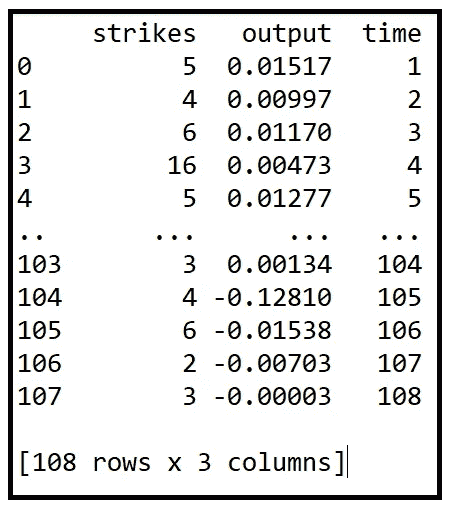

# 泊松整数 ARIMA 回归模型简介

> 原文：<https://towardsdatascience.com/an-introduction-to-the-poisson-integer-arima-regression-model-b66d3ff2e6e5?source=collection_archive---------10----------------------->


图片由 [Clker-Free-Vector-Images](https://pixabay.com/users/clker-free-vector-images-3736/?utm_source=link-attribution&utm_medium=referral&utm_campaign=image&utm_content=35104) 来自 [Pixabay](https://pixabay.com/?utm_source=link-attribution&utm_medium=referral&utm_campaign=image&utm_content=35104) ( [Pixabay 许可](https://pixabay.com/service/license/))

## 以及如何使用 Python 和 statsmodels 实现泊松 INAR(1)回归模型的教程

整数 ARIMA 模型用于建模由整数计数组成的时间序列数据。

这些数据集带来了一些独特的挑战:

**数据是自相关的:**时间序列数据通常是自相关的。我们为这些数据建立的任何模型都需要考虑这些序列相关性。ARIMA(自回归综合移动平均)模型旨在捕捉时间序列数据中的自相关性。

**数据仅由整数计数 0、1、2、3…等组成。:** ARIMA 模型设计用于模拟实值时间序列数据，而不是基于计数的时间序列数据。基于计数的数据可以使用[泊松](/an-illustrated-guide-to-the-poisson-regression-model-50cccba15958)和[类泊松](/generalized-poisson-regression-for-real-world-datasets-d1ff32607d79)模型进行建模，例如[负二项式](/generalized-poisson-regression-for-real-world-datasets-d1ff32607d79)和广义泊松模型。不幸的是，泊松和类泊松模型是静态模型，不是为处理相关时间序列数据而设计的。

> 泊松整数 ARIMA 模型弥补了时间序列数据的 ARIMA 模型与基于计数的数据集的泊松和类泊松模型之间的差距。

正如我们将在下面看到的，在结构上，泊松风险模型的构建与 ARIMA 或泊松模型非常不同。

在本文中，我们将重点关注 Brannas 在*“AR(1)模型中的解释变量”*中介绍的**泊松 INAR(1)** 模型(参见文章底部的论文链接)。INAR(1)是具有 1 阶自回归分量的整数 ARIMA 模型，即，它仅使用第一时间滞后分量， *y_(t-1)。泊松 AR(1)使用泊松过程对误差分量建模。*

让我们检查泊松整数 AR(1)模型的结构。我们将经常使用 Cameron A.C .和 P.K. Trivedi 的《计数数据的回归分析》一书中所遵循的符号约定，以及该主题的一些原始论文。文章最后提到了书和论文的链接。

# 泊松 INAR(1)模型的结构

通用整数 AR(1)模型表示如下:


通用整数 INAR(1)回归模型(图片由作者提供)

在 INAR(1)模型中，我们将时间序列在时间 *t* 的值 express *y_t* 表示为两个量的和:

***ρ ○ y_(t-1):*** 这一项是时间序列在前一时间步 *(t-1)的值的函数。*

***ε_t:*** 这是一个随机变量，代表隐藏的，因此也是未知的变量。我们将选择通过假设随机变量 *ε_t.* 的某种已知概率分布(如正态分布或泊松分布)来模拟潜在变量的影响

第一项，***ρ○y _(t-1)****值得补充说明。理解这个量的方法如下:*

*假设我们正在对一个电子商务网站每天的点击数进行建模。这是计数的时间序列数据，人们可以合理地预期第 *t* 天的点击次数与前几天的点击次数相关。*

*现在假设在某一天 *t* ，点击次数 *y_t =1000* 。再假设我们把这个数字 1000 看做 1000 个独立的，同分布的随机变量: *b_1，b_2，b_3，…b_1000* 。每个变量 *b_i* 遵循以下伯努利分布:*

**

*伯努利随机变量 b_i(图片由作者提供)*

*所以我们可以把 *y_t=1000* 的值看做 *1000 次*独立伯努利试验，每一次的成功概率为 *ρ。*如果一次试验*‘成功’*，网站上就会记录一次点击。因此，一天 t 的预期点击数就是 *ρ乘以 y _ t**

*现在我们可以看到 INAR(1)方程是如何模拟在时间索引 *t* 的网站点击量的，即:*

*   *在前一时间步 *(t-1)* 的预期网站点击数，以及*
*   *由随机变量 *ε_t. ε_t 的实现值提供的对该期望值的*调整*用于对一些潜在数据生成过程建模。**

## *泊松 INAR(1)模型*

*由于我们希望对整数计数的时间序列数据进行建模，因此假设基础(未知)数据生成过程是泊松过程是合适的。因此，*εt*是一个泊松分布的随机变量。*

*因此，**泊松 INAR(1)模型**可以表示如下:*

**

*泊松 INAR(1)模型*

*基本上，我们所说的是在时间 *t* 观察到的值是前一时间步的期望值和假设泊松比为*μt*的泊松分布计数的组合。*

## *如何处理回归变量*

*假设 ***X*** 为回归变量的矩阵， ***β*** 为回归系数的向量，如下:*

**

*回归变量矩阵 ***X*** 和回归系数向量 **β** (图片由作者提供)*

*我们将泊松过程的平均发生率*μt*表示为下面的函数 ***X*** 和回归系数 ***β*** 如下:*

**

*泊松平均指数(图片由作者提供)*

# *估计*

*估算包括估算 *ρ和* ***β*** *。*该领域的各种研究提出了许多估计技术，如最大似然估计、条件最小二乘法、加权最小二乘法和广义矩法。在*“AR(1)模型中的解释变量”*中，Brannas 使用条件最小二乘法和条件广义矩方法技术进行参数估计。*

*在本文中，我们将探讨使用最大似然估计(MLE)方法来估计 *ρ和***β。** 我们对 MLE 的选择很大程度上取决于 [statsmodels](https://www.statsmodels.org/stable/index.html) 库中[**GenericLikelihoodModel**](https://www.statsmodels.org/stable/dev/generated/statsmodels.base.model.GenericLikelihoodModel.html)类的存在。GenericLikelihoodModel 类允许您指定您选择的自定义 MLE 函数，statsmodels 将很乐意为您最大化该函数。*

## *泊松 INAR(1)模型的极大似然估计*

*在最大似然法中，我们寻求将观察整个训练数据集的可能性最大化的值 *ρ和****【β】***。具体来说，我们希望找到 *ρ和* ***β*** ，这将最大化 *t=1 到 n* ***中 *y_t* 的联合出现概率的自然对数。*** 就符号而言，我们希望最大化以下对数似然函数:*

**

*对数似然函数(作者图片)*

*在实践中，我们通过使用以下规则将乘积的对数转换为各个概率的对数之和:*

**ln(A * B * C * D *……)= ln(A)+ln(B)+ln(C)+ln(D)+……**

*最大化*ℓ(⍴；****β****|****y****)*，我们需要构造条件概率分布 *P(y_t|y_(t-1))* 。让我们看看如何做到这一点。*

## *泊松 INAR(1)分布随机变量的概率质量函数*

*让我们来看看泊松 INAR(1)模型的方程:*

**

*泊松 INAR(1)模型*

*我们看到 *y_t* 由两部分组成:y_(t-1) 的期望值和一个泊松分布变量 *ε_t* 。因此，给定 *y_(t-1)* ，观察到 *y_t* 的概率可以表示为两个概率的乘积:*

1.  *从 *y_(t-1)* 个可能事件中观察到 *j* 个‘事件’的二项概率，接下来，*
2.  *观察*(y _ t—j)*‘事件’的泊松概率。*

*由于我们不知道 *j* 是什么，所以我们允许 *j* 的范围从 *0* 到 *y_t(实际上是*，从 *0* 到 *min(y_t，y_(t-1)* ，但这是一个技术问题，所以一切仍然有意义)。对于 *j* 的每个值，我们在(1)和(2)中计算上述两个概率的乘积。最后，我们将所有单个产品总结如下:*

**

*泊松 INAR(1)分布随机变量的 PMF(图片由作者提供)*

*上面的等式所表示的是，在时间步长 *t* 观察到前一时间步长 *y_(t-1)* 的 *y_t* 的概率，等于观察到 *y_(t-1)* 事件中的 *0* 事件的二项式概率和观察到 *y_t* 事件的泊松概率，或者说，观察到 *1* 事件中的二项式概率*

*让我们回忆一下，在上面的等式中，泊松过程的平均发生率 *μ_t 是*表示为*回归变量* ***x_t*** 和回归系数 ***β*** 的如下函数:*

**

*泊松平均指数(图片由作者提供)*

*让我们还记得 *ρ* 是二项概率，在做 MLE 时，我们不希望 *ρ* 出界。因此，我们定义另一个变量γ，使得:*

**

*逻辑函数(图片由作者提供)*

*上述逻辑函数确保当γ的范围从-∞到+∞时，伯努利概率 *ρ* 保持有界在 *[0，1]内。**

**

*逻辑函数(图片由作者提供)*

# *如何使用 Python 和 Statsmodels 构建和训练泊松 INAR(1)*

*我们将使用 STRIKES 数据集说明泊松 INAR(1)模型的使用过程:*

## *制造业罢工数据集*

*为了说明模型拟合过程，我们将使用以下在回归建模文献中广泛使用的开源数据集:*

**

*制造业罢工(数据来源:[美国 BLS](https://www.bls.gov/) 通过 [R 数据集](https://github.com/vincentarelbundock/Rdatasets/blob/master/datasets.csv#L609))*

*该数据集是一个月度时间序列，显示了从 1968 年到 1976 年每月开始的美国制造业活动与美国制造业合同罢工数量之间的关系。*

**

*STRIKES 数据集(来源: [R 数据集](https://github.com/vincentarelbundock/Rdatasets/blob/master/datasets.csv#L609))(图片由[作者](https://sachin-date.medium.com/))*

*这个数据集在 R 中可用，可以使用 [statsmodels 数据集包](https://www.statsmodels.org/devel/datasets/index.html)获取。*

*因变量 ***y*** 为*击*。*

*我们将从导入所有必需的包开始:*

```
***import** math
**import** numpy **as** np
**import** statsmodels.api **as** sm
**from** statsmodels.base.model **import** GenericLikelihoodModel
**from** scipy.stats **import** poisson
**from** scipy.stats **import** binom
**from** patsy **import** dmatrices
**import** statsmodels.graphics.tsaplots **as** tsa
**from** matplotlib **import** pyplot **as** plt*
```

*让我们使用 statsmodels 将数据集加载到内存中:*

```
*strikes_dataset = sm.datasets.**get_rdataset**(dataname=**'StrikeNb'**, package=**'Ecdat'**)*
```

*打印出数据集:*

```
***print**(strikes_dataset.**data**)*
```

*我们看到以下输出:*

**

*我们将前 92 个数据点视为训练集，其余 16 个数据点视为测试数据集:*

```
*strikes_data = strikes_dataset.**data**.**copy**()
strikes_data_train = strikes_data.**query**(**'time<=92'**)strikes_data_test = strikes_data.**query**(**'time>92'**).**reset_index**().**drop**(**'index'**, **axis**=1)*
```

*这是我们的回归表达式。*罢工*是因变量，*产出*是我们的解释变量。假设回归截距存在:*

```
*expr = **'strikes ~ output'***
```

*我们将使用 [Patsy](https://patsy.readthedocs.io/en/latest/quickstart.html) 来雕刻出 ***X*** 和 ***y*** 矩阵。Patsy 将自动添加一个回归截距列到 ***X*** :*

```
*y_train, X_train = **dmatrices**(expr, strikes_data_train, **return_type**=**'**dataframe**'**)
**print**(y_train)
**print**(X_train)y_test, X_test = **dmatrices**(expr, strikes_data_test, **return_type**=**'**dataframe**'**)
**print**(y_test)
**print**(X_test)*
```

*接下来，我们将扩展 GenericLikelihoodModel:*

```
***class** INAR(GenericLikelihoodModel):
    **def** __init__(self, endog, exog, **kwds):
        super(INAR, self).__init__(endog, exog, **kwds)*
```

*在我们的扩展中，我们将覆盖 *nloglikeobs()* 和 *fit()* 方法。statsmodels 调用 *nloglikeobs()* 方法来获取每个观测值的对数似然值 *y_t.* 因此，我们之前描述的泊松 INAR(1)的似然函数进入该方法。该方法返回一个对数似然数组，由 statsmodels 提供的超类对该数组中的所有值求和，以获得由 statsmodels 的优化器优化的总对数似然值。*

```
***class PoissonINAR**(GenericLikelihoodModel):
    **def** __init__(self, endog, exog, **kwds):
        super(INAR, self).__init__(endog, exog, **kwds)

    **def** nloglikeobs(self, params):
        ***#Fetch the parameters gamma and beta 
        #that we would be optimizing***gamma = params[-1]
        beta = params[:-1]

 ***#Set y and X***y = self.endog
        y = np.array(y)
        X = self.exog

 ***#Compute rho as a function of gamma***rho = 1.0/(1.0+math.exp(-gamma))

 ***#Compute the Poisson mean mu as a dot 
        #product of X and Beta***mu = np.exp(X.dot(beta))

 ***#Init the list of log-likelihhod values, 
        #one value for each y***ll = []

 ***#Compute all the log-likelihood values for 
        #the Poisson INAR(1) model*****for** t **in** range(len(y)-1,0,-1):
            prob_y_t = 0
            **for** j **in** range(int(min(y[t], y[t-1])+1)):
                prob_y_t += poisson.pmf((y[t]-j), mu[t]) *  
                            binom.pmf(j, y[t-1], rho)
            ll.append(math.log(prob_y_t))
        ll = np.array(ll) ***#return the negated array of log-likelihoods*****return** -ll*
```

*让我们也实现一下 *model.fit()* 方法:*

```
***def** fit(self, **start_params**=None, **maxiter**=1000, **maxfun**=5000, **kwds):
 ***#Add the gamma parameter to the list of 
    #exogneous variables that the model will optimize***self.exog_names.append(**'gamma'**) **if** start_params == **None**:
 ***#Start with some initial values of Beta and gamma***start_params = np.append(np.ones(self.exog.shape[1]), 1.0)***#Call super.fit() to start the training* ****return** super(**PoissonINAR**, self).fit(**start_params**=start_params,
               **maxiter**=maxiter, **maxfun**=maxfun, **kwds)*
```

*让我们创建泊松 INAR(1)模型类的实例，并在训练数据集上对其进行训练:*

```
*inar_model = **PoissonINAR**(y_train, X_train)
inar_model_results = inar_model.**fit**()*
```

*打印模型培训总结:*

```
***print**(inar_model_results.**summary**())*
```

*我们看到以下输出:*

**

*泊松 INAR(1)模型的训练总结(图片由作者提供)*

## *回归系数的显著性*

*输出变量和 gamma 的系数在 95%的置信区间都是显著的，正如它们的 p 值小于 0.05 所证明的。显著不同于零的回归截距也是如此:*

**

*回归系数的重要性(图片由作者提供)*

## *回归系数的解释*

*系数的解释是*而不是*简单明了。伽马为-0.7039，对应于 1/(1+exp(0.7039)) = 0.33095 的 *ρ* 。*

*估算的 *β* 为 2.6215。*

*拟合模型的方程式为:*

**

*拟合泊松 INAR(1)回归模型的方程(图片由作者提供)*

*对于任意给定的 *t* ，0.33095(大约 33%)的 *y_(t-1)* 构成 *y_t* 。其余的来自泊松过程的估计平均值 *μ_t* ，它是时间 *t* 的输出和估计的 ***β*** 向量的函数。*

## *测量产量变化对罢工频率的影响*

*从模型方程中，很容易看出，观察到的撞击次数随着制造产量的增加而增加。我们可能想通过它们增加了多少来衡量。*

*在训练数据集中，“输出”变量的标准偏差为 0.05654。通过打印以下内容可以看到这一点:*

```
*strikes_data_train['output'].**std**()*
```

*现在假设我们考虑 *y_t* 的两个假设值，即 *y_t1* 和 *y_t2* ，使得它们各自之前的值*y _(T1–1)*和*y _(T2–1)*恰好相同。由于 *β* =2.6215 ***，*** “输出”增加一个标准差，将导致泊松过程的估计均值波动 e^(2.6215*0.05654) = 1.15977，即大约 16%。因此，产量中一个标准差的增加会导致每月观察到的罢工次数增加 16%。*

## *泊松 INAR(1)模型的拟合优度*

*模型方程中的滞后项 *y_(t-1)* 使得拟合优度的确定变得复杂。泊松 INAR(1)模型的非线性排除了使用基于均方误差的测量，例如 R 平方。另一方面，由于 MLE 用于模型拟合，基于偏差的测量，例如</the-complete-guide-to-r-squared-adjusted-r-squared-and-pseudo-r-squared-4136650fc06c>**和 [**卡方分布似然比(LR)测试**](https://en.wikipedia.org/wiki/Likelihood-ratio_test) 可用于判断拟合优度。然而，伪 r 平方和 LR 检验都需要计算零模型(也称为仅截距模型)的对数似然(LL)。在泊松 INAR(1)模型中，由于模型方程中滞后项 *y_(t-1)* 的存在，零模型的构成并不十分明显，还存在争议。***

***考虑到这些困难，人们可能希望通过间接方式判断拟合优度，特别是通过检查拟合模型参数的标准误差和相应的 95%置信区间。***

***在对“罢工”模型采用这种方法时，我们观察到以下情况:***

****ρ* 的 95%置信区间范围为 1/(1+exp(1.174))=0.23613 至 1/(1+exp(0.233))=0.44201，与 1/(1+exp(0.7039)) = 0.33095 的 *ρ* 拟合值相当接近。***

***不幸的是,“输出”变量有一个相当大的标准误差 1.126 和相应的宽置信区间 0.415 到 4.828。正如我们在上一节所看到的，它对“打击”的影响很弱。这对模型的拟合优度有不利影响。***

## ***预言；预测；预告***

***该模型允许提前一步做出预测。预测包括在 ***X*** 矩阵和 ***y*** 的滞后值上运行拟合的模型。我们将在 ***X_test*** 和 ***y*** *的滞后值上运行拟合的模型。*为此，我们将在 statsmodels 中的 model.py 上实现 *predict()* 方法，如下所示:***

```
*****def** predict(self, **params**, **exog**=None, ***args**, ****kwargs**):
 ***#Fetch the optimized values of parameters gamma and beta***fitted_gamma = params[-1]
    fitted_beta = params[:-1] ***#Compute rho as a function of gamma***rho = 1.0/(1.0+math.exp(-fitted_gamma)) ***#Get the Intercept and the regression variables,
    #Don't get the last column which contains the lagged y values***X = exog[:,:-1]
 ***#Fetch the lagged y values***y_lag_1 = exog[:,-1] ***#Compute the predicted y using the fitted Poisson INAR(1) 
    #model's equation***y_pred = rho * y_lag_1 + np.exp(X.dot(fitted_beta)) **return** y_pred***
```

***让我们准备 ***X*** 矩阵进行预测***

```
***X_test[**'y_lag_1'**] = y_test.**shift**(1)
X_test = X_test.**fillna**(0)***
```

***根据测试数据集生成预测。由于我们对计数感兴趣，我们将对预测进行四舍五入。***

```
***inar_predictions = np.**round**(inar_model_results.**predict**(**exog**=X_test))
**print**(inar_predictions)***
```

***我们得到以下输出:***

******

***让我们为 *y_test* 绘制一步预测图:***

```
***predicted_counts=inar_predictions
actual_counts = y_test[**'strikes'**]fig = plt.**figure**()
fig.suptitle(**'Predicted versus actual strike counts'**)predicted, = plt.**plot**(X_test.index, predicted_counts, 'go-', **label**='Predicted counts')actual, = plt.**plot**(X_test.index, actual_counts, 'ro-', **label**='Actual counts')plt.**legend**(**handles**=[predicted, actual])plt.**show**()***
```

***我们看到的是:***

******

***泊松 IINAR(1)模型创建的一步预测罢工数量(图片由作者提供)***

***提前一步预测的质量证实了我们之前通过泊松 INAR(1)模型的拟合优度强调的问题。***

***以下是完整源代码的链接:***

***使用 Python 和 statsmodels 的泊松整数 ARIMA 模型***

# ***引用和版权***

## ***书***

***Cameron A. Colin，Trivedi Pravin K .， [*计数数据回归分析*](http://cameron.econ.ucdavis.edu/racd/count.html) ，计量经济学会专论№30，剑桥大学出版社，1998 年。国际标准书号:0521635675***

## ***报纸***

***布朗恩斯，科特。(1995).[AR(1)计数数据模型中的解释变量](https://www.researchgate.net/publication/254848069_EXPLANATORY_VARIABLES_IN_THE_AR1_COUNT_DATA_MODEL) [**PDF 下载链接**](http://www.usbe.umu.se/digitalAssets/39/39103_ues381.pdf)***

***荣，罗伯特 c 和 a。整数时间序列的二项式稀疏模型。*统计建模*6(2006):81–96。，DOI:[10.1191/1471082 x 06 ST 114 OA](https://doi.org/10.1191/1471082X06st114oa)[**PDF 下载链接**](https://citeseerx.ist.psu.edu/viewdoc/download?doi=10.1.1.914.8707&rep=rep1&type=pdf)***

***凯南 j .， [*美国制造业的合同罢工持续时间，计量经济学杂志*](https://www.sciencedirect.com/science/article/pii/0304407685900648) ，第 28 卷，1985 年第 1 期，第 5-28 页，ISSN 0304-4076，[https://doi . org/10.1016/0304-4076(85)90064-8。](https://doi.org/10.1016/0304-4076(85)90064-8.) [**PDF 下载链接**](https://www.ssc.wisc.edu/~jkennan/research/JEM85.pdf)***

## ***数据集***

***文章中使用的制造业罢工数据集是统计软件中可供公众使用和实验的几个数据集之一，最值得注意的是，这里的[是 R 包](https://rdrr.io/rforge/Ecdat/man/StrikeNb.html)。在 [GPL v3 许可](https://github.com/vincentarelbundock/Rdatasets/blob/master/LICENSE.md)下， [Vincent Arel-Bundock](https://github.com/vincentarelbundock) 通过[vincentarelbundock.github.io/rdatasets](https://vincentarelbundock.github.io/Rdatasets)已经可以使用 Python 访问数据集。***

## ***形象***

***本文中的所有图片版权归 [CC-BY-NC-SA](https://creativecommons.org/licenses/by-nc-sa/4.0/) 所有，除非图片下面提到了不同的来源和版权。***

# ***相关文章***

***</the-complete-guide-to-r-squared-adjusted-r-squared-and-pseudo-r-squared-4136650fc06c>  </an-illustrated-guide-to-the-poisson-regression-model-50cccba15958>  </negative-binomial-regression-f99031bb25b4>  </generalized-poisson-regression-for-real-world-datasets-d1ff32607d79>  

*感谢阅读！如果您喜欢这篇文章，请* [***关注我***](https://timeseriesreasoning.medium.com) *获取关于回归和时间序列分析的提示、操作方法和编程建议。****