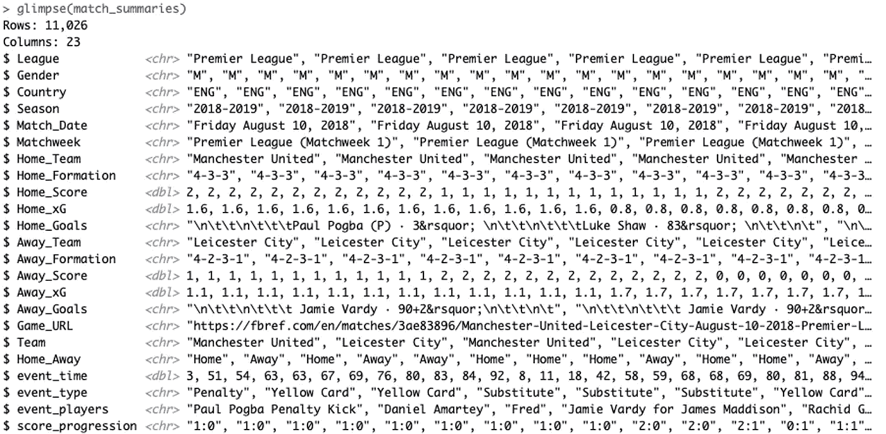
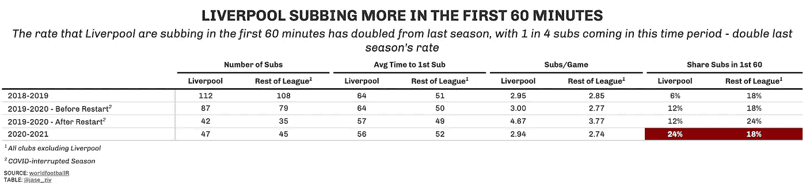

# worldfootballR 软件包介绍

> 原文：<https://towardsdatascience.com/an-introduction-to-the-worldfootballr-r-package-8932b192065d?source=collection_archive---------28----------------------->

## 使用 worldfootballR 包提取英超联赛替补数据


照片由[维也纳雷耶斯](https://unsplash.com/@viennachanges?utm_source=unsplash&utm_medium=referral&utm_content=creditCopyText)在 [Unsplash](https://unsplash.com/s/photos/soccer?utm_source=unsplash&utm_medium=referral&utm_content=creditCopyText) 拍摄

随着`[worldfootballR](https://github.com/JaseZiv/worldfootballR)` R 包的创建；一个新的 R 包来帮助从 fbref.com 提取足球数据，我将试着强调这个包的使用方法。

发布的软件包目前是一个开发版本，仅在 GitHub 上可用，但一旦用户测试完成，将在 CRAN 上提供。

在这篇文章中，我将分析利物浦在过去三个赛季的英超联赛(EPL)中使用换人的情况，以了解当前赛季的行为是否发生了变化，以及在 2019-2020 赛季期间 COVID 爆发和随后暂停期间是否发生了变化。

数据是从过去两个半赛季中提取的，直到 2020/21 EPL 赛季第 17 轮比赛结束。

# 使用`worldfootballR`提取数据

该软件包有一个名为`get_match_summary`的功能，提取比赛 URL 的比赛摘要(进球，替补，红/黄牌)数据(以及其他关于比赛的元数据)。

要获取比赛 URL，可以使用另一个函数—`get_match_urls`—它接受国家代码(“ENG”代表英格兰)、性别和赛季结束年份，并返回一个比赛 URL 向量。

```
devtools::install_github("JaseZiv/worldfootballR")
library(worldfootballR)match_urls <- get_match_urls(country = "ENG", gender = "M", season_end_year = c(2019:2021))match_summaries <- get_match_summary(match_url = match_urls)
```

该函数的输出如下所示:



大量事件数据需要分析。来源:世界足球

# 制造第一艘潜艇的队伍

既然包装说明已经出来了，我们就把注意力转向英超联赛换人数据的分析，特别提出这个问题，利物浦的换人行为有变化吗？

这一分析大致是受 FiveThirtyEight 在联赛重启前后关于德甲球队替代者的一篇文章的启发。

# 用数据解释利物浦的换人

在分析的所有赛季中，利物浦在一个赛季中的替补人数略高于联盟平均水平，上赛季重新开始后，每个赛季的平均替补人数达到了 4.67 人。本赛季已经恢复到 COVID 之前的水平。

有趣的是，虽然利物浦的第一次替补出场时间通常略晚于联赛平均水平(56 分钟比 52 分钟)，但红军在赛季重新开始后一直接近他们的第一次替补出场时间，而联赛平均水平已经恢复到 COVID 之前的水平，逆转了全联盟的趋势。

# 现在第一个小时更？

红军在 2019-20 赛季的第一个小时进行了 12%的换人(是 2018-19 赛季的两倍)，本赛季在前 16 场比赛中这一比例再次翻倍。然而，联盟经历了这一趋势的直接逆转，在 19/20 赛季重新开始的部分期间飙升至 24%，并回落到前几个赛季的联盟平均水平。

看看这种趋势如何在本赛季的后半段继续下去将会很有趣。



数据来源于 worldfootballR。使用 gt 进行可视化

# 包裹

这是利用`worldfootballR`包中各种数据提取功能的一系列分析中的第一个。

在这里，我们看到利物浦比他们之前的趋势更早地进行了第一次换人，并且偏离了联赛平均水平。我将跟踪这一分析，看看这一趋势是否还在继续。

一如既往，任何关于作品或 R 包的问题/评论，请随时通过常规渠道联系。

加油红人！！

这篇文章的完整版本出现在 dontblamethedata.com 的这里