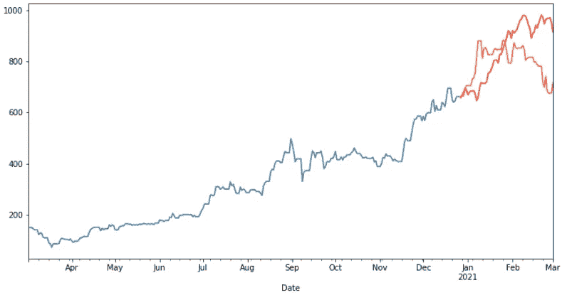

# ARIMA 时间序列分析导论

> 原文：<https://towardsdatascience.com/an-introduction-to-time-series-analysis-with-arima-a8b9c9a961fb?source=collection_archive---------9----------------------->



作者图片

时间序列预测侧重于分析等距时间间隔内的数据变化。时间序列分析广泛应用于各种领域，从计量经济学到地质学和地震预测；它也被用于几乎所有的应用科学和工程。时间序列数据的例子包括标准普尔 500 指数、发病率、死亡率、血压跟踪、全球气温。这篇文章将着眼于如何自回归综合移动平均(ARIMA)模型的工作，并适合时间序列数据。在继续之前，首先要考虑的是多变量预测和单变量预测之间的区别。前者仅使用以前的时间值来预测未来值。后者利用了不同的预测值，而不是序列本身。Jupyter 笔记本及相关数据请参考我的 [GitHub](https://github.com/TahaBinhuraib/Arima_medium) repo。

## 白噪声及其重要性

根据定义，白噪声是随机数据。如果变量是独立的且同分布(i.i.d ),均值为零，则时间序列是白噪声(随机)。换句话说，时间序列有一个均值 *μ = 0* 和一个恒定的标准差 *σ = c* 。您可以使用 df.describe()函数来检查您的平均值:


作者图片

由于我们的平均值远高于零，我们可以放心，我们的数据不是白噪音。尽管我们不需要执行以下操作，但还是让我们将数据分成两部分，看看它们各自的标准偏差:

```
df_1 = df[:100]
df_2 = df[100:]print(df_1.describe())
print(df_2.describe())
```


作者图片

这里我们可以清楚地看到，我们的σ₁ ≠σ₂.下一张图将展示一个白噪声的例子。如下图所示，信号在平均值 0 附近振荡，不难发现标准偏差随时间保持不变。


图片来自维基百科

**白噪声** *y =噪声(t) = ϵₜ*

由于白噪声的定义隐含着随机性，你不能对它建模并做出预测。一旦你看到白噪音，不要继续任何预测模型！

# ARIMA 简介

Arima 是 Auto-Regressive Integrated Moving Average 的缩写，它是一种预测算法，基于以前的值携带固有信息的假设，可用于预测未来的值。我们可以开发一个预测模型，根据过去的值来预测 xₜ。，正式表示为:
*p(xₜ | xₜ₋₁，… ,x₁)*

为了理解 ARIMA，我们首先要把它分成几个基本成分:

1.  阿肯色州
2.  我
3.  马萨诸塞州

ARIMA 模型包含三个参数:

1.  p 是 AR 项的阶数
2.  q 是 MA 项的顺序
3.  d 是差分的数目

## 自回归 AR 和移动平均 MA

AR 模型仅依赖于过去的值(滞后)来估计未来的值。让我们来看看 AR 模型的一般形式:


值“p”决定了预测中要考虑的过去值 p 的数量。模型的阶数越高，考虑的过去值就越多。为了简单起见，我们来看一个 AR(1)模型。


> AR 模型可以简单地认为是 p 个过去值的线性组合。

另一方面，移动平均 MA 模型依赖于过去的预测误差来进行预测。让我们看看 MA 模型的一般形式:


> MA 模型可以简单地认为是 q 个过去预测误差的线性组合。

现在，在进一步讨论之前，我们必须讨论平稳数据和非平稳数据之间的区别。

## 静止的

平稳数据是时间序列不依赖于时间变量的数据；为了开发仅依赖于过去值的预测模型，需要这种假设。没有稳定的数据会使您的预测不令人满意，因为您的模型会将时间变量考虑在内。直观上，平均值和方差等参数不会随时间而改变。下面的两个图表说明了平稳数据和非平稳数据之间的区别:


作者图片

如上所示，非平稳数据有明显的上升趋势。

现在让我们看一个非平稳数据的具体例子，并使用 Pandas 的 diff()函数来实现平稳性:


非平稳数据

```
#Calculates the difference of a Dataframe element compared with another element in the Dataframe (default is element in previous row = 1).df_1.diff(1).plot()
```


使用 Pandas Diff 函数后的静态数据

如上所述，我们通过计算连续行之间的差值实现了平稳性。

如果 d=0: yₜ = Yₜ

*如果 d=1: yₜ = Yₜ — Yₜ₋₁*

*如果 d = 2:yₜ=(yₜ—yₜ-₁)-(yₜ-₁—yₜ-₂)*

现在让我们考虑时间序列 x 的 ARIMA(1，1，1)。为了简洁起见，省略了常数项。

*yₜ = yₜ — y_t₋₁*

yₜ = ϕ₁yₜ₋₁ + ϵₜ — θ₁ ϵₜ₋₁

## 我们如何找到参数(p，d，q)

我们可以简单的使用 [*Auto。Arima*](https://pypi.org/project/pmdarima/) 和交叉验证，以便找到模型的最佳参数。首先，让我们加载数据并绘制它。

```
df = pd.read_csv('passengers.csv', usecols=[1], engine='python')
plt.plot(df)
```


作者图片

如上所示，该数据具有明显的季节性上升趋势。现在我们将简单地利用汽车。Arima 来拟合数据并进行预测

```
y = df.values
train, test = train_test_split(y, train_size=100)# Fit model
model = pm.auto_arima(train, seasonal=True, m=12)forecasts = model.predict(test.shape[0])x = np.arange(y.shape[0])
plt.plot(x, y, c='blue' , label = 'expected')
plt.plot(x[100:], forecasts, c='green' , label = 'predicted')
plt.legend()
plt.show() 
```


作者图片

非常符合测试数据！

# 摘要

1.  Arima 是一个很好的时间序列分析工具，Auto Arima 软件包使微调过程变得更加容易
2.  始终绘制您的数据并执行解释性数据分析 EDA，以便更好地理解数据。
3.  了解不同预测模型背后的技术细节可以帮助你选择正确的模型。

# 参考

[https://machine learning mastery . com/ARIMA-for-time-series-forecasting-with-python/](https://machinelearningmastery.com/arima-for-time-series-forecasting-with-python/)

https://people.duke.edu/~rnau/411arim.htm

[https://towards data science . com/understanding-ARIMA-time-series-modeling-d 99 CD 11 be 3 f 8](/understanding-arima-time-series-modeling-d99cd11be3f8)