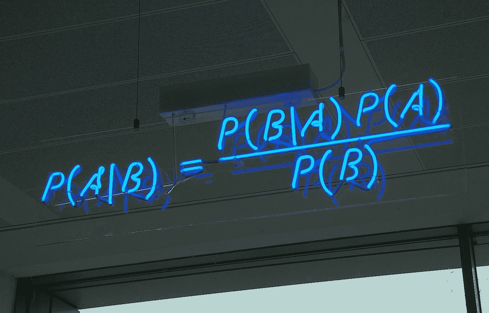
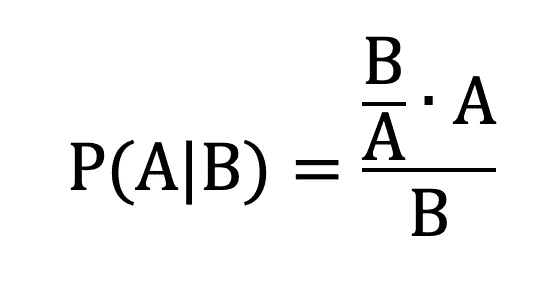
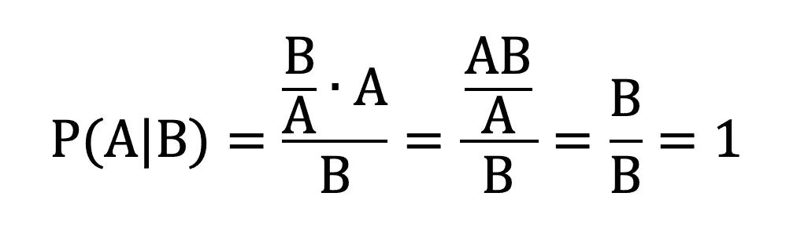
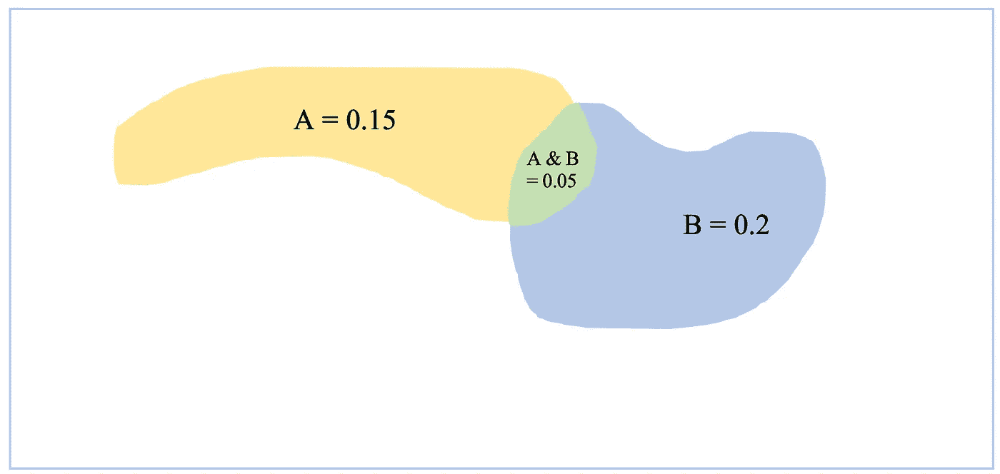
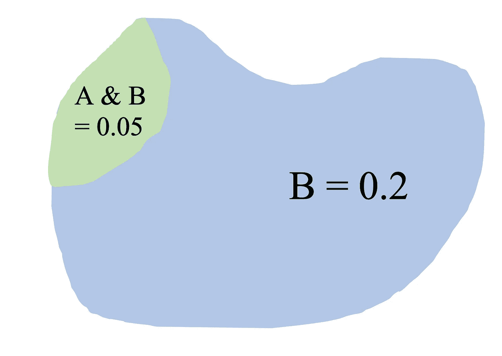
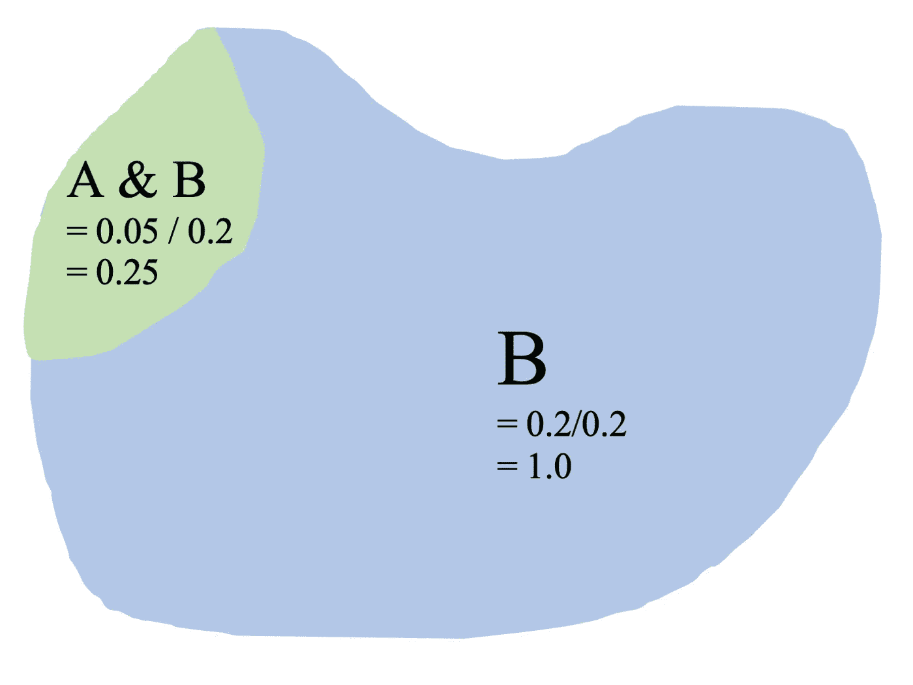
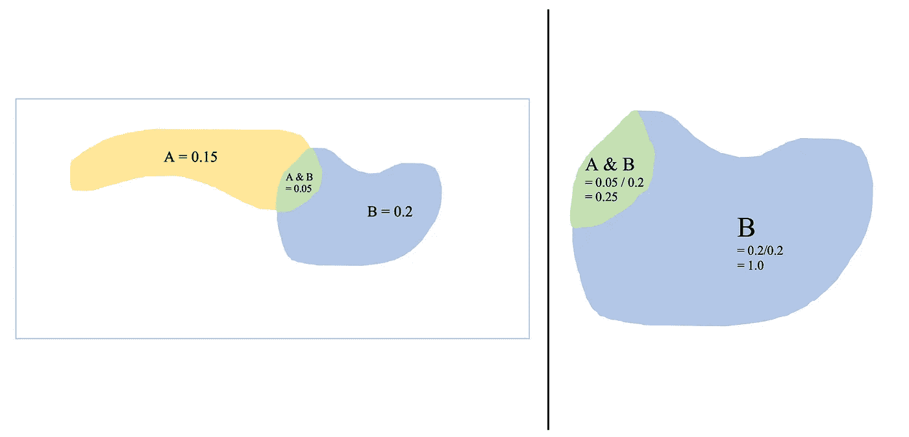
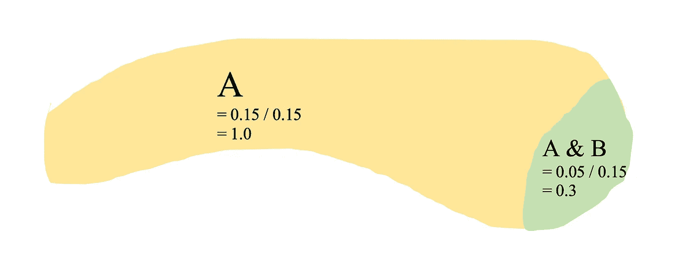
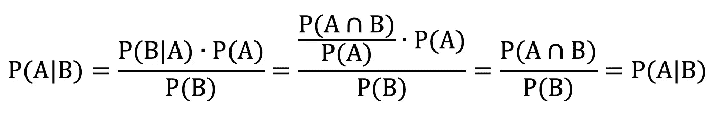

# 贝叶斯定理的直观方法

> 原文：<https://towardsdatascience.com/an-intuitive-approach-to-bayes-theorem-f1af8a116375?source=collection_archive---------39----------------------->

## 区域类比

"剑桥自治大学霓虹灯下的数学."图片由[马特·巴克在 flickr](https://www.flickr.com/photos/mattbuck007/3676624894/in/photostream/) 上提供，经[知识共享协议 BY-SA 2.0](https://creativecommons.org/licenses/by-sa/2.0/) 授权。

这张照片很好地说明了一切:给定事件 B，事件 A 的概率等于给定事件 A，B 的概率，A 的概率，以及 B 的概率的倒数的乘积。实际上，我认为这张图片更好地总结了这一切。

这个公式来自于数学背景(相对于统计学)，起初有点难以理解，如果你把这些条件概率过于字面地解释为分数，它就显得有些荒谬。这是一个很容易犯的错误——一个我很容易犯的错误——把这个公式理解成这样:

错误的贝叶斯。作者图片

这反过来又简化成了一句废话:

进一步错误的贝叶斯。作者图片

事件 A 的概率给定事件 B，不管这些事件是什么，都是确定无疑的——疯狂！显然，这不是对贝叶斯定理的正确解释，但是对于熟悉(可能过于熟悉)有理表达式的人来说，要不看到上面的分数解释可能有点困难。我承认，由于这种诱人但错误的分数转换，贝叶斯定理总是需要我做一些工作来抵制这种诱惑，并深入挖掘这一统计真理的直观而准确的解释。所以，为了让我为自己更好地记忆这个解释铺平道路，也为了给其他人带来一个有希望的直观解释，我想分享一下我对这个公式的更好的解释。为此，图像:

作者图片

假设在这个矩形内部，黄色区域 A(包括与 B 重叠的绿色部分)总共占矩形的 15%；蓝色区域 B(包括绿色重叠区域)总共占矩形的 20%；绿色重叠的地方占矩形的 5%。

问一下，如果你把你的笔悬停在这个长方形的盒子上并随机放下，你落在 A 区的概率是多少(写为 P(A))。它占了总面积的 15%,所以你有 15%的机会以黄色着陆是有道理的。降落在蓝区的概率呢，B (P(B))？它是矩形的 20%，所以有 20%的可能性。以及在 A 和 B 中落地的概率(P(A&B)也写成 P(A∩B)，读作“A 相交 B 的概率”)？那是绿色区域，所以有 5%的可能性。到目前为止，还不错。

假设我们限制我们的笔只悬停在蓝色区域，b。让我们放大。

作者图片

我们在蓝区着陆的新概率是多少(P(B|B)，读作“给定 B 的 B 的概率”)？现在，这是一个 100%的机会——我们已经将我们的笔移动限制在蓝色区域上！所以让我们来衡量我们的数字。蓝区原本只是总面积的 20%，现在是整个赛场:B=1.0 = 100%。至于绿色交叉区域，我们也需要扩大它。它占矩形的 5%，但它占 b 区的 0.05/0.2 = .25 =25%。

作者图片

有了这些重写的区域，就很容易知道我们的笔落在绿色重叠区域的概率是多少(P(A|B)): 25%。

让我们思考一下所有这些。为了找到单个事件的概率，例如降落在 A 或 B 或它们的相交区域的概率，我们只需查看该区域占整个矩形的比例。在绿色重叠区域中，有 15%的机会降落在 A 上，20%的机会降落在 B 上，5%的机会同时降落在两者上。

作者图片

但是，当我们限制我们的笔在蓝色区域盘旋时，B——我们可以说我们已经*给定了*我们将在 B 的某个地方着陆——我们通过除以 B 的面积(或者，不严格地说，除以 B 的概率)来重新计算我们的面积，以找到新的面积/在绿色 A-B 重叠区着陆的概率，或者给定我们将在 B (P(A|B))的某个地方着陆的概率，即 0.25，或者 25 在一个恰当的统计定义中，你会看到它是这样写的:

条件概率的定义。作者图片

给定事件 B 的事件 A 的概率等于 A 和 B 相交的概率(或者，在我们的面积类比中，绿色 A-B 重叠区的面积)除以 B 的概率(或者 B 的面积)。

停止追踪，关掉迪斯科球。如果我们想知道 B 给定 A 的概率是多少(P(B|A))呢？在我们上面的区域例子中，很容易放大黄色区域，再次缩放区域，看看绿色重叠区域的新区域是多少:0.3，或者说有 30%的机会降落在区域 B，假设我们要降落在 a 的某个地方。

作者图片

不幸的是，在现实生活中很难复制这一过程。通常，只有一个这样的条件概率是已知的(P(B|A))，而另一个是未知的(P(A|B))。这就是贝叶斯定理的力量。你不需要知道另一个概率，不需要去实验性地找到它。你可以先把它算掉。你可以把它想象成从放大的图片开始，然后回到完整的图片。

作者图片

我们从 P(A|B)开始，我们想到达 P(B|A)。看看我们所知道的。p(A | B)= . 25；P(B) = 0.2。让我们把它们放大。为了缩小它们，我们除以 B 的面积(0.2)；把它们按比例缩小，乘以 B 的面积 P(A | B)* P(B)= 0.25 * 0.2 = 0.05 = P(A∩B)。让你回到这里:

作者图片

再次放大，这次是黄色区域 A:

作者图片

通过除以 A 的面积(0.15)来缩放面积。P(A∩B)/P(A)= 0.05/0.15 = 0.3 = P(B | A)。就是这样。你从 P(A|B)一路做到了 P(B|A ),而无需进行任何新的实验或任何更多的计数。我们现在也可以重温原来分数解释。只要稍加替换，一切都会迎刃而解:

表明贝叶斯定理产生了条件概率的定义。图片作者。

那么贝叶斯定理发生了什么？在分子中，你将 P(B|A)的条件概率(这是重叠区域，缩放到 A) *乘以 A (P(A)的大小*，以查看重叠区域在“总体情况”中的价值。比如找到它的原始分数。然后，你把它缩小，这次是 B 的大小，用它除以 B 的面积(P(B))来看它值多少 B 区。那就是把你从 P(A|B)带到 P(B|A)的翻转。

当应用于一个例子时，这个东西听起来更酷。一个经典的例子是垃圾邮件。使用单词“money”的垃圾邮件的部分是 0.4(P(Money | Spam)= 0.4)；所有电子邮件中垃圾邮件的比例为 0.1 (P(垃圾邮件)= 0.1)；所有邮件中使用“钱”这个词的部分是 0.2 (P(Money)=0.2)。贝叶斯定理告诉你，带有“money”一词的邮件是垃圾邮件的部分或概率是 P(Spam | Money)= P(Money | Spam)* P(Spam)/P(Money)= 0.4 * 0.1/0.2 = 0.2。当一封带有“钱”字的邮件进来时，有 20%的可能是垃圾邮件。

请继续阅读这些链接，了解更多关于条件概率、贝叶斯定理及其应用的信息。

*   [集合论](https://en.wikipedia.org/wiki/Set_(mathematics))
*   [条件概率](https://en.wikipedia.org/wiki/Conditional_probability)
*   [贝叶斯定理](https://en.wikipedia.org/wiki/Bayes%27_theorem)
*   [贝叶斯定理和条件概率(附有趣例子)](https://brilliant.org/wiki/bayes-theorem/?quiz=bayes-theorem#_=_)
*   [朴素贝叶斯分类器](https://en.wikipedia.org/wiki/Naive_Bayes_classifier)
*   [多项式朴素贝叶斯解释](https://www.mygreatlearning.com/blog/multinomial-naive-bayes-explained/#:~:text=Multinomial%20Na%C3%AFve%20Bayes%20uses%20term,term%20appears%20in%20a%20document.&text=After%20normalization%2C%20term%20frequency%20can,to%20estimate%20the%20conditional%20probability.)