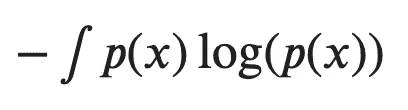
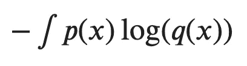
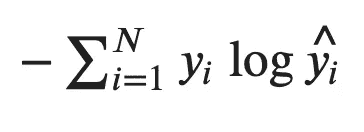

# 直观指南:熵如何与交叉熵相联系

> 原文：<https://towardsdatascience.com/an-intuitive-guide-how-entropy-connects-to-cross-entropy-78b0713494a9?source=collection_archive---------28----------------------->

你好。

对于任何机器学习和数据科学的初学者来说，最重要的是你要清楚*熵*和*交叉熵*的概念。它们无处不在，并作为构建树、奇特的维数缩减和图像分类的关键基础。

在这篇文章中，我将试着用*信息论*的视角带你了解熵的概念，当我第一次尝试掌握这个概念时，它变得非常有用。让我们看看进展如何。

照片由 [Ave Calvar](https://unsplash.com/@shotbyrain?utm_source=medium&utm_medium=referral) 在 [Unsplash](https://unsplash.com?utm_source=medium&utm_medium=referral) 上拍摄

> ***第一步。什么是-log(p)？***

信息论的主要关注点之一是量化编码和传输事件所需的总位数。直观上，罕见事件，即具有较低概率的事件，将需要更多的比特来表示，而频繁事件将不需要很多比特。

因此，我们可以从编码器和发射器的角度出发，将*负对数(p)* 定义为编码和传输遵循 p 概率分布的事件所需的总比特数，也称为*信息、*。很容易检查到小 p(罕见事件)导致大对数(p)(更多比特)。

现在，从事件观察者的角度来看，我们注意到 how -log(p)本质上是观察事件的'*惊喜'*。例如，如果掷硬币时 p(头)= 0.99，p(尾)= 0.01，那么如果掷的是一条尾巴，人们会惊讶得多。注意-log(p(tail)) = 6.644，远大于-log(p(head)) = 0.014。

你直观的看出-log(p)是什么意思了吧？

> ***第二步。熵，意料中的惊喜***

根据这一讨论，我们可以用概率分布 p(x)定义事件的*预期惊喜*，我们称之为熵。更正式地说，这是量化一个事件的可能结果中固有的不确定性水平。对于连续变量 x，熵可以写成:

熵，一个事件的预期惊喜

回到信息论，从编码器和发射器的角度来看，这量化了表示遵循概率分布 p(x)的随机选择事件所需的比特数。想象一个包含圆形和三角形的盒子，回忆化学课上熵的概念/感觉！一个偏斜的分布(许多圆和几个三角形)将意味着低熵，因为你的不确定性水平很低，这意味着，你有信心你选择的将是一个圆。

> ***第三步。交叉熵，用于机器学习***

现在换挡。让我们记住，机器学习的主要目标是找到并声明一个最佳模仿(近似)真实数据分布的概率分布。交叉熵提供了一种使用分布 q 量化遵循分布 P 编码数据所需的平均比特数的方法。

q(x)与 p(x)的交叉熵

值得注意的是，这个量可以通过下面的关系从熵中获得，其中的概念是:(原始比特)+(额外比特)=(总比特)。(额外比特)部分就是所谓的 *KL-divergence* ，统计学上常用来衡量两个分布之间的距离，也称为*相对熵*。

从熵到交叉熵

在图像分类中，您会经常遇到*交叉熵损失*，对于 N 个类别，表示如下，其中 y_{i}和\hat{y_{i}}分别是实际标签和预测。想象 N = 2，然后你会意识到交叉熵损失如何简单地变成逻辑回归中使用的逻辑损失。

交叉熵损失

> 恭喜你。你已经走了很长的路。

总而言之，

*   -log(p)只是一种表达你对观察到概率为 p 的事件有多惊讶的奇特方式。罕见事件(低 p)导致高度惊讶。
*   如果你对所有事件的惊喜进行积分，你会得到你预期的惊喜，我们称之为熵。如果你有高熵，这意味着一个事件的可能结果中固有的不确定性水平很高。
*   交叉熵考虑了接近真实分布 P 的分布 Q，并使用分布 Q 来测量表示分布 P 之后的数据所需的比特量
*   交叉熵损失是一种很好的方法，可以量化我们的机器学习模型对数据的真实分布(P)的逼近程度(Q)。注意，逻辑损失只是一个二元交叉熵损失。

你现在对熵是什么以及它如何与机器学习的交叉熵联系起来有了很好的理解。希望它能帮助你比以前更容易起飞。

不要犹豫留下你的想法！您的反馈和评论有助于丰富我们的社区。很高兴听到。感谢阅读:-)

~ DK