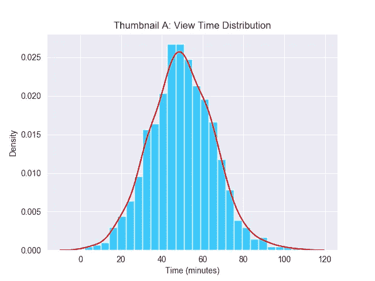
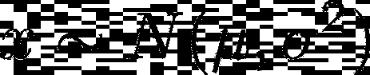
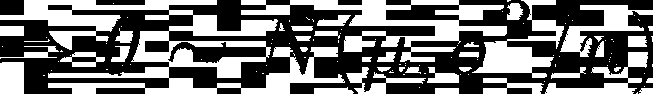
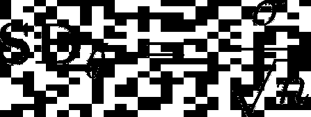
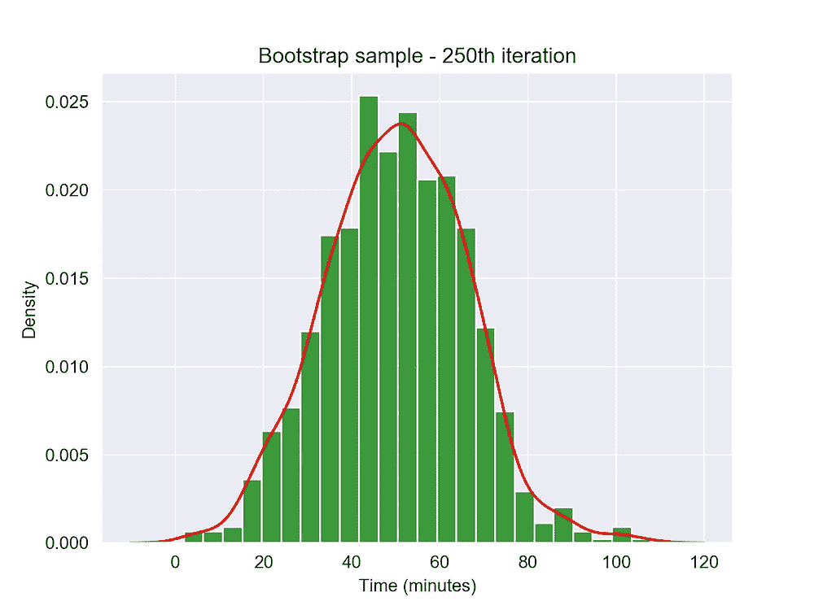
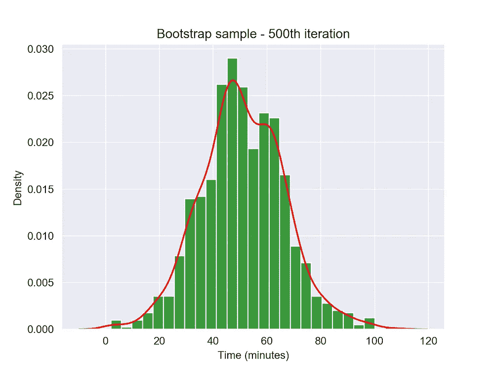
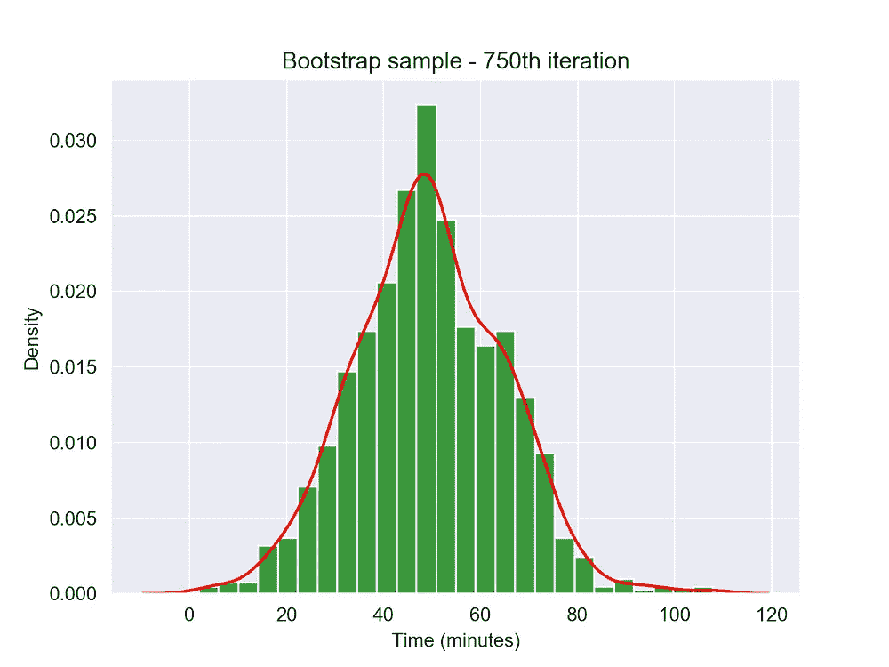
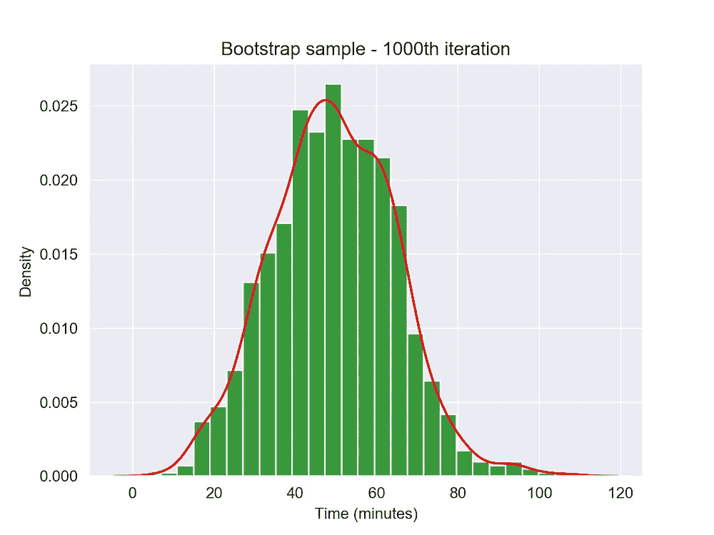

# 引导程序的直观指南

> 原文：<https://towardsdatascience.com/an-intuitive-guide-to-the-bootstrap-9b1ebdec6975?source=collection_archive---------15----------------------->

## [入门](https://towardsdatascience.com/tagged/getting-started)

## 本文概述了如何在不做太多假设的情况下回答因果问题

对我来说，自举是 21 世纪最了不起的发明之一。这是一种非常强大的易于实现的重采样技术。这种技术被广泛应用于许多领域。

从测试因果断言到提高机器学习模型的预测准确性，bootstrap 已经*极大地增强了*任何人都可以对其数据提出的各种问题。为了充分理解它是如何工作的，我想通过一个有趣而简单的例子向大家展示一下。

想象一下，网飞正在宣传一部名为《好莱坞崛起》的虚构动作片。他们想最大化人们观看这部电影的时间。为此，他们希望优化用户登录网飞网站时看到的这部电影的艺术作品(缩略图)。

一部电影的艺术作品是用户与网飞网站互动的焦点。因此，没有吸引力的缩略图可能会阻止观众观看电影。因此，网飞的高管们热衷于使用吸引大部分用户群的缩略图。让我们假设下面的艺术品是正在考虑的两个选项之一。

照片由 [Angela Ng](https://unsplash.com/@angelang?utm_source=unsplash&utm_medium=referral&utm_content=creditCopyText) 在 [Unsplash](/s/photos/hollywood?utm_source=unsplash&utm_medium=referral&utm_content=creditCopyText) 上拍摄。查看**缩略图 A** 的用户看好莱坞崛起的时间更长吗？

这些高管想知道他们的用户会对 ***缩略图 A*** 做出怎样的反应，然后再向所有人推广。为此，他们进行了一项实验。

首先，他们从用户群中随机选择 1000 名观众。然后向这些查看者显示缩略图 a。然后记录这些用户的每个查看时间。观看时间本质上是用户观看好莱坞崛起的时间。这些信息随后被用于计算网飞管理层感兴趣的各种汇总统计数据。

例如，他们可能对这个视图时间分布(MVT) 的 ***含义感兴趣。例如，假设他们观察到缩略图 A 的 MVT*比缩略图 b 下的 MVT 高****

在 [Unsplash](/s/photos/hollywood?utm_source=unsplash&utm_medium=referral&utm_content=creditCopyText) 上由 [Cameron Venti](https://unsplash.com/@ventiviews?utm_source=unsplash&utm_medium=referral&utm_content=creditCopyText) 拍摄的照片。网飞正考虑在《好莱坞崛起》首映期间展示其成员

# 一个简单的实验

网飞许多高管心中的一个问题是，这个数字有多可靠？他们应该用它来推动缩略图 A 超过 B 吗？他们能从某种程度上理解他们评估中潜在的不确定性吗？

让我们试着用一些模拟数据来回答这些问题。我从平均值为 50 分钟、方差为 15 分钟的正态分布中得出观察结果。

观看时间的所有 1000 名观众谁观看了设置后，显示。

使用这些参数值，我们可以观察到各种各样的视图时间行为。看起来好像有些用户几乎没有看这部电影(观看时间约 0 分钟)，而他们中的少数人看完了这部电影(观看时间约 120 分钟)。所有这些场景都代表了合理的观看行为。我们还发现*经验平均观看时间为 49.7 分钟*。这是意料之中的，因为我是从 50 分钟的均值分布中提取的。

如何知道这个数字是异常低还是异常高？如何判断我的统计值是否只是随机的结果？也许我观察到了我所做的价值，因为我的样本中选择了特定的人，以及他们在进行这个样本的那天的特定心情？

要回答所有这些问题，我们需要测量统计数据的可变性。 ***也就是说，我们想知道如果我们选择不同的随机样本*** ，我们的统计值会有多大的不同。那么我们该怎么做呢？

嗯，有两种大致的方法:

1.  使用统计理论的方法
2.  引导程序

# 统计理论

由于我们样本中的每个观察值都是独立的(随机抽取)且同分布的(都选自正态分布)，统计理论给出了以下结果:

从统计理论中推导出样本平均值的标准误差(样本标准偏差)

我们现在可以使用这些等式来*测量样本均值统计的可变性*。嗯，那很简单！为什么我们不这样做呢？嗯，一个原因是这些好的封闭形式的公式只被开发用于一个被充分研究的分布的子集(想想泊松，正态)。因此，为了利用上面的简单公式，需要确保他们的数据符合每个分布的假设。

这不是一个吸引人的解决方案。像现实生活中的大多数事情一样，假设需要被检验。虽然它们有时可能是合理的，但它们最终会迫使分析师花费大量时间来验证这些假设，而不是研究手头的实际数据。

在我看来，这就是 ***无模型解决方案*** 的最终动机。我们能否在不对数据生成过程施加所有这些条件的情况下，以某种方式了解我们的估计器的行为？

有没有办法让我们用我们观测样本的经验分布作为我们的北极星；我们的指南针？

有，有！让我在下一节告诉你所有的事情

# 自举

我们知道我们的每个模拟观察都是独立的，并且是同分布的。因此，我们为什么不从我们的样本 中抽取**样本呢？具体来说，我们为什么不用替换重新取样呢？**

让我们考虑一下。我们 1000 次浏览的样本本质上是我们对网飞用户行为的唯一描述。如果这个抽样步骤*执行正确* (即以分层随机的方式代表网飞用户群的分布)，它应该是用户真实观看行为的相当准确的表示。

这是为什么呢？有趣的是，随机抽取的样本的 ***分布形状通常与从*** 抽取的人口相似。我知道这听起来有点奇怪。当我第一次听到这个消息时，我也对此表示怀疑。为了让我相信这一点，我进行了测试。然而，在我向你展示我的结果之前，我想请你注意另一个重要的问题。

这是否意味着我从人群中随机抽取的每个样本看起来都一样？不要！也不应该。你会注意到一些极端的例子，在这些例子中，同一个数字要么被抽取了很多次，要么根本没有被抽取。出现这种情况是因为我们用替换的 ***样品。*** 这样做可以确保:

1.  每个抽屉都是相互独立的。
2.  我们以反映数据生成过程的方式抽取样本。

在模拟反事实(假设)现实的背景下，这些指针再次变得非常有用。例如，假设你在最初的实验中观察到的观看时间天生就受到人们当天情绪的影响。有些人可能只是想拿些爆米花和他们的伴侣一起看一部精彩的动作惊悚片，而另一些人可能只是度过了艰难的一天，因此想看一些有趣和放松的东西。

因此，在这种情况下，您会发现视图时间分布有很大的偏差。可能会有一些小的视图持续时间和一些异常大的视图持续时间。

如果我们在大部分用户想看一部好的动作片的时候进行实验，或者相反，会怎么样呢？诸如此类的问题使得网飞很难通过单一实验的镜头准确推断观众想要什么。

那么，他们是否应该反复进行*同样的实验呢？如果代价很高呢？如果这破坏了他们的用户体验怎么办？有替代方案吗？这是自举拯救世界的众多例子之一。*

*该引导程序描述如下:*

1.  *随机选择一组网飞观众，给他们看。*
2.  *记录他们的观看时间。*
3.  *计算这个随机样本的平均观看时间(MVT)。*
4.  *从步骤 1 中收集的样本中抽取另一个样本(随机替换)并记录其 MVT。把这个**叫做 T5【自举】MVT 叫做 ***
5.  *重复步骤 4 B 次(通常 B 被设置为 250 或 500 这样的大数字)。*
6.  *计算 ***自举 MVT*** 的 B 值的样本标准差(标准差)。*

*我还附上了我用来用 Python 创建自己的引导示例的代码片段:*

*在 python 中模拟引导程序*

*要全面了解我用来生成下面这些图的代码，请查看我的[***GitHub repo***](https://github.com/navysealtf9k/Medium_Articles/blob/main/Bootstrap/bootstrapping.py)。正如我所承诺的，这是我画的一些自举样本的照片:*

****

*一些显示引导样本的图像，这些引导样本是通过从观察样本中抽取 1000 个观察值而创建的*

****

*不出所料，尽管来自同一个分布，但我们在它们的每个形状上都看到了相当多的变化。你可能也想知道标准误差的自举估计是否与统计理论预测的一致？嗯，统计理论告诉我们这个数字是 **0.4963** 。我们的自举估计是 0.48694 。我认为数字说明了一切。*

*如上所示，bootstrapping 使我们能够从收集的数据中重新采样。因此，我们实质上可以模拟许多不同的现实。这些样本本质上允许我们假装在不同的时间点进行实验。*

*因此，通过模拟大量不同的似是而非的现实，我们可以在我们的估计器(在我们的例子中是平均观看时间)可以采用的不同值上形成一个分布。因此，通过这种分布，我们可以更好地了解估计量的不确定性。*

# *限制*

*像所有的统计方法一样，bootstrap 也有它的缺点。例如，当样本量非常小时，它对手头数据的经验分布的依赖可能是错误的。我强烈建议读者查看 ***关于引导程序*** 的介绍，以获得关于这些限制的全面讨论。对于喜欢快速浏览的读者，请查看这个精彩的 [***栈溢出***](https://stats.stackexchange.com/questions/280725/pros-and-cons-of-bootstrapping) 答案。*

# *结论*

*这就是它的全部！这个优雅的程序让我们可以做很多奇妙的事情。我们可以用它来衡量我们估计的不确定性。我们可以围绕我们的估计建立置信区间，并进行假设检验(例如，缩略图 A 下的查看时间是否高于缩略图 B)。我们还可以对复杂的统计数据做出推断性的陈述(例如，缩略图 A 下的平均观看时间的标准误差是多少？)不可能得到这么好的封闭形式的公式。*

*这些途径中的每一个都能让网飞更好地了解他们的实验结果。 ***它还能让他们在对数据做最少假设的情况下做出明智而有意义的决定*** 。*

*最后，对于那些关心这个过程的统计特性的人，不要担心。统计学家投入了大量的时间和精力来证明这一过程产生的估计值具有大量理想的统计特性(如无偏性)。*

# *参考*

*[1] 布拉德利·埃夫隆和罗伯特·J·蒂布拉尼 ***，《自举导论》(1994)，*** CRC 出版社*

*[2] ***用外行人的话解释自举是如何工作的*** (2012)，[https://stats . stack exchange . com/questions/26088/Explaining-to-layer-why-bootstrapping-works](https://stats.stackexchange.com/questions/26088/explaining-to-laypeople-why-bootstrapping-works)*

*[3] ***自举的利弊*** (2017)，[https://stats . stack exchange . com/questions/280725/自举的利弊](https://stats.stackexchange.com/questions/280725/pros-and-cons-of-bootstrapping)*