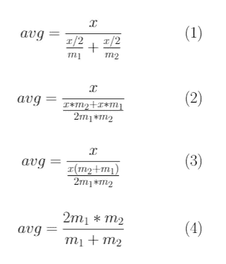

# F1 分数的直观指南

> 原文：<https://towardsdatascience.com/an-intuitive-guide-to-the-f1-score-55fe8233c79e?source=collection_archive---------25----------------------->

## 揭秘一个非常流行的分类标准

安托万·道特里在 [Unsplash](https://unsplash.com?utm_source=medium&utm_medium=referral) 上拍摄的照片

作为一名数据科学家，我广泛使用了 F1 分数的概念，因为这是一种在澄清任务中同时考虑精确度和召回率的好方法。这是一个非常受欢迎的指标，也被称为索伦森-戴斯系数。但对我来说，这从来不是一个直观的平均值。

为了刷新我们的记忆，F1 分数的公式是 2*m1***m2*/(*m1*+*m2*)，其中 *m1* 和 *m2* 代表精度和召回分数。

在我看来，F1 的分数有两个关键属性:

1.  F1 分数在定义时位于 *m1* 和 *m2* 之间。
2.  F1 分数从来不会大于 *m1* 和 *m2* 的算术平均值，但往往会更小。(即 F1 分数向 *m1* 和 *m2* 中较小的一个加权)。其实只有在 *m1* = *m2* 时才等于算术平均值。

在我看来，这两个属性非常关键，因为如果没有第一个属性，它就不能被认为是一个平均值。如果没有第二个，就很难理解为什么要用 F1 分数来分类，而不是用典型的算术平均值来分类。有了这个属性，我们就可以强制要求一个分类算法在精确度和召回率上都是体面的。当使用 F1 分数时，该算法不能通过另一个中的优秀来弥补一个中的严重不足，因为分数倾向于两者中较低的一个。典型的算术平均数不是这种情况。

从 F1 分数的上述定义中，这两个重要的特性都没有突出出来。

如果其他人处于相同的位置，我想我会提供一个清晰，直观的指南来理解 F1 的分数。

我们从一个(看似)不相关的概念开始。

你可能听过一个常见的谜语，它是这样的:

你正在跑 10 公里。如果你以 10 公里/小时的速度跑完前 5 公里，然后以 15 公里/小时的速度跑完最后 5 公里，你在整个比赛中的平均速度是多少？

经过多年数学教育的磨练，典型的本能是脱口而出“12.5！”，这当然是错误的。这是算术平均值，如果比赛是根据时间而不是距离分成两部分，这将是正确的。

正确答案是 10/(5/10 + 5/15) = 12 公里/小时

很有意思。

答案小于 12.5 的原因是，我们实际上花了更多的时间以较慢的速度前进，这将平均速度向较慢的速度加权。(要把这一点说清楚，想想如果你以 0 公里每小时的速度跑完下半场会发生什么。您将永远跑完这场比赛，您的平均速度必须设置为 0。)这反映在正确的答案中。

让我们以两个任意的速度求解一个任意长度的比赛。

考虑一场长度为 x 的比赛，前半段距离(x/2)我们以 *m1* 的速度前进，后半段以 *m2* 的速度前进。在整个比赛中，我们的平均速度是多少？我们继续进行下图中的计算。

作者形象

在第 1 行，分子是所覆盖的总距离，分母是所用时间。我们进行到第 2 行，通过交叉乘法，将 2 移至分母。接下来，我们算出 x，并以取消 x 和重新排列结束。

也许你现在看到了这个常见谜语和 F1 成绩之间的联系。平均速度公式简化为精确的 F1 分数公式，其中 *m1* 和 *m2* 表示精确和召回。

用我们可能称之为“两个一半的比赛”的故事来指导我们的直觉的优势在于，现在上面提到的 F1 成绩的两个关键属性自然出现了。在不借助抽象数学证明的情况下，这些性质从故事中直观地表现出来。事实上，他们不可能是其他人。

具体来说:

1.  F1 成绩不能大于准确率和召回率中的较大者，也不能小于两者中的较小者。因此，它确实是一种平均值。这显然是对的，因为你在整个比赛中的平均速度不能快于你在比赛中最快的瞬时速度，也不能慢于你最慢的瞬时速度。
2.  如果两者确实不相等，F1 分数更接近精确度和召回率中的较小者，而不是较大者。因此，F1 分数不能大于算术平均值(且通常较小)。这是显而易见的，因为你花更多的时间在较慢的速度上，所以平均速度会朝着较慢的速度下降。当然，在两种速度相等的情况下，这一点没有意义。

诚然，这些属性可以直接从 F1 成绩的定义中得到正式证明，为了完整起见，我将在下面提供正式证明，但它们比故事中出现的更直观。

好了，该证明了。

深呼吸。

为了开始第一个性质的证明，我们注意到如果 *m1* 和 *m2* 中恰好有一个是 0，那么 F1=0，性质 1 是非常正确的。如果 m1 和 m2 均为 0，则 F1 分数未定义。

现在我们只需要关注 m1 和 m2 都不是 0 的情况。

我们将用矛盾来证明性质 1:

不失一般性，让 *m1* ≦ *m2* 。因此，我们把 *m2* 作为两者中的较大者，如果确实存在较大者的话。

然后，我们假设，与我们试图证明的相反，F1 = 2*m1***m2*/(*m1*+*m2*)>*m2*。

既然我们知道 m2 不为零，那么我们可以将两边除以 *m2* ，得到:2*m1*/(*m1*+*m2*)>1*。*

将两边乘以( *m1* + *m2* )并组合相似项得到: *m1* > *m2* ，这与我们假设的 *m1* ≦ *m2 相矛盾。*

由此，我们得出 F1 ≦ *m2* 的结论。

通过几乎相同的论证，我们可以得出 F1 ≧ *m1* 的结论。我们假设 F1 < m1，两边除以 m1，两边乘以( *m1* + *m2* )并组合类似的项。这就产生了 *m2* < *m1* ，再次与我们的假设 *m1* ≦ *m2* 相矛盾。

因此，我们已经证明 F1 必须位于 m1 和 m2 之间，并且第一个性质被证明。

进一步，在 *m1* = *m2* 的情况下，很明显 F1= *m1* = *m2* ，由于 F1 = 2*m1***m2*/(*m1*+*m2*)= 2*m1**

*为了证明性质 2，我们再次使用矛盾的方法:*

*我们假设 F1 = 2*m1***m2*/(*m1*+*m2*)>(*m1*+*m2*)/2，其中( *m1* + *m2* )/2 为算术平均值。*

*这就简化为 4 个*m1***m2*>(*m1*+*m2*)。如果我们乘出并组合类似的项，我们得到 0>m1+*m2*-2*m1***m2*=(*m1*-*m2*)。*

*这是不可能的，因为一个数的平方不可能是负数。此外，等式仅在 *m1* = *m2* 时成立。因此，我们已经表明，F1 等于算术平均值当且仅当 *m1* = *m2* ，(这符合事实，在这种情况下 F1 =*m1*=*m2*，如上所述)，否则 F1 小于算术平均值，这是性质二。*

*虽然上述证明并不特别困难，但我相信你会同意我的观点，这个故事提供了非常需要的直觉。*

*所以下一次你遇到 F1 的分数时，把它想象成你在一场比赛中的平均速度，你以等于精确的速度跑到一半，以等于回忆的速度跑到另一半。*

*精确和回忆有好几个名字。精度也称为用户的准确度。召回也被称为敏感性和生产者的准确性。精确性和回忆性也与遗漏和犯错误的概念有关。这些概念的名称各不相同，这表明这些概念在多少学科中是至关重要的。*

*维基百科贡献者。(2021 年 9 月 28 日)。索伦森-骰子系数。在*维基百科，免费百科*。2021 年 10 月 10 日 16:58 从 https://en.wikipedia.org/w/index.php?[检索 title = S % C3 % b 8 rensen % E2 % 80% 93 ice _ coefficient&oldid = 1047086456](https://en.wikipedia.org/w/index.php?title=S%C3%B8rensen%E2%80%93Dice_coefficient&oldid=1047086456)*

*[https://deepai . org/machine-learning-glossary-andterms/f-score](https://deepai.org/machine-learning-glossary-and-terms/f-score)*