# 无需数学的假设检验的直观介绍(几乎)

> 原文：<https://towardsdatascience.com/an-intuitive-introduction-to-hypothesis-testing-210277ddf09?source=collection_archive---------12----------------------->

照片由 [Testalize.me](https://unsplash.com/@testalizeme?utm_source=unsplash&utm_medium=referral&utm_content=creditCopyText) 在 [Unsplash](https://unsplash.com/s/photos/testing?utm_source=unsplash&utm_medium=referral&utm_content=creditCopyText) 上拍摄

在这篇文章中，我将做一个假设检验的基本演示。我会尽量避免使用数学，把重点放在让你对所涉及的概念有一个总体的概念上，并在假设检验上培养一些直觉。

好吧，那我们开始吧。

# 一个例子

我将向你们展示一个假设，这个假设是-

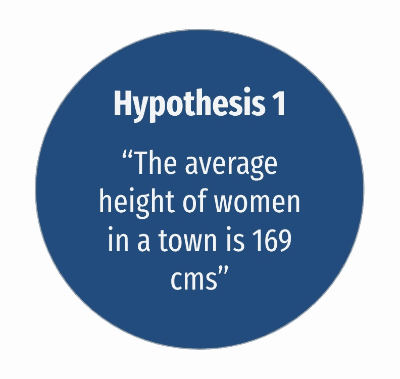

我们将忽略不同年龄组女性之间的潜在差异，保持简单。现在，虽然我们以正常的方式称之为假设，但在统计学中，假设有一个正式的含义，即可以被检验的东西。

所以让我们试着测试一下。假设我们选取 20 名女性作为样本，她们的平均身高为 168.6 厘米。

那么这个观察对于这个假设意味着什么呢？我想让你停下来思考几秒钟- ***这对我们的假设产生了多大的怀疑？***

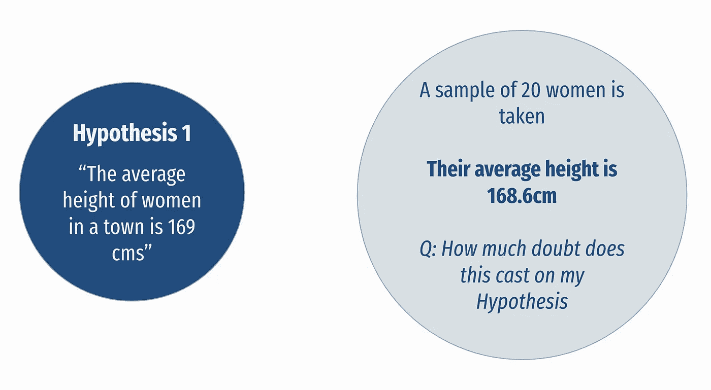

我们一开始说平均值是 169 厘米，但现在我们有了这个样本，它比那个略小，但它真的对假设产生了很多疑问吗？

大概不会吧？我们随机选择了一个小样本，但由于随机变化，选择的女性可能略矮。所以我们的假设仍然是正确的，这并不是完全不可能的。

**取不同的样本** 现在让我们想象另一个场景，我们再次随机抽取 20 名女性 ***，但这次她们的平均身高是 161 厘米*** 。这一次平均值比上一次稍远一些。

所以让我再问你一次，这给我们的假设带来了多大的怀疑。

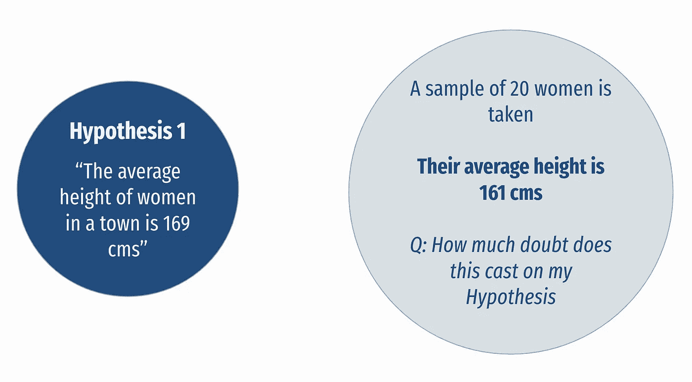

你认为这次观察到的样本 ***的平均身高为 161 厘米会比上一个例子*** 更加令人怀疑吗，即使我们抽样的人数相同？

平均身高比 169 低很多，所以你要开始思考这个样本只是随机低于真实平均值的可能性有多大。

虽然我们还没有处理任何公式或数学，但你已经在这一点上完成了你的第一个假设检验。

现在让我们稍微形式化一下。更具体地说，我们将原始假设称为 ***零假设*** ，并将其表示为***【h₀】、*** ，在这种情况下，零假设 ***是真实平均值为 169 cms*** 。然后我们得到了另一个叫做 ***的东西替代假说*** 通常被表示为 ***H₁.*** 在替代假设下，真实均值不是 169 cms。

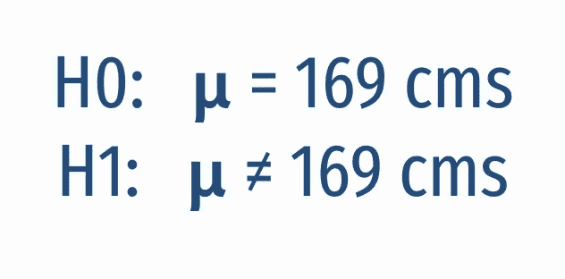

无效假设和替代假设

所以问题是，我们的样本均值是否离 169 厘米足够远，以至于我们能够拒绝最初的假设？在第二个例子中，你认为——嗯，也许它离 169 足够远，也许现在对零假设有相当多的怀疑

# 形式化假设检验

让我们考虑这条代表样本均值可能值的数字线。我们通常用 x̅代表样本平均值，用𝝻.代表总体平均值如果你取一个样本，取它的平均值，你会期望它是 169，但是你也知道由于随机变化 ，它可能是 168 或 170。

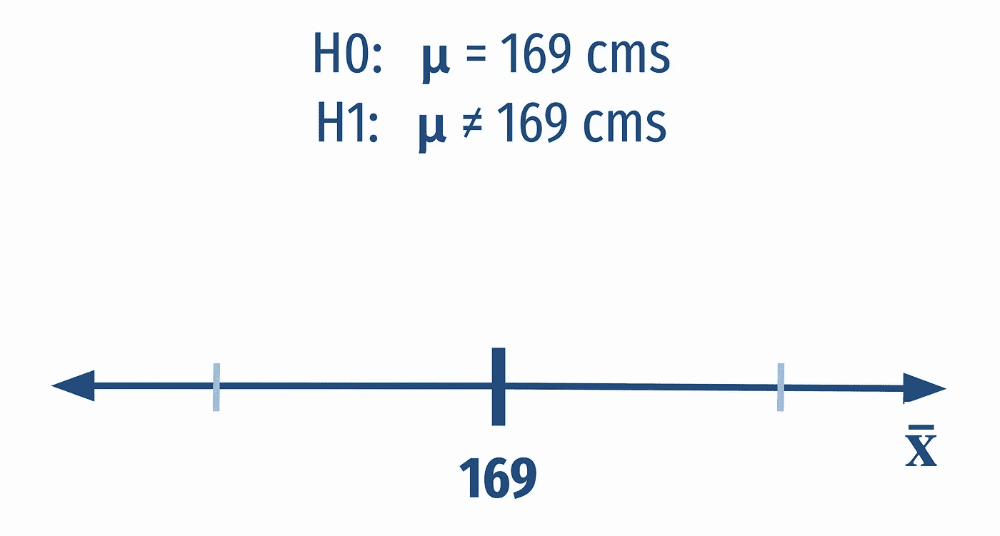

假设检验所要做的就是设定这些关键的界限，超过这些界限，我们将开始拒绝零假设。所以当我们的样本变得太极端时，我们开始更加怀疑我们的零假设。在我们的示例中，样本平均值为 161 厘米，很可能离 169 太远，处于剔除区。

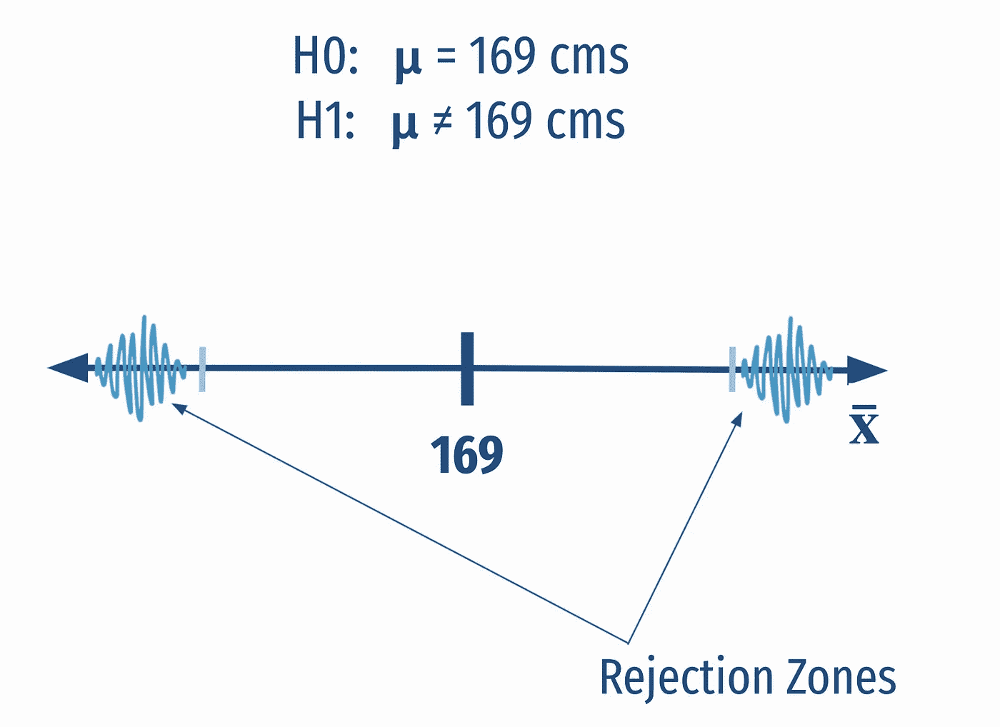

# 第二个例子

现在让我们试试另一个例子，另一个假设。我们的第二个假设是

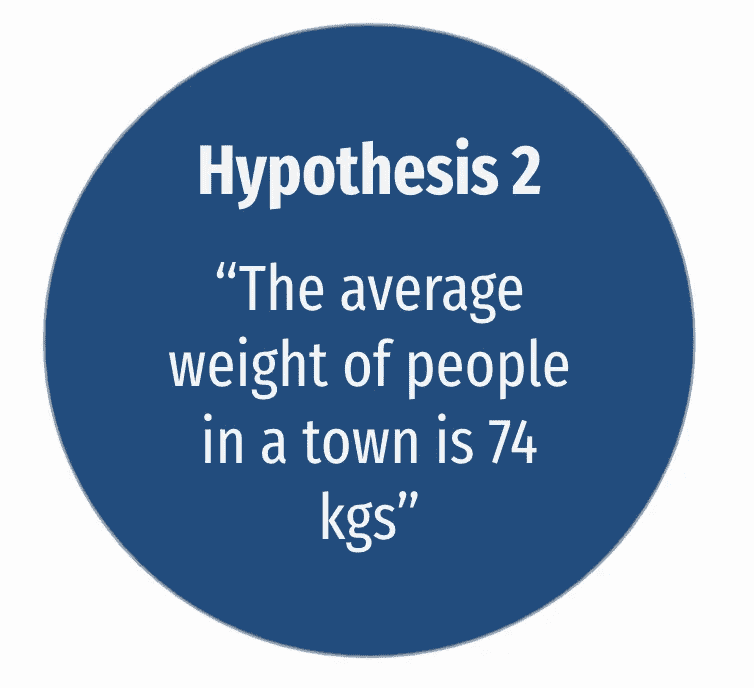

像以前一样，我们要取一个样本来检验这个假设。这一次，虽然我们只取了五个人作为样本，但我们发现这五个人的平均体重只有 68 公斤。

同样，我们也要问自己同样的问题- ***这对我们的假设*** 产生了多大的怀疑。所以停下来几秒钟，想一想

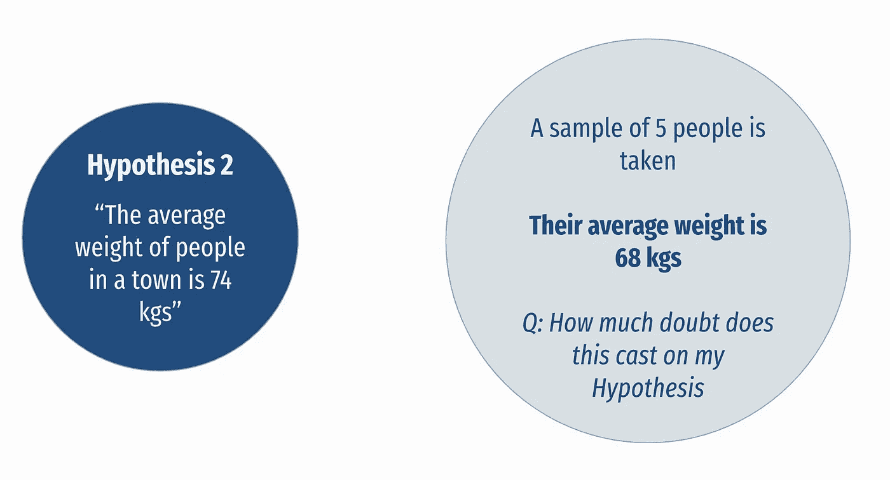

现在，即使权重之间的差异很大，你可能会认为这没关系，因为我们 ***只考虑 5 个样本*** ，也许，只是也许我们选择了稍微轻一点的人，如果我们再选择 5 个样本，总样本的平均权重可能会上升。

现在让我提出一个稍微修改的场景。这一次我们抽样调查了 500 人，而不是 5 人。但是样本平均值仍然是 68 公斤。这给我们的假设带来了多大的质疑？

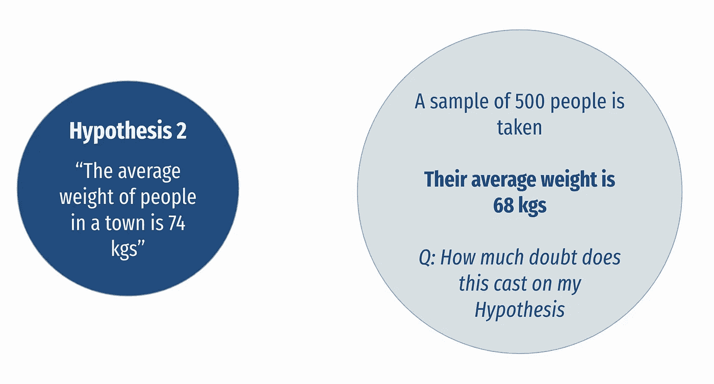

你会开始认为- ***是的，这是铸造了很多疑问现在*** 。平均重量没有一点变化，但变化的是样本中的观察次数。所以我们现在在样本中有 500 个人。这意味着 ***我们对样本均值*** 更有信心，我想直觉上你可以看到这个工作。以亚马逊评论为例——一个产品在 5 个评分中获得 4.8 星，而另一个产品在 1200 个评分中获得 4.8 星。你会对第二种产品更有信心。

如果你有一个更大的样本，发现平均体重仍然是 68，你会开始想，我们现在几乎已经得到了整个城镇——真正的平均体重可能不再是 74 了。

我们这里的零假设是真实的总体均值是 74，我们的
替代假设是它不是 74。

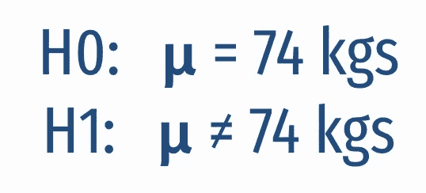

无效假设和替代假设

因此，在我们的五人样本中，我们将在这里得出的决定我们是否拒绝零假设的临界值可能远离 74，但当我们的样本中有 500 人时，我们将拒绝零假设的临界值实际上非常接近 74。所以如果我们得到一个样本均值，比如说 71 或者 77，这就有足够的证据来否定零假设。

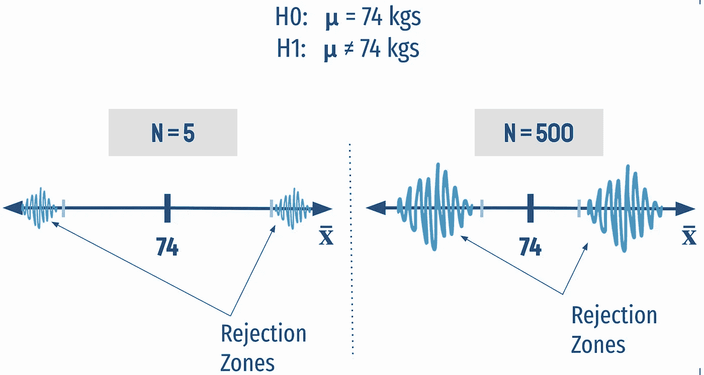

较大的样品扩大了剔除区

到目前为止，我们还没有做任何实际的计算，但是我们有办法计算这些精确的区域，来决定我们是否要拒绝这个无效假设。

通过这些我们很快就会看到的计算，我们真正想要回答的是这个问题— ***如果零假设为真，我们的样本*** 有多极端？这确实是假设检验试图从数字上回答的核心问题。

虽然在文章的开始我提到我们将保持这种数学自由，我只是给你一个公式，并帮助巩固我们在这里发展的直觉。

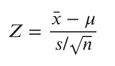

样本的极值

***这个 Z 是极值的度量*** 。因此，当 Z 接近于零时，这意味着我们的样本与零假设为真时我们的预期相符。如果你看看这个函数的分子，你可以看到，如果样本均值等于假设均值μ，那么我们会得到 0。和***x̅和 mu 之间的差距越大，z 值越大*** 意味着我们的样本更极端，这意味着我们更有可能拒绝零假设，我们在第一个例子中看到了这种情况。

另外，你可能会注意到分母上有一个 ***n*** ，它代表样本大小。我们现在也明白了这是如何工作的，因为随着 n 的增加，Z 的值也会增加，这再次意味着我们更有可能拒绝空值。因此，随着样本量的增加，我们更有可能拒绝零，除非总体和样本均值之间的差异很小。

基于以上所见，我们知道当-
***1 时，我们更有可能拒绝***【h₀】***。样本差异较大，如第一个示例和
2。当观察次数更多时，如第二个例子。***

假设检验本质上包括三个步骤

假设检验过程

# 第一类和第二类错误

这就引出了本文的最后一个概念，即第一类和第二类错误。

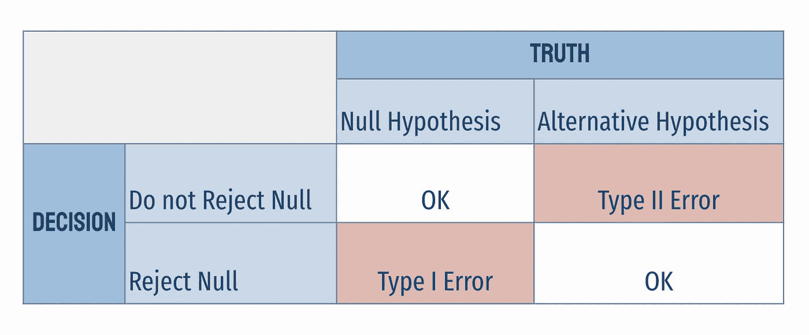

第一类和第二类错误

当我们进行假设检验时，我们会根据手头的证据做出决定，而不是 100%有保证的证据。我们只是说，有足够的证据表明会有这样或那样的行为。统计学上永远如此！正因为如此，无论做出什么决定，我们都有可能犯错误。总有机会得到一个极端的样本，使你拒绝零假设或替代假设。

在前面的例子中，我们有拒绝区域，在那里我们要拒绝零假设。当我们拒绝事实上为真的零假设时，第一类错误就发生了。我们永远无法排除打字错误的可能性。

拒绝区域是任意的，由测试人员选择

类型 1 错误的概率称为**显著性水平**或**α(α)。**事实上，你可以选择你的重要性水平。你可以选择拒绝零假设的决定有多严格。我们通常会使用 5%的级别，但这只是惯例。我们在这里画出的这些区域，我们要拒绝零假设，是完全任意的。我们只是根据我们称之为**显著性水平(α)的严格程度来决定它们。**

当您不拒绝事实上为假的零假设时，就会出现**类型 2** 错误，因此假设样本均值非常接近 169 cms，因此我们选择不拒绝该零假设。当然，真实的人口平均数仍有可能不同于 169。这可能是任何事情，在这种情况下，我们将犯第二类错误，这种犯第二类错误的可能性是我们无法完全减轻的。当我们进行假设检验时，总会有犯第二类错误的概率，在这种情况下，犯第二类错误的**概率被称为β(**β**)**，一个负β被称为假设检验的**功效(1-** β **)。**

假设检验的介绍到此结束。