# 对费希尔信息的直观观察

> 原文：<https://towardsdatascience.com/an-intuitive-look-at-fisher-information-2720c40867d8?source=collection_archive---------1----------------------->

## [思想和理论](https://towardsdatascience.com/tagged/thoughts-and-theory)

## 它的含义，以及为什么它是这样计算的

Fisher information 提供了一种方法来衡量随机变量包含的关于随机变量的假设概率分布的某个参数 *θ* (如真实均值)的信息量。

我们将从费希尔信息的原始定义和公式开始。

# 费希尔信息的定义和公式

给定一个随机变量 ***y*** ，假设它遵循一个概率分布*f(****y****)；****θ****)*，其中 ***θ*** 为分布的参数(或参数向量)，Fisher 信息计算为**偏导数的**方差**w . r . t .*θ***的***ℓ(****θ*****

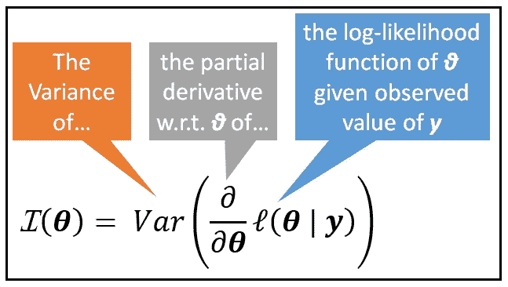

Fisher 信息为**表示为***偏导数的**方差 *θ*** 对数似然函数***ℓ(****θ| y****)(图片由作者提供)******

***上面的公式可能看起来有点吓人。在本文中，我们将首先深入了解费希尔信息的*概念*，然后我们将了解为什么它是以这种方式计算的。***

***先说个例子。***

# ***泊松过程的例子***

***让我们从下面的数据样本开始我们的旅程。这是一个[泊松过程](/the-poisson-process-everything-you-need-to-know-322aa0ab9e9a)的模拟，模拟了医院急诊室每小时到达的病人数量。***

***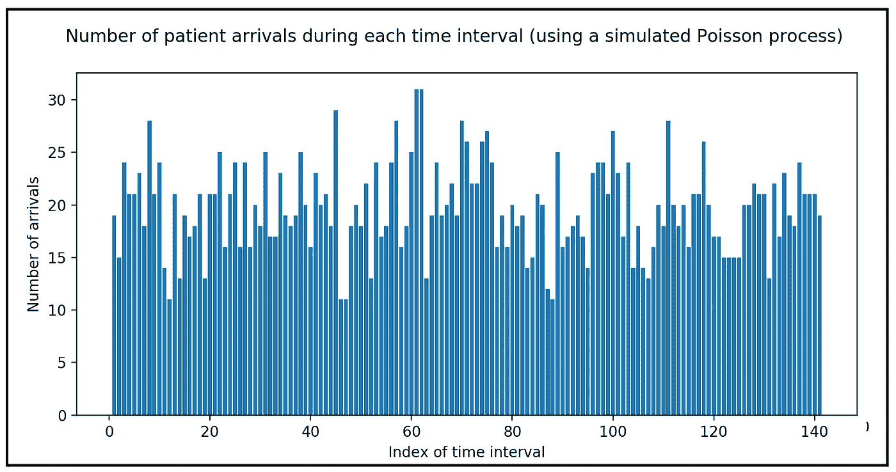***

***模拟病人到达急诊室的泊松过程(图片由作者提供)***

***在这个数据样本中，随机变量(姑且称之为 ***y*** )是每小时到达的病人数。既然 ***y*** 是一个离散的随机变量，它必然服从某种 **P** 概率 **M** ass **F** 函数( **PMF** )。像这样的全编号事件类型数据通常可以通过泊松分布成功建模，如下所示:***

***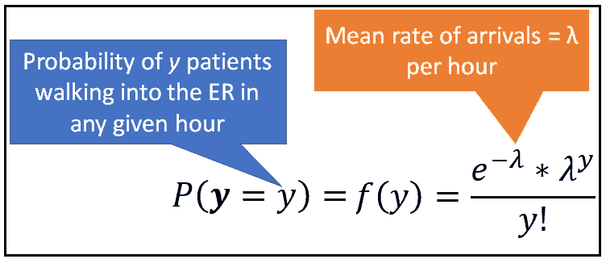***

***泊松分布的离散随机变量 **y** 的 **P** 概率 **M** ass **F** 函数(图片由作者提供)***

***此时，我们需要后退一步，注意以下两点:***

*   ***我们不知道(也永远不会知道)什么是 ***y*** 的真实概率分布。我们所拥有的只是几百个事件的数据样本。基于数据的性质(在我们的示例中，基于非负计数的事件数据)，我们假设 ***y*** 是泊松分布的。***
*   ***其次，即使我们(正确地)假设 ***y*** 是泊松分布，我们也不会知道 ***y*** 值的总体的真实平均事件率 *λ_0* 的值。我们能做的最好的事情是使用样本平均速率 *λ* 来估计 *λ_0* 。***

***现在，假设你观察到一定数量的病人在特定的时间走进急诊室。假设，***y****= 20*。如果能够知道 ***y*** 中包含多少关于 ***y*** 值总体的真实但未知的平均事件率 *λ_0* 的信息，那就太好了。而这正是费希尔信息让我们以数学特别擅长的量化方式来衡量的！***

***在我们理解如何度量随机变量 ***y*** 中包含的费希尔信息之前，让我们再一次看看泊松概率的公式:***

***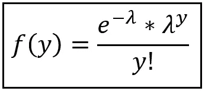***

***泊松分布离散随机变量 **y** 的 **P** 概率**M**as**F**函数(图片由作者提供)***

***注意 *f(y)* 实际上是两个变量的函数:***

*   ***观察到的事件计数 y，***
*   ***平均速率λ。***

***因此，我们将 PMF 的等式写得稍微有些不同，如下所示:***

***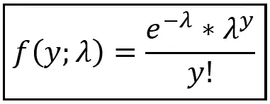***

***PMF 表示为 y 和 *λ(图片由作者提供)*的函数***

***假设我们是某个无所不知的存在，他们知道真实的群体平均事件率 *λ_0* 是每单位时间 *16* 。利用 *λ=λ_0=16，*我们得到下面的图，用于*f(y；λ) w.r.t. y:****

***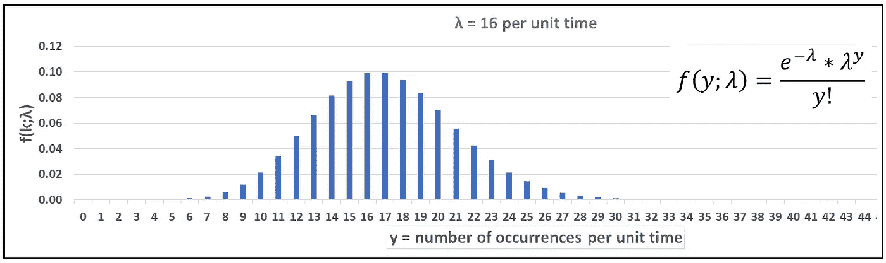***

***平均速率的泊松 PMF*λ= 16(图片由作者提供)****

***这幅***y***PMF 的图给了我们这个问题的答案:假设真实的平均发生率是 16，那么单位时间内观察到 0，1，2，3…事件的概率是多少？***

***毫不奇怪，概率*f(y；λ=16)* 峰值在 *λ=16。****

***泊松变量通常是整数(离散)值，但我们将它显示为一条平滑的曲线。严格来说，简单地将 PMF(离散概率函数)转化为平滑的概率曲线是非常不正确的，但是将其显示为平滑曲线将有助于我们使用单参数分布(如泊松分布)来说明 Fisher 信息背后的一些概念。这是上述分布的连续版本:***

***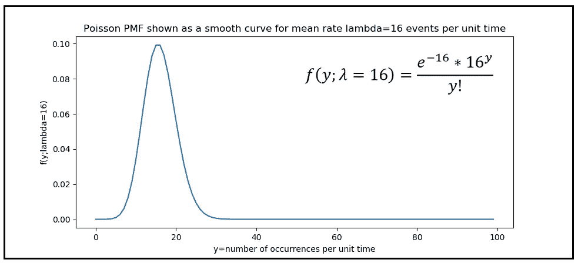***

***f(y；*λ)*w . r . t . y .*λ= 16*事件/单位时间(图片由作者提供)***

# ***可能性的概念***

***现在，假设我们对 *y=10* 进行单次观察。我们将 y 固定为 10，并允许平均速率 *λ* 从 0 变化到∞。***

***这里我们提出的问题是:**给定不同的平均速率 *s λ值，在某个单位时间间隔内观察到 *10* 事件的概率是多少？******

***这类问题是可能性函数概念的基础。***

****f(y；λ)* w.r.t. *λ* 如下图，外形与上图相似。不同之处在于这两幅图的坐标轴所显示的内容。***

***在上图中，X 轴显示随机变量 **y** 的观察值，Y 轴显示概率(或连续**YY**情况下的概率密度)。***

***在下图所示的第二个图中，图的 X 轴显示了参数 *λ。*y 轴描绘了所谓的 *λ* 的似然函数，用程式化的 *L、*表示，即: *ℒ(λ|y)* ，或者一般来说*ℒ(****θ****|****y****)*对于某些参数 ***θ* 对于给定的随机变量 ***y*** *的观测值，它被读出为 ***θ*** 的可能性。******

***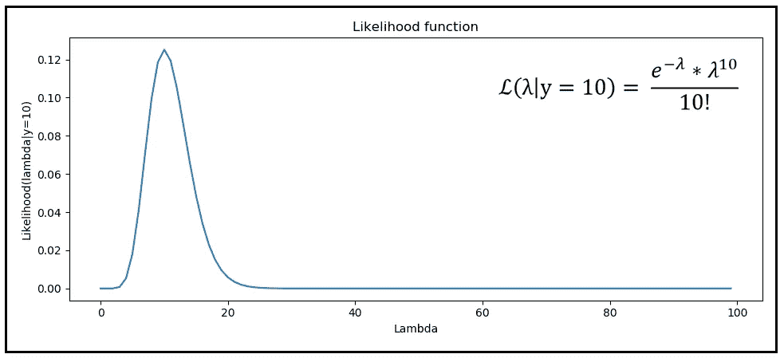***

***y=10 的观测计数的 *λ的似然函数(图片由作者提供)****

***我们观察到关于此图的以下三件事(用蓝色矩形突出显示):***

***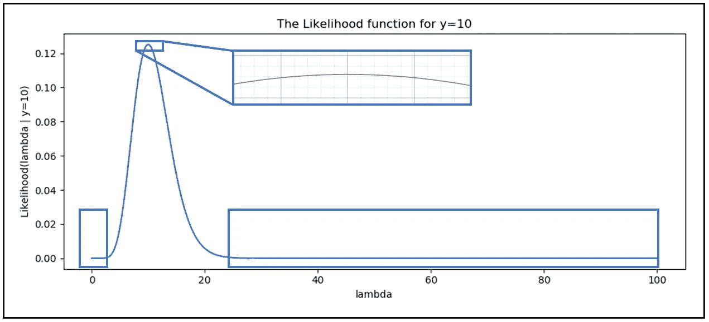***

***似然函数上缓慢变化的似然区域(图片由作者提供)***

1.  ***对于(未知的)真实平均速率 *λ* 的值远离**yT5【的观测值(本例中为 10)，似然函数变化不大。这由曲线底部左侧和右侧(尤其是右侧)的蓝色矩形标记。*****
2.  ***类似地，当值 *λ* 非常接近观察值 y=10 时，可能性不会改变太多。这由可能性曲线顶部的平顶区域指示。***
3.  ***对于 *λ* 的其余值， *λ* 的每一个单位变化都会导致在任何给定的小时内观察到 *10* 事件的概率发生很大的变化。***

***通过检查似然变化率的绝对值的曲线图*ℒ(λ|y*w . r . t .*λ，证实了上述三个直觉。****

# ***似然变化率 w.r.t. *θ****

***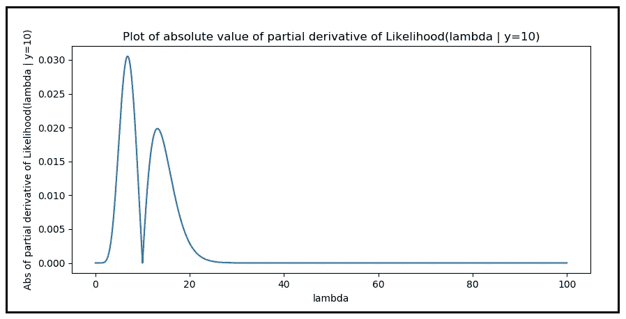***

***可能性*ℒ(λ|y*偏导数 *w.r.t. λ的绝对值(图片作者提供)****

***我们通过将 ***y*** 固定在特定小时内 10 个事件的观测值上来构建上述图表，我们绘制了以下值与平均速率的关系:***

***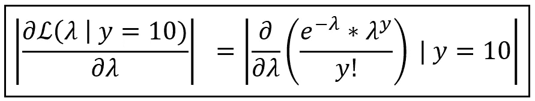***

***似然 *ℒ(λ|y 的偏导数 *w.r.t. λ的绝对值)(图片由作者提供)。*****

# ***对数似然的概念***

***不是微分原始似然函数 *ℒ(λ | y_i)* ，而是微分似然函数的自然对数通常是方便的，原因如下:***

*   *****对目标函数凹性的需求:**很多时候，我们希望找到能最大化观测整个训练数据集的联合概率的参数向量 ***θ*** 。换句话说，我们希望最大化训练数据集中所有观察到的 *y_i* 的可能性 *ℒ(λ | y_i)* 的乘积。这种优化技术被称为**最大似然估计**。如果被最大化的函数是一个[向下凹的函数](https://en.wikipedia.org/wiki/Concave_function)，则最大化起作用。许多概率分布函数只有在取对数时才是下凹的。***
*   *****保存优化目标:***x*的对数函数是 *x* 的严格增函数。通俗地说， *log(x)* 随 *x* 起伏。因此，无论我们对 *x* 有什么优化目标，采用 *log(x)* 将保持这些目标不变。***
*   *****易微分:**几种概率分布*f(****y；θ)*** 包含指数运算和乘法项。泊松和正态概率分布函数是经典的例子。区分这样的功能会变得很乏味，有时甚至完全不可能。取自然对数具有“消除”指数运算的效果(即“ *e* 项)。对数运算符还将所有乘法转换成加法，使得求导工作变得容易得多。***

*****对数似然函数**用小格程式化的 *l* 表示，即ℓ( ***θ | y*** *，*，对于给定的随机变量*y*的观测值 y **，读作**θ的对数似然*******

***采用泊松分布函数的自然对数可将其简化为以下函数:***

***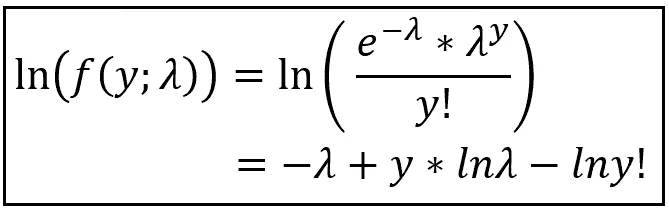***

***泊松分布函数的自然对数(图片来自作者)***

# ***对数似然函数的偏导数***

***让我们保持 ***y*** 固定在某个观测值 *y* 并重写*ln(f(λ；y))* 为对数似然函数ℓ(*λ****| y =****y)。*接下来，我们对ℓ(*λ****| y =****y)*求偏导数，得到如下函数:***

***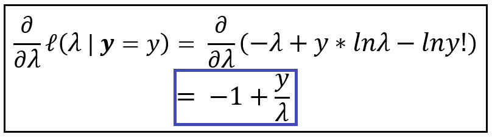***

***泊松分布对数似然函数的偏导数 w.r.t. *λ(图片由作者提供)****

***让我们画出 *λ* 的非负值的偏导数:***

***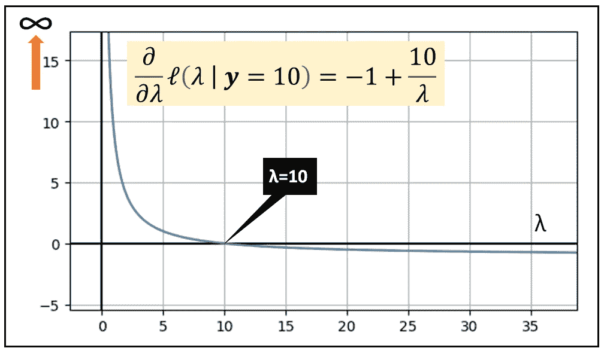***

***ℓ(的偏导数 w . r . t .*λ**λ****| y****= 10)*对于 *λ的非负值(图片由作者提供)****

***上面的图揭示了以下特征:***

*   ***当真实平均速率 *λ* 等于每小时观察到的计数 y=10 时，对数似然函数的变化率下降到零。***
*   ***当真实平均速率 *λ* 与 y=10 的观测值相差很大时，对数似然的变化相对于真实平均速率 *λ* 迅速且渐进地稳定到恒定值-1。***
*   ***对于真实平均率 *λ* 的所有其他值，对数似然函数对于 *λ中的每个单位变化变化非常迅速。****

***这里有一些有趣的事情:***

# ***对数似然的偏导数的方差***

***对数似然的偏导数就像 ***y*** 一样是一个随机变量。对数似然的偏导数也有均值和方差。***

***该函数的方差越小，观察值 *y* 与 **y** 的概率分布的真实平均值匹配的可能性就越大。换句话说，随机变量 ***y*** 中包含的关于 ***y*** 的真实含义的信息越多。另一方面，ℓ(*λ****| y****= y*的偏导数的方差越大，包含在 ***y*** 中关于其真实均值的信息就越少。***

***因此， ***y*** 所包含的关于***【y***的假定分布的某个参数 *θ* 的真值的信息，与对数似然函数的偏导数 w.r.t. *θ* 的方差成反比关系。这种相反的关系由 ***y*** 的分布的费希尔信息捕获如下:***

***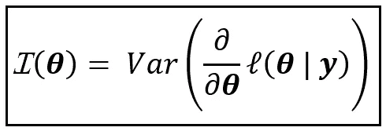***

***费希尔信息(图片由作者提供)***

***上述等式的 R.H.S .可以通过使用下面的计算随机变量 ***X*** 的方差的公式来简化:***

***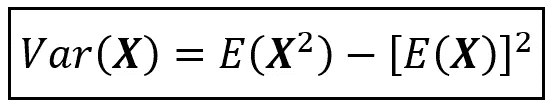***

***随机变量 **X** 的方差公式(图片由作者提供)***

***记住对数似然的偏导数本身是一个随机变量，具有平均值，即期望值(w.r.t. ***y*** )。因此，我们可以利用上述方差公式，如下所示:***

***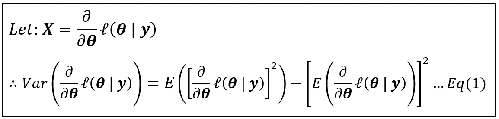***

***费希尔信息(图片由作者提供)***

# ***期望值在费雪信息计算中的作用***

***上式中需要注意的一点是期望值，R.H.S 上的 *E()* 算子是 w.r.t .随机变量 **y.** 它们是*不是*w . R . t .***y****概率分布的参数 *θ* 。*这是有意义的，因为对数似然函数的偏导数总是针对随机变量***y****= y*的特定观测值来计算的。例如，在泊松的例子中，我们计算的是在某个小时的观察中的***y****= 10*观察到的事件。因此，对于随机变量 ***y*** 的每个观察值，对数似然函数的偏导数可能呈现不同的值。因此，偏导数的期望值具有(粗略地说)“平滑”整个观察值范围内的方差的效果。***

# ***简化费希尔信息方程的程序***

***对等式(1)的 R.H.S .的第一个期望可以用无意识统计学家(简称 LOTUS)的[定律来简化，它是这样的:](https://en.wikipedia.org/wiki/Law_of_the_unconscious_statistician)***

*   ***如果 ***X*** 是一个概率密度函数为*f(****X****= X)*的连续随机变量，并且***
*   ****g(****X****)*是 ***X*** 的函数，那么，***
*   ****g(****X****)*的期望值，即*E(g(****X****)*可以用下面的公式计算:***

***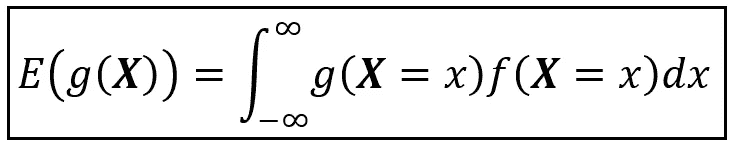***

***无意识统计学家的法则(LOTUS)(图片由作者提供)***

***我们可以如下使用 LOTUS 来求解等式(1)的 R.H.S .的两个期望中的第一个:***

***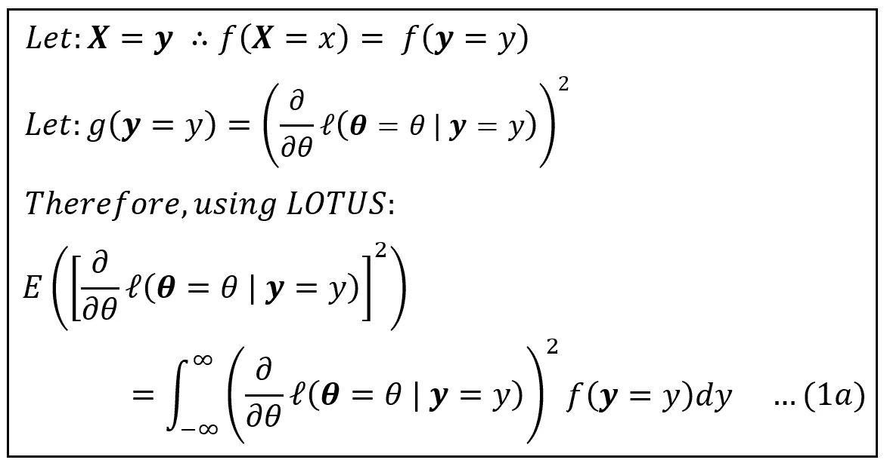***

***简化费希尔信息方程(图片由作者提供)***

***同样，我们可以使用 LOTUS 来求解等式(1)的第二个期望:***

***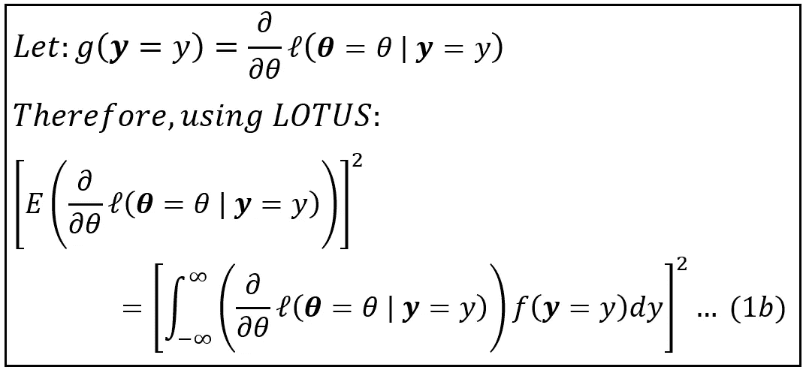***

***简化费希尔信息方程(图片由作者提供)***

***在上面的等式中，通过注意对数似然函数ℓ(*θ****| y****= y)*实际上是概率分布函数 ***y、****f(θ；y)* 它是两个变量的函数， *y* 和 *θ。*所以它的偏导数 w.r.t. *θ* 可以表示为:***

***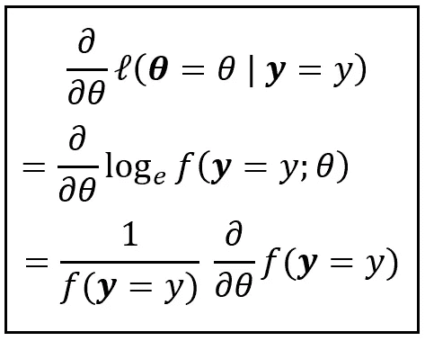***

***(图片由作者提供)***

***我们将把这个结果代入方程(1b)的 R.H.S .积分中。此外，由于在 R.H.S .上的积分是 w.r.t. *y* ，我们可以在这个积分之外求 w.r.t. *θ* 的偏导数，如下所示:***

***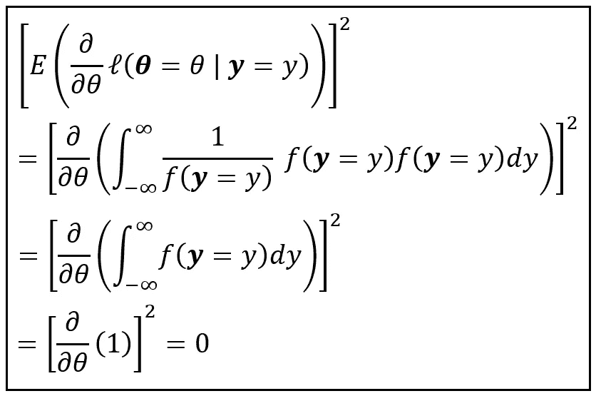***

***简化费雪信息方程中的方程(1b)***

***在上面的简化中，我们利用了这样的事实，因为 f(。)是 y 的假定概率分布，f(y=y)从-∞到+∞的积分将为 1，对常数值 1 的微分为零。因此，等式(1b)简化为零。***

***现在，让我们回忆一下等式(1)表示的费希尔信息的等式如下:***

***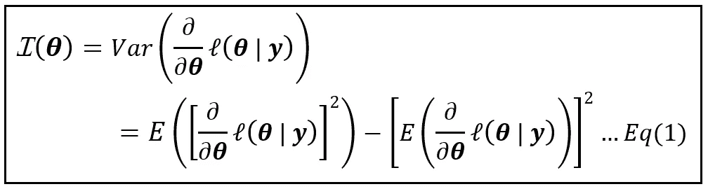***

***费希尔信息方程(图片由作者提供)***

***等式(1)由等式(1a)组成:***

***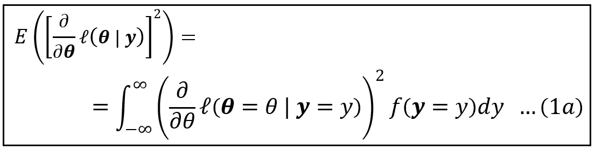***

***(图片由作者提供)***

***和方程 1b，我们评估为 0。***

***因此，我们有以下结果:***

***给定一个随机变量 ***y*** 假定服从一个概率分布*f(****y****；* ***θ*** *)，*该分布的费希尔信息可以使用以下公式计算:***

***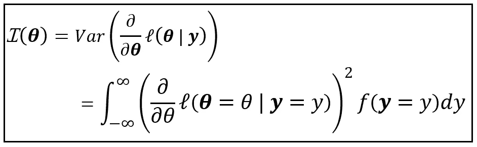***

***费希尔信息的公式(图片由作者提供)***

# ***引用和版权***

***，【费希尔 R. A .】，(1922)论理论统计学的数学基础，*伦敦皇家学会哲学汇刊。A 辑，包含数学或物理性质的论文。222309–368。[http://doi.org/10.1098/rsta.1922.0009](https://doi.org/10.1098/rsta.1922.0009)****

## ***形象***

***本文中的所有图片版权所有 [Sachin Date](https://www.linkedin.com/in/sachindate/) 在 [CC-BY-NC-SA](https://creativecommons.org/licenses/by-nc-sa/4.0/) 下，除非图片下面提到了不同的来源和版权。***

****如果您喜欢这篇文章，请关注我的*[***Sachin Date***](https://timeseriesreasoning.medium.com/)*以获得关于回归、时间序列分析和预测主题的提示、操作方法和编程建议。****