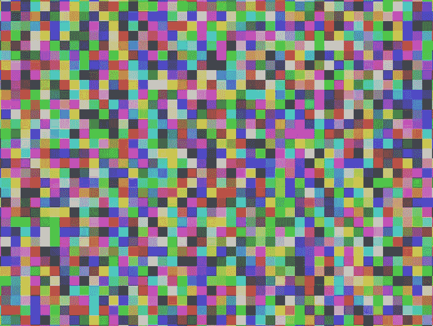
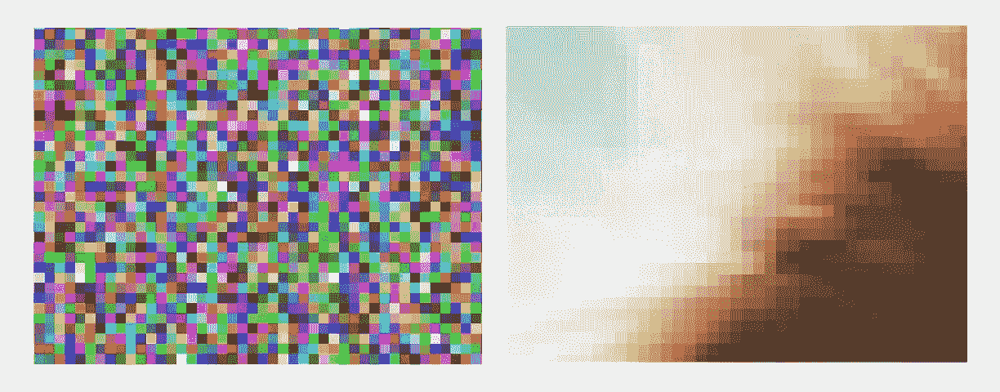
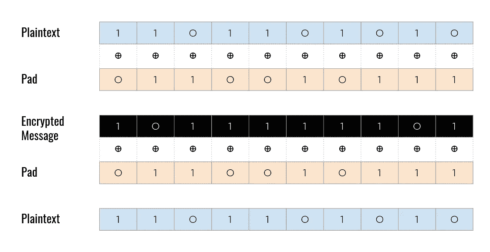
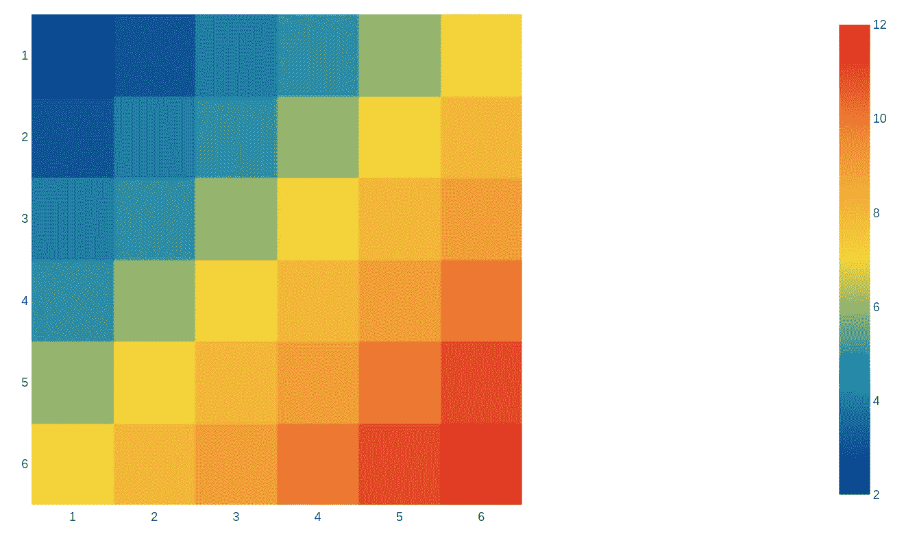

# 对信息论基础的直观观察

> 原文：<https://towardsdatascience.com/an-intuitive-look-at-the-basics-of-information-theory-2bf0d2fff85e?source=collection_archive---------22----------------------->

## [入门](https://towardsdatascience.com/tagged/getting-started)

## 数据压缩、熵、加密、Kolmogorov 复杂性以及它们为何重要的非技术之旅



随机像素的放大视图。图片由作者提供。

# 介绍

本文将着眼于信息理论，目标是为一些概念及其应用开发有用的直觉。它将远离技术细节，但底部有链接的参考资料供进一步阅读。首先，我想从一个简单的问题开始:

# 任何文件都可以压缩吗？

这个问题的答案是深刻的。不要只是陈述答案，让我们看看我们是否能推理出解决的方法。

1.  假设*任何*文件都可以被压缩，导致文件变小。
2.  因此，压缩文件的输出也可以总是被压缩。
3.  如果这是真的，那么任何文件都可以被无限多次压缩。
4.  因此，任何数量的信息都可以压缩成一位。
5.  这显然是荒谬的，所以我们必须拒绝前提。

关键的一点是，冗余度较大(因此信息较少)的**文件可以比冗余度较小(因此信息较多)的文件压缩得更多**。一旦你压缩了一个文件，你就消除了冗余，使其信息更加密集。试图再次压缩它将产生收益递减。

通过创建一个包含随机生成的文本(没有模式或冗余)的文件，并尝试将其压缩成 ZIP 文件，您可以很容易地看到这一点。检查前后的文件大小，你会发现它们没有什么不同。同时，从维基百科上取一段，复制粘贴几十次到一个文件里，然后压缩。你会看到它缩小了很多。您还可以尝试使用`zlib` Python 库的`compress`和`decompress`函数，以编程方式进行压缩。

探索数据压缩涉及到信息论中一些最重要的观点:

*   有一个基本的信息单位(比特)。
*   并非所有的比特串都包含相同数量的信息——有些比特串可以比其他比特串压缩得更多。
*   文件中的信息量与其随机性相关，与其可预测性负相关。


作者随机像素。由 [Pauline Loroy](https://unsplash.com/@paulinel?utm_source=medium&utm_medium=referral) 在 [Unsplash](https://unsplash.com?utm_source=medium&utm_medium=referral) 上拍摄的狗狗照片

关于随机性和信息的想法通常是违反直觉的。哪一个包含更多的信息，一个看起来有噪声的随机像素的图像，就像左边的图像，还是一张狗的照片(假设像素数量相同)？**很多人可能会说，随机像素的图像包含的信息比狗狗照片少。对于我们的人眼来说，随机像素看起来是重复和多余的。但这是不正确的。**当我们放大到像素级别时，我们看到随机像素表现出多样性、不可预测性和缺乏模式，而狗的照片则有模式和冗余。狗的照片可以压缩到原来大小的一小部分，而随机像素则不能。不信你自己试试！**可解释性和对人类的意义并不等同于信息内容。**



放大了上面两张图片(随机像素对狗)。作者图片。

# 加密和信息

加密意味着获取一条消息，让没有密钥的人无法阅读。早期的替换密码(如凯撒密码)只是简单地用字母互相替换，保留了语言的统计模式。如果消息在加密前是可压缩的，那么在加密后仍然是可压缩的。我用`zlib`进行了测试，在美国权利法案上得到了 70%的压缩率，不管是否应用了凯撒密码。看到我用的代码[这里](https://gist.github.com/thomashikaru/dfcc11b34a1d1dc6df94c30623460862)。通过使用字符频率的统计知识，这些替代密码很容易被破解。

现代安全加密使加密的消息看起来与随机位无法区分，消除了原始消息统计属性的任何泄漏。加密是基于位的，因此任何类型的信息都可以加密—文本、照片、音频、视频、可执行文件等。为了直观地了解加密是如何工作的，让我们考虑一下一次性密码本(OTP)，它是加密的一个基本构造块。

要使用 OTP，双方需要共享一串秘密随机位(“pad”)。为了发送秘密消息，一方将消息转换成二进制，用填充符将其排列起来，并执行按位异或(XOR)运算。XOR 由带加号的圆圈表示，如果两位相同，则返回 0，如果两位不同，则返回 1。**结果是一串看起来随机的比特，没有密码板是完全无法破译的。**因为看起来是随机的，加密的信息几乎是不可压缩的。没有关于潜在消息的统计信息被泄露，它甚至不受暴力攻击的影响，因为当你尝试每一个可能的长度为 N 的 pad 时，你将简单地揭示长度为 N 的每一个可能的消息，没有办法区分正确的和不正确的。



使用一次性密码本的加密示意图。图片作者。

为了解密消息，接收方用他/她的 pad 排列接收到的消息，并再次执行逐位 XOR。这将反转加密并揭示原始消息。这是因为 XOR 函数的一些特性:`(a XOR b) XOR b = a XOR (b XOR b) = a XOR 0 = a`。实际上，交换真正随机的一次性密码本是不可行的。但是上面解释的思想也可以用于伪随机密码本，这意味着双方只需要交换用于生成伪随机密码本的相对较短的秘密密钥。

让我们试着把加密和信息密度的概念放在一起。考虑下面的思维实验:你是一名间谍，任务是寻找和解码敌人的信息。有一天，你截获了一个图像文件。你打开它，发现每个像素的 RGB 值都是(0，0，0)。图像完全是黑色的。你对这个截获的文件有什么看法？

你可以确信，无论你的对手使用什么样的加密方法，在黑色像素阵列中没有隐藏的秘密图像或秘密信息。为什么？因为它是非随机的，非常冗余，而且它不包含太多的信息。当然，信息内容不是零(可能已经有了预先的协议，如果场景 A 发生，对手将向他们的伙伴发送黑色图像，如果场景 B 发生，发送白色图像，等等。).**但是加密不能删除消息中的信息，解密也不能恢复丢失的信息，所以如果加密后的消息是低信息量的，那么之前的消息一定也是。**


两幅图像的像素数量相同。全黑图像的压缩率是随机图像的 1000 倍。注意:PNG 是一种无损压缩格式。图片作者。

另一方面，如果你收到的是一个随机像素的数组，就像上面的图像一样，它与加密后的有意义的图像没有什么区别。通过应用某种变换，图像中看似随机的 0 和 1 可以变得有意义。也许像素*和*只是代表随机的比特，这对我们人类来说没有多大意义。如果没有额外的知识，我们无法区分，但无论哪种方式都有信息存在。**意义和信息不是一回事。**意义与我们对信息的主观理解有关，而信息则是一种客观指标。

事实上，**低于预期的信息量可以暗示意义**的存在。如果你是一名天体物理学家，正在接收来自深空的信号，在混乱的背景噪声之间，你突然探测到一串信息异常低的比特(即异常可压缩的序列)，你可能会开始怀疑你正在接收一个外星人的传输。对于我们人类来说，信息中的非随机性和冗余性是一个强烈的意义信号——无论是语言的统计模式、玫瑰图像中的红色像素海洋，还是一段音乐的和声。无论假想的外星人与我们有多么不同，他们产生的信息无疑也包含冗余。

# 宏观状态和微观状态

我们刚刚讨论了将随机性与缺乏信息混为一谈，将有序性与信息混为一谈是错误的。我们可以用**宏状态**和**微状态**来理解**命令**和**信息**的关系。宏观状态是对系统的宏观描述，例如“画面全黑”或“画面有随机值的像素”。微观状态是系统在较小细节层次上的精确排列，例如图像中每个像素的实际 RGB 值。

**熵**的概念，通常翻译为“无序”，在热力学和信息论中都有出现。**当一个给定的宏观状态有很多微观状态时，就会出现高熵。低熵是指给定的宏观状态只有很少的微观状态。更少的熵意味着更多的有序和更多的可预测性。更多的熵意味着更少的有序性、更多的随机性和更多的不确定性。**

让我们考虑另一个日常例子:滚动一对骰子。任何垄断玩家都知道，并非所有的结果都是平等的。平均而言，每 36 卷中只有 1 卷会产生 12 个总数。但是 36 中的 6 将产生 7 的和。因此，宏状态“我掷了一个 12”只有一个对应的微状态，而“我掷了一个 7”有 6 个微状态。



掷出 7 有六种方法，但掷出 2 或 12 只有一种方法。图片作者。

在前面的全黑图像中，只有一个微观状态与宏观状态“图像全黑”匹配:每个像素必须具有 RGB = (0，0，0)。这意味着熵非常低，因此信息量低，因此可压缩性高。每个像素都符合前一个像素的模式，因此它不会提供任何令人惊讶或有价值的信息。

在随机像素图像中，有难以想象的大量微观状态对应于宏观状态“图像具有随机值的像素”。大约有 2 个⁰⁰⁰⁰⁰⁰可能的独特的 1200x800 RGB 图像，其中许多会导致一个看起来随机的图像。**这意味着有非常高的熵，因此高信息量，因此低压缩性。**每个像素的颜色完全独立于之前的颜色，因此每个像素都具有最大的惊喜和信息量。

熵也适用于许多物理系统。想象一下在房间的角落里爆开一个充满难闻气体的气球。有许多微观状态对应着“气体均匀地散布在整个房间里”，而远远更少的状态对应着“气体全部集中在房间的一个角落里”。或者想象一个放在室温下的冰块。水分子以液体形式四处弹跳的宏观状态比水分子被锁在高度有序的冰块中的宏观状态要多得多。根据热力学第二定律，一个系统的总熵不可避免地随时间增加，可能性较大的事件支配可能性较小的事件。结果，气体总是扩散，发生化学反应，冰块融化。完全不同的领域——信息论、化学和物理——都利用了熵的概念。

# Kolmogorov 复杂性

一位名叫[安德雷·柯尔莫哥洛夫](https://en.wikipedia.org/wiki/Andrey_Kolmogorov)的俄罗斯数学家在他的《复杂性理论》中正式提出了关于信息压缩的想法。**根据 Kolmogorov 的说法，一个文件的复杂度是能够重现该文件的最短计算机程序的长度。因此，尽管圆周率的前十亿个二进制数字看起来是随机的，并且需要十亿位来存储它们的原始形式(并且可能不能被 ZIP 算法压缩太多)，但是它们可以由相对较短的计算机程序生成(远少于十亿位)，只要你有足够的时间和内存。你可以直接存储产生它们的程序，而不是直接存储十亿位。**

在我大学时最喜欢的一个作业中，我们被给了一堆数据文件，并且必须编写脚本在运行时重新创建这些数据文件。分数是根据你的剧本有多小来分配的。全班都在看谁能写出最少的位来表示文件；我们试图尽可能接近真实的 Kolmogorov 复杂性。

假设您有一个如下所示的文件，存储一年中每天的天气数据:

```
01/01/2021: sunny, high of 8 C, low of 4 C
01/02/2021: partly cloudy, high of 3 C, low of -1 C
01/03/2021: rainy, high of 6 C, low of 2 C
...
12/31/2021: snow, high of -1 C, low of -5 C
```

文件中有很多冗余:日期遵循可预测的顺序，相同的天气词汇重复使用，每次都给出温度的单位，等等。通过为特定文件定制脚本，您通常可以胜过一般的压缩算法，有时甚至是显著的。

Kolmogorov 复杂性也被扩展到物理定律是宇宙状态的一种压缩算法。知道了力、质量和加速度之间的关系，就意味着可以用更少的变量来描述同一个系统。一个在弹道运动下遵循抛物线轨迹的物体可以用两个点来描述，而不是它实际通过的无限个点。科学作为压缩宇宙的一种方式的想法是深刻的，马库斯·赫特在莱克斯·弗里德曼的播客[5]中对此进行了探索。

# **语言学、音乐等等**

作为一名语言学家，我对这些概念如何应用于人类语言很感兴趣。**语言中存在统计模式和内置冗余，这使得所有人类语言都是可压缩的。几乎开创了信息论领域的克劳德·香农估计，书面英语有大约 50%的冗余率。**

> 这是你第一次写英语作文。

语言必须平衡效率和冗余。语言不应该无谓地浪费宝贵的比特和音节。然而，信息密度太大，信息变得对噪音和讹误更加敏感。如果消息中的每一位都在做更多的工作，那么偶然翻转一位将会产生更灾难性的结果。语言中的冗余允许听者甚至从被破坏的信息中恢复意义(例如在嘈杂的房间中，使用糟糕的 FaceTime 连接，或者在阅读凌乱的手写内容时)，就像在数字信息中添加纠错位允许从被破坏的信号中恢复一样。有趣的是，上面的“密集英语”的例子在像希伯来语这样的语言中不起作用，因为希伯来语已经是拼写密集的了(元音不是书面的)。语言的某些特征，比如同意标记(我吃 vs .她吃 **s** )，起初看起来是多余的，因为它们没有告诉你任何你无法从句子中的其他单词中找出的东西。但是考虑到通信容易受到噪音和干扰，内置冗余实际上很有意义。

研究甚至表明，压缩率可以代表一首音乐听起来有多好听。压缩性太大，而且太无聊(就像全黑的图像或者一段音乐一遍又一遍的演奏着同样简单的旋律)。密度太大，听起来不和谐，缺乏令人愉悦的模式。有一个可压缩性的黄金地带——音乐包含了模式和惊喜的恰当平衡。

关于信息论还有很多可以说的，所以看看下面的资料，感谢阅读！

# 参考

[1] *詹姆斯·格雷克*的信息。

[2][https://en.wikipedia.org/wiki/Entropy](https://en.wikipedia.org/wiki/Entropy)

[3]尼古拉斯·哈德森。2008.音乐美与信息压缩。[https://www . researchgate . net/publication/49770962 _ Musical _ beauty _ and _ information _ compression _ Complex _ to _ the _ ear _ but _ simple _ to _ the _ mind](https://www.researchgate.net/publication/49770962_Musical_beauty_and_information_compression_Complex_to_the_ear_but_simple_to_the_mind)

[https://en.wikipedia.org/wiki/Kolmogorov_complexity](https://en.wikipedia.org/wiki/Kolmogorov_complexity)

[5]马库斯·哈特在莱克斯·弗里德曼的播客上。[https://www.youtube.com/watch?v=E1AxVXt2Gv4](https://www.youtube.com/watch?v=E1AxVXt2Gv4)

6 罗杰·利维。2008.不确定输入下理性人句子理解的噪声通道模型。[http://www.mit.edu/~rplevy/papers/levy-2008-emnlp.pdf](http://www.mit.edu/~rplevy/papers/levy-2008-emnlp.pdf)