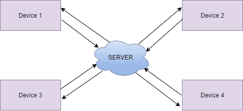

# 联邦学习的研究

> 原文：<https://towardsdatascience.com/an-investigation-into-federated-learning-4e466346e515?source=collection_archive---------61----------------------->

# 一种不共享原始数据的分散分布式机器学习技术

# 什么是联合学习？

联合学习也称为协作学习或分散学习，是一种机器学习技术，通过保持训练数据分散来训练模型。

多酷啊。

那么我们为什么需要联邦学习呢？

在我们开始之前，让我们快速浏览一下如何在传统的机器学习(ML)设置中训练一个模型。在传统的 ML 设置中，训练模型之前的第一步包括下载或存储您希望在本地存储库中使用的数据，并对数据应用一些机器学习算法来预测结果。这里要注意的关键点是，您将数据集中收集或存储到一个地方，从而集中训练模型。但是由于数据隐私相关的考虑，这一过程在未来可能不会继续进行。数据，无论来自哪个领域，通常都是私有或敏感的。由于隐私相关的问题，任何组织都不可能共享这些数据。由于行业竞争、隐私安全和复杂的行政程序，即使是同一家公司不同部门之间的数据整合也面临重重阻力。

现在让我们考虑卫生保健领域的一个例子。医疗数据是高度敏感的。出于监管方面的考虑，如美国的健康保险便携性和会计法案(HIPAA)或通用数据保护和法规(GDPR ),这些数据不能共享或提供给公众。

也就是说，改革传统的机器学习技术对于解决这些日益增长的监管问题是必要的。

那么，当您无法访问任何数据时，您将如何开始培训过程呢？如果您不能收集数据并存储到您的本地存储库中，您如何训练模型呢？

> 每个问题都有三种解决方法:接受它，改变它，或者离开它。如果你不能接受，那就改变它。如果你不能改变它，那就离开它

谷歌在 2016 年首次推出了联邦学习。你可以在这篇[文章中读到更多关于联合学习的内容。](https://arxiv.org/pdf/1602.05629.pdf)他们使用边缘设备(移动设备)中的联合学习来预测谷歌 Gboard 中的下一个关键词预测。

让我们简单地理解一下联合学习。

联合学习的主要概念是将模型发送到训练设备，而不是将数据收集或存储到一个地方来训练模型。

[刘宇英](https://unsplash.com/@yuyeunglau?utm_source=medium&utm_medium=referral)在 [Unsplash](https://unsplash.com?utm_source=medium&utm_medium=referral) 上的照片

已经使用集中式机器学习设置训练的模型被发送到联合学习过程中的所有参与设备。每个设备都有自己的本地私有数据。每台设备都使用自己的设备数据进行训练，产生特定的本地更新。这些更新被发送到受信任的中央服务器，在那里服务器对所有设备更新进行加权平均。这个加权平均值成为下一轮训练的基础模型。这被重复 k 次，直到模型收敛。这样，通过分散训练数据来训练模型。

图片作者。该图显示了联合学习中的四个参与设备，每个工人都通过自己的数据接受培训，并将更新发送到服务器。服务器从这 4 台设备中获取加权平均值，并分配给所有工人，这将成为下一轮培训的基础模型。

但是，在联邦学习中有许多实际的挑战或限制。以下是其中的一些:

1.每个设备的系统要求(如内存)都不同

2.由于每个设备都必须向服务器发送模型更新，因此存在大量通信开销

3.每个设备的更新都可以逆转，以恢复原始数据

4.本地设备数据可以是异构的和非 IID 的。也就是说，设备数据可能不平衡，并且每个设备的样本数量可能不同

在我的下一篇文章中，我们将更多地讨论联合学习的类型、使用 Pytorch 的实现以及联合学习中可以采用的各种模型拓扑。这只是对联合学习的介绍。

敬请期待伙计们。在我的下一篇文章中再见。

关于我

我是 Manjari Ganapathy，拉斯维加斯内华达大学计算机科学专业的理学硕士。目前我正在 Mingon Kang 教授的指导下完成我的联邦学习硕士论文。

参考

[1].Brendan McMahan 等人，[从分散数据进行深度网络的通信高效学习](https://arxiv.org/pdf/1602.05629.pdf) (2017)

[2].彼得·凯鲁兹等人，[联邦学习的进展和公开问题](https://arxiv.org/abs/1912.04977) (2019)