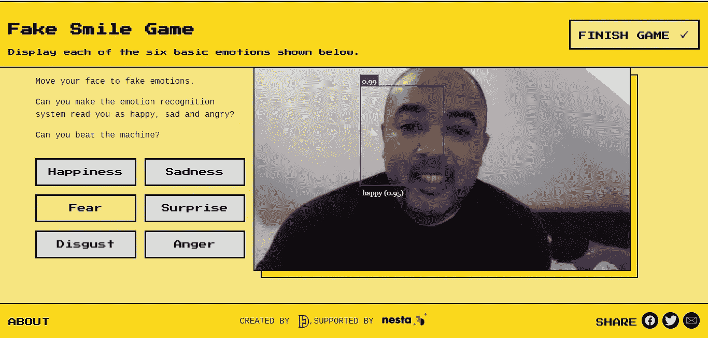
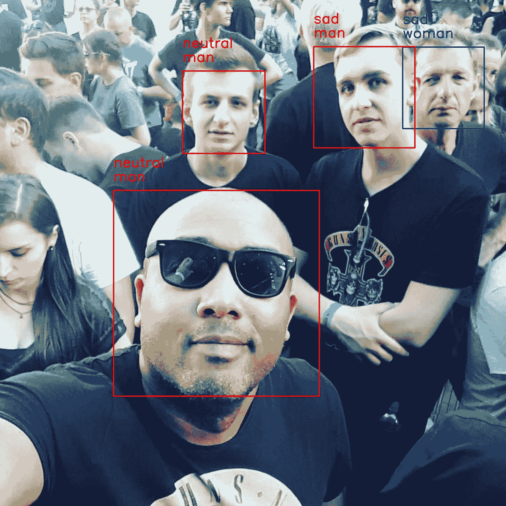

# 一个提高人工智能情感识别意识的在线游戏

> 原文：<https://towardsdatascience.com/an-online-game-to-raise-awareness-on-ai-emotion-recognition-76bb2740dfa3?source=collection_archive---------34----------------------->

来源:作者截图自网站 Emojify.info

## 人工智能情感识别的应用概述和伦理问题

根据非语言行为线索识别某人的感受，甚至预测潜在的反应，不再是为敏感和机敏的人保留的问题。

随着情绪智能尖端技术的进步，这种能力随着机器出于各种目的识别人类情绪的能力而获得了新的维度。

复杂的面部检测算法现在已经强大到足以分析和测量现实世界中捕捉到的情绪。它们是如此强大，以至于我们正在达到一个点，一些伦理方面已经被提出。

# 情绪识别是如何工作的？

情绪识别基于面部表情识别，这是一种基于计算机的技术，采用算法来检测面部，对面部表情进行编码，并实时识别情绪状态。

它通过使用嵌入在笔记本电脑、手机和数字标牌系统中的计算机驱动的摄像头以及安装在计算机屏幕上的摄像头来分析图像或视频中的人脸来实现这一点。

一般来说，计算机驱动的摄像机用于面部分析分三步进行:

1.  **人脸识别**:识别场景、图像或视频片段中的人脸。
2.  **面部标志的识别**:从检测到的人脸中提取面部特征信息。例如，检测面部组件的形状，或者描述面部区域中的皮肤纹理。
3.  **情绪分类和面部表情**:分析面部特征外观的运动和变化，并将该信息分类为表情解释类别，例如面部肌肉活动，例如微笑或皱眉；情绪类别，如快乐或愤怒；以及诸如(不)喜欢或矛盾心理的态度类别。

来源:[https://github.com/gitliber/Facial_Emotion_Detector](https://github.com/gitliber/Facial_Emotion_Detector)—图片由作者提供。

# 实际例子

前段时间，为了了解更多关于这项技术的信息，我实现了一个**面部情感检测器**，它能够使用带有 Keras CNN 模型和 OpenCV 的 fer2013/IMDB 数据集进行实时面部检测和情感/性别分类。

使用 IMDB 性别分类的系统对性别的准确率达到 96%，使用 fer2013 数据集进行情感分类测试的准确率达到 66%。

来源:[https://github.com/gitliber/Facial_Emotion_Detector](https://github.com/gitliber/Facial_Emotion_Detector)—图片由作者提供。

该系统基于一篇论文，该论文提出了由 [B-IT-BOTS 机器人团队](https://mas-group.inf.h-brs.de/?page_id=622)实现的用于设计实时 CNN(卷积神经网络)的通用框架，该 CNN 控制能够执行人脸检测、性别分类和情感分类的实时视觉系统。

详情请参考我的 [GitHub](https://github.com/gitliber/Facial_Emotion_Detector) 。

# 用游戏提高意识。

关于 AI 的情感识别伦理方面的讨论，有很多方法可以展开。

其中一项是允许人们在网络摄像头或智能手机上做鬼脸，通过使用情感识别的游戏来观看人工智能的运行。

最近，剑桥大学和 UCL 大学的一组研究人员创建了一个网站，旨在帮助人们了解计算机如何扫描面部表情来检测情绪，并开始讨论技术及其社会影响。

这个项目是由一群社会科学家、公民科学家和设计师创建的，他们希望开始一场关于情绪识别系统的对话，从技术背后的科学到其社会影响，以及这之间的一切。

当你访问该网站时，你可以在设备的摄像头前玩一个做鬼脸的游戏，让人工智能情感识别系统识别六种情绪:快乐，悲伤，恐惧，惊讶，厌恶和愤怒。

该项目允许人们与这些系统互动，并更好地了解它们有多强大，以及它们有多大缺陷。

如果你愿意，你也可以回答一系列可选问题来帮助研究人员，例如你以前是否使用过这项技术，你是否觉得它有用或令人担忧。

问题的可选答案将被用在一篇关于公民科学方法的学术论文中，以更好地理解情绪识别的社会含义。

# 情绪识别的伦理方面

一旦情感识别假定我们的面部表情完美地反映了我们的内心情感，它就不可靠。

每个曾经假笑过的人都知道，那通常不是真的。

这种倡议是一种引人入胜的方式，可以引发关于技术及其社会影响的讨论。

这个项目可能看起来是一个有趣的游戏。尽管如此，这也是一种令人兴奋的科学方法，让人们考虑这项技术的风险，考虑到它可能存在的令人担忧的歧视和监控潜力。

# 情感分析的应用

凭借强大的商业吸引力，企业可以使用这种技术来评估客户的总体情绪，从而确定营销策略。仅仅拥有一个社交媒体账户就能让你使用这个工具，了解人们对它的看法以及你的客户的行为。

这项技术也可以用于呼叫中心。使用人工智能，可以实时识别感觉，从而提供直接的护理。

情感分析范围广泛，可用于多种目的，包括:

*   进行市场研究，捕捉公众表达的情感；
*   沉浸式体验创造:根据用户传递的情绪改变虚拟现实环境的能力；
*   用户评价；
*   虚拟助手:可以根据用户的情绪定制语言。

在一些国家，如中国，人工智能情感识别技术已经用于许多领域，包括警察审讯和学校行为监控。

其他潜在应用包括:

*   边境管制。
*   求职面试中对候选人的评估。
*   面向企业的客户洞察收集。

# 结论

复杂的面部检测算法现在已经强大到足以分析和测量现实世界中捕捉到的情绪。它们是如此强大，以至于我们正在达到一个点，一些伦理方面已经被提出。

因此，我们需要一种更加开放和民主的方法来决定如何使用这项技术，尤其是决定必须如何使用这项技术。

与信息安全相结合的用户体验有待加强。这不仅仅是实现机制。

越来越有必要让用户能够管理他们想要共享的数据和不想共享的数据。

# 参考

*   一个展示人工智能情感风险的在线游戏。[https://www . technology times . PK/2021/04/04/emojify-a-online-game-to-show-risks-of-ai-emotion-recognition/](https://www.technologytimes.pk/2021/04/04/emojify-an-online-game-to-show-risks-of-ai-emotion-recognition/)
*   人脸分类与检测—【https://github.com/gitliber/Facial_Emotion_Detector 
*   测试人工智能情感识别技术。——【https://emojify.info/ 
*   科学家创造了一个在线游戏来展示人工智能情感的风险。[https://jerseyeveningpost . com/news/uk-news/2021/04/04/scientists-create-online-game-to-show-risks-of-ai-emotion-recognition/](https://jerseyeveningpost.com/news/uk-news/2021/04/04/scientists-create-online-game-to-show-risks-of-ai-emotion-recognition/)
*   面部情感识别简介—[https://algorithm ia . com/blog/introduction-to-Emotion-Recognition](https://algorithmia.com/blog/introduction-to-emotion-recognition)
*   使用深度学习的面部情感识别:综述和见解—[https://www . science direct . com/science/article/pii/s 1877050920318019](https://www.sciencedirect.com/science/article/pii/S1877050920318019)
*   人工智能的进步威胁到隐私。https://www.eurekalert.org/pub_releases/2019-01/uoc-aia010319.php
*   用于情感和性别检测的实时卷积神经网络—[https://github . com/git liber/face _ Emotion _ Detector/blob/master/report . pdf](https://github.com/gitliber/Facial_Emotion_Detector/blob/master/report.pdf)